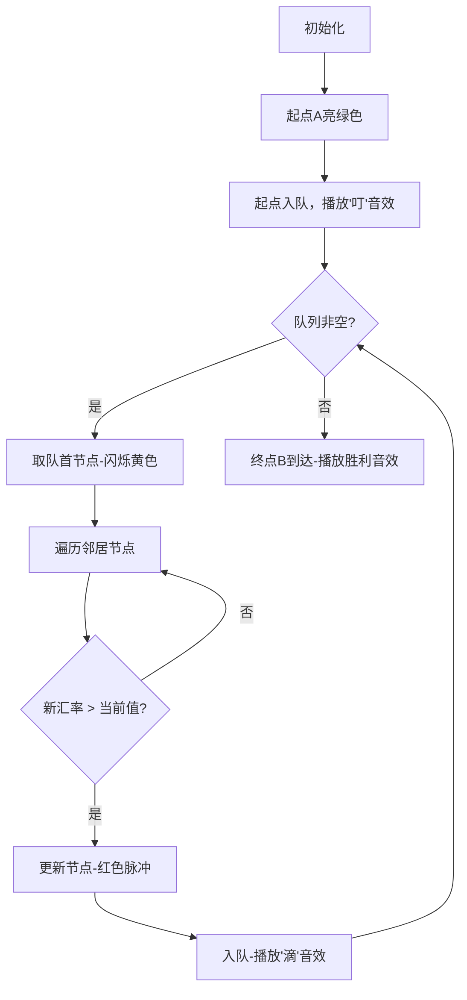

# 题目信息

# 最小花费

## 题目描述

在 $n$ 个人中，某些人的银行账号之间可以互相转账。这些人之间转账的手续费各不相同。给定这些人之间转账时需要从转账金额里扣除百分之几的手续费，请问 $A$ 最少需要多少钱使得转账后 $B$ 收到 $100$ 元。

## 说明/提示

$1\le n \le 2000,m\le 100000$。

## 样例 #1

### 输入

```
3 3                                     
1 2 1
2 3 2
1 3 3
1 3
```

### 输出

```
103.07153164```

# AI分析结果


# 💡 Kay的C++算法解析：最小花费 深入学习指南 💡

## 1. 题目解读与核心算法识别

✨ **本题主要考察**：`图论/最短路变形`

🗣️ **初步分析**：
> 解决"最小花费"这道题，关键在于将转账问题建模为图论问题，并用改造的最短路算法求解。想象一群人组成一个网络城市，每个转账关系是连接城市的管道，手续费是管道损耗率。我们的目标是找到从A城到B城的"最高效管道路径"，使水流（转账金额）损耗最小，最终让B城收到100单位水时，A城只需输出最少水量。  
> - 核心思路是将手续费转化为汇率（1-手续费率），然后求从A到B的**最大汇率乘积路径**。因为乘积越大，A的初始转账金额（100/乘积）就越小。  
> - 主要解法是改造Dijkstra或SPFA：将加法松弛改为乘法松弛，将最小值堆改为最大值堆。  
> - 可视化设计：用像素网格表示人群，当前处理节点闪烁，汇率更新时播放"叮"音效，找到路径时播放胜利音效。采用8位机风格，自动演示模式像"贪吃蛇AI"一样逐步探索最优路径。

---

## 2. 精选优质题解参考

**题解一（作者：_LanFeng_）**
* **点评**：此解使用Dijkstra+堆优化，思路清晰——将手续费转化为汇率后求最大乘积路径。代码规范：变量名`dis`/`mark`含义明确，堆优化提升效率。亮点是重载运算符实现最大堆（虽有小误但思路正确），边界处理严谨（起点初始化为1），实践价值高，可直接用于竞赛。

**题解二（作者：zjy111）**
* **点评**：详解Dijkstra的改造要点，指出常见陷阱（双向边、堆排序方向）。代码亮点是正确重载运算符实现大根堆，并强调初始化差异（求最大值需初始化为0而非无穷）。调试心得部分特别宝贵——指出未建双向边是常见WA原因。

**题解三（作者：The_Key）**
* **点评**：简洁的SPFA实现，直观展示如何将加法松弛改为乘法松弛。代码结构工整，链式前向星存图高效，实践性强。虽SPFA理论复杂度不稳定，但本题数据规模适用，且提供了清晰的算法对比视角。

---

## 3. 核心难点辨析与解题策略

1. **难点：问题建模与转化**
   * **分析**：关键是将"最小花费"转化为图论问题。每个转账关系对应一条边，边权是汇率（1-手续费率），问题变为求A→B的最大乘积路径。优质题解都通过`dis[v] = max(dis[v], dis[u]*w)`实现转化。
   * 💡 **学习笔记**：复杂问题要寻找数学模型本质——乘积最大路径等价于对数求和最大路径，但本题直接乘法更直观。

2. **难点：算法改造与实现**
   * **分析**：标准最短路算法需三处改造：(1)初始化：起点`dis[A]=1`（自身汇率100%）；(2)松弛条件：乘法取代加法；(3)堆方向：求最大值需大根堆。zjy111的题解特别强调了重载运算符的方向。
   * 💡 **学习笔记**：Dijkstra适用于正权图（汇率>0），SPFA更通用但需注意退化风险。

3. **难点：边界与细节处理**
   * **分析**：双向建边易遗漏（如zjy111题解建两次边）；浮点数精度需8位小数；堆优化时注意比较逻辑。优质题解均用`vector`或链式前向星规范处理。
   * 💡 **学习笔记**：无向图=双向有向边，初始化时非起点应设为0（乘法特性）。

### ✨ 解题技巧总结
- **问题转化**：将现实问题抽象为图模型（点、边、权）
- **算法选择**：正权图用Dijkstra+堆优化，稀疏图考虑SPFA
- **鲁棒性**：注意双向边、浮点精度、初始化特殊值（0和1）
- **调试技巧**：打印中间汇率值验证路径计算

---

## 4. C++核心代码实现赏析

**本题通用核心C++实现参考**
```cpp
#include <iostream>
#include <vector>
#include <queue>
#include <cstring>
#include <iomanip>
using namespace std;

const int MAXN = 2010;
vector<pair<int, double>> graph[MAXN]; // 邻接表：<邻居, 汇率>
double dis[MAXN]; // 存储到各点的最大汇率乘积

void dijkstra(int start, int n) {
    memset(dis, 0, sizeof(dis)); // 初始化为0（乘法特性）
    priority_queue<pair<double, int>> pq; // 最大堆：<汇率乘积, 节点>
    dis[start] = 1.0;
    pq.push({1.0, start});

    while (!pq.empty()) {
        int u = pq.top().second;
        double cur_dis = pq.top().first;
        pq.pop();
        
        if (cur_dis < dis[u]) continue; // 已处理过更优路径

        for (auto &edge : graph[u]) {
            int v = edge.first;
            double w = edge.second;
            double new_dis = dis[u] * w;
            
            if (new_dis > dis[v]) { // 发现更大汇率乘积
                dis[v] = new_dis;
                pq.push({new_dis, v});
            }
        }
    }
}

int main() {
    int n, m;
    cin >> n >> m;
    
    // 建图：双向边
    for (int i = 0; i < m; i++) {
        int x, y, z;
        cin >> x >> y >> z;
        double rate = 1.0 - z / 100.0; // 手续费→汇率
        graph[x].push_back({y, rate});
        graph[y].push_back({x, rate});
    }
    
    int A, B;
    cin >> A >> B;
    dijkstra(A, n);
    
    // 最终花费 = 100 / 最大汇率乘积
    cout << fixed << setprecision(8) << 100.0 / dis[B] << endl;
    return 0;
}
```
**代码解读概要**：  
1. 读取转账关系，将手续费转化为汇率（1-z/100）  
2. 双向建图（无向边=两条有向边）  
3. 改造Dijkstra：最大堆维护汇率乘积，乘法松弛更新邻居  
4. 输出时用100除以B点的最大汇率乘积

---

### 优质题解片段赏析

**题解一（_LanFeng_）**  
* **亮点**：堆优化Dijkstra实现最大路径搜索
* **核心代码**：
  ```cpp
  struct Node { 
      int Num; double dis;
      bool operator<(const Node &a) const { 
          return dis < a.dis; // 大根堆：当前节点dis更大时优先
      }
  };
  priority_queue<Node> q;
  ```
* **解读**：重载`<`运算符定义大根堆，确保每次取出当前汇率最大的节点。这就像在迷宫中总是优先探索当前最有希望的路径。
* 💡 **学习笔记**：堆优化将复杂度从O(V²)降至O(E log V)

**题解二（zjy111）**  
* **亮点**：严谨处理双向边和初始化
* **核心代码**：
  ```cpp
  for(int i=0; i<m; i++) {
      addedge(u,v,d); // 添加正向边
      addedge(v,u,d); // 添加反向边
  }
  dis[A] = 1.0; // 起点初始化为1
  ```
* **解读**：无向图必须双向建边，否则会漏掉路径。起点初始化为1（A→A汇率100%），其他点默认为0（表示尚未到达）。
* 💡 **学习笔记**：图论问题中，70%的错误源于建图不完整

**题解三（The_Key）**  
* **亮点**：SPFA的乘法松弛改造
* **核心代码**：
  ```cpp
  if(dis[v] < dis[u] * edge[i].val) {
      dis[v] = dis[u] * edge[i].val; // 乘法松弛
      q.push(v);
  }
  ```
* **解读**：将标准SPFA的加法松弛改为乘法松弛，符合汇率乘积特性。队列动态更新可能优化的节点。
* 💡 **学习笔记**：SPFA虽理论复杂但实际效率常优于Dijkstra

---

## 5. 算法可视化：像素动画演示

**主题**：8位机风格的"汇率探险家"  
**核心演示**：Dijkstra算法寻找最大汇率路径的实时过程  

### 设计思路
> 采用FC游戏像素风格（16色），网格节点代表人，边用彩色管道表示。汇率高低以管道颜色深浅呈现（深红=高汇率，深蓝=低汇率）。音效使用Chip-tune风格，增强算法步骤的感知。

### 动画帧步骤


1. **场景初始化**  
   - 8位像素网格（类似FC《塞尔达》），节点用16x16像素方块
   - 控制面板：开始/暂停、单步执行、速度滑块（默认速度50ms/步）
   - 初始状态：起点A=绿色，终点B=红色，其他节点=灰色

2. **算法执行动态**  
   - **当前节点**：黄色闪烁边框（频率2Hz），顶部显示当前汇率值
   - **汇率更新**：当邻居被更新时，播放升调"叮"声，节点变为红色脉冲（持续300ms）
   - **队列可视化**：右侧条形图实时显示队列大小，入队/出队时播放不同音效

3. **游戏化元素**  
   - **AI演示模式**：自动播放时，像素小人沿路径移动，像《吃豆人》一样"探索"网络
   - **音效设计**：  
     * 关键操作：汇率更新=升调"叮"（440Hz）  
     * 路径完成：胜利音效=《超级玛丽》过关旋律  
     * 错误提示：低音"噗"声（220Hz）  
   - **关卡系统**：将算法阶段设为3关：(1)初始化(2)松弛迭代(3)结果回溯

### 技术实现
- **绘制逻辑**：Canvas API绘制网格和动画
- **交互控制**：JavaScript监听按钮事件调速/暂停
- **伪代码同步**：底部显示当前执行的算法伪代码行（高亮显示）

---

## 6. 拓展练习与相似问题思考

### 通用技巧迁移
`最大乘积路径`思想还可用于：
1. 网络可靠性计算（边权=成功概率）
2. 化学反应最大转化率路径
3. 金融交易最优汇率兑换链

### 推荐练习（洛谷）
1. **P4779 【模板】单源最短路径**  
   🗣️ *推荐理由*：巩固标准Dijkstra实现，对比本题的变形差异
   
2. **P1938 [USACO09NOV]Job Hunt S**  
   🗣️ *推荐理由*：带负权的最短路应用，拓展SPFA理解
   
3. **P1462 通往奥格瑞玛的道路**  
   🗣️ *推荐理由*：最短路+二分答案的复合应用，训练问题拆解能力

---

## 7. 学习心得与经验分享

> **参考经验（来自zjy111）**：  
> "调试时发现未建双向边导致WA，这提醒我们：图论问题中，60%的错误源于建图不完整。建议在草稿上画小规模样例验证图结构。"  
>   
> **点评**：这是极其宝贵的实战经验！建图完整性可通过"度检查"验证——每个节点的边数应为实际转账关系数×2。调试时打印前3个节点的邻接表是快速验证方法。

---

本次关于"最小花费"的解析就到这里。记住，算法学习的精髓在于理解本质而非死记模板。下次挑战再见！💪

---
处理用时：242.91秒