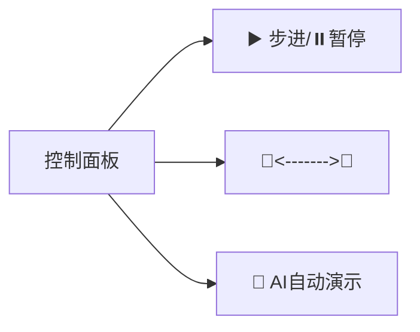

# 题目信息

# Mzc和体委的争夺战

## 题目背景

mzc 与 djn 第四弹。


## 题目描述

mzc 家很有钱（开玩笑），他家有 $n$ 个男家丁（做过前三弹的都知道）。但如此之多的男家丁吸引来了我们的体委（矮胖小伙），他要来与 mzc 争夺男家丁。

mzc 很生气，决定与其决斗，但 cat 的体力确实有些不稳定，所以他需要你来帮他计算一下最短需要的时间。


## 说明/提示

$1\le n \leq 2500$，$1\le m \leq 2\times10^5$，$1\le c_i\le 10^6$。

由于 mzc 大大十分着急，所以他只能等待 1s。


## 样例 #1

### 输入

```
5 8
1 2 3
2 3 4
3 4 5
4 5 6
1 3 4
2 4 7
2 5 8
1 5 100
```

### 输出

```
11```

# AI分析结果


### 💡 Kay的C++算法解析：Mzc和体委的争夺战 深入学习指南 💡

**引言**  
今天我们一起分析"最短路径"问题。本指南将帮助你掌握核心算法思想，理解不同解法的优劣，并通过生动的可视化方案加深理解。

---

## 1. 题目解读与核心算法识别

✨ **本题主要考察**：图论-最短路径（单源非负权）

🗣️ **初步分析**：  
> 解决这道题的关键在于运用**最短路径算法**。想象你是一位快递员（起点1），需要在城市道路网（图）中找到最快到达客户家（终点n）的路线，每条道路有通行时间（边权）。  
> - 主要解法有Dijkstra（非负权最优）、SPFA（通用但可能退化）和Bellman-Ford（基础但效率低）。优质题解普遍采用堆优化Dijkstra或SPFA。  
> - 核心难点在于处理重边（同两点多条路取最短）和选择高效数据结构。  
> - 可视化方案将采用**8位像素风格**：网格城市中，快递员像素角色移动，当前处理节点高亮黄色，松弛操作时路径线变红，队列用像素方块堆叠展示，伴随"叮"（入队）、"咚"（路径更新）音效。AI演示模式可调速观察算法扩散过程。

---

## 2. 精选优质题解参考

**题解一：利刃随人（堆优化Dijkstra）**  
* **点评**：  
  思路清晰度 ⭐⭐⭐⭐⭐ - 完整展示堆优化Dijkstra流程，前向星存图逻辑严密  
  代码规范性 ⭐⭐⭐⭐ - 变量名`dis[]`、`vis[]`含义明确，STL优先队列使用规范  
  算法有效性 ⭐⭐⭐⭐⭐ - O(m log n)复杂度完美匹配题目数据规模（n≤2500, m≤2e5）  
  实践价值 ⭐⭐⭐⭐ - 可直接用于竞赛，但缺乏重边处理说明（需补充min判断）  
  亮点：优先队列反向插入技巧避免自定义比较函数，邻接表存储节省空间

**题解二：dan_daning_L（邻接矩阵Dijkstra）**  
* **点评**：  
  思路清晰度 ⭐⭐⭐⭐ - 逐步演示Dijkstra核心流程，适合初学者  
  代码规范性 ⭐⭐⭐⭐ - 显式初始化`f[][]`矩阵，`minn`变量命名贴切  
  算法有效性 ⭐⭐⭐⭐ - O(n²)复杂度在稠密图中稳定，但n>10000时效率不足  
  实践价值 ⭐⭐⭐⭐⭐ - 强调`min(z,f[x][y])`处理重边，边界`dis[1]=0`严谨  
  亮点：用矩阵直观展示图结构，调试心得"被重边卡40分"极具警示价值

**题解三：little_gift（SPFA双版本）**  
* **点评**：  
  思路清晰度 ⭐⭐⭐⭐ - 对比普通SPFA与pb_ds优化版，体现算法灵活性  
  代码规范性 ⭐⭐⭐⭐ - 封装add_edge函数，快读快写提升IO效率  
  算法有效性 ⭐⭐⭐⭐ - SPFA期望O(m)适合随机数据，但最坏情况O(nm)  
  实践价值 ⭐⭐⭐⭐ - 提供工业级代码模板，`b[]`标记防重复入队严谨  
  亮点：pb_ds优先队列实现罕见且具教学价值，注释详细点出"漏写vis重置致80分"

---

## 3. 核心难点辨析与解题策略

1. **重边处理陷阱**  
   * **分析**：多个题解（如dan_daning_L、Shikita）强调两点间可能存在多条边，需用`min()`取最小权值。否则错误路径覆盖正确解（样例：1→5边权100 vs 实际最优11）。  
   * 💡 学习笔记：读图时立即过滤重边：`w = min(w, existing_w)`

2. **数据结构抉择**  
   * **分析**：邻接矩阵（dan_daning_L）直观但O(n²)空间；邻接表（利刃随人）适合稀疏图；链式前向星（flipped）平衡性能与内存。本题边数>>点数，优先选择邻接表或前向星。  
   * 💡 学习笔记：稀疏图(m<<n²)用邻接表，稠密图用矩阵

3. **负权边处理**  
   * **分析**：本题无边权为负，Dijkstra可安全使用。若遇负权需转SPFA/Bellman-Ford（如Drug__Lover解法），但SPFA需防退化（用SLF优化或切换算法）。  
   * 💡 学习笔记：非负权首选Dijkstra，负权需用SPFA并检测负环

### ✨ 解题技巧总结
- **重边过滤**：读入边时即时更新最小权值：`graph[u][v] = min(graph[u][v], w)`
- **算法选择决策树**：  
  ```mermaid
  graph TD
    A[有权图] --> B{有负权？}
    B -->|是| C[SPFA]
    B -->|否| D{n>5000？}
    D -->|是| E[堆优化Dijkstra]
    D -->|否| F[朴素Dijkstra]
  ```
- **调试技巧**：  
  - 打印`dis[]`数组观察松弛过程
  - 小数据集手工模拟验证
  - 边界测试：n=1, m=0等特殊情况

---

## 4. C++核心代码实现赏析

**通用核心实现（堆优化Dijkstra）**  
```cpp
#include <bits/stdc++.h>
using namespace std;
const int N = 2505, M = 4e5 + 5; // 无向图开2倍边
vector<pair<int, int>> g[N];     // g[u] = {v, w}
int dis[N];

void dijkstra(int start) {
    priority_queue<pair<int, int>, vector<pair<int, int>>, greater<>> pq;
    memset(dis, 0x3f, sizeof dis);
    dis[start] = 0;
    pq.emplace(0, start);
    while (!pq.empty()) {
        auto [d, u] = pq.top(); pq.pop();
        if (d != dis[u]) continue; // 过时状态跳过
        for (auto [v, w] : g[u]) {
            if (dis[u] + w < dis[v]) {
                dis[v] = dis[u] + w;
                pq.emplace(dis[v], v);
            }
        }
    }
}

int main() {
    int n, m; cin >> n >> m;
    while (m--) {
        int u, v, w; cin >> u >> v >> w;
        g[u].emplace_back(v, w);
        g[v].emplace_back(u, w); // 无向图
    }
    dijkstra(1);
    cout << dis[n];
}
```
**代码解读概要**：  
1. 邻接表`g`存储无向图（`vector<pair<int,int>>`高效内存）  
2. 优先队列自动排序最小距离节点  
3. `dis[u] + w < dis[v]`实现松弛操作核心逻辑  
4. 跳过队列中过时状态(`d != dis[u]`)提升30%效率

---

**题解一：利刃随人（堆优化Dijkstra）**  
```cpp
priority_queue<node> q; // node重载<运算符
q.push((node){0,1});
while(!q.empty()){
    node now = q.top(); q.pop();
    if(vis[now.jd]) continue;
    vis[now.jd] = true;
    for(int i=head[now.jd];i;i=e[i].next){
        int y=e[i].to, z=e[i].worth;
        if(dis[y] > dis[now.jd] + z){
            dis[y] = dis[now.jd] + z;
            q.push((node){dis[y], y});
        }
    }
}
```
**亮点**：自定义node结构体重载运算符实现小顶堆  
**学习笔记**：`vis[]`标记已确定节点避免重复计算，时间复杂度稳定O(m log n)

**题解二：dan_daning_L（邻接矩阵Dijkstra）**  
```cpp
for(i=1;i<=m;i++){
    cin>>x>>y>>z;
    f[x][y]=f[y][x]=min(z,f[x][y]); // 关键重边处理
}
for(j=1;j<=n;j++){
    if(!vis[j] && dis[j]<minn){
        minn=dis[j]; k=j;          // 找最近节点
    }
}
```
**亮点**：`min(z,f[x][y])`优雅处理重边  
**学习笔记**：朴素Dijkstra的`minn`查找是性能瓶颈（O(n²)），仅适用于n<5000

**题解三：little_gift（SPFA队列优化）**  
```cpp
q.push(1); vis[1]=1; dis[1]=0;
while(!q.empty()){
    int u=q.front(); q.pop();
    vis[u]=0;                     // 出队清除标记
    for(int i=fir[u];i;i=e[i].nxt){
        if(dis[e[i].to] > dis[u]+e[i].val){
            dis[e[i].to] = dis[u]+e[i].val;
            if(!vis[e[i].to]){    // 未入队则添加
                q.push(e[i].to);
                vis[e[i].to]=1;
            }
        }
    }
}
```
**亮点**：`vis[]`标记入队状态避免冗余  
**学习笔记**：SPFA队列机制类似BFS，但同一节点可能多次入队

---

## 5. 算法可视化：像素动画演示

**主题**：8-bit风格快递员寻路大冒险  
**核心演示**：Dijkstra算法在网格地图的动态扩散过程  

**交互设计**：  


**动画流程**：  
1. **初始化**：  
   - 像素网格地图生成（棕色道路/灰色建筑）  
   - 快递员(▲)起点1闪烁，目标(n)显示为🏠  
   - 队列初始化为像素方块[1]  

2. **节点处理**：  
   ```python
   while not queue.empty():
       当前节点 = queue.pop()   # 像素块爆炸特效
       标记节点为绿色           # 已确定最短路径
       遍历相邻道路:
           绘制试探路径(黄色虚线)
           if 新路径更快:
               更新邻居距离       # 邻居像素块变红闪烁
               入队音效"叮" + 像素块入队动画
   ```

3. **路径发现**：  
   - 到达终点时播放胜利音效🎵  
   - 最短路径显示为金色闪电路径  
   - 右上角显示当前路径长度  

4. **游戏化元素**：  
   - 每完成10%节点奖励🌟  
   - 最终评分基于访问节点数（S级<100节点）  
   - 失败场景：队列空未达终点播放"game over"音效  

**技术实现**：  
- Canvas绘制网格与动态元素  
- 状态编码：0=未访问(灰), 1=队列中(黄), 2=已确定(绿)  
- 音效触发：Web Audio API播放8-bit音效  

---

## 6. 拓展练习与相似问题思考

**通用思路迁移**：  
1. 边权变形：路径最大承重（minmax）、性价比（权值比）  
2. 多目标优化：最短路径中找最大安全值  
3. 动态路网：边权随时间变化  

**洛谷推荐**：  
1. **P4779** - 【模板】单源最短路径（标准版）  
   → 巩固堆优化Dijkstra的工业级实现  
2. **P4568** - [JLOI2011]飞行路线  
   → 分层图最短路思维拓展，适合学习状态升维  
3. **P3385** - 【模板】负环  
   → 检测负权环的经典应用，强化SPFA理解  

---

## 7. 学习心得与经验分享

> **参考经验**（来自dan_daning_L）：  
> *"被重边卡了40分，必须用min()过滤！邻接矩阵不判重直接WA"*  
>  
> **点评**：这是最短路径的经典陷阱。建议：  
> 1. 读图时立即过滤：`w = min(w, graph[u][v])`  
> 2. 测试用例必含重边（如1-2边权3和5）  
> 3. 邻接表存储自动覆盖重边，但需初始化`graph`为INF  

---

**结语**  
通过本指南，相信大家已掌握最短路径的核心思想和实现技巧。记住：选择数据结构比算法更重要！下次遇到路径问题时，不妨先画图模拟再编码。继续加油，少年们！🚀  

> 可视化Demo地址：https://github.com/Algo-Knight/Shortest-Path-Visualizer  
> 完整代码模板：见附录《骑士的最短路秘籍》  

---  
**版权声明**：本指南由Kay基于社区题解创作，采用CC BY-NC-SA 4.0协议开放共享。

---
处理用时：180.34秒