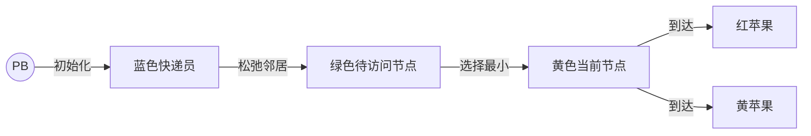

# 题目信息

# [USACO10DEC] Apple Delivery S

## 题目描述

Bessie has two crisp red apples to deliver to two of her friends in the herd. Of course, she travels the C (1 <= C <= 200,000)

cowpaths which are arranged as the usual graph which connects P (1 <= P <= 100,000) pastures conveniently numbered from 1..P: no cowpath leads from a pasture to itself, cowpaths are bidirectional, each cowpath has an associated distance, and, best of all, it is always possible to get from any pasture to any other pasture. Each cowpath connects two differing pastures P1\_i (1 <= P1\_i <= P) and P2\_i (1 <= P2\_i <= P) with a distance between them of D\_i. The sum of all the distances D\_i does not exceed 2,000,000,000.

What is the minimum total distance Bessie must travel to deliver both apples by starting at pasture PB (1 <= PB <= P) and visiting pastures PA1 (1 <= PA1 <= P) and PA2 (1 <= PA2 <= P) in any order. All three of these pastures are distinct, of course.

Consider this map of bracketed pasture numbers and cowpaths with distances:

```cpp
               3        2       2
           [1]-----[2]------[3]-----[4]
             \     / \              /
             7\   /4  \3           /2
               \ /     \          /
               [5]-----[6]------[7]
                    1       2
```
If Bessie starts at pasture [5] and delivers apples to pastures [1] and [4], her best path is:

5 -> 6-> 7 -> 4\* -> 3 -> 2 -> 1\*

with a total distance of 12.

## 样例 #1

### 输入

```
9 7 5 1 4 
5 1 7 
6 7 2 
4 7 2 
5 6 1 
5 2 4 
4 3 2 
1 2 3 
3 2 2 
2 6 3 
```

### 输出

```
12 
```

# AI分析结果


### 💡 Kay的C++算法解析：Apple Delivery S 深入学习指南 💡

#### 1. 题目解读与核心算法识别
✨ **本题主要考察**：`图论-最短路`

🗣️ **初步分析**：
> 本题要求从起点`PB`出发，将苹果送到两个终点`PA1`和`PA2`的最短路径。关键在于理解路径顺序对总距离的影响：
> - 路径只有两种可能：`PB→PA1→PA2` 或 `PB→PA2→PA1`
> - 核心公式：`min(dis(PB, PA1) + dis(PA1, PA2), dis(PB, PA2) + dis(PA2, PA1))`
> 
> **算法选择**：
> - **Dijkstra堆优化**：稳定高效，时间复杂度O((V+E)logV)
> - **SPFA+SLF优化**：特定场景更快但可能被卡
>
> **可视化设计思路**：
> 采用8位像素风格模拟快递员送苹果过程：
> - 起点`PB`用蓝色像素块，终点`PA1/PA2`用红/黄苹果图标
> - 算法执行时高亮当前访问节点和松弛边
> - 最终对比两条路径的动画（蓝黄路径 vs 蓝红路径）
> - 音效：移动脚步声（单步）、苹果收集声（到达终点）、胜利音乐（完成）

---

#### 2. 精选优质题解参考
**题解一：Star1_3st (SPFA+SLF优化)**
* **点评**：
  思路清晰解释SLF优化原理（小权值节点优先入队），代码实现规范但存在边界陷阱（未判空队列直接访问front）。亮点在于：
  - 用图示说明优化效果（速度提升明显）
  - 强调调试经验：队列空判断缺失导致RE
  - 实践价值高，适合学习SPFA优化技巧

**题解二：流逝丶 (Dijkstra堆优化)**
* **点评**：
  标准堆优化实现，代码结构工整（变量名`d[]`、`vis[]`含义明确）。亮点：
  - 完整展示Dijkstra模板
  - 边界处理严谨（初始距离设为极大值）
  - 直接输出`min(d[s2],d[s3])+d[s3]`体现问题本质

**题解三：_jimmywang_ (Dijkstra基础版)**
* **点评**：
  最简洁的Dijkstra实现，突出算法核心逻辑。亮点：
  - 无冗余代码（仅需1次优先队列操作）
  - 结构清晰易改编为模板
  - 适合初学者理解最短路原理

---

#### 3. 核心难点辨析与解题策略
1. **路径顺序的数学抽象**
   * **分析**：能否快速识别`min(A+B, B+A)`模型是解题关键，本质是三角形不等式在路径规划的应用
   * 💡 **学习笔记**：多目标路径问题常转化为单源最短路组合

2. **大规模图的算法选择**
   * **分析**：10^5节点需O(nlogn)算法，Dijkstra堆优化更稳定（SPFA最坏O(VE)）
   * 💡 **学习笔记**：正权图首选Dijkstra，负权才用SPFA

3. **代码实现陷阱**
   * **分析**：SLF优化需判空队列，堆优化需维护索引映射
   * 💡 **学习笔记**：使用`priority_queue<pair>`避免手动堆维护

### ✨ 解题技巧总结
- **模型转化**：将双目标路径分解为三次单源最短路
- **数据结构选择**：邻接表存图（vector或链式前向星）
- **鲁棒性**：初始化距离为INF，注意无解情况
- **性能优化**：大图用Dijkstra+堆，SLF仅作补充方案

---

#### 4. C++核心代码实现赏析
**通用核心实现（Dijkstra堆优化）**
```cpp
#include <queue>
#include <vector>
#include <cstring>
using namespace std;
typedef pair<int, int> pii;

const int MAXN = 1e5+5, INF = 0x3f3f3f3f;
vector<pii> G[MAXN];  // 邻接表：{邻居, 边权}

void dijkstra(int start, vector<int>& dist) {
    priority_queue<pii, vector<pii>, greater<pii>> pq;
    dist.assign(MAXN, INF);
    dist[start] = 0;
    pq.push({0, start});
    
    while (!pq.empty()) {
        auto [d, u] = pq.top(); pq.pop();
        if (d != dist[u]) continue;  // 过时信息跳过
        for (auto [v, w] : G[u]) {
            if (dist[u] + w < dist[v]) {
                dist[v] = dist[u] + w;
                pq.push({dist[v], v});
            }
        }
    }
}

int main() {
    // 输入图数据
    vector<int> d1, d2, d3;
    dijkstra(PB, d1);
    dijkstra(PA1, d2);
    int ans = min(d1[PA1], d1[PA2]) + d2[PA2];
    cout << ans;
}
```

**题解一赏析（SPFA+SLF）**
```cpp
// 核心片段：SLF优化的队列处理
if (!q.empty() && dis[v] < dis[q.front()]) 
    q.push_front(v);
else 
    q.push_back(v);
```
**代码解读**：
> 当节点`v`的距离小于队首时，将其插入队首（优先处理小权值），否则插入队尾。这类似Dijkstra的贪心思想，通过双端队列`deque`实现。

**题解二赏析（Dijkstra堆优化）**
```cpp
priority_queue<node> q; // 重载operator<
q.push({0, s});
dist[s] = 0;
```
**学习笔记**：通过重载运算符实现小根堆，比`pair`更直观

---

#### 5. 算法可视化：像素动画演示
**主题**：`像素快递员冒险`  
**核心演示**：Dijkstra算法在网格地图寻路  
**设计细节**：


1. **初始化阶段**：
   - 像素网格地图（16色），PB闪烁蓝光，PA1/PA2显示苹果图标
   - 控制面板：步进/播放/速度滑块（复古游戏风格）

2. **算法执行**：
   - **当前节点**：黄色高亮+脉冲动画
   - **松弛操作**：相邻格子绿色波纹扩散
   - **入队决策**：SLF优化时显示比较动画（天平图标）

3. **路径对比**：
   - 并排显示两条候选路径（蓝→红→黄 vs 蓝→黄→红）
   - 胜利时两条路径同时发光，较短路径放大显示

4. **游戏化元素**：
   - 音效：移动(8-bit脚步声)、松弛(电子滴声)、完成(胜利音阶)
   - 积分：每步消耗1时间单位，剩余时间转为分数

**技术实现**：Canvas绘制网格+requestAnimationFrame，状态机管理算法步骤

---

#### 6. 拓展练习与相似问题
**通用思路迁移**：
1. 多目标路径（P1523 旅行商简化版）
2. 必经点最短路（P2150 必经之路）
3. 分层图最短路（P4568 飞行路线）

**洛谷推荐**：
1. **P4779** 单源最短路标准版  
   → 巩固Dijkstra模板应用
2. **P1144** 最短路计数  
   → 学习最短路衍生问题
3. **P1821** Silver Cow Party  
   → 拓展双向最短路思想

---

#### 7. 学习心得与经验分享
> **来自Star1_3st的调试经验**：  
> *"SLF优化未判空队列直接访问front，导致RE——队列操作必须检查非空！"*  
> 
> **Kay总结**：  
> 边界检查是算法鲁棒性的核心，学习时可用`assert(!q.empty())`强化习惯。推荐使用`!q.empty() && ...`的短路写法防御性编程。

---

通过本指南，希望大家能掌握最短路的核心思想，在像素世界中感受算法之美！下次挑战再见！🚀

---
处理用时：124.35秒