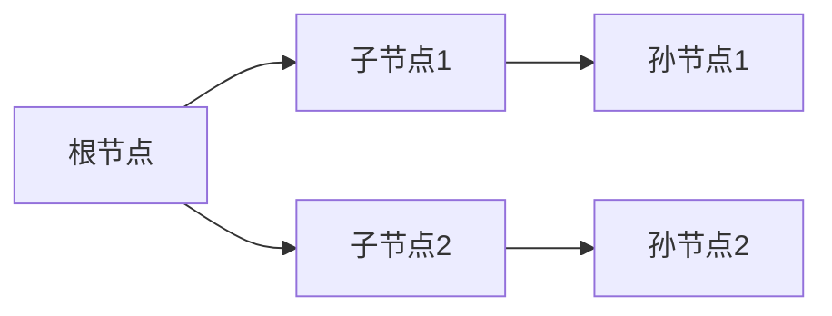

# 题目信息

# [蓝桥杯青少年组省赛 2023] 活动人数

## 题目描述

有一个大型企业集团，由 $N$ 个部门组成，编号从 $1$ 到 $N$。这些部门之间的层次关系形成了一个树状结构，一个上级部门可能会有 $1$ 个或多个直接下级部门，一个下级部门只有一个直接上级部门。  

本月集团举办了一个大型活动，这次的活动组织方按如下要求安排活动：  

1. 来的人越多越好；  
2. 如果一个上级部门参加本次活动，那么他们的直接下级部门就不能参加，而他的间接下级部门可以参加（如下图，如果部门 $1$ 参加，那么部门 $2,3$ 不能参加，而部门 $4,5,6$ 可以参加）。  

请你帮他们计算一下，如何安排可以使参加活动的人数最多，并输出参加活动的最多人数。  

例如：当 $N=6$，每个部门编号为 $1$ 到 $6$，部门上下级关系和部门的人数如下图所示：  


注意：示例中，部门 $1$ 是层级最高的部门，没有直接上级，故将其直接上级部门设为 $0$；  

当安排（$1,4,5,6$）这 $4$ 个部门参加活动时，人数最多，为 $11$，所以输出 $11$。  

## 说明/提示

**【评分标准】**

- $10$ 分：能正确输出第一组数据；  
- $10$ 分：能正确输出第二组数据；  
- $10$ 分：能正确输出第三组数据；  
- $10$ 分：能正确输出第四组数据；  
- $10$ 分：能正确输出第五组数据；  
- $10$ 分：能正确输出第六组数据；  
- $10$ 分：能正确输出第七组数据；  
- $10$ 分：能正确输出第八组数据；  
- $10$ 分：能正确输出第九组数据；  
- $10$ 分：能正确输出第十组数据。

## 样例 #1

### 输入

```
6
0 1 2
1 2 4
1 3 3
2 4 3
3 5 2
3 6 4```

### 输出

```
11```

# AI分析结果


# 💡 Kay的C++算法解析：活动人数 深入学习指南 💡

**引言**  
今天我们来一起分析"活动人数"这道树形动态规划题目。本指南将帮助大家理解树形DP的核心思想，掌握状态设计和转移技巧，并通过像素动画直观感受算法执行过程。

## 1. 题目解读与核心算法识别

✨ **本题主要考察**：树形动态规划 (Tree DP)

🗣️ **初步分析**：  
> 解决"活动人数"的关键在于运用树形DP。想象一下组织一场派对：每个部门（节点）可以选择参加或不参加，但如果经理（父节点）参加了，他的直接下属（子节点）就不能参加。树形DP就像在树上进行"决策叠加"，自底向上计算最优解。  
> - **核心思路**：定义`dp[u][0]`和`dp[u][1]`分别表示节点u不选/选时的最大人数，通过DFS后序遍历完成状态转移。  
> - **难点**：正确构建树结构，设计无后效性的状态转移方程。  
> - **可视化设计**：采用像素树结构（绿色/红色方块表示选/不选），动画展示DFS递归回溯时dp值更新过程，关键操作配"滴答"音效，完成状态播放胜利音效。

---

## 2. 精选优质题解参考

**题解一（作者：lym2022）**
* **点评**：思路清晰直击树形DP本质，用`f[u][0/1]`状态定义准确反映问题核心。代码规范（vector邻接表存图），初始化逻辑简洁（`f[u][1]=a[u]`），状态转移`f[u][0] += max(f[v][0],f[v][1])`充分体现"子节点可选可不选"的特性。实践价值高，完整包含边界处理（根节点识别），是竞赛标准实现。

**题解二（作者：FJ_EYoungOneC）**
* **点评**：采用链式前向星存图展现专业实现技巧，状态转移与代码结构高度一致。亮点在于显式处理`w[u]`赋值与根节点检测的原子性操作，`f[u][1] += f[j][0]`的累加逻辑直观呈现"父选子不选"约束。调试友好性强，循环终止条件`~i`的位运算优化体现工程思维。

**题解三（作者：wyyinput）**
* **点评**：中规中矩但完整覆盖树形DP核心，亮点在于用`r+v`语法直接映射节点权重。代码中`f[v][1]=r[i]`的初始化方式巧妙避免DFS重复赋值，`head[u]`链式遍历展现经典图论实现范式，适合初学者理解指针式邻接表运作。

---

## 3. 核心难点辨析与解题策略

1.  **难点：状态定义与无后效性**
    * **分析**：必须保证父节点状态仅依赖子节点独立结果。优质解法定`dp[u][0]`（不选u）和`dp[u][1]`（选u）完美隔离决策影响：当u选中时子节点必不选(`dp[u][1] += dp[v][0]`)，u不选时子节点自由选择(`dp[u][0] += max(...)`）。
    * 💡 **学习笔记**：树形DP的状态设计需满足"子问题独立性"。

2.  **难点：树结构构建与根节点确定**
    * **分析**：输入数据含父-子关系但未显式标注根节点。题解均通过`parent==0`判定根节点（如`if(u==0)root=v`），并用邻接表（vector）或链式前向星存图。特别注意树是有向无环图，DFS需避免回环（通过fa参数）。
    * 💡 **学习笔记**：树的物理存储必须维护单向关系。

3.  **难点：后序遍历与状态转移时机**
    * **分析**：必须先处理所有子节点再回溯更新父节点。所有优质题解采用DFS递归模式：进入节点→递归子节点→用子节点dp值更新当前节点状态→返回。这确保状态转移满足拓扑序。
    * 💡 **学习笔记**：树形DP本质是"递归式动态规划"。

### ✨ 解题技巧总结
- **问题抽象**：将部门关系抽象为树，参加约束转化为节点选择规则
- **状态设计**：二维状态表示节点选/不选两种决策
- **DFS时机**：后序遍历保证子状态先于父状态计算
- **边界处理**：根节点特殊标记，叶子节点直接初始化

---

## 4. C++核心代码实现赏析

**通用核心实现参考**
```cpp
#include <iostream>
#include <vector>
using namespace std;
const int N = 1e5 + 5;

vector<int> G[N];    // 邻接表存树
int dp[N][2], a[N];  // dp状态，节点权重
int root;            // 根节点

void dfs(int u) {
    dp[u][0] = 0;      // 不选u初始化
    dp[u][1] = a[u];    // 选u初始化
    for (int v : G[u]) {
        dfs(v);        // 先递归处理子节点
        dp[u][0] += max(dp[v][0], dp[v][1]); // u不选：子节点自由选
        dp[u][1] += dp[v][0];               // u选：子节点必不选
    }
}

int main() {
    int n; cin >> n;
    for (int i = 0; i < n; i++) {
        int p, u, w;
        cin >> p >> u >> w;
        if (p == 0) root = u;   // 父为0即根节点
        else G[p].push_back(u); // 构建树边
        a[u] = w;               // 节点权重
    }
    dfs(root);
    cout << max(dp[root][0], dp[root][1]);
}
```

**代码解读概要**：  
通过邻接表`G`存储树结构，`dfs`后序遍历计算每个节点的两种状态。主函数识别根节点后启动递归，最终输出根节点选/不选的最优解。

---

**题解一（lym2022）片段赏析**  
```cpp
void dfs(int u) {
    f[u][0] = 0; 
    f[u][1] = a[u];  // 初始化当前节点状态
    for(auto v : e[u]) { 
        dfs(v);      // 关键：先递归子节点
        // 状态转移
        f[u][1] += f[v][0];              // u选则v必不选
        f[u][0] += max(f[v][0], f[v][1]);// u不选则v自由选
    } 
}
```
* **亮点**：递归调用与状态转移紧密耦合，体现"分治+动态规划"思想
* **学习笔记**：DFS递归位置决定计算顺序——子节点状态必须在转移前计算完成

**题解二（FJ_EYoungOneC）片段赏析**  
```cpp
void dfs(int u) {
    f[u][1] = w[u];    // 初始化与权重绑定
    for (int i = h[u]; ~i; i = ne[i]) { // 链式遍历
        int j = e[i];
        dfs(j);        // 子节点递归
        f[u][1] += f[j][0];    // 累加约束
        f[u][0] += max(f[j][0], f[j][1]); // 自由选择
    }
}
```
* **亮点**：`~i`位运算优化链式前向星遍历
* **学习笔记**：`h[u]`指针链实现O(1)空间复杂度的子节点访问

**题解三（wyyinput）片段赏析**  
```cpp
// 主函数初始化
for(int i=1;i<=n;i++){
    scanf("%d%d",&u,&v);
    scanf("%d",r+v);    // 权重直接存入目标地址
    f[v][1]=r[i];      // 巧妙预初始化
    add(u,v);          // 建图
    if(u==0) root=v;   // 根节点检测
}
```
* **亮点**：`r+v`语法直接内存赋值提升效率
* **学习笔记**：输入处理阶段完成状态初始化可简化DFS逻辑

---

## 5. 算法可视化：像素动画演示

**主题**："像素树探险"（8-bit风格树形DP模拟）  
**核心演示**：DFS遍历过程与dp值动态更新  

### 设计细节


1. **场景设计**：
   - 树结构呈现为复古像素网格，节点是16x16像素方块
   - 状态颜色编码：绿色（选中）/红色（未选）/黄色（当前节点）
   - 控制面板：步进按钮、速度滑块、暂停/继续

2. **动画流程**：
   - **帧1**：根节点闪烁（配"滴"声），显示`dp[root][?]=?`
   - **帧2**：递归进入子节点，线条高亮显示递归路径
   - **帧3**：叶子节点计算（绿/红方块闪烁），显示`dp[leaf][1]=weight`
   - **帧4**：回溯更新父节点，数字动画显示累加过程
   - **帧5**：根节点显示最终`max(dp[0],dp[1])`（胜利音效）

3. **游戏化元素**：
   - 每完成子树计算得⭐，分数=当前dp值
   - "AI模式"自动播放（速度可调），模拟贪吃蛇式搜索
   - 音效系统：选择声（滴）、计算声（咔嚓）、胜利（号角）

4. **技术实现**：
   - Canvas绘制树形网格，requestAnimationFrame驱动
   - 状态机管理DFS流程，颜色变换用CSS动画
   - 伪代码同步显示在右侧面板（高亮当前执行行）

---

## 6. 拓展练习与相似问题思考

**通用技巧迁移**  
树形DP适用于任何树形结构上的带约束优化问题，特别是：
1. 相邻节点约束问题（如选点覆盖）
2. 树形背包问题（带容量限制）
3. 树上路径统计（最长链/直径）

**洛谷推荐**  
1. **P1352 没有上司的舞会**  
   🗣️ 双倍经验题，巩固基础树形DP
2. **P2014 选课**  
   🗣️ 引入背包容量约束，学习树形背包
3. **UVA1292 Strategic game**  
   🗣️ 最小点覆盖变形，掌握状态设计扩展

---

## 7. 学习心得与经验分享

> **经验摘录（lym2022）**：  
> "树形DP板子题，注意状态转移顺序：必须先递归子节点再更新父节点，否则会使用未计算的状态。"  
>
> **点评**：  
> 作者强调了DFS递归位置的重要性——这是树形DP的命脉。初学者常犯的错误是在子节点递归前就尝试使用其dp值，导致逻辑错误。建议动手画递归栈示意图加深理解。

---

**结语**  
通过本次分析，相信大家已掌握树形DP的核心思想：状态定义决定解法框架，DFS顺序保证正确计算。记住，多画状态转移图+小数据模拟是调试的金钥匙。下次遇到"树上选点"问题，就大胆套用这个模式吧！💪

---
处理用时：170.94秒