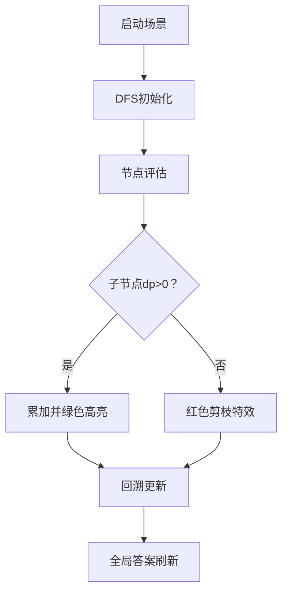

# 题目信息

# 最大子树和

## 题目描述

小明对数学饱有兴趣，并且是个勤奋好学的学生，总是在课后留在教室向老师请教一些问题。一天他早晨骑车去上课，路上见到一个老伯正在修剪花花草草，顿时想到了一个有关修剪花卉的问题。于是当日课后，小明就向老师提出了这个问题：

一株奇怪的花卉，上面共连有 $n$ 朵花，共有 $n-1$ 条枝干将花儿连在一起，并且未修剪时每朵花都不是孤立的。每朵花都有一个“美丽指数”，该数越大说明这朵花越漂亮，也有“美丽指数”为负数的，说明这朵花看着都让人恶心。所谓“修剪”，意为：去掉其中的一条枝条，这样一株花就成了两株，扔掉其中一株。经过一系列“修剪“之后，还剩下最后一株花（也可能是一朵）。老师的任务就是：通过一系列“修剪”（也可以什么“修剪”都不进行），使剩下的那株（那朵）花卉上所有花朵的“美丽指数”之和最大。

老师想了一会儿，给出了正解。小明见问题被轻易攻破，相当不爽，于是又拿来问你。

## 说明/提示

### 数据范围及约定

- 对于 $60\%$ 的数据，有 $1\le n\le 1000$；
- 对于 $100\%$ 的数据，有 $1\le n\le 16000$。

## 样例 #1

### 输入

```
7
-1 -1 -1 1 1 1 0
1 4
2 5
3 6
4 7
5 7
6 7
```

### 输出

```
3```

# AI分析结果


# 💡 Kay的C++算法解析：最大子树和 深入学习指南 💡

## 1. 题目解读与核心算法识别

✨ **本题主要考察**：树形动态规划 (树形DP)

🗣️ **初步分析**：
> 解决"最大子树和"这道题，关键在于运用树形DP思想。想象你是一位园丁，树上的花朵有正负"美丽指数"，你需要修剪树枝保留最优美的连通花簇。树形DP就像从根部开始层层评估每棵子树的"美丽潜力"，只保留能增加整体美感的枝条。
> - 核心思路：定义`dp[u]`表示以节点u为根的子树中包含u的最大点权和。通过DFS后序遍历，对每个节点u：初始化`dp[u]`为自身点权；遍历子节点v时，若`dp[v]>0`则累加（相当于保留该分枝），否则舍弃。
> - 难点：树的无根特性（任意节点均可为根）和负权处理（需舍弃拖累整体美感的负权子树）。
> - 可视化设计：采用8位像素风格，树节点显示当前`dp`值。DFS时当前节点闪烁黄光，评估子节点时：正权子节点亮绿光并入队，负权子节点变灰消失。回溯更新时播放"收集金币"音效，最终最大子树以金光脉冲特效标记。

---

## 2. 精选优质题解参考

**题解一 (作者：Mutsumi_0114)**
* **点评**：此解法思路清晰直白（顺推DP逻辑），状态定义`f[u]`精准体现"包含u的最大子树和"核心思想。代码规范（变量名`f[u]`、`a[u]`含义明确），边界处理严谨（初始化`ans`为最小整数值）。亮点在于用直观图示解释状态转移，实践价值高（可直接用于竞赛），空间复杂度优化至O(n)。

**题解二 (作者：FCBM71)**
* **点评**：创新性使用二维状态`fn/fy`分别表示不包含/包含根的最大值，拓展了DP思维。代码采用链式前向星存储提升效率，亮点是引入`tomax`宏加速比较操作。虽最终证明一维状态足够解题，但二维解法对理解树形DP状态设计有启发意义。

**题解三 (作者：tribool4_in)**
* **点评**：解法简洁高效，核心代码仅10行。状态转移方程`f[u] = a[u] + max(0, f[v])`直击问题本质，变量命名规范（`f`表DP值，`a`存点权）。虽然省略图示但代码自注释性强，特别适合初学者理解树形DP基础模式。

---

## 3. 核心难点辨析与解题策略

1.  **难点：状态定义与无后效性**
    * **分析**：优质题解统一用`dp[u]`表示"包含u的子树最大和"，该定义保证：① 状态包含根节点u ② 子问题解独立（无后效性）。关键推导：`dp[u]`初始化`=a[u]`，通过`max(0, dp[v])`决策是否保留子树。
    * 💡 **学习笔记**：好的状态定义是动态规划的基石，需满足"全覆盖"和"无后效"。

2.  **难点：负权子树处理**
    * **分析**：当子节点`dp[v]<0`时，累加会降低整体值。题解通过`dp[u] += max(0, dp[v])`自然实现"剪枝"逻辑。关键变量：循环索引u代表当前子树根，v为子节点。
    * 💡 **学习笔记**：树形DP中，子问题贡献为负时应果断舍弃——贪心思想与动态规划的完美结合。

3.  **难点：树的遍历与存储**
    * **分析**：使用`vector`或链式前向星存图（无向边需双向存储）。DFS需记录父节点`fa`避免回环，核心操作：
      ```cpp
      for(v : u的子节点){
        if(v == fa) continue;
        DFS(v, u);          // 递归子节点
        if(dp[v] > 0) dp[u] += dp[v];
      }
      ```
    * 💡 **学习笔记**：树形DP常用DFS后序遍历，子节点状态先于父节点计算完成。

### ✨ 解题技巧总结
- **问题分解法**：将"全局最大子树"分解为"以每个节点为根的最大子树"子问题
- **贪心融合**：在状态转移中即时决策（`max(0, dp[v])`）
- **鲁棒性测试**：特别注意全负权情况（初始化`ans=INT_MIN`）
- **存储优化**：大规模数据用链式前向星替代`vector`提升性能

---

## 4. C++核心代码实现赏析

**本题通用核心C++实现参考**
* **说明**：综合自优质题解，体现最简洁高效的标准解法。
* **完整核心代码**：
```cpp
#include <iostream>
#include <vector>
#include <climits>
using namespace std;
const int N = 16005;
vector<int> G[N];
int dp[N], w[N], n, ans = INT_MIN;

void dfs(int u, int fa) {
    dp[u] = w[u];                     // 初始化包含u的子树
    for (int v : G[u]) {
        if (v == fa) continue;        // 避免回环
        dfs(v, u);                    // 递归子节点
        if (dp[v] > 0) dp[u] += dp[v]; // 保留正贡献子树
    }
    ans = max(ans, dp[u]);            // 更新全局答案
}

int main() {
    cin >> n;
    for (int i = 1; i <= n; i++) cin >> w[i];
    for (int i = 1; i < n; i++) {
        int u, v; cin >> u >> v;
        G[u].push_back(v);            // 无向图双向建边
        G[v].push_back(u);
    }
    dfs(1, 0);                        // 任选根节点开始
    cout << ans;
    return 0;
}
```
* **代码解读概要**：
  1. 读入点权`w[]`和树边（双向存图）
  2. DFS遍历：初始化`dp[u]=w[u]` → 递归子节点 → 正权子树累加
  3. 回溯时更新全局最大值`ans`

---
**题解一核心片段赏析 (Mutsumi_0114)**
* **亮点**：图示化解释状态转移，代码自注释性强
* **核心代码片段**：
```cpp
void dfs(int u, int fa) {
    f[u] = a[u];                // 关键点1：状态初始化
    for(int v : G[u]) {
        if(v == fa) continue;   // 关键点2：避免回环
        dfs(v, u);              // 关键点3：递归子问题
        if(f[v] > 0) f[u] += f[v]; // 决策点：保留正权子树
    }
}
```
* **代码解读**：
  > - **行1**：每个子问题初始化为自身点权，体现"包含根节点"的定义
  > - **行3**：`fa`参数是避免死循环的关键技巧，类似走迷宫时做标记
  > - **行5**：核心决策！如同园丁修剪——只保留能增加美感的枝条
  > - **行6**：贪心思想：正权子树是"资产"，负权是"负债"
* 💡 **学习笔记**：树形DP的DFS需传递父节点信息防止回溯，这是与普通DFS的关键区别。

**题解二核心片段赏析 (FCBM71)**
* **亮点**：二维状态扩展思维，链式前向星优化
* **核心代码片段**：
```cpp
void dfs(int x, int fa) {
    fy[x] = w[x];                    // 包含x的情况
    for (int i = head[x]; i; i = nxt[i]) {
        int v = to[i];
        if (v == fa) continue;
        dfs(v, x);
        if (fy[v] > 0) fy[x] += fy[v];  // 累加正权子树
        fn[x] = max(fn[x], max(fy[v], fn[v])); // 不包含x的情况
    }
}
```
* **代码解读**：
  > - **行1**：`fy[x]`类比一维解法中的`dp[x]`
  > - **行7**：`fn[x]`创新点：记录不包含x时的最优解，通过`max(fy[v], fn[v])`继承子树最优值
  > - **行5**：链式前向星遍历：`head[x]`获取起点，`nxt[i]`跳转下条边
* 💡 **学习笔记**：当问题要求"不一定包含根节点"时，二维状态提供更灵活的解决方案。

---

## 5. 算法可视化：像素动画演示

**主题**：像素园丁的修剪冒险 (8位复古花园风格)

### 动画设计


1. **场景与UI**：
   - 像素化树结构（FC游戏风格），节点显示当前`dp`值
   - 控制面板：步进/暂停/调速滑块，背景音乐（8-bit轻快BGM）

2. **关键帧演示**：
   - **DFS启动**：根节点(如节点7)闪烁金光，播放"探索开始"音效
   - **子节点评估**：
     - 正权子节点（如4,5,6）：绿色脉冲特效，伴随"收集金币"声
     - 负权子节点（如1,2,3）：灰色渐隐，伴随"枯萎"音效
   - **回溯更新**：当前节点显示累加值（如节点7: -1→3），金色数字跳动
   - **全局更新**：当发现更大`dp`值，屏幕上方"最佳记录"刷新

3. **交互设计**：
   - 单步执行：按方向键逐步观察决策
   - 自动演示：AI园丁自动修剪（速度可调）
   - 关卡进度：每完成一棵子树评估获得1星，满星触发庆祝动画

4. **教学提示**：
   > "当前评估节点4 → 发现子节点1(dp=-1) → 舍弃！✂️"  
   > "节点5无子节点 → 保留自身值1 → 回溯更新父节点7"

---

## 6. 拓展练习与相似问题思考

* **算法迁移场景**：
  1. 树上独立集问题（如：没有上司的舞会）
  2. 子树统计问题（如：节点覆盖的最优解）
  3. 依赖关系决策（如：资源分配受父节点约束）

* **推荐练习**：
  1. **洛谷 P1352** - 没有上司的舞会  
     🗣️ *推荐理由：同属树形DP经典题，强化状态分治（选/不选当前节点）*
  2. **洛谷 P2015** - 二叉苹果树  
     🗣️ *推荐理由：引入边权概念，学习背包思想与树形DP结合*
  3. **洛谷 P2014** - 选课  
     🗣️ *推荐理由：树形DP+依赖背包的综合应用，提升状态设计能力*

---

## 7. 学习心得与经验分享

> **参考经验 (来自 StoneXie)**：  
> "最初错误认为根节点固定，提交N²暴力解法导致TLE。改用记忆化DFS后AC，这提醒我们：树形DP中任意节点可为根，避免重复计算是关键。"

> **点评**：这个调试经历极具代表性。在树形DP中，理解"无根树可任选根"的特性可避免无效计算。当遇到TLE时，优先检查是否存在重复递归或未记忆化的情况。

---

通过本次分析，我们深入掌握了树形DP的核心思想：**将全局问题分解为独立子问题，通过后序遍历自底向上求解，并即时决策子问题贡献**。记住，好的状态设计能使复杂问题迎刃而解！下次我们将探索更复杂的树形DP变种，继续加油！💪

---
处理用时：108.93秒