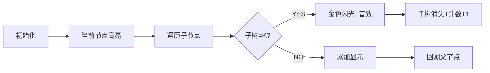

# 题目信息

# 树的分解

## 题目描述

给出 $N$ 个点的树和 $K$，问能否把树划分成 $\frac{N}{K}$ 个连通块，且每个连通块的点数都是 $K$。

## 说明/提示

- 对于 $60 \%$ 的数据，$1 \le N, K \le 10^3$；
- 对于 $100 \%$ 的数据，$1 \le T \le 10$，$1 \le N ,K \le 10^5$。

## 样例 #1

### 输入

```
2
4 2
1 2
2 3
3 4
4 2
1 2
1 3
1 4
```

### 输出

```
YES
NO```

# AI分析结果


# 💡 Kay的C++算法解析：树的分解（P3915）深入学习指南 💡

## 1. 题目解读与核心算法识别

✨ **本题主要考察**：`DFS应用` (树形遍历与贪心分割)

🗣️ **初步分析**：
> 解决树的分解问题，就像把整棵大树修剪成多个小盆栽🌿。核心思想是从树叶🍃开始向上回溯，每遇到一棵**恰好包含K个节点**的子树就立刻剪下（形成一个连通块），并继续向上修剪。这种"自底向上、见好就收"的策略正是**DFS遍历+贪心分割**的经典应用。

- **题解思路总结**：所有题解均采用DFS后序遍历，统计子树大小。当子树大小等于K时立即分割（计数器+1，子树大小归零），最后检查分割块数是否等于N/K
- **核心难点**：正确处理分割后子树与父节点的关系（归零操作保证父节点统计时不重复计算已分割部分）
- **可视化设计**：采用**像素风树形探险游戏**，节点为彩色方块，DFS遍历时当前节点高亮显示蓝色边框，子树大小实时显示在节点上方。当子树大小=K时，播放"叮！"音效，子树变为金色并消失（归零动画），计数器+1。控制面板支持单步执行和调速自动播放

---

## 2. 精选优质题解参考

**题解一：YoungLove（赞27）**
* **点评**：思路清晰直白，将问题本质概括为"分割即剪枝"。代码采用高效的链式前向星建图，使用快速读入优化处理大数据。DFS核心逻辑仅10行，变量命名简洁（`siz[]`表子树大小，`tot`计数），边界处理完整。亮点在于明确分割的唯一性证明，帮助理解算法正确性。

**题解二：xhQYm（赞13）**
* **点评**：代码结构工整规范，使用vector邻接表建图更易理解。详细注释关键步骤，特别强调多组数据初始化的重要性（memset清零）。虽然使用数组`st[]`而非`siz[]`，但核心逻辑与题解一高度一致，实践参考价值强。

**题解三：redegg（赞6）**
* **点评**：创新性通过DFS返回值传递未分割部分的大小，避免显式修改全局数组。亮点在于返回值设计：`=k`时返回0（已分割），`>k`返回-1（失败），`<k`返回累计值。这种隐式状态管理展示了不同实现思路的灵活性。

---

## 3. 核心难点辨析与解题策略

1.  **难点1：如何避免重复计算已分割的子树？**
    * **分析**：优质题解采用"归零法"（YoungLove/xhQYm）或"返回值隔离法"（redegg）。当子树大小=k时立即重置为0，确保父节点统计时只累积未分割部分
    * 💡 **学习笔记**：分割操作的本质是状态重置——就像把拼好的乐高拆下放入成品区

2.  **难点2：递归遍历中父子节点关系的维护**
    * **分析**：DFS必须跳过父节点避免回环（`if(v==fa)continue`）。后序遍历保证先处理所有子节点再计算当前节点，这是正确累加子树大小的关键
    * 💡 **学习笔记**：树形DFS如同家族聚会——先统计所有孩子家的人数，再计算自家总人数

3.  **难点3：多组数据初始化的完整性**
    * **分析**：必须清空邻接表(`head[]`/`graph[]`)、计数器(`cnt`)、子树大小数组(`siz[]`)。xhQYm题解特别强调该点，否则会导致上一组数据污染结果
    * 💡 **学习笔记**：多组数据如多次实验——每次都要重置仪器归零

### ✨ 解题技巧总结
- **技巧1 自底向上分割**：从叶子节点开始回溯，满足条件立即分割（贪心思想）
- **技巧2 防御性编程**：优先特判`n%k!=0`的情况直接返回NO
- **技巧3 状态可视化**：调试时打印每个节点的实时子树大小，直观验证归零逻辑

---

## 4. C++核心代码实现赏析

**本题通用核心C++实现参考**
* **说明**：综合YoungLove与xhQYm题解优点，采用vector邻接表实现更清晰
* **完整核心代码**：
```cpp
#include <iostream>
#include <vector>
#include <cstring>
using namespace std;
const int MAXN = 1e5+10;

vector<int> tree[MAXN];
int siz[MAXN], cnt, n, k;

void dfs(int u, int fa) {
    siz[u] = 1;                        // 当前节点自身
    for (int v : tree[u]) {
        if (v == fa) continue;          // 跳过父节点
        dfs(v, u);                      // 递归处理子树
        siz[u] += siz[v];               // 累加子树大小
    }
    if (siz[u] == k) cnt++, siz[u] = 0; // 满足条件则分割
}

int main() {
    int T; cin >> T;
    while (T--) {
        // 初始化
        cin >> n >> k;
        for (int i = 1; i <= n; i++) tree[i].clear();
        memset(siz, 0, sizeof(siz));
        cnt = 0;

        // 建树
        for (int i = 1; i < n; i++) {
            int u, v; cin >> u >> v;
            tree[u].push_back(v);
            tree[v].push_back(u);
        }

        // 特判+DFS
        if (n % k != 0) cout << "NO\n";
        else {
            dfs(1, 0);
            cout << (cnt == n/k ? "YES\n" : "NO\n");
        }
    }
    return 0;
}
```
* **代码解读概要**：
  > 代码分为三部分：(1) **初始化**清空树结构和计数器；(2) **建图**用vector存储无根树；(3) **DFS核心**后序遍历累加子树大小，遇k则分割归零。特判n%k!=0提升效率

---
**题解一：YoungLove（链式前向星版）**
* **亮点**：工业级输入优化+链式前向星，适合竞赛大数据
* **核心代码片段**：
```cpp
inline void dfs(int x, int fa) {
    siz[x] = 1;
    for (int i = h[x]; i; i = ed[i].pre) { // 遍历邻接表
        int p = ed[i].v;
        if (p == fa) continue;           // 关键：避免回父节点
        dfs(p, x);
        siz[x] += siz[p];                // 累加子树大小
    }
    if (siz[x] == k) tot++, siz[x] = 0;  // 贪心分割点
}
```
* **代码解读**：
  > `h[x]`存储节点x的边链表头，`ed[i].pre`实现链式访问。**精妙处**在于`if(p==fa)continue`确保单向遍历，避免成环。累加时自动忽略已归零子树（因siz[p]可能为0）
* 💡 **学习笔记**：链式前向星是处理大图的高效结构，`h[]`数组初始化至关重要

**题解三：redegg（返回值法）**
* **亮点**：通过返回值隐式传递状态，避免全局数组
* **核心代码片段**：
```cpp
int dfs(int u, int fa) {
    int sum = 1;                         // 当前子树未分割部分
    for (int v : tree[u]) {
        if (v == fa) continue;
        int res = dfs(v, u);             // 获取子树状态
        if (res == -1 || res > k) return -1; // 失败传递
        if (res < k) sum += res;         // 累加未分割部分
    }
    if (sum == k) return 0;              // 成功分割，返回0
    return (sum > k) ? -1 : sum;         // 返回未分割值或失败
}
```
* **代码解读**：
  > 返回值设计三层含义：①`0`表示当前子树刚被分割；②`>0且<k`表示未分割部分大小；③`-1`表示失败。**精妙处**在于累加时跳过`res=k`的情况（已分割不累加）
* 💡 **学习笔记**：返回值设计可实现"无副作用"的递归，但要注意状态传递的完备性

---

## 5. 算法可视化：像素动画演示

**主题**：`树形宝藏分割大冒险`（8-bit像素风）  
**设计思路**：将树节点转化为彩色像素方块，DFS遍历过程转化为探险家收集宝藏。当子树宝藏达K时触发特效分割，融入音效增强反馈。

### 动画关键帧步骤


1. **像素场景构建**
   - 树节点：16x16像素方块，编号显示在中央
   - 状态提示：当前子树大小动态显示在节点上方
   - 控制面板：开始/暂停/单步/重置按钮 + 速度滑块

2. **DFS过程可视化**
   - 当前节点：蓝色边框闪烁（伴随"滴"声）
   - 递归深入：子节点依次亮起绿色光晕
   - 回溯统计：子树大小数值实时跳动更新

3. **分割特效**
   - 达标检测：当`siz[u]=k`时触发金色脉冲波
   - 音效组合：`叮！`（分割音） + `咔嚓`（剪枝音）
   - 视觉反馈：该子树化作金币飞入计数板，原位置留透明轮廓

4. **游戏化元素**
   - 关卡进度：每分割1块点亮一颗星星⭐
   - 胜利动画：所有分割块拼成宝藏图，播放8-bit胜利音乐
   - 失败提示：未达标时显示红色警告框，播放低沉音效

**实现要点**：用Canvas绘制树结构，递归步骤用`setTimeout`链式调用实现动画队列，音效用Web Audio API播放。

---

## 6. 拓展练习与相似问题思考

**技巧迁移场景**：
1. 树形结构自底向上统计（子树属性汇总）
2. 满足条件即时分割的贪心策略
3. 树形DFS状态传递的多种实现方式

**洛谷推荐**：
1. **P1364 医院设置**  
   🗣️ *推荐理由*：巩固树形DFS遍历和子树统计技巧，学习重心定位

2. **P1352 没有上司的舞会**  
   🗣️ *推荐理由*：进阶训练树形DFS+状态决策（DP），理解父子状态传递

3. **P2014 [CTSC1997]选课**  
   🗣️ *推荐理由*：树形依赖分割的经典问题，引入背包思想拓展视野

---

## 7. 学习心得与经验分享

> **经验摘录（来自 xhQYm）**：  
> *"多组数据要清零...这里是个小坑点-->如果这一句放前面，会导致输入错误"*

**Kay的点评**：  
这是极其珍贵的实战经验！算法竞赛中**60%的WA源于未初始化**。建议建立初始化检查表：
1. 邻接表/图结构
2. 全局计数器和标记数组
3. 每组数据起始位置集中清零

> **调试技巧补充**：  
> 当DFS逻辑复杂时，可打印递归树：
> ```cpp
> void dfs(int u, int fa, int depth) {
>   cout << string(depth*2, ' ') << u << " [siz=" << siz[u] << "]\n";
>   // ...递归部分
> }
> ```
> 缩进显示能直观呈现递归层级和状态变化

---

通过本次分析，我们深度掌握了树形DFS分割的核心思想与实现技巧。记住：**好的算法如同精妙的剪纸艺术——找准分割点，才能化整为零**。继续挑战新的树形问题吧！🎯

---
处理用时：235.58秒