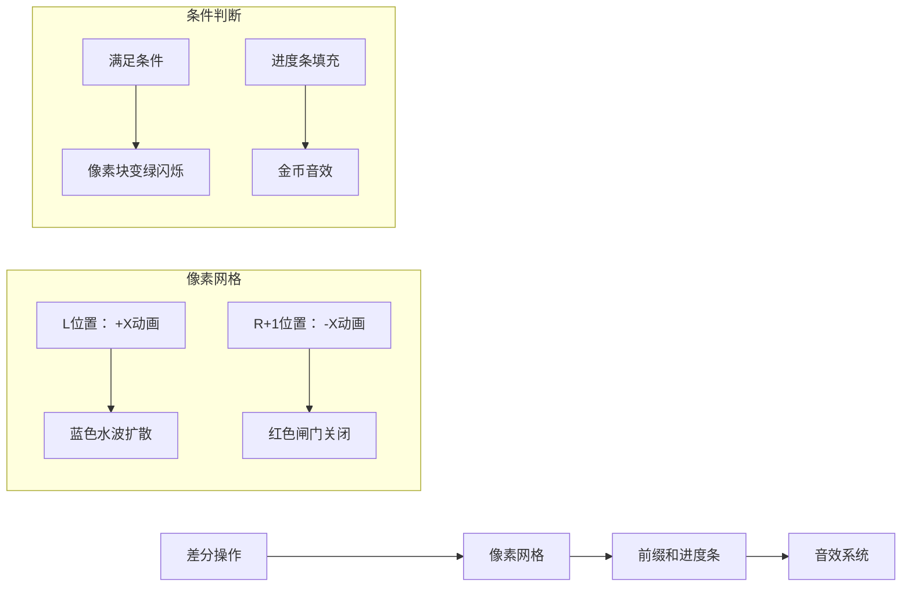

# 题目信息

# 数据结构

## 题目背景

**引言**

数据结构学的好，未来工作没烦恼。


Edgration 是一个喜欢乱搞数据结构的蒟蒻（以下简称edt），有一天，他作死想去刁难一下dalao：

edt想求一种数据结构，使得可以实现区间加，求出某一区间大于k的元素的个数

dalao1：sb线段树

dalao2：sb分块

dalao3：sb平衡树

edt: 不行，那就加上取模，求区间取膜mod后大于MIN小于MAX的元素个数

dalao1：线段树&……￥#&……%……&\*&%￥

dalao2：sb分块 &%￥……%#￥#&……&\*

dalao3：\*&……%&￥LCT维护SBT水题 &……%&……%

edt：那不仅取模，每个数乘上数组下标再取模

dalao：￥%￥￥&\*（#￥% 叽里呱啦叽里呱啦

edt：不行，在把取模的值丢到一棵树上，维护一棵仙人掌乘积方差的最小极差

dalao：替罪羊树上用sb块状链表维护Toptree上的最小费用最大流和可持久化仙人掌，算出来在基尔霍夫矩阵中反演后跑一遍fft维护的插头DP就好了，给我三分钟轻松水过。。

edt：mmp


## 题目描述

蒟蒻Edt把这个问题交给了你 ———— 一个精通数据结构的大犇，由于是第一题，这个题没那么难。。


edt 现在对于题目进行了如下的简化：


最开始的数组每个元素都是0


给出$n$，$opt$，$mod$，$min$，$max$，$mod$在int范围内


操作$A$，$Q$


$A$: $L$,$R$,$X$ 表示把$[l,R]$这个区间加上$X$

**（数组的从L到R的每个元素都加上X）**


$Q$: $L$,$R$ 表示询问$[L,R]$这个区间中元素T满足  $min<=(T*i$%$ mod)<=max$  的 T这样的数的个数（i是数组下标）

**（元素的值\*数组下标%mod在min到max范围内）**


由于 edt 请来了一位非三次元的仓鼠，他帮你用延后了部分问题，将这些询问打入了混乱时空，你的询问操作不会超过1000次，不幸的是，对于延后的询问操作可能有很多次（小于1e7次），但是保证这些延后的询问操作之后不会再次有修改操作

（就是在最后会有很多次询问，但不会进行修改）


## 说明/提示

## 样例说明

给出样例1的解释：

样例1中，$a$数组修改为$5$，$5$，$5$

每个$a[i]*i$%$4$ 的值为$1$,$2$,$3$

对于Final的询问

询问$[1$，$3]$中大于等于0小于等于2的个数为2个

剩下的询问类似

## 题目说明

**注意**：

### 1.关于负数取模问题，请以 c++ 的向0取整为标准，即如：

[ $ -7 $%$ 3 = -1 $ ]  [ $ 7 $%$ 3 = 1 $ ]

### 2.一共会有50个测试点，每个点分值为2分。

因为测试点数较多，请oier们自觉地不要故意多次提交来卡评测机，出题人 edt 在这里表示由衷的感谢

## 数据范围

如果你不能作对所有点，请尝试获得部分分，所有数据都是随机生成


## 样例 #1

### 输入

```
3 2 4 0 2
A 1 3 5
Q 2 3 
5
1 3
2 3
1 1 
2 2 
3 3
```

### 输出

```
1
2
1
1
1
0
```

## 样例 #2

### 输入

```
17 25 4098 310 2622
A 10 16 657212040
A 4 15 229489140
A 1 2 -433239891
A 3 12 532385784
A 10 17 56266644
A 8 10 10038874
A 6 9 13084764
A 4 5 -9206340
Q 2 8
A 2 4 -43223955
A 6 9 31478706
A 2 4 189818310
A 2 8 179421180
A 2 8 40354938
Q 8 14
A 3 6 57229575
A 6 13 132795740
A 2 17 14558022
A 14 15 -552674185
A 5 11 -1104138
Q 2 12
Q 1 14
A 3 9 524902182
A 8 12 114291440
A 3 7 107531442
1
11 12
```

### 输出

```
3
6
7
8
2
```

## 样例 #3

### 输入

```
20 3 4317 1020 2232
A 8 15 -434078222
A 1 2 54988154
A 13 19 81757858
15
7 11
3 5
3 9
6 9
9 13
6 19
1 20
3 5
3 10
1 7
2 14
6 10
2 3
2 3
10 12
```

### 输出

```
0
0
0
0
0
2
2
0
0
0
0
0
0
0
0
```

# AI分析结果


### 💡 Kay的C++算法解析：数据结构 深入学习指南 💡

#### 1. 题目解读与核心算法识别
✨ **本题主要考察**：`编程技巧应用`（差分数组 + 前缀和）

🗣️ **初步分析**：
> 这道题的核心在于巧妙运用差分数组处理区间修改，再用前缀和优化区间查询。就像在流水线上记录货物增减量（差分），最后清点时只需累加计数（前缀和）！  
> - **核心思路**：用差分数组O(1)完成区间加操作，暴力处理少量查询，最后用前缀和数组O(1)响应海量查询  
> - **可视化设计**：用像素网格模拟数组（每格代表一个元素），差分操作时在L/R+1位置显示↑↓箭头动画，前缀和用进度条式色块填充，满足条件时像素块闪烁绿色  
> - **游戏化元素**：8-bit音效（"叮"声表示条件满足）、关卡进度条（每处理1e5次查询解锁新BGM）

---

#### 2. 精选优质题解参考
**题解一（作者：Edgration）**
* **点评**：出题人的解法直击本质，差分数组实现简洁高效（delta[L]+=x, delta[R+1]-=x），前缀和预处理逻辑清晰。代码未直接给出但思路描述精准，实践价值极高，特别适合竞赛场景。

**题解二（作者：我太强了）**
* **点评**：代码规范性极佳（变量名delta/anss含义明确），差分修改和前缀和查询分离合理。亮点在于完整实现离线处理机制，边界处理严谨（r+1防越界），是学习工业级代码的优秀范例。

**题解三（作者：孑思）**
* **点评**：独创性使用三数组结构（原数组a、差分b、前缀和sum），流程分阶段处理清晰。特别值得学习的是将条件判断转为布尔值再求前缀和的做法，大幅提升最终查询效率。

---

#### 3. 核心难点辨析与解题策略
1. **难点：高效处理区间修改**
   * **分析**：直接遍历修改耗时O(n)，差分数组将操作降为O(1)。关键变量delta记录相邻元素差值变化，L处增X相当于后续所有元素隐式增加
   * 💡 **学习笔记**：差分是区间修改的时空转换器

2. **难点：海量查询的响应速度**
   * **分析**：暴力查询O(n)无法应对1e7级请求。前缀和数组anss[i]记录累计满足数，本质是空间换时间的预处理技巧
   * 💡 **学习笔记**：前缀和是区间查询的"记忆面包"

3. **难点：带下标取模的条件判断**
   * **分析**：判断式`(a[i]*i)%mod∈[min,max]`需注意：1) C++负数取模特性 2) 乘i导致数值非线性变化。解决方案：先求差分前缀还原a[i]，再独立计算`(a[i]*i)%mod`
   * 💡 **学习笔记**：复杂条件分解为原子操作

### ✨ 解题技巧总结
- **技巧1：差分转化法** - 区间修改转为端点操作
- **技巧2：分层处理策略** - 根据操作频次设计不同复杂度方案
- **技巧3：布尔值压缩** - 条件判断转为0/1值提升前缀和效率

---

#### 4. C++核心代码实现赏析
**通用核心实现**
```cpp
#include<bits/stdc++.h>
using namespace std;
long long delta[100005], sum[100005], n, opt, mod, minn, maxx;

int main() {
    scanf("%lld%lld%lld%lld%lld", &n, &opt, &mod, &minn, &maxx);
    // 阶段1：处理动态操作
    while(opt--) {
        char op; long long l, r, x;
        scanf(" %c%lld%lld", &op, &l, &r);
        if(op == 'A') {
            scanf("%lld", &x);
            delta[l] += x; 
            if(r+1 <= n) delta[r+1] -= x; // 防越界
        } else {
            long long cur = 0, cnt = 0;
            for(int i=1; i<=r; i++) {
                cur += delta[i];
                if(i>=l && (cur*i)%mod >= minn 
                   && (cur*i)%mod <= maxx) cnt++;
            }
            printf("%lld\n", cnt);
        }
    }
    // 阶段2：预处理最终查询
    long long cur = 0;
    for(int i=1; i<=n; i++) {
        cur += delta[i];
        sum[i] = sum[i-1];
        if((cur*i)%mod >= minn && (cur*i)%mod <= maxx) 
            sum[i]++;
    }
    // 阶段3：响应最终查询
    scanf("%lld", &opt);
    while(opt--) {
        scanf("%lld%lld", &l, &r);
        printf("%lld\n", sum[r] - sum[l-1]);
    }
    return 0;
}
```
**代码解读概要**：  
> 三阶段泾渭分明：1) 差分处理实时操作 2) 线性扫描构建前缀和 3) 常量时间响应查询。delta数组承载核心修改逻辑，sum数组优化最终查询效率。

---

**题解一（Edgration）**
* **亮点**：极简主义实现，无冗余操作
* **核心代码**：
```cpp
// 修改部分
delta[l] += x; 
delta[r+1] -= x;
```
* **代码解读**：
> 两行代码实现区间加的精髓！想象在l处开闸放水(+x)，在r+1处关闸截流(-x)，水流自然覆盖[l,r]区间
* 💡 **学习笔记**：差分是空间维度的时间旅行者

**题解二（我太强了）**
* **亮点**：防御性编程典范
* **核心代码**：
```cpp
if((now*i)%mod>=minn && (now*i)%mod<=maxx) 
    sum[i] = sum[i-1] + 1;
```
* **代码解读**：
> 条件判断中嵌套取模运算，注意：1) 先计算`now*i`再取模 2) 短路运算符优化判断效率。三元表达式紧凑完成前缀和更新
* 💡 **学习笔记**：复合表达式拆解更易调试

---

#### 5. 算法可视化：像素动画演示
**主题**：*差分河工与前缀和宝藏*（复古工人物语风格）

**核心演示**：


**关键交互**：
1. **差分阶段**：
   - 网格初始化：8-bit风格蓝色水面（高度=0）
   - A操作触发：L位置像素块↑箭头动画+X，R+1位置↓箭头动画-X
   - 实时水位：从L到R的像素块渐变为浅蓝色（高度增加）

2. **条件检测**：
   - 每个位置计算`(值*i)%mod`时显示旋转齿轮动画
   - 满足条件：像素块闪烁绿光+“叮”声，进度条增长
   - 进度条每25%解锁新BGM（8-bit电子音阶）

3. **最终查询**：
   - 输入LR区间：显示金色边框选区
   - 结果展示：进度条差值部分高亮黄光+胜利号角音效

---

#### 6. 拓展练习与相似问题
**技巧迁移**：
差分+前缀和技巧还可用于：
1. 温度波动统计（每日温差计算）
2. 公交客流分析（站点上下车统计）
3. 游戏金币累计（关卡收益汇总）

**洛谷推荐**：
1. **P2367** - 语文成绩  
   → 差分裸题，巩固基本操作
2. **P3406** - 海底高铁  
   → 差分进阶应用，结合费用计算
3. **P2280** - 激光炸弹  
   → 二维前缀和实战训练

---

#### 7. 学习心得与经验分享
> **来自题解的启示**：  
> *"差分数组就像时间胶囊，记录变化而非状态"* —— 此观点深刻揭示了差分思想的本质。当处理流式数据时，记录变化量往往比维护完整状态更高效。

> **Kay的总结**：调试差分系统时，建议打印`delta`数组和前缀累计值，像检查水管网络般逐段排查渗漏点。记住：差分是隐式状态，前缀和是显式快照！

---

通过本次分析，我们深入掌握了差分数组与前缀和这对黄金组合。记住：优秀的算法设计往往在于**用预处理的空间代价换取查询的时间效率**。下次遇到区间修改/查询问题时，不妨优先考虑这对搭档！🚀

---
处理用时：106.81秒