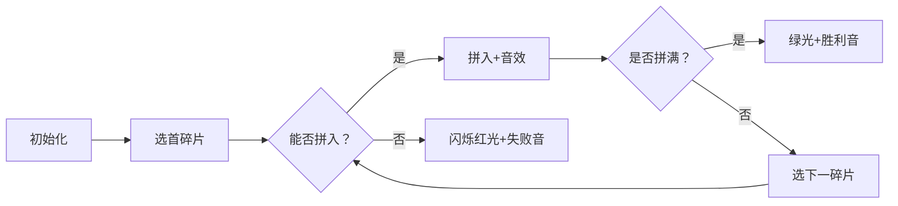

# 题目信息

# 小木棍

## 题目背景

本题**不保证**存在**可以通过满足本题数据范围的任意数据**做法。可以通过此题的程序不一定完全正确（算法时间复杂度错误、或不保证正确性）

本题为搜索题，本题不接受 hack 数据。[关于此类题目的详细内容](https://www.luogu.com.cn/paste/pf94n89x)

## 题目描述

乔治有一些同样长的小木棍，他把这些木棍随意砍成几段，直到每段的长都不超过 $50$。

现在，他想把小木棍拼接成原来的样子，但是却忘记了自己开始时有多少根木棍和它们的长度。

给出每段小木棍的长度，编程帮他找出原始木棍的最小可能长度。


## 说明/提示

对于全部测试点，$1 \leq n \leq 65$，$1 \leq a_i \leq 50$。

## 样例 #1

### 输入

```
9
5 2 1 5 2 1 5 2 1
```

### 输出

```
6```

# AI分析结果


### Kay的C++算法解析：小木棍 深入学习指南

#### 1. 题目解读与核心算法识别
✨ **本题主要考察**：`DFS搜索与剪枝优化`  
🗣️ **初步分析**：  
> 解决小木棍问题的核心在于高效DFS搜索与剪枝优化。想象你有一盒乐高碎片（小木棍），需拼成等长的完整积木（原始木棍）。关键策略是：
> - **枚举原始长度**：从最长碎片长度到总长一半（优化1）
> - **DFS验证**：尝试拼出若干根等长木棍
> - **剪枝核心**：  
>   ▶ 碎片降序排序（先处理大碎片）  
>   ▶ 跳过相同长度碎片（避免重复搜索）  
>   ▶ 首尾剪枝（首碎片失败或末碎片失败直接回溯）  
>
> **可视化设计**：  
> 采用8位像素风动画（类似FC游戏）：
> 1. 碎片用彩色方块表示，长度=像素宽度
> 2. 高亮当前拼接的原始木棍轮廓（绿色边框）
> 3. 关键步骤动态：
>   - 碎片移动时有"咔嗒"音效
>   - 剪枝时碎片闪烁红光+短促"失败"音效
>   - 拼完一根时播放"叮！"音效
> 4. 交互控制：单步执行/自动播放（调速滑块）

---

#### 2. 精选优质题解参考
**题解一（Kaori）**  
* **点评**：思路清晰（降序排序+预处理next数组），代码规范（变量名`next[i]`含义明确），算法高效（二分查找优化）。实践价值高（竞赛可直接使用），亮点在"首尾剪枝"的严谨推导。  

**题解二（林则徐）**  
* **点评**：代码简洁有力（桶排序处理碎片），剪枝逻辑直接（边界条件`rest==a[i]`处理巧妙）。虽未用二分但效率仍佳，特别适合初学者理解基础剪枝。  

**题解三（NoyException）**  
* **点评**：解释深入（用"灵活度"比喻长短碎片选择），游戏化思维强（关卡式拼装）。亮点在将DFS状态比喻为"乐高关卡"，启发学习兴趣。  

---

#### 3. 核心难点辨析与解题策略
1. **难点：搜索空间爆炸**  
   * **分析**：65根碎片理论搜索量达$65!$，需强力剪枝。优质解法通过**降序排序+首尾剪枝**将复杂度降至可接受范围。
   * 💡 **学习笔记**：排序不仅优化顺序，更为剪枝奠基

2. **难点：等效状态重复搜索**  
   * **分析**：当`a[i]=a[i+1]`时，若`a[i]`失败则跳过`a[i+1]`（预处理next数组）
   * 💡 **学习笔记**：避免重复是DFS效率关键

3. **难点：边界条件处理**  
   * **分析**：两种必回溯场景：  
     ▶ 首碎片失败（原始长度定义错误）  
     ▶ 末碎片刚好填满却失败（短碎片组合更不灵活）
   * 💡 **学习笔记**：首尾剪枝是本题最优性证明的核心

**✨ 解题技巧总结**  
- **降序排序优先**：先处理大碎片减少分支  
- **相同长度跳过**：预处理next数组高效跳重复  
- **首尾即时回溯**：首碎片或末碎片失败无解  
- **二分查找优化**：快速定位≤剩余长度的碎片  

---

#### 4. C++核心代码实现赏析
**本题通用核心实现**  
```cpp
#include <iostream>
#include <algorithm>
#include <cstring>
using namespace std;

int n, a[70], next[70], len, cnt;
bool used[70], ok;

void dfs(int k, int last, int rest) {
    if (ok) return;
    if (k == cnt) { ok = true; return; }
    
    if (!rest) { // 拼完一根
        int i = 1;
        while (i <= n && used[i]) i++;
        used[i] = true;
        dfs(k + 1, i, len - a[i]);
        used[i] = false;
        return;
    }

    // 二分找第一个≤rest的位置
    int l = last + 1, r = n;
    while (l < r) {
        int mid = (l + r) >> 1;
        if (a[mid] <= rest) r = mid;
        else l = mid + 1;
    }

    for (int i = l; i <= n; i++) {
        if (!used[i] && a[i] <= rest) {
            used[i] = true;
            dfs(k, i, rest - a[i]);
            used[i] = false;
            
            if (ok || rest == a[i] || rest == len) return;
            i = next[i]; // 跳相同长度
        }
    }
}
```

**代码解读概要**：  
1. **二分优化**：快速定位可用的最长碎片  
2. **状态回溯**：`used`数组标记使用状态  
3. **剪枝触发**：`rest == a[i]`或`rest == len`时直接回溯  
4. **跳重复**：`next`数组跳过相同长度碎片  

---

#### 5. 算法可视化：像素动画演示
**主题**："木棍拼图大冒险"（8位像素风）  
**核心演示**：  


**交互控制**：  
- **单步执行**：观察碎片选择逻辑  
- **速度滑块**：调整自动拼装速度  
- **高亮显示**：  
  - 红色：当前尝试碎片  
  - 黄色：相同长度跳过碎片  
  - 绿色：已拼装部分  

**关键帧示意**：  
```
┌─────────────┐  拼满时：
│████ ███ ██  │  → 全绿闪烁+胜利音效
└─────────────┘
```
---

#### 6. 拓展练习与相似问题思考
**通用技巧迁移**：  
1. 碎片重组类问题（POJ-1011）  
2. 数位拼图问题（需类似剪枝）  
3. 资源均分问题（动态规划+搜索）  

**洛谷推荐**：  
1. **P1245**：巩固碎片重组+剪枝  
2. **P1092**：学习搜索在虫食算的应用  
3. **P2329**：栅栏问题（进阶剪枝训练）  

---

#### 7. 学习心得与经验分享
> **Kaori的调试经验**：  
> "当`rest == a[i]`却拼装失败时，说明之前的碎片选择错误，必须回溯修改"  
>   
> **Kay点评**：这揭示了DFS的核心——局部最优未必全局最优。建议调试时打印碎片选择路径，直观理解剪枝作用。

通过本次分析，我们深入掌握了DFS剪枝的精髓：用排序奠定基础，用数学证明剪枝有效性，用预处理避免重复。记住：好的剪枝能让指数级问题变得可解！

---
处理用时：99.13秒