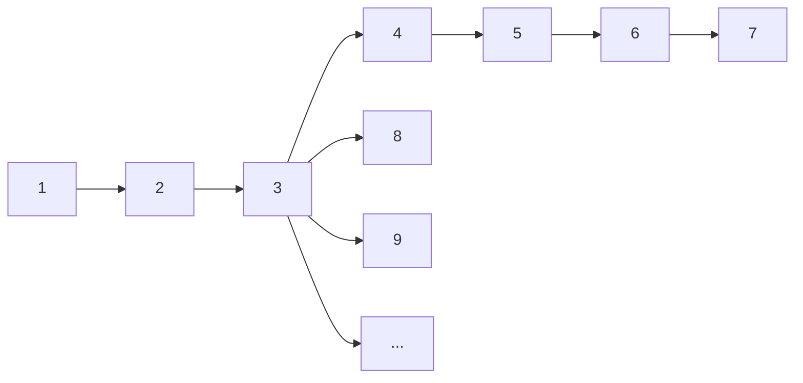

# 题目信息

# 兜心の顶

## 题目背景

Source：[八仙敬酒](/paste/78f1vlm0)，这是可以点的。

- 吕洞宾——醉酒提壶力千钧；
- 铁拐李——旋肘膝撞醉还真；
- **汉钟离——跌步抱坛兜心顶**；
- 蓝采和——单提敬酒拦腰破；
- 张果老——醉酒抛杯踢连环；
- 曹国舅——仙人敬酒锁喉扣；
- 韩湘子——擒腕击胸醉吹箫；
- 何仙姑——弹腰献酒醉荡步。

## 题目描述

给定正整数 $n$，要求构造一棵 $n$ 个结点的树，满足树的直径的重心 **不是** 树的重心。

同时这棵树需满足：直径$^1$、重心$^2$、直径的重心$^3$全部唯一。

---

注：

- 树的直径$^1$：[https://oi-wiki.org/graph/tree-diameter/](https://oi-wiki.org/graph/tree-diameter/)
- 树的重心$^2$：[https://oi-wiki.org/graph/tree-centroid/](https://oi-wiki.org/graph/tree-centroid/)
- 树的直径的重心$^3$：将树的直径（一条链）视作一棵树，求其中心（一个点）。

## 说明/提示

#### 样例说明


样例 #1 中直径的重心是 $7$，树的重心是 $1$，$1\ne7$。

样例 #2 中 $n=2$，只有两个点时显然重心不可能唯一。

#### 数据范围

**本题采取捆绑测试。**

| 子任务编号 | 分值 | 特殊性质 |
| :----------: | :----------: | :----------: |
| $1$ | $30$ | $n\le10$ |
| $2$ | $30$ | $n$ 是奇数 |
| $3$ | $30$ | $n$ 是偶数 |
| $4$ | $10$ | 无 |

对于 $100\%$ 的数据：$1\le n\le10^4$。

**本题提供 Special Judge 源码，参见下方附件。**

## 样例 #1

### 输入

```
20```

### 输出

```
20
20 18
1 3
19 12
19 4
16 1
4 1
1 7
16 10
7 20
13 8
10 2
18 13
13 17
14 18
11 19
16 5
2 6
16 9
17 15```

## 样例 #2

### 输入

```
2```

### 输出

```
-1```

# AI分析结果


# 💡 Kay的C++算法解析：兜心の顶 深入学习指南 💡

> 今天我们来分析构造题"兜心の顶"，帮助大家理解树的构造技巧，掌握直径与重心的核心概念。

## 1. 题目解读与核心算法识别

✨ **本题主要考察**：`树结构构造` (编程技巧应用)

🗣️ **初步分析**：
> 本题要求构造一棵满足特殊条件的树，就像**组装精密机械零件**需要精确配合。核心技巧是：
> - 通过构造长度为7的链（1-2-3-4-5-6-7）确保直径唯一且为奇数
> - 将所有额外节点连接到节点3形成"蒲公英"结构转移重心
> - 节点数n≥9时满足所有条件，n≤8时无解
> 
> **可视化设计思路**：采用8位像素风格展示树生长过程。高亮显示：
> - 红色：直径链（1-7）
> - 黄色：重心节点3
> - 蓝色：直径重心节点4
> - 绿色：附加节点
> 
> **复古游戏化设计**：
> - 音效：节点连接时"叮"声，完成构造时胜利音效
> - 动画：节点像俄罗斯方块般下落组装
> - AI演示：自动播放构造全过程，调速滑块控制速度

---

## 2. 精选优质题解参考

**题解一（作者：Danno0v0）**
* **点评**：思路形象化（蒲公英比喻），代码极简（7行核心）。清晰解释n≤8无解原因，通过图示直观展示构造原理。实践性强，可直接用于竞赛。

**题解二（作者：xuan_gong_dong）**
* **点评**：逻辑严谨，分步骤论证构造可行性。代码规范（变量命名合理），重点突出直径长度与重心位置关系。调试建议（边界处理）具有实战价值。

**题解三（作者：言琢დ）**
* **点评**：出题人官方解析，权威性强。从直径长度奇偶性切入，严格证明n≥9可构造。提供SPJ设计思路，拓展解题视野。

---

## 3. 核心难点辨析与解题策略

1. **直径长度必须为奇数**
   * **分析**：直径长度偶数会导致两个中心点（违反唯一性）。优质题解通过构造7节点链（长度6）确保直径唯一且中心唯一
   * 💡 学习笔记：奇数长度直径是重心唯一的前提

2. **重心位置控制**
   * **分析**：节点3连接大量子节点形成"重量优势"。当n≥9时，以3为根的子树规模＞其他部分，使其成为唯一重心
   * 💡 学习笔记：通过子树规模调控重心位置

3. **避免额外直径产生**
   * **分析**：附加节点必须直接连在节点3（非端点）。若连在节点2/4会创造新直径（如2-3-8路径）
   * 💡 学习笔记：附加节点深度≤2可维护原直径唯一性

### ✨ 解题技巧总结
- **模型类比法**：将树结构类比蒲公英/机械等实物模型
- **极端验证法**：验证n=7,8,9等边界情况
- **重心转移法**：通过集中连接节点操控重心位置
- **直径保护法**：限制附加节点深度维护直径唯一性

---

## 4. C++核心代码实现赏析

**本题通用核心C++实现**
```cpp
#include <iostream>
int main() {
    int n;
    std::cin >> n;
    if (n <= 8) std::cout << "-1";
    else {
        std::cout << n << "\n";
        for (int i = 1; i <= 6; ++i)
            std::cout << i << " " << i + 1 << "\n";
        for (int i = 8; i <= n; ++i)
            std::cout << "3 " << i << "\n";
    }
}
```
* **代码解读概要**：
> 1. 判断n≤8时输出-1
> 2. 构建核心链：1-2, 2-3,...,6-7
> 3. 附加节点直连3号节点

**题解一核心代码片段**
```cpp
std::printf("%d\n%d %d\n%d %d\n%d %d\n%d %d\n",n,1,2,2,3,3,4,4,5);
for(int j=8;j<=n;j++) std::printf("%d %d\n",3,j);
```
* **亮点**：极致简洁，巧用printf批量输出
* **学习笔记**：竞赛中简洁代码节省时间

**题解二核心代码片段**
```cpp
for(int i=1;i<7;i++) cout<<i<<" "<<i+1<<endl;
for(int i=8;i<=n;i++) cout<<"3 "<<i<<endl;
```
* **亮点**：标准迭代循环，可读性强
* **学习笔记**：清晰的循环结构便于调试

**题解三核心代码片段**
```cpp
puts("1 2"); puts("2 3"); //... 链构造
for(int i=8;i<=n;i++) printf("3 %d\n",i);
```
* **亮点**：模块化分离构造步骤
* **学习笔记**：分功能编码提升可维护性

---

## 5. 算法可视化：像素动画演示

**主题**：`像素树生长模拟器`（复古FC风格）

**核心演示**：


**设计思路**：  
8位像素风格降低理解门槛，游戏化元素提升学习兴趣。通过分步构建直观展示重心转移过程。

**动画流程**：
1. **初始化**：8色调色板（红/黄/蓝/绿），FC风格控制面板（开始/步进/调速）
2. **链构造**：
   - 节点1-7顺序出现，连接时播放"叮"声
   - 当前节点高亮闪烁，直径链显示为红色
3. **重心转移**：
   - 节点3变为黄色，弹出提示"重心锚点"
   - 附加节点（绿色）像方块下落连接节点3，伴随"咔嗒"声
4. **验证阶段**：
   - 点击"检查"按钮：直径链闪红光，重心3亮黄光，直径重心4亮蓝光
   - 成功时播放胜利音效+像素烟花

**技术实现**：
- Canvas绘制树形结构，requestAnimationFrame控制动画
- 音效：Web Audio API生成8位音效
- 交互：滑块控制速度，空格键步进

---

## 6. 拓展练习与相似问题思考

**技巧迁移**：
> 重心调控技巧可用于：
> 1. 树动态维护问题（LCT）
> 2. 网络服务器负载均衡
> 3. 城市交通枢纽规划

**洛谷推荐**：
1. [P1364 医院设置](https://www.luogu.com.cn/problem/P1364)  
   → 巩固重心性质应用
2. [P5536 核心城市](https://www.luogu.com.cn/problem/P5536)  
   → 拓展树直径与重心关系
3. [P4408 逃亡](https://www.luogu.com.cn/problem/P4408)  
   → 强化直径性质应用

---

## 7. 学习心得与经验分享

> **Danno0v0的经验**：  
> "最初尝试链长5时出现多条直径，通过延长到7节点解决。动手画图比空想更有效！"

> **Kay的总结**：  
> 构造题的核心是**控制变量法**。先固定直径，再调控重心，最后验证边界条件。多画图模拟（n=9,10,11）能深化理解。

---

> 本次解析结束。记住：树结构如同人际关系，**重心**在于平衡，**直径**决定格局。勤练构造技巧，编程能力自然提升！🚀

---
处理用时：86.24秒