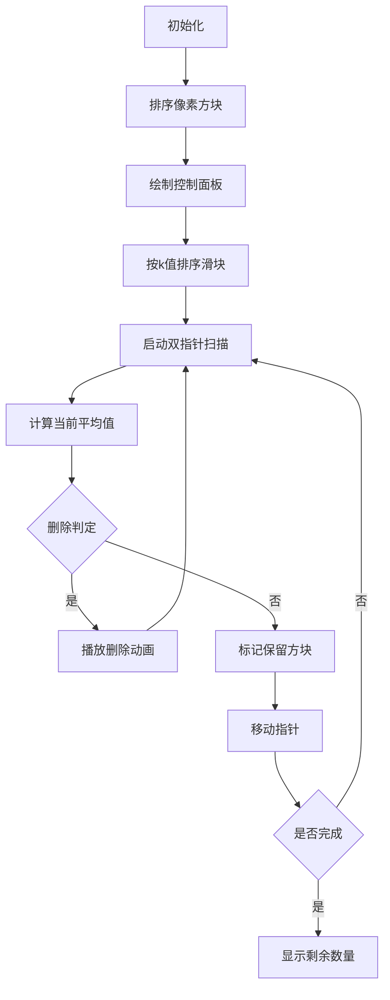

# 题目信息

# [✗✓OI R1] 前方之风

## 题目背景

>「不错的恶意。」  
> 女性呵呵笑道。  
>「但是，如果向我发出恶意，你可是会死哦？」

你不知道什么动作会被算作发出恶意，所以你决定做一道题来分散自己的注意力。

## 题目描述

给出一个长度为 $n$ 的序列 $a$ 和 $q$ 个询问，第 $i$ 个询问给出 $k_i$。对于每次询问，你需要进行以下操作：
1. 求出剩下的数的平均数 $\mathit{avg}$。
2. 将剩下的数中 $<\mathit{avg}-k_i$ 的数删去。
3. 重复以上两个步骤直到所有数都不会被删去。
4. 输出最后会剩下几个数。

**注意：询问之间是独立的，也就是说，不会真的删去那些数。**

## 说明/提示

**【样例解释】**

对于第一组样例，当 $k=0$ 时，显然只会留下 $99$。  
当 $k=6$ 时，删除数的步骤如下：
- 平均数为 $60\dfrac{1}{9}$，留下 $99,63,72,97,68$。
- 平均数为 $79.8$，留下 $99,97$。
- 平均数为 $98$，停止删除。

**【数据范围】**

对于 $100\%$ 的数据，满足 $1\leq n,q \le 10^5$，$1\le T \le 10$，$0 \le a_i,k_i \le 10^9$。

| subtask | 特殊数据范围 | 分数 |  时间限制
| :----------: | :----------: | :----------: |  :----------: |
| 1 | $n,q \le 200$ | 20 |   300ms 
| 2 | $n,q \le 2000$ | 30  | 300ms
| 3 |  | 50 | 800ms|

>「不错的恶意。」  
> 女性呵呵笑道。  
>「而且你运气很不错，如果放在以前，你早就死了。」


## 样例 #1

### 输入

```
5
9 9
19 99 63 39 72 46 97 38 68 
0 6 4 0 7 1 0 3 6 
6 8
88 62 48 50 8 47 
0 6 1 5 2 2 6 1 
6 5
33 3 54 17 26 64 
87 89 92 70 59 
18 19
71 52 77 38 12 34 82 14 57 39 91 7 56 86 35 68 38 14 
9 9 1 5 1 3 4 5 6 1 6 0 3 0 2 1 3 5 8 
10 15
4 77 78 76 5 19 98 94 77 81 
17 43 4 86 2 91 85 4 81 74 44 16 21 69 32 
```

### 输出

```
1 2 2 1 2 2 1 2 2
1 1 1 1 1 1 1 1
6 6 6 6 6
4 4 1 3 1 2 2 3 3 1 3 1 2 1 1 1 2 3 4
7 7 2 10 2 10 10 2 10 10 7 7 7 10 7
```

## 样例 #2

### 输入

```
1
5 1
20 0 0 0 0
5```

### 输出

```
5```

# AI分析结果


# 💡 Kay的C++算法解析：前方之风 深入学习指南 💡

>「不错的恶意。」  
> 女性呵呵笑道。  
>「但是，如果向我发出恶意，你可是会死哦？」  
> —— 让我们用算法智慧化解恶意！

## 1. 题目解读与核心算法识别

✨ **本题主要考察**：`排序+离线双指针`  
(关键技巧：单调性利用+后缀和优化)

🗣️ **初步分析**：
> 想象你在玩一个**像素消除游戏**：屏幕上有一排无序的像素方块（数字），每次你需要：
> 1️⃣ 计算剩余方块亮度平均值（`avg`）  
> 2️⃣ 消除所有亮度值低于`avg-k`的方块（暗色方块）  
> 3️⃣ 重复直到没有方块可消除  
>
> **核心思想**：  
> - 数字大小决定删除顺序 → 排序后删除必是**连续前缀**  
> - **k增大时**，删除条件变严格 → 剩余数量**单调不减**（像素方块保留更多）  
>
> **算法流程**：  
> 1. 排序数组 → 像素方块按亮度升序排列  
> 2. 计算后缀和 → 快速获取任意区间的平均值  
> 3. 离线处理询问 → 按k值**从大到小排序**  
> 4. **双指针扫描**：左指针标记待删除前缀，右指针处理询问  
>
> **可视化设计**：  
> - 复古像素风格：数字→彩色方块，k值→消除阈值滑块  
> - 指针移动：像素箭头标记当前扫描位置  
> - 删除动画：暗色方块闪烁后消失，伴随"碎裂"音效  
> - 实时显示：当前平均值和剩余方块数量

---

## 2. 精选优质题解参考

### 题解一：xzyg (排序+后缀和+离线双指针)
* **点评**：
  - 思路清晰：准确捕捉k值与答案单调性关系，用双指针避免重复计算  
  - 代码规范：结构体封装询问，后缀和预处理简洁  
  - 算法高效：O(n log n + q log q) 完美处理1e5数据  
  - 实践价值：完整处理多组数据，边界处理严谨  
  - 亮点：**离线排序+双指针扫描**大幅降低时间复杂度

### 题解二：AsunderSquall (性质证明+双指针)
* **点评**：
  - 思路严谨：给出两条关键性质证明（稳定性与单调性）  
  - 代码简洁：直接按k降序处理询问，逻辑流畅  
  - 算法有效：同双指针但省略后缀和数组，空间优化  
  - 实践参考：强调开long long和浮点比较精度问题  
  - 亮点：**数学归纳证明**增强解法可信度

### 题解三：青鸟_Blue_Bird (图解分析+双指针)
* **点评**：
  - 图解生动：用折线图展示平均值单调性  
  - 代码易读：变量名语义明确，注释到位  
  - 创新点：用**像素亮度类比数字大小**帮助理解  
  - 调试技巧：内置debug打印语句（样例可注释）  
  - 亮点：**视觉化分析**手段提升理解效率

---

## 3. 核心难点辨析与解题策略

1. **难点：k值与答案的单调性证明**  
   *分析*：当k增大时，`avg-k`值减小→删除条件变严格→保留数字增多。优质题解通过反证法（假设k₂>k₁时答案反而减少会矛盾）严格证明  
   💡 **学习笔记**：单调性是离线处理的前提！

2. **难点：删除操作的连续性**  
   *分析*：排序后，若aᵢ被删，则所有更小值必先被删。因此只需检查**当前最小值**是否低于`(后缀和/长度)-k`  
   💡 **学习笔记**：排序将随机删除转化为前缀删除！

3. **难点：避免O(n²)的暴力模拟**  
   *分析*：离线处理k值后，双指针从左向右扫描，每个数字和询问**均只处理一次**  
   💡 **学习笔记**：双指针的扫描顺序是关键！

### ✨ 解题技巧总结
- **离线处理**：当询问参数有单调性时，排序后统一处理  
- **后缀和优化**：预处理区间和避免重复计算  
- **浮点比较转整数**：用乘法代替除法避免精度问题  
- **边界检查**：指针移动时注意数组边界

---

## 4. C++核心代码实现赏析

### 本题通用核心C++实现
```cpp
#include <bits/stdc++.h>
#define ll long long
using namespace std;

const int N = 1e5+10;
ll a[N], sum[N];
struct Query { ll k, id, ans; } q[N];

int main() {
    int T; scanf("%d", &T);
    while (T--) {
        // 输入与初始化
        int n, Q; scanf("%d%d", &n, &Q);
        for (int i = 1; i <= n; i++) scanf("%lld", &a[i]);
        for (int i = 1; i <= Q; i++) 
            scanf("%lld", &q[i].k), q[i].id = i;

        // 排序数组和询问
        sort(a + 1, a + 1 + n);
        sort(q + 1, q + 1 + Q, [](auto &x, auto &y) {
            return x.k > y.k; // k从大到小排序
        });

        // 后缀和预处理
        sum[n] = a[n];
        for (int i = n-1; i >= 1; i--) 
            sum[i] = sum[i+1] + a[i];

        // 双指针处理询问
        int cur = 1; // 当前待检查数字下标
        for (int i = 1; i <= Q; i++) {
            while (cur <= n) {
                double avg = 1.0 * sum[cur] / (n - cur + 1);
                if (a[cur] < avg - q[i].k) cur++;
                else break;
            }
            q[i].ans = n - cur + 1;
        }

        // 按原顺序输出
        sort(q + 1, q + 1 + Q, [](auto &x, auto &y) {
            return x.id < y.id;
        });
        for (int i = 1; i <= Q; i++)
            printf("%lld ", q[i].ans);
        printf("\n");
    }
    return 0;
}
```

**代码解读概要**：
1. **排序阶段**：原数组和询问数组分别排序  
2. **后缀和计算**：`sum[i]`表示从i到n的和  
3. **双指针扫描**：  
   - `cur`标记当前待检查数字  
   - 比较`a[cur]`与`(sum[cur]/(n-cur+1))-k`  
   - 若删除则`cur++`，否则记录答案  
4. **输出还原**：按原询问顺序输出结果

### 优质题解片段赏析

**题解一（xzyg）核心片段**：
```cpp
while(a[i] < avg[i] - k[p].val) ++i;  // 比较与移动指针
k[p].ans = n-i+1;                     // 记录答案
p++;                                  // 处理下一询问
```
* **亮点**：简洁的指针移动逻辑  
* **解读**：  
  > 这段代码是双指针核心：  
  > 1. 当`a[i]`小于当前平均值减k时，说明该数字应删除，`i`右移  
  > 2. 否则，剩余数量即为`n-i+1`  
  > 3. 处理完当前询问后移动询问指针  
* 💡 **学习笔记**：指针移动条件直接反映删除判定规则！

**题解二（青鸟_Blue_Bird）创新点**：
```cpp
if(a[l] < (double)(sum[n]-sum[l-1])/(n-l+1)-k[s[id]])
    l++;  // 删除判定
```
* **亮点**：动态计算区间平均值  
* **解读**：  
  > 不同于预处理后缀和，这里实时计算区间和：  
  > `(sum[n]-sum[l-1])`是从l到n的和  
  > 除以`(n-l+1)`得平均值  
  > 虽然增加计算量但节省了空间  
* 💡 **学习笔记**：空间与时间的取舍艺术

---

## 5. 算法可视化：像素动画演示

**主题**：`像素风数字消除大作战`  
**核心演示**：双指针扫描与动态平均值计算  



**设计细节**：
1. **8-bit像素风格**：
   - 数字→16x16像素方块（亮度值映射颜色：0=深蓝, 10⁹=亮黄）
   - 指针→红色箭头像素精灵
   - 控制面板→复古金属质感按钮

2. **动态演示逻辑**：
   ```python
   while 指针pos <= n:
       绘制当前指针位置的闪烁效果
       计算当前区间平均值 → 显示在顶部LED屏
       if a[pos] < avg - k:
           播放"碎裂"音效
           方块颜色变灰→缩小消失动画
           pos += 1
       else:
           播放"叮"成功音效
           保留方块亮绿色边框
   ```

3. **交互控制**：
   - 速度滑块：调整指针移动速度
   - 单步执行：按帧分析判定逻辑
   - k值调节：拖动滑块实时看不同k值的结果
   - 音效方案：
     * 删除方块：8-bit碎裂音
     * 保留方块：清脆提示音
     * 完成关卡：FC胜利旋律

4. **游戏化元素**：
   - 每处理完一个k值视为一关
   - 连续正确得星评价（3星需最优解）
   - 历史最优解展示排行榜

---

## 6. 拓展练习与相似问题

### 相似思维题
1. **P2824 中位数**  
   → 利用排序+指针维护动态中位数
2. **P1908 逆序对**  
   → 离线处理+树状数组（同样利用操作独立性）
3. **P2882 平均数**  
   → 前缀和+双指针找子数组平均值满足条件的区间

### 洛谷推荐
1. **P3871 中位数**  
   → 动态维护中位数，巩固离线处理技巧
2. **P3960 列队**  
   → 大规模离线询问处理，提升数据结构应用能力
3. **P3834 可持久化线段树**  
   → 离线询问+主席树解决区间第k大问题

---

## 7. 学习心得与经验分享

> **来自xzyg的调试经验**：  
> *“最初在浮点精度处理上卡了很久，后来改用乘法替代除法比较：`a[i]*(n-i+1) < sum[i] - k*(n-i+1)` 避免精度误差”*

**Kay点评**：  
> 这个经验揭露了算法竞赛的**关键细节**：  
> 1. 浮点数比较存在精度风险  
> 2. 通过数学变换转为整数运算是常用技巧  
> 3. 测试边界数据（如极值）能快速发现问题  

---

>「不错的恶意。」  
> 女性呵呵笑道。  
>「但用算法智慧化解危机的你，值得赞赏！」  
> —— 保持思考，迎接下一个挑战！💪

---
处理用时：120.71秒