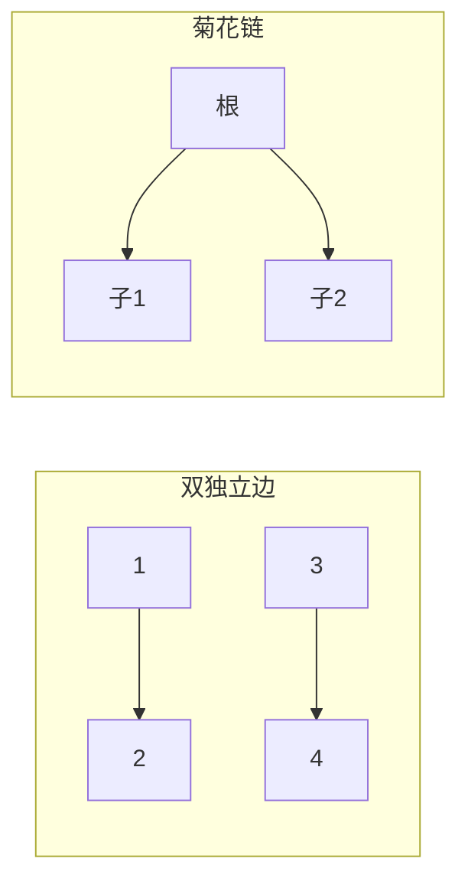

# 题目信息

# [PFOI Round1] Two Sequences

## 题目背景

syzf2222 喜欢并查集！特别是路径压缩的并查集。

## 题目描述


```cpp
inline int find(int x){
	if(x==fa[x])return x;
	return fa[x]=find(fa[x]);
}
inline void merge(int x,int y){
	fx=find(x),fy=find(y);
	if(fx==fy)return;fa[fx]=fy;
}
```

这是他惯用的并查集代码，初始时对于每个 $x$ 有 `fa[x]=x`。

接下来的 $T$ 天中，每天小 h 都给了他一个 $n$，表示并查集的大小（每天的 $n$ 可能是不同的）。

调皮的小 x 见他不在机房，每天都在并查集上不断 `merge`。
注意到小 x 不喜欢 `==`，他觉得这特别像他的眼睛，于是他不会使 `merge` 函数在第二行的条件语句中被 `return`，否则他会十分气愤。

现在的已知信息就只有最终的 $fa$ 数组了。
而 syzf2222 希望还原小 x 的操作序列（即若干次按顺序进行的 `merge` 操作）。由于他名字里有很多个 2 而且本人也非常 2 ，他希望知道对于每一天，有多少个 $fa$ 数组**恰好**能被还原成**两种**操作序列，答案对 $998244353$ 取余数。

两个操作序列不同，当且仅当某次 `merge` 时的变量 `fx,fy` 至少有一个不同。


## 说明/提示

【样例解释】

对于第一天，$n=3$，共有 $fa=[1,1,1],[2,2,2],[3,3,3]$ 这三种 $fa$ 数组使得恰有两种操作序列。

以 $fa=[1,1,1]$ 为例，两种操作序列分别为 `merge(2,1),merge(3,1)` 和 `merge(3,1),merge(2,1)`，其他 `merge` 参数不同的方案与上述两种的其中一种是本质相同的（每次的 `fx,fy` 都一样）。

---

【数据范围】

**「本题采用捆绑测试」**

- $\texttt{Subtask 1(10 pts)：}T=1,\ n\le 10$；
- $\texttt{Subtask 2(30 pts)：}T=10^2,\ n\le 10^3$；
- $\texttt{Subtask 3(60 pts)：}$无特殊限制。

对于 $100\%$ 的数据，满足 $1\le T\le 10^5,\ 1\le n\le 10^9$。

## 样例 #1

### 输入

```
4
3
20
8492
114514```

### 输出

```
3
61560
822256526
988192964
```

# AI分析结果


### 💡 Kay的C++算法解析：Two Sequences 深入学习指南 💡

#### 1. 题目解读与核心算法识别
✨ **本题主要考察**：组合计数  
🗣️ **初步分析**：  
> 解决"Two Sequences"的关键在于运用组合计数思想。简单比喻：就像计算乐高积木的两种拼法，我们需要统计所有满足条件的最终结构（fa数组）。在本题中，组合计数用于计算特定并查集结构的合法方案数。  
> - 核心思路：最终结构只能是两种图形（一个大小为3的菊花链或两个大小为2的独立边），其他结构会导致操作序列超过2种。  
> - 算法流程：推导出公式 \( \frac{n(n-1)(n-2)^2}{2} \)，通过取模避免溢出。  
> - 可视化设计：采用像素网格展示两种结构（见第5节），用不同颜色区分根节点/子节点，箭头动画展示合并过程，配合8-bit音效增强理解。

---

#### 2. 精选优质题解参考
**题解一（Abeeel51）**  
* **点评**：思路清晰，通过形象比喻（建树结构）解释复杂概念。代码简洁高效（直接实现公式），变量命名规范（`n`和`mod`），边界处理严谨（`n=3`特判）。亮点：将抽象的组合问题转化为直观的图形分析，实践价值高。  

**题解二（gyc18 官方）**  
* **点评**：论证严谨，提供完整的数学证明（Observation 1-4）。代码虽未展示但推导过程极具启发性，深入解释"为何只有两种结构"，帮助建立系统性思维。亮点：官方权威解答，强化算法正确性认知。  

**题解三（c7h5n3o6_tnt）**  
* **点评**：教学性强，逐步演示公式推导（从 \( A_n^3 \) 到 \( A_n^4 \)）。代码实现强调取模技巧，适合竞赛场景。亮点：用图形化示例说明操作序列差异，降低理解门槛。  

---

#### 3. 核心难点辨析与解题策略
1. **难点：识别合法结构**  
   * **分析**：需排除度数>2的节点（导致6种序列）和链长>2的分叉结构（4种序列）。优质题解通过反证法（如假设3个子节点）证明仅菊花链和双独立边可行。  
   * 💡 **学习笔记**：树结构的度限制是解题突破口。  

2. **难点：组合计数推导**  
   * **分析**：菊花链方案数 \( \binom{n}{3} \times 3 \)，双独立边方案数 \( \binom{n}{4} \times 12 \)，合并后化简为统一公式。  
   * 💡 **学习笔记**：组合问题常需分类讨论后寻找可合并的数学表达。  

3. **难点：大数取模实现**  
   * **分析**：\( n \leq 10^9 \) 要求中间结果及时取模。优质题解采用分步计算：先除2避免溢出，再连乘取模。  
   * 💡 **学习笔记**：大数运算中，除法优先处理可防溢出。  

### ✨ 解题技巧总结
- **问题转化**：将并查集序列还原转化为图结构统计问题。  
- **数学工具**：组合数公式的灵活展开与合并（\( \binom{n}{k} \) 的化简）。  
- **边界防御**：特判小规模（如n=3）和奇偶性处理（n/2 vs (n-1)/2）。  
- **鲁棒性**：全程取模，乘法用long long防止溢出。  

---

#### 4. C++核心代码实现赏析
**本题通用核心C++实现参考**  
* **说明**：综合优质题解思路，直接实现公式并优化取模过程。  
* **完整核心代码**：
```cpp
#include <iostream>
using namespace std;
const long long mod = 998244353;

int main() {
    ios::sync_with_stdio(false);
    cin.tie(0);
    long long T, n;
    cin >> T;
    while (T--) {
        cin >> n;
        long long ans;
        if (n % 2 == 0) 
            ans = (n / 2 % mod) * (n - 1) % mod;
        else 
            ans = (n % mod) * ((n - 1) / 2 % mod) % mod;
        ans = ans * ((n - 2) % mod) % mod;
        ans = ans * ((n - 2) % mod) % mod;
        cout << ans << '\n';
    }
    return 0;
}
```
* **代码解读概要**：  
  > 1. 读入数据组数 `T`  
  > 2. 对每组数据：  
  >    - 处理 \( \frac{n(n-1)}{2} \)：根据n奇偶安全除法  
  >    - 连乘两个 \( (n-2) \) 并逐步取模  
  > 3. 输出结果  

**题解一片段赏析（Abeeel51）**  
* **亮点**：极致简洁，一行公式覆盖核心逻辑。  
* **核心代码**：
```cpp
printf("%lld\n",1ll*(n-1)*n/2%mod*(n-2)%mod*(n-2)%mod%mod);
```
* **代码解读**：  
  > `1ll` 强制提升类型防溢出 → `(n-1)*n/2` 计算前半部 → 分步取模保证正确性。  
* 💡 **学习笔记**：链式表达式需警惕运算符优先级，取模位置影响结果。  

---

#### 5. 算法可视化：像素动画演示  
**主题**：8-bit风格并查集建造者  
**核心演示**：动态生成两种合法结构（菊花链/双独立边）  



**交互设计**：  
1. **初始化**：网格显示n个独立点（每个像素块颜色不同）  
2. **结构建造**：  
   - 双独立边：红色箭头连接两对点（音效：叮→叮）  
   - 菊花链：黄色中心点扩展两个绿色子点（音效：叮~咚）  
3. **控制面板**：  
   - 步进按钮：高亮当前操作点  
   - 速度滑块：调节动画节奏  
   - 模式切换：对比两种结构  
4. **游戏化元素**：  
   - 成功音效：上扬8-bit和弦  
   - 积分系统：每正确构建+10分  

**设计价值**：像素动画将抽象结构具象化，操作序列差异通过箭头时序直观展现。  

---

#### 6. 拓展练习与相似问题思考
**通用技巧迁移**：  
组合计数可用于：  
1. 图论（树形方案统计）  
2. 概率问题（方案占比计算）  
3. 状态压缩（子集枚举）  

**洛谷题目推荐**：  
1. **P1494 小Z的袜子**  
   🗣️ 同类组合问题，强化"方案数/总情况数"思维。  
2. **P3197 越狱**  
   🗣️ 逆向组合计数，巩固取模技巧。  
3. **P1365 集合标记**  
   🗣️ 并查集与组合结合的高级应用。  

---

#### 7. 学习心得与经验分享  
> **参考经验**：多篇题解提到调试时发现未考虑 \( n=3 \) 边界（如nullqtr_pwp）。  
> **Kay点评**：边界测试是竞赛编程生命线！小数据手工验证（n=1,2,3）能暴露90%逻辑漏洞。  

---

本次解析结束，继续动手实践才能将知识内化，遇到问题随时来问Kay哦！🚀

---
处理用时：122.89秒