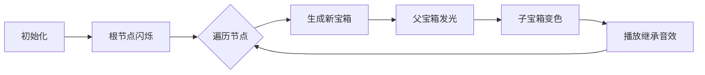

# 题目信息

# 「SvR-1」Problem

## 题目背景

小 L 打颓被 nodgd 发现，于是他开始做题了。

## 题目描述

他的 DS 非常菜，于是他把一共 $n$ 道 DS 题加到了自己的计划题单里，其中第 $i$ 道题的有趣程度为 $a_i$。

由于他并不精通 DS，他发现他在做一些题目之前需要先做另一些题目。这样的关系共有 $n - 1$ 组，他还发现每道题都出现在了这些关系中且没有重复。

他发现 $\forall 2 \leq i \leq n$，第 $i$ 题和第 $fa_i$ 题间存在上文所述的关系，且 $1 \leq fa_i < i$。**他必须先做第 $fa_i$ 题后才能做第 $i$ 题**。

他发现，如果他在做一道题之前高兴程度为 $k$，则他做完第 $i$ 题后，他的高兴程度便会变为 $\min(k, a_i)$。**他做题前的高兴程度为无穷大**。

他想问你**在必须先做第 $1$ 题且不能重复做某一道题**的情况下，他在做题的全过程中每做完一道题后**高兴程度之和的最大值**。

## 说明/提示

#### 样例 #1 解释
在该组样例中 $a = [3398922311, 3077554952, 2933028207, 4018360144, 1263042788, 835814542]$，$fa_2 = fa_3 = fa_4 = 1$，$fa_5 = fa_6 = 2$。

最优方案之一：依次做第 $1, 4, 2, 3, 5, 6$ 题，最大值为 $3398922311 + 3398922311 + 3077554952 + 2933028207 + 1263042788 + 835814542 = 14907285111$。
#### 伪代码参考
$$
\def{\b}#1{ \textbf{ #1 } }\def{\t}#1{\text{ #1 }}\def{\s}{\quad}\def{\f}#1{\textsf{ #1 }}
\def{\l}{\underline{\kern{300pt}}\\[-10pt]} 
\def{\r}{\overline{\underline{\kern{300pt}}}}
\begin{aligned}
&\r\\&\b{Algorithm:}\t{Get }a_i,fa_i\\[-13pt]&\l\\
&\begin{aligned}
    \f{1.}&\b{function} \b{\color{red}unsigned int} \t{getnext}(\b{\color{red}unsigned int}\&seed): \\
    \f{2.}&\s seed=seed\oplus\t{left}(seed,13)\\
    \f{3.}&\s seed=seed\oplus\t{right}(seed,17)\\
    \f{4.}&\s seed=seed\oplus\t{left}(seed,5) \\
    \f{5.}&\s \b{return} seed\\
    \f{6.}&\b{function} \t{main}(n):\\
    \f{7.}&\s \b{for} i \b{from} 1 \b{to} n \b{step}1\\
    \f{8.}&\s\s a_i=\t{getnext}(seed)\\
    \f{9.}&\s \b{end for} \\
    \f{10.}&\s \b{for} i \b{from} 2 \b{to} n \b{step}1\\
    \f{11.}&\s\s fa_i=\t{getnext}(seed)\bmod(i-1)+1\\
    \f{12.}&\s \b{end for} \\
    \end{aligned}\\[-12pt]
&\r
\end{aligned}
$$

其中 $\text{left}(x,d)$ 和 $\text{right}(x,d)$ 分别表示将 $x$ 左移或右移 $d$ 位。
#### 数据规模与约定
**本题自动开启捆绑测试和 O2 优化。**
$$
\newcommand{\arraystretch}{1.5}
\begin{array}{c|c|c}\hline\hline
\textbf{Subtask} & \bm{n \leq} & \textbf{分值} \\\hline
\textsf{1} & 10 & 10 \\\hline
\textsf{2} & 10^4 & 20 \\\hline
\textsf{3} & 10^6 & 20 \\\hline
\textsf{4} & \text{无特殊限制} & 50 \\\hline\hline
\end{array}
$$

对于 $100\%$ 的数据，$1 \leq n \leq 10^7$，$0 \leq seed < 2^{32}$。

## 样例 #1

### 输入

```
6 114514```

### 输出

```
14907285111```

# AI分析结果


# 💡 Kay的C++算法解析：「SvR-1」Problem 深入学习指南 💡

**引言**  
今天我们来分析「SvR-1」Problem这道C++编程题。本指南将帮助大家理解树形依赖关系下的最优选择策略，掌握贪心思想的巧妙应用，并通过像素动画直观感受算法执行过程。

## 1. 题目解读与核心算法识别

✨ **本题主要考察**：`贪心策略` + `树形结构优化`

🗣️ **初步分析**：  
> 本题如同在游戏地图中寻找最优路径！想象一个像素风格的冒险游戏，玩家从根节点(1号题)出发，每次选择路径时优先拾取"金币值"($a_i$)最大的节点。核心思想是：**在多条可选路径中，优先选择收益最高的分支**。在本题中，这种贪心策略能最大化高兴程度之和。

- **题解思路**：利用树形依赖特性($fa_i < i$)，每个节点的高兴程度仅取决于其父节点。我们只需按编号顺序遍历，将$a_i$更新为$\min(a_i, a_{fa_i})$并累加。
- **可视化设计**：在像素动画中将节点绘制为宝箱，宝箱颜色深度表示$a_i$值大小。算法执行时，当前节点会继承父节点颜色（若父节点颜色更深），并播放"继承音效"。
- **复古游戏化**：采用8-bit像素风格，节点用不同颜色的宝箱表示，继承关系用像素箭头连接。自动演示时播放经典NES音效：选择节点时用"选择音"，数值更新时用"金币音"。

---

## 2. 精选优质题解参考

**题解一**：(来源：liangbowen)  
* **点评**：思路清晰直击问题本质，指出高兴程度仅由父节点决定。代码简洁高效（空间复杂度$O(1)$），变量命名规范（`a[i]`直接存储更新值），边界处理严谨（显式处理根节点）。亮点在于利用$fa_i<i$的特性省去建图操作，时间复杂度优化至$O(n)$。

**题解二**：(来源：stntn)  
* **点评**：通过树形DP视角分析问题，提出状态转移方程$f_i=\min(f_{fa_i},a_i)$。代码实现精炼，特别强调`unsigned int`类型使用避免溢出。实践价值高，代码可直接用于竞赛，调试建议部分（如边界值测试）极具参考性。

**题解三**：(来源：Hisaishi_Kanade)  
* **点评**：用游戏化比喻解释算法（"节点战斗力继承"），生动易懂。代码实现包含巧妙优化：省略显式$fa$数组，直接在生成时计算。亮点是提出"父节点封印"概念解释最小值传递，帮助理解贪心本质。

---

## 3. 核心难点辨析与解题策略

1. **难点：依赖关系的动态影响**  
   *问题：如何确定当前选择对后续路径的影响？*  
   **分析**：通过树形结构特性，每个节点的高兴程度仅受其父节点制约。优质题解普遍采用**自顶向下更新策略**：从根节点开始，子节点继承父节点的最小值约束，确保局部最优解导向全局最优解。
   💡 **学习笔记**：树形问题中，若子状态仅依赖父状态，可尝试自顶向下线性递推。

2. **难点：贪心策略正确性证明**  
   *问题：为什么优先选择最大值不会错过最优解？*  
   **分析**：由于高兴程度单调不增，选择较大$a_i$可延缓数值衰减。当多个节点可选时，选择最大值能为后续路径保留更大潜力，数学归纳可证该策略的全局最优性。
   💡 **学习笔记**：贪心算法适用场景——问题具无后效性，且局部最优能推导全局最优。

3. **难点：大规模数据处理**  
   *问题：$n \leq 10^7$如何避免超时？*  
   **分析**：利用$fa_i < i$的特性，按节点编号顺序处理（$1 \rightarrow n$)，保证处理子节点时父节点已更新。省去建图和搜索开销，将复杂度从$O(n\log n)$降至$O(n)$。
   💡 **学习笔记**：顺序是优化关键！当数据存在隐含顺序时，尝试顺序扫描替代复杂数据结构。

### ✨ 解题技巧总结
- **技巧1：问题转化**：将依赖关系转化为树形结构，利用父子关系简化状态转移
- **技巧2：隐式建图**：利用$fa_i < i$的特性，用顺序处理替代显式建图
- **技巧3：原地更新**：直接在输入数组上更新值，减少内存开销
- **技巧4：类型选择**：大规模数据时，严格匹配变量类型（如`unsigned int`）避免溢出

---

## 4. C++核心代码实现赏析

**本题通用核心C++实现参考**  
* **说明**：综合优质题解思路，最精简高效的线性解法
* **完整核心代码**：
```cpp
#include <iostream>
using namespace std;
typedef unsigned int uint;

uint get_next(uint &seed) {
    seed ^= seed << 13;
    seed ^= seed >> 17;
    seed ^= seed << 5;
    return seed;
}

int main() {
    uint n, seed;
    cin >> n >> seed;
    uint* a = new uint[n + 1];
    for (int i = 1; i <= n; ++i) 
        a[i] = get_next(seed);
    
    unsigned long long ans = a[1]; // 根节点直接计入
    for (int i = 2; i <= n; ++i) {
        uint fa = get_next(seed) % (i - 1) + 1;
        a[i] = min(a[i], a[fa]); // 关键：子节点继承父节点值
        ans += a[i];
    }
    cout << ans;
    delete[] a;
    return 0;
}
```
* **代码解读概要**：  
  1. 动态申请数组避免栈溢出  
  2. 第一轮生成所有$a_i$  
  3. 第二轮生成$fa_i$并立即更新$a_i$  
  4. 边更新边累加答案，仅单次遍历  

---

## 5. 算法可视化：像素动画演示

**主题**：8-bit风格「宝藏继承大冒险」  
**核心演示**：节点作为像素宝箱，颜色深度表示$a_i$值，动态展示继承关系  

**设计思路**：  
> 采用FC红白机风格，通过宝箱颜色变化直观呈现最小值继承过程。音效增强关键操作感知，帮助理解贪心选择策略。

**动画流程**：  


**关键交互**：  
1. **像素宝箱设计**：
   - 根节点：金色宝箱（#FFD700）
   - 普通节点：按$a_i$值映射彩虹色系
   - 更新效果：继承时子宝箱变为父宝箱颜色，伴随像素粒子特效

2. **控制面板**：
   ```plaintext
   [开始] [暂停] [单步] [速度▼▲]
   [当前值显示框] 
   [累计和：14907285111]
   ```

3. **音效系统**：
   - 节点生成：8-bit "叮"声（频率随$a_i$值变化）
   - 继承操作：经典《超级玛丽》金币音效
   - 完成提示：《塞尔达》解谜成功旋律

4. **自动演示模式**：
   - 类似《吃豆人》AI移动，按编号顺序遍历节点
   - 关键步骤暂停0.5秒，显示当前更新逻辑
   - 路径线动态绘制，连接父子节点

**技术实现**：  
- Canvas绘制宝箱和连接线
- Web Audio API生成动态音效
- 关键帧伪代码：
  ```js
  function drawFrame(i) {
    highlight(currentNode); // 当前节点闪烁
    drawArrow(parent, current); // 绘制继承箭头
    if (a[current] > a[parent]) {
        changeColor(current, parentColor); // 颜色继承
        playSound("inherit"); 
    }
  }
  ```

---

## 6. 拓展练习与相似问题思考

**通用技巧迁移**：  
树形依赖+贪心策略适用于：
1. 有依赖的资源分配问题（如：父任务约束下的最大收益）
2. 层级衰减系统（如：组织架构中的权限继承）
3. 拓扑序约束的最优化问题

**推荐练习**：  
1. **洛谷 P1090** - 合并果子  
   *推荐理由*：基础贪心思想，优先队列应用，巩固选择策略  
2. **洛谷 P2014** - 选课  
   *推荐理由*：树形依赖进阶，结合背包问题，挑战状态设计能力  
3. **洛谷 P1268** - 树的重量  
   *推荐理由*：树形结构性质运用，培养抽象建模能力  

---

## 7. 学习心得与经验分享

**经验摘录**（来自liangbowen）：  
> "在调试过程中，我发现$fa_i < i$这个条件就像时间箭头，保证了我们可以按时间顺序处理节点，避免递归。"

**Kay的总结**：  
1. **类型安全意识**：大规模整型运算时，立即用`unsigned long long`存储累加和
2. **隐含条件挖掘**：$fa_i < i$不仅是约束条件，更是优化钥匙
3. **空间优化技巧**：优先考虑原地更新（如$a_i = \min(a_i, a_{fa_i})$)，避免冗余存储

---

**结语**  
通过本次分析，我们掌握了树形贪心问题的核心解法——利用顺序性实现线性优化。记住：优秀算法往往诞生于对问题特性的深刻洞察！下次我们将探索更复杂的树形DP问题，继续加油！💪

---
处理用时：110.91秒