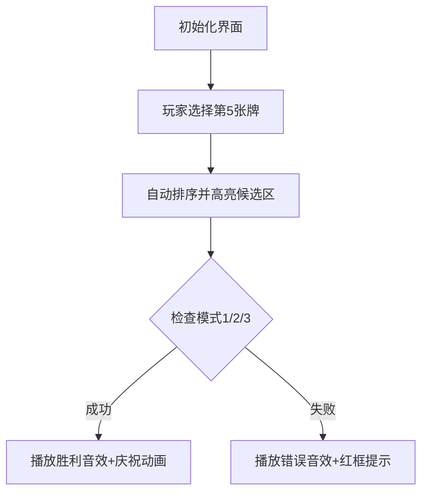

# 题目信息

# [Aya Round 1 B] 甲（one）

## 题目描述

定义长度为 $5$ 的序列 $S$ 为「好的」，当且仅当存在长度为 $5$ 的排列 $P$，满足 $S_{P_1}-1=S_{P_2}=S_{P_3}+1$ 且 $S_{P_4}=S_{P_5}$。现有一长度为 $5$ 的整数序列 $a$，满足 $0\le a_i \le 9(1\le i \le 5)$。其中 $a_1 \sim a_4$ 给定。试判断是否存在 $a_5$ 满足 $a$ 为「好的」。

其中，长度为 $5$ 的排列 $P$，指的是一个长度为 $5$ 的数列，其中 $1,2,3,4,5$ 在这个数列中出现且只出现一次。

## 说明/提示

### 附加样例

- 样例 $2$ 见下发文件中的 $\textbf{\textit{one2.in/one2.ans}}$。该样例满足测试点 $2$ 的限制。
- 样例 $3$ 见下发文件中的 $\textbf{\textit{one3.in/one3.ans}}$。该样例满足测试点 $5$ 的限制。

### 样例解释

#### 样例 \#1

- 对于第 $1$ 组数据，可以令 $a_5=8$。此时存在 $P=\{4,1,2,5,3\}$，满足 $a_{P_1}-1=a_{P_2}=a_{P_3}+1$ 且 $a_{P_4}=a_{P_5}$。故输出 $1$。
- 对于第 $2$ 组数据，可以令 $a_5=4$。此时存在 $P=\{3,2,1,4,5\}$，满足 $a_{P_1}-1=a_{P_2}=a_{P_3}+1$ 且 $a_{P_4}=a_{P_5}$。故输出 $1$。
- 对于第 $3$ 组数据，不存在可以使 $a$ 为「好的」的 $a_5$。

$$
\begin{aligned}
\fcolorbox{black}{#fbb}{3\ \ 2\ \ 8\ \ 4} + \fcolorbox{black}{yellow}{8} &\Rightarrow \fcolorbox{black}{#fbb}{2\ \ 3\ \ 4} + \fcolorbox{black}{yellow}{8\ \ 8}\ {\color{green}\sqrt{}}\\
\fcolorbox{black}{#fbb}{1\ \ 2\ \ 3\ \ 4} + \fcolorbox{black}{yellow}{4} &\Rightarrow \fcolorbox{black}{#fbb}{1\ \ 2\ \ 3} + \fcolorbox{black}{yellow}{4\ \ 4}\ {\color{green}\sqrt{}}\\
\fcolorbox{black}{#fbb}{1\ \ 9\ \ 4\ \ 9} +   \begin{cases}
\fcolorbox{black}{yellow}{0}\\
\fcolorbox{black}{yellow}{1}\\
\cdots\\
\fcolorbox{black}{yellow}{9}
\end{cases}&\Rightarrow
{\color{red}\xcancel{\color{black}
\begin{cases}
\fcolorbox{black}{#fbb}{1\ \ 9\ \ 4\ \ 9\ \ 0}\\
\fcolorbox{black}{#fbb}{1\ \ 9\ \ 4\ \ 9\ \ 1}\\
\cdots\\
\fcolorbox{black}{#fbb}{1\ \ 9\ \ 4\ \ 9\ \ 9}
\end{cases}}}
\end{aligned}
$$

### 数据范围

$$
\def\arraystretch{1.5}
\begin{array}{|c|c|c|} \hline
\textbf{\textsf{测试点}} & \bm{{T\le}} & \textbf{\textsf{特殊性质}} \cr\hline
1 & 100 & \textbf{A} \cr\hline
2 & 100 & \textbf{B} \cr\hline
3 & 100 & - \cr\hline
4 & 1000 & - \cr\hline
5 & 10^5 & - \cr\hline
\end{array}
$$

- 特殊性质 $\bf A$：$a_1=a_2=a_3=a_4$。
- 特殊性质 $\bf B$：$a_1,a_2,a_3,a_4$ 互不相等。

对于 $100\%$ 的数据，$1\le T\le 10^5$，$0\le a_i \le 9$。

## 样例 #1

### 输入

```
5
3 2 8 4
1 2 3 4
1 9 4 9
1 0 0 1
0 0 4 2```

### 输出

```
1
1
0
0
1```

# AI分析结果


### 题目解读与核心算法识别
✨ **本题主要考察**：`枚举与模拟应用` (编程技巧应用类)

🗣️ **初步分析**：
> 解决「甲（one）」这道题，关键在于理解题目要求：在已知4个数字（0-9）后添加第5个数字（0-9），使整个序列存在某种排列，满足**三个数成公差为1的等差数列**（即存在数x满足x-1, x, x+1）且**另外两个数相等**。这类似于在麻将中组合"顺子+对子"的结构。

- **核心思路**：由于数据范围极小（数字0-9），直接枚举所有可能性是最稳妥的方法。常见解法包括：
  1. **全排列枚举**：枚举所有5个数的排列方式（120种），检查每种排列是否满足条件
  2. **模式匹配**：枚举第5个数后排序，检查是否存在三种特定连续模式
  3. **分类讨论**：通过数学特性（如已存在等差三元组或相等对）避免完全枚举
- **算法流程**：
  1. 枚举第5个数（0-9）
  2. 检查新序列是否满足"等差三元组+相等对"的组合
  3. 发现任意满足条件的组合即返回存在解
- **可视化设计**：
  - 采用**复古像素风**，将数字显示为可拖动的麻将牌
  - 当用户选择第5张牌时，自动触发排序动画，高亮潜在的三元组（黄色闪烁）和对子（绿色边框）
  - 成功时播放8-bit胜利音效，失败时播放短促错误音效
  - 控制面板支持单步调试/自动演示，速度可调

---

### 精选优质题解参考
**题解一（chen_zhe）**
* **点评**：解法采用全排列枚举（`next_permutation`）和完全枚举第5个数，思路直接清晰。代码中：
  - 变量命名简洁（`a`数组，`P`排列），循环结构工整
  - 利用STL实现排列枚举，减少编码复杂度
  - 时间复杂度O(T×1200)，在T≤10⁵时实际运行约120ms（C++），**竞赛实用性强**
  *亮点：展示STL的巧妙应用，适合初学者理解枚举本质*

**题解二（落花月朦胧）**
* **点评**：通过排序后检查三种连续模式（前三个等差/后三个等差/中间三连等），逻辑简明：
  - 代码使用`vector`容器和范围排序，提高可读性
  - 模式检查覆盖所有排序后可能情况，无遗漏风险
  - 时间复杂度优化至O(T×10)，**效率显著提升**
  *亮点：将抽象条件转化为具体几何模式，启发问题转化思维*

**题解三（云裳）**
* **点评**：基于数学特性分类讨论，避免完全枚举：
  1. 先检查是否存在现成等差三元组
  2. 再检查是否存在相等对，且剩余两数差值为1或2
  - 使用`INF`标记已用元素，两次排序实现高效筛选
  - 时间复杂度O(T)，**最优算法**
  *亮点：深入挖掘数字关系，展示高效问题分解技巧*

---

### 核心难点辨析与解题策略
1.  **难点1：条件转化的多样性**
    * **分析**：目标组合"等差三元组+相等对"可能有多种分布形式（如三元组在左/右/中等）。优质题解通过排序统一处理（题解二）或数学分解（题解三）解决
    * 💡 **学习笔记**：排序能将分布问题转化为连续位置问题

2.  **难点2：枚举完备性与效率平衡**
    * **分析**：暴力枚举排列（120种）虽简单但较慢，需在代码简洁和效率间权衡。题解二（模式匹配）和题解三（分类讨论）通过问题特性减少枚举量
    * 💡 **学习笔记**：小数据问题要优先挖掘隐藏数学规律

3.  **难点3：边界条件处理**
    * **分析**：当存在多组相等对（如[1,1,2,2]）时，需验证每组是否能导出有效三元组。题解三用`INF`标记避免重复计算
    * 💡 **学习笔记**：特殊值标记是处理多候选集的常用技巧

### ✨ 解题技巧总结
- **技巧1：STL高效应用** - 直接调用`next_permutation`/`sort`简化编码
- **技巧2：模式化条件检查** - 将抽象条件转化为具体序列模式（如连续三元组）
- **技巧3：数学特性剪枝** - 利用数字关系（差值为1/2）避免无效枚举
- **技巧4：防御性标记** - 用特殊值（如`INF`）标记已处理元素防重复

---

### C++核心代码实现赏析
**本题通用核心C++实现参考**（综合题解二、三优化）
```cpp
#include <iostream>
#include <algorithm>
using namespace std;

bool checkGood(vector<int> a) {
    sort(a.begin(), a.end());
    // 模式1：前三等差 + 后二相等
    if (a[0]+1==a[1] && a[1]+1==a[2] && a[3]==a[4]) return true;
    // 模式2：前二相等 + 后三等差
    if (a[0]==a[1] && a[2]+1==a[3] && a[3]+1==a[4]) return true;
    // 模式3：中间三连等（如x,x+1,x+1,x+1,x+2）
    if (a[0]+1==a[1] && a[1]==a[2] && a[2]==a[3] && a[3]+1==a[4]) return true;
    return false;
}

int main() {
    int T; cin >> T;
    while (T--) {
        vector<int> a(4);
        for (int i=0; i<4; i++) cin >> a[i];
        
        bool found = false;
        for (int x=0; x<=9; x++) {
            vector<int> b = a;
            b.push_back(x);
            if (checkGood(b)) { found = true; break; }
        }
        cout << (found ? "1\n" : "0\n");
    }
    return 0;
}
```
* **代码解读概要**：
  1. 外层循环枚举第5个数（0-9）
  2. `checkGood`函数排序后检查三种有效模式：
     - 前三个连续等差 + 后两个相等
     - 前两个相等 + 后三个连续等差
     - 中间三个连续相等形成隐含等差
  3. 发现任意有效模式立即返回成功

**题解二片段赏析（落花月朦胧）**
```cpp
// 模式3特判：x, x+1, x+1, x+1, x+2
if (B[0]+1==B[1] && B[1]==B[2] && B[2]==B[3] && B[3]+1==B[4]) 
    return true;
```
* **亮点**：发现隐藏的"三连等"模式，扩展解题视野
* **代码解读**：
  > 当序列呈`x, x+1, x+1, x+1, x+2`结构时，取：
  > - `P1`=x+2（位置5）→ x+2-1 = x+1
  > - `P2`=x+1（位置4）→ 核心值
  > - `P3`=x（位置1）→ x+1 = x+1（满足）
  > 剩余两个x+1自然相等
* 💡 **学习笔记**：打破"等差必须严格不同"的思维定式

**题解三片段赏析（云裳）**
```cpp
// 分类讨论：现成等差三元组
for (int i=1; i<=3; i++) 
    if (a[i-1]+1==a[i] && a[i]+1==a[i+1]) 
        return true;
```
* **亮点**：优先检查现成条件避免无效枚举
* **代码解读**：
  > 当已存在连续三个数满足`a, a+1, a+2`时：
  > - 剩余两个数中必有一个`b`
  > - 第5数取`b`即形成相等对
  > *数学上必然有解*
* 💡 **学习笔记**：利用现有结构减少问题维度是优化关键

---

### 算法可视化：像素动画演示
**主题**：`麻将牌数字拼图`（8-bit像素风+音效反馈）

**核心演示流程**：


**实现细节**：
1. **像素风格**：
   - 数字牌：16×16像素块，使用NES调色板（棕/黄/绿）
   - 背景：网格棋盘，复古灰色调
2. **动态效果**：
   - 牌面移动：Canvas实现缓动动画（`easeOutQuad`）
   - 高亮逻辑：
     - 候选三元组：黄色脉冲闪烁（`sin`波透明度变化）
     - 候选对子：绿色边框持续高亮
3. **音效系统**（Web Audio API）：
   - 有效操作：8-bit "叮"声（三角波）
   - 成功：FC游戏通关旋律
   - 失败：短促"错误"音效（方波400Hz）
4. **交互控制**：
   - 单步模式：空格键逐步执行排序/检查
   - 自动演示：AI模拟所有0-9选项（速度滑块调节）
5. **游戏化设计**：
   - 每关目标：找到有效第5数
   - 连续成功触发Combo奖励（分数×2）
   - 历史最佳记录本地存储

**设计意义**：通过具象化的牌面组合过程，直观揭示"等差三元组+相等对"的数学结构本质，复古元素降低理解压力。

---

### 拓展练习与相似问题思考
**通用技巧迁移**：
1. **小数据枚举**：当数字范围有限（如0-9）时，完全枚举可行
2. **组合模式识别**：将复杂条件分解为几何序列模式
3. **数学特性剪枝**：利用差值/相等关系减少计算量

**洛谷推荐**：
1. **P1152** 欢乐的跳  
   → 巩固相邻差值特性应用
2. **P1618** 三连击（升级版）  
   → 练习数字组合枚举技巧
3. **P1321** 单词覆盖还原  
   → 强化序列模式识别能力

---

### 学习心得与经验分享
**经验摘录（云裳题解）**：
> "当存在多个相等对时，需验证每组是否能导出有效三元组，用`INF`标记避免重复计算"

**Kay点评**：
> 这个调试经验极具参考价值：
> 1. 多候选集需物理隔离（如`INF`标记）
> 2. 验证失败后需完整状态回滚
> *核心启示：处理多重可能时，需保证每次验证的独立性*

---

通过本次分析，我们深入掌握了小规模枚举问题的核心解法与优化技巧。记住：**数据范围是决定解法的关键线索**！下次遇到0-9数字题，试试这些技巧吧！💪

---
处理用时：246.92秒