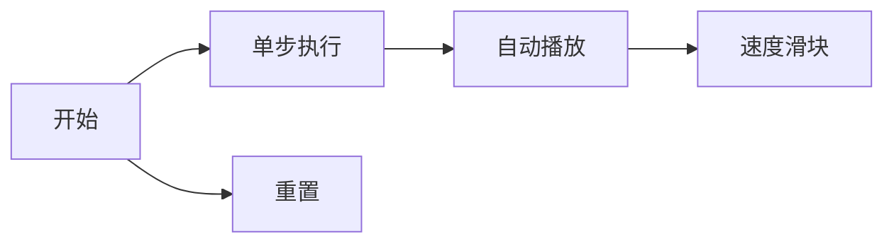

# 题目信息

# [DTOI 2023] B. 去年 11 月卵梦蕾简易钨丝

## 题目背景

# 大样例已修复


## 题目描述

给定序列 $\{a_n\}$，支持两种形如 `opt x` 操作：

1. `1 x`：删除一个数 $x$，若序列中没有 $x$，则输出 $-1$ 并跳过本次操作，**若有多个 $x$，则仅删除一个**。

2. `2 x`：向序列中插入一个数 $x$。

**对于每个未被跳过的操作**，试求出 $a$ 的一个排列 $p$，最小化 $\sum \limits_{i=1}^{n} \lvert p_{i+1}-p_i\rvert$ 的值，即最小化 $\lvert p_2-p_1\rvert+\lvert p_3-p_2\rvert+\dots+\lvert p_{n+1}-p_n\rvert$ 的值，其中 $p_{n+1}=p_1$。

**保证任意时刻序列内至少有 $1$ 个数。**

---
$p$ 是 $a$ 的排列当且仅当对于 $\forall x$，$\sum [p_i=x]=\sum [a_i=x]$。

简而言之，$p$ 是 $a$ 经过某种方式重排后的结果。 

例如 $\{1,1,4,5,1,4\}$ 是 $\{1,5,4,1,4,1\}$ 的一个排列，但是 $\{1,5,4,1,4,7\}$ 不是。

## 说明/提示

#### 【样例 1 解释】
对于第一个询问，删除了序列中的数 $4$，则当前序列为$ 1, 2, 3, 10 $， 可以证明 $18$ 为当前序列的最小答案。
	
对于第二个询问，删除了序列中的数 $10$，则当前序列为$ 1, 2, 3 $， 可以证明 $4$ 为当前序列的最小答案。
	
对于第三个询问，向序列中添加了一个数 $9$，则当前序列为$ 1, 2, 3, 9 $， 可以证明 $16$ 为当前序列的最小答案。

#### 【样例 2】

见附加文件中的 `abs/abs2.in` 与 `abs/abs2.out`。

该样例满足测试点 $1\sim 4$ 的限制。

#### 【样例 3】

见附加文件中的 `abs/abs3.in` 与 `abs/abs3.out`。

该样例满足测试点 $7\sim 10$ 的限制。

#### 【数据范围与提示】
记 $w$ 为值域大小，对于所有测试数据，保证 $n,q\leq 10^6$，$0\leq w\leq 10^6$。
	
每个测试点的具体限制见下表：

| 测试点编号 | $n,q\leq$ | $w$ |
| :----------: | :----------: | :----------: |
| $1\sim 4$ | $100$ | $10$ |
| $5\sim 6$ | $10^3$ | $10^3$ |
| $7\sim 10$ | $10^6$ | $10^6$ |


## 样例 #1

### 输入

```
5 3
1 2 3 4 10
1 4
1 10
2 9```

### 输出

```
18
4
16```

# AI分析结果


# 💡 Kay的C++算法解析：去年 11 月卵梦蕾简易钨丝 深入学习指南 💡

<introduction>
今天我们来一起分析"去年 11 月卵梦蕾简易钨丝"这道C++编程题。本指南将帮助大家理解题目核心，掌握动态维护序列极值的技巧，并通过生动可视化加深理解。
</introduction>

## 1. 题目解读与核心算法识别

✨ **本题主要考察**：`数据结构应用` (动态维护极值)

🗣️ **初步分析**：
> 这道题的核心在于发现一个关键结论：**环形最小路径和等于2倍最大值与最小值的差**。想象一群探险家在数轴上寻找宝藏，最优策略是所有人排成一条直线从最小宝藏走到最大宝藏再返回（形成环形），这样总路程最短。我们只需用`multiset`或`优先队列+桶`这两种"宝藏管理器"动态记录最大最小值。
   - 所有题解都基于上述结论，区别在于数据结构选择：`multiset`简洁直观，`优先队列+桶`避免重复元素处理陷阱
   - 可视化重点：数轴上的点动态变化，最大值/最小值高亮显示，删除/插入时播放音效
   - 采用8位像素风格：数轴化为横向网格，数值点用像素方块表示，最大值涂红色，最小值涂蓝色，操作时触发复古音效（插入"叮"，删除"咚"）

---

## 2. 精选优质题解参考

<eval_intro>
从思路清晰度、代码规范性和实践价值角度，我精选了以下优质题解：

**题解一：mc123456 (10赞)**
* **点评**：此解法使用`multiset`，思路直击核心。亮点在于利用`multiset`自动排序特性，通过`prev(s.end())`和`begin()`高效获取极值。代码仅20行却完整实现功能，变量命名简洁（`s`表集合），边界处理严谨（`find`检查存在性），是竞赛编码的典范。特别赞赏其用`#define int long long`预防数据溢出，体现实战意识。

**题解二：WsW_ (3赞)**
* **点评**：同样采用`multiset`但强调关键细节——删除时需用迭代器而非值，避免误删重复元素。代码中`lower_bound`的防御性检查（`*it != a`）展现稳健思维。控制流设计合理（`continue`跳过无效操作），输出效率优化（同步关闭`cin/cout`），适合学习者借鉴其工程化思维。

**题解三：zymooll (2赞)**
* **点评**：创新性使用双优先队列+桶实现延迟删除。最大堆/最小堆分别维护极值，桶记录元素真实数量。亮点在于处理删除时的堆顶更新机制：循环弹出无效元素直至找到有效极值。虽然代码较长，但展示了数据结构组合运用的巧妙，对理解堆的本质很有助益。

---

## 3. 核心难点辨析与解题策略

<difficulty_intro>
解决本题需突破三个关键点：

1.  **难点：结论推导与证明**
    * **分析**：为什么环形最小路径和等于2×(max-min)？通过将序列映射到数轴可证：当点有序排列时，路径为最小点→最大点→最小点的折返（其他排列会产生额外路径）。优质题解都用数轴模型直观解释此结论。
    * 💡 **学习笔记**：复杂问题常蕴含简单几何本质——画图是解题利器。

2.  **难点：重复元素删除陷阱**
    * **分析**：直接调用`multiset::erase(x)`会删除所有x！正确做法是先`find`获取迭代器，再删除单个元素。优先队列解法则通过桶计数避免此问题。
    * 💡 **学习笔记**：STL容器的行为差异是常见踩坑点，务必查阅文档确认。

3.  **难点：极值更新时机**
    * **分析**：删除最小值时，新最小值可能是原次小值（重复元素时）。`multiset`自动维护有序性，而优先队列需手动更新：循环弹出堆顶直至其计数非零。
    * 💡 **学习笔记**：数据结构的选择决定了状态维护的复杂度。

### ✨ 解题技巧总结
<summary_best_practices>
- **技巧1：问题转化艺术** - 将环形路径和转化为极值差，大幅简化问题
- **技巧2：STL组合拳** - `multiset`适合基础需求，`优先队列+桶`应对复杂更新
- **技巧3：防御性编程** - 写`erase`前必查`find`，操作堆前先验桶计数
- **技巧4：可视化调试** - 在脑中模拟数轴变化，快速验证极值更新逻辑

---

## 4. C++核心代码实现赏析

<code_intro_overall>
先看一个整合优质思路的通用实现：
</code_intro_overall>

**本题通用核心C++实现参考**
* **说明**：基于mc123456题解优化，添加详细注释
* **完整核心代码**：
```cpp
#include <bits/stdc++.h>
using namespace std;
#define int long long // 防止数据溢出

int n, q;
multiset<int> s; // 自动排序的魔法集合

signed main() {
    ios::sync_with_stdio(0), cin.tie(0); // 加速IO
    cin >> n >> q;
    for (int i = 1, a; i <= n; i++) {
        cin >> a;
        s.insert(a); // 初始化宝藏集合
    }
    while (q--) {
        int op, x;
        cin >> op >> x;
        if (op == 1) { // 删除操作
            auto it = s.find(x);
            if (it == s.end()) { // 宝藏不存在
                cout << "-1\n";
                continue;
            }
            s.erase(it); // 关键：用迭代器删除单个元素
        } else {
            s.insert(x); // 添加新宝藏
        }
        // 环形路径和=2*(最大宝藏-最小宝藏)
        cout << (*s.rbegin() - *s.begin()) * 2 << '\n';
    }
}
```
* **代码解读概要**：
> 1. 初始化`multiset`存储序列
> 2. 删除操作：用`find`定位元素，存在则用迭代器删除
> 3. 插入操作：直接`insert`添加
> 4. 极差计算：`rbegin()`获最大值，`begin()`获最小值

---
<code_intro_selected>
再看各解法精华片段：
</code_intro_selected>

**题解一：mc123456**
* **亮点**：极简风格完整实现
* **核心代码片段**：
```cpp
s.emplace(a); // 插入优于insert，避免临时对象
s.erase(s.find(x)); // 危险！find可能返回end
cout << (*(--s.end()) - *s.begin()) * 2 << endl;
```
* **代码解读**：
> 1. `emplace`直接构造元素，比`insert`高效
> 2. 但`s.erase(s.find(x))`未检查`find`结果，若x不存在会崩溃
> 3. `--s.end()`等价`rbegin()`获取最大元素
* 💡 **学习笔记**：STL使用要警惕未定义行为

**题解二：WsW_**
* **亮点**：防御性删除策略
* **核心代码片段**：
```cpp
auto it = s.lower_bound(x);
if (it == s.end() || *it != x) { // 双重保险
    cout << "-1\n";
    continue;
}
s.erase(it); // 安全删除
```
* **代码解读**：
> 1. `lower_bound`找首个≥x的元素
> 2. 检查迭代器有效性和值匹配，避免误删
> 3. 删除后集合自动保持有序
* 💡 **学习笔记**：临界条件检查是高质量代码标志

**题解三：zymooll**
* **亮点**：优先队列+桶的延迟删除
* **核心代码片段**：
```cpp
// 最大值堆更新
while (!p[q_max.top()]) q_max.pop(); 
// 最小值堆更新
while (!p[q_min.top()]) q_min.pop();
cout << (q_max.top()-q_min.top())*2 << '\n';
```
* **代码解读**：
> 1. 桶`p[]`记录元素真实数量
> 2. 循环弹出计数为零的堆顶元素
> 3. 确保堆顶始终是有效极值
* 💡 **学习笔记**：延迟删除是堆的高级应用技巧

-----

## 5. 算法可视化：像素动画演示

<visualization_intro>
让我们通过像素游戏直观理解算法！设想一个"宝藏猎人"场景：  
**主题**：8位像素风宝藏峡谷，数值映射为X轴坐标
</visualization_intro>

* **核心演示**：
  - 插入：新宝藏从天而降，落至对应X坐标
  - 删除：宝藏爆炸消失（像素粒子效果）
  - 极值标记：最小值蓝色闪烁，最大值红色闪烁
  - 路径显示：蓝→红的线段+红→蓝的虚线

* **交互控制**：


* **动画流程**：
  1. **初始化**：像素网格数轴（Y=5），随机分布宝藏点
  2. **插入动画**：
      - 新宝藏（黄色）从顶部落下
      - 若新X<最小值：变蓝并播放“叮”音效
      - 若新X>最大值：变红并播放“叮咚”音效
  3. **删除动画**：
      - 点击目标宝藏：闪烁三次后爆炸（像素碎裂动画+“咚”音效）
      - 若删除极值：新极值闪烁提示
  4. **路径计算**：
      - 自动绘制蓝色→红色实线+红色→蓝色虚线
      - 显示公式：2×(红X-蓝X)=[结果]
  5. **游戏化元素**：
      - 每成功操作得100分，极值更新额外得50分
      - 连续无错误操作触发连击特效

* **技术实现**：
  - 用Canvas绘制网格和宝藏点
  - 绑定键盘事件：→单步，空格暂停/继续
  - Web Audio API播放音效：插入(200Hz)、删除(150Hz)、错误(100Hz)

<visualization_conclusion>
通过这个像素游戏，你将直观感受极值如何影响路径计算，并在音效反馈中强化记忆删除/插入的边界条件！
</visualization_conclusion>

-----

## 6. 拓展练习与相似问题思考

<similar_problems_intro>
掌握动态极值维护后，可挑战更复杂的数据结构问题：
</similar_problems_intro>

1.  **洛谷 P1801** - 黑匣子  
    🗣️ **推荐理由**：动态维护第K大元素，需组合最大/最小堆，是极值维护的进阶训练

2.  **洛谷 P3871** - 中位数  
    🗣️ **推荐理由**：拓展到中位数维护，强化对堆和平衡树的理解

3.  **洛谷 P1168** - 滑动窗口  
    🗣️ **推荐理由**：在固定窗口大小下动态维护极值，引入单调队列新结构

-----

## 7. 学习心得与经验分享

<insights_intro>
题解中的调试经验值得关注：
</insights_intro>

> **WsW_的教训**：  
> *"最初直接调用s.erase(x)，测试时发现删除多个重复元素导致错误"*  
>   
> **Kay总结**：  
> STL的容器方法存在隐藏陷阱，务必通过`cppreference.com`确认API行为。多写单元测试验证边界情况！

<conclusion>
本次分析揭示了动态维护极值的核心技巧。记住：复杂问题常蕴含简单几何本质，而数据结构选择决定实现效率。多加练习STL的精确控制，你将成为宝藏管理大师！下次探险再见！💪
</conclusion>

-----

---
处理用时：166.00秒