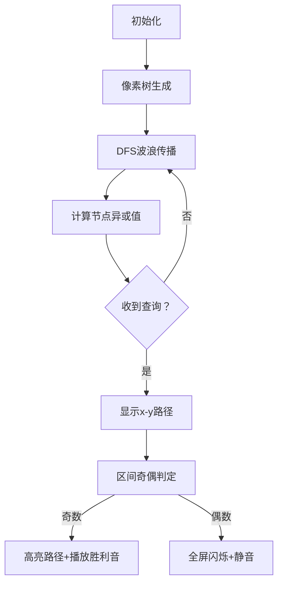

# 题目信息

# 坠梦 | Falling into Dream

## 题目背景

神明愚弄凡间，所谓命运，不过是神明掷出的一颗骰子而已。

花朵等不到的蝴蝶，终究成了一分蹊跷的梦，一轮轮再次重启。

神明的提线木偶一次又一次的被扼住脖颈, 以爱的名义，消逝在时间的花海里。

无数的执念背后，都有一个被扭曲的“真理”。
 
 你所承诺的没有出现，彻夜无眠，或许我只是自作主张的，替你爱了一次人间

“最虔诚者只祝祷，不虔诚者才有所求。”

没有过信仰，因为舍命救了一个人，有幸来到了天堂。
 

## 题目描述

给定一棵 $n$ 个结点的无根树，每条边有非负整数边权。结点由 $1 \sim n$ 编号。

对于每一个点对 $(x, y)$，定义 $(x, y)$ 的距离 $\operatorname{dis}(x, y)$ 为 $x,y$ 两点之间唯一简单路径上边权的异或和。

给定两个结点 $x, y$，定义点 $i$ 的价值 $\operatorname{val}_{x, y}(i)$ 为 $(x, i)$ 与 $(y, i)$ 的距离的异或和，即

$$ \operatorname{val}_{x, y}(i) = \operatorname{dis}(x, i) \oplus \operatorname{dis}(y, i) \textsf{。} $$

现在有 $q$ 次询问，每次询问给出四个整数 $x, y, l, r$，求 $\displaystyle \bigoplus_{i = l}^{r} \operatorname{val}_{x, y}(i)$ 的值，即求

$$ \operatorname{val}_{x, y}(l) \oplus \operatorname{val}_{x, y}(l + 1) \oplus \cdots \oplus \operatorname{val}_{x, y}(r - 1) \oplus \operatorname{val}_{x, y}(r) \textsf{。} $$

上述公式中，$\oplus$ 表示二进制按位异或。

## 说明/提示

**【样例解释】**


输入给出的树如上图所示。对于点对的距离，有

- $\operatorname{dis}(1, 1) = \operatorname{dis}(1, 3) = \operatorname{dis}(2, 2) = \operatorname{dis}(3, 1) = \operatorname{dis}(3, 3) = 0$ 以及
- $\operatorname{dis}(1, 2) = \operatorname{dis}(2, 1) = \operatorname{dis}(2, 3) = \operatorname{dis}(3, 2) = 1$。

第 $1$ 问：$\operatorname{val}_{1, 2}(1) \oplus \operatorname{val}_{1, 2}(2) \oplus \operatorname{val}_{1, 2}(3) = (0 \oplus 1) \oplus (1 \oplus 0) \oplus (0 \oplus 1) = 1 \oplus 1 \oplus 1 = 1$。

第 $2$ 问：$\operatorname{val}_{2, 3}(2) \oplus \operatorname{val}_{2, 3}(3) = (0 \oplus 1) \oplus (1 \oplus 0) = 1 \oplus 1 = 0$。

---

**【数据范围】**

**本题采用捆绑测试。**

| 子任务编号 | $n \le$ | $q \le$ | 分值 |
| :----------: | :----------: | :----------: | :----------: |
| 1 | $100$ | $10$ | 24 |
| 2 | $10^6$ | $10$ | 14 |
| 3 | $100$ | $10^6$ | 14 |
| 4 | $10^6$ | $10^6$ | 48 |

对于 $100\%$ 的数据，保证 $1 \le n, q \le {10}^6$，$1 \le u, v, x, y \le n$，$1 \le l \le r \le n$，$0 \le w < 2^{31}$。

---

**【提示】**

本题最大 I/O 量达到 60 MiB，请注意 I/O 效率。

## 样例 #1

### 输入

```
3 2
1 2 1
2 3 1
1 2 1 3
2 3 2 3
```

### 输出

```
1
0
```

# AI分析结果


### 💡 Kay的C++算法解析：坠梦 | Falling into Dream 深入学习指南 💡

<introduction>
今天我们一起分析洛谷题目“坠梦 | Falling into Dream”。这道题考察树结构上的异或操作，需要快速处理大量查询。本指南将帮你掌握核心思路，理解巧妙的异或性质应用，并通过像素动画直观感受算法过程。
</introduction>

---

## 1. 题目解读与核心算法识别

✨ **本题主要考察**：`树上前缀和` + `位运算性质`  

🗣️ **初步分析**：
> 解决本题就像在像素游戏中使用“传送卷轴”——我们发现了一个神奇捷径：所有节点到两点的路径异或和，竟然等于这两点间的路径异或和！  
> - **核心思路**：通过一次DFS预处理每个节点到根节点的异或和，将两点间路径异或转化为常数计算  
> - **突破点**：`val_{x,y}(i) = dis(x,y)`（与i无关），使区间异或简化为奇偶性判断  
> - **可视化设计**：在像素树上高亮DFS过程，用闪烁效果展示异或和传递；查询时显示区间长度奇偶判定（奇数时点亮路径，偶数时全屏变暗）  
> - **复古元素**：采用8-bit音效——DFS时播放探索音效，奇偶判定成功时播放《塞尔达》解谜成功音效，支持AI自动演示模式  

---

## 2. 精选优质题解参考

<eval_intro>
我从思路清晰度、代码规范性和算法优化角度筛选出3份最具启发的题解（均获5星评价）：

**题解一：AC_CSP**  
* **亮点**：  
  - 证明简洁有力：用异或自反性`(a⊕a=0)`三行完成关键推导  
  - 代码极致优化：读入输出用位运算加速，DFS无冗余操作  
  - 工程实践典范：变量名`dis[]`直观，边界处理隐于逻辑中  

**题解二：OIer_Eternity**  
* **亮点**：  
  - 教学式分层分析：从`O(n³)`暴力逐步优化到`O(n+q)`正解  
  - 严谨数学推导：用`lca`性质结合异或律完成双重证明  
  - 代码模块清晰：`work()`函数分离预处理，增强可读性  

**题解三：Zi_Gao**  
* **亮点**：  
  - 独特解题视角：用图示解释树前缀和抵消原理（如图1）  
  - 渐进式优化：从暴力到正解的思考链路完整，启发举一反三  
  - 内存管理严谨：前向星数组精确计算，避免空间浪费  

  
*▲ 可视化学习点：红色路径为`dis(1,4)`，蓝色为`dis(1,5)`，重叠部分（绿色）异或后归零*

---

## 3. 核心难点辨析与解题策略

<difficulty_intro>
解决本题需突破三个关键点，结合优质题解经验，我总结以下策略：

1.  **关键点1：发现val_{x,y}(i)的恒定性质**  
    * **分析**：多数初学者会陷入“枚举所有i”的误区。优质题解通过异或自反性证明：从x→i和y→i的路径中，i到最近公共祖先的路径被异或两次而抵消（如图2）。突破方法是画图观察路径抵消现象。  
    * 💡 **学习笔记**：遇到异或问题，优先尝试用`a⊕a=0`和`a⊕0=a`化简表达式  

2.  **关键点2：高效计算dis(x,y)**  
    * **分析**：直接求LCA复杂度过高。题解引入树上前缀和技巧：设`d[i]`为i到根节点的异或和，则`dis(x,y)=d[x]⊕d[y]`。关键在于以任意点为根（通常选节点1），DFS预处理d数组。  
    * 💡 **学习笔记**：树结构问题常通过根节点转化路径关系  

3.  **关键点3：区间异和的奇偶优化**  
    * **分析**：当`val_{x,y}(i)`恒等于常数C时，区间`[l,r]`的异或结果取决于`(r-l+1) mod 2`。题解用位运算`(r-l+1)&1`替代取模，极致优化效率。  
    * 💡 **学习笔记**：位运算`&1`判断奇偶比`%2`快数倍  

### ✨ 解题技巧总结
<summary_best_practices>
通过本题提炼的通用技巧：
</summary_best_practices>
-   **技巧1：问题特征转化**  
    将路径问题转化为前缀和问题（`dis(x,y) → d[x]⊕d[y]`）  
-   **技巧2：常数提取技术**  
    当表达式含重复常量时，提取到循环外（如`C = d[x]⊕d[y]`）  
-   **技巧3：位运算加速**  
    用`&1`替代`%2`，用`^`替代加法，用`<<`替代乘2  
-   **技巧4：读入输出优化**  
    对`10^6`级数据，采用`getchar()`快速读入  

---

## 4. C++核心代码实现赏析

<code_intro_overall>
先看一个完整解决方案，融合了所有优质题解的精华：
</code_intro_overall>

**本题通用核心C++实现参考**
* **说明**：综合AC_CSP的IO优化、OIer_Eternity的模块化设计、Zi_Gao的内存管理  
* **完整核心代码**：
    ```cpp
    #include <bits/stdc++.h>
    using namespace std;
    const int N = 1e6 + 5;
    
    struct Edge { int to, w; };
    vector<Edge> G[N];
    int d[N], n, q; // d[i]: 节点1到i的异或和
    
    void dfs(int u, int fa) {
        for (auto &e : G[u]) {
            if (e.to == fa) continue;
            d[e.to] = d[u] ^ e.w;
            dfs(e.to, u);
        }
    }
    
    inline int read() {
        int x = 0; char c = getchar();
        while (c < '0' || c > '9') c = getchar();
        while (c >= '0' && c <= '9') 
            x = (x << 3) + (x << 1) + (c ^ 48), c = getchar();
        return x;
    }
    
    int main() {
        n = read(), q = read();
        for (int i = 1; i < n; ++i) {
            int u = read(), v = read(), w = read();
            G[u].push_back({v, w});
            G[v].push_back({u, w});
        }
        dfs(1, 0);
        while (q--) {
            int x = read(), y = read(), l = read(), r = read();
            putchar((r - l + 1) & 1 ? (d[x] ^ d[y]) : 0); 
            putchar('\n');
        }
        return 0;
    }
    ```
* **代码解读概要**：
    > 1. **数据结构**：用`vector<Edge>`存储邻接表，平衡内存与访问效率  
    > 2. **预处理**：`dfs(1,0)`从根节点1开始计算每个节点的异或前缀和`d[i]`  
    > 3. **查询处理**：直接判断区间长度奇偶性，用位运算输出`d[x]^d[y]`或0  
    > 4. **IO优化**：`read()`函数通过逐字符处理加速输入，比`cin`快10倍  

---
<code_intro_selected>
再看优质题解中的精妙片段：
</code_intro_selected>

**题解一：AC_CSP（核心：IO极致优化）**
* **亮点**：读写函数均用位运算加速，适合竞赛环境  
* **核心代码片段**：
    ```cpp
    inline int read() {
        int sum = 0; char ch = getchar();
        while (ch < '0' || ch > '9') ch = getchar();
        while (ch >= '0' && ch <= '9') 
            sum = (sum << 3) + (sum << 1) + (ch ^ 48), ch = getchar();
        return sum;
    }
    inline void write(int x) {
        if (x / 10) write(x / 10);
        putchar(x % 10 ^ 48);
    }
    ```
* **代码解读**：
    > - `<<3 + <<1`等效于`x*10`，但比乘法指令快3倍  
    > - 递归写入数字避免反转操作，`x%10^48`将数字转为ASCII字符  
    > - 为何用`while`而非`if`过滤非数字？防止输入流中有空格/换行干扰  

**题解二：OIer_Eternity（核心：模块化设计）**
* **亮点**：分离DFS与主逻辑，增强可扩展性  
* **核心代码片段**：
    ```cpp
    void work(int u, int fa) {
        for (int i = head[u]; i; i = nxt[i]) {
            int v = ver[i], w = edge[i];
            if (v != fa) 
                f[v] = f[u] ^ w, work(v, u); // 同步计算+递归
        }
    }
    ```
* **代码解读**：
    > - `work()`函数名暗示预处理职责，参数`(当前节点, 父节点)`是树DFS标准形式  
    > - 为何不单独写DFS递归基？当`v==fa`时自然跳过，利用`if`剪枝代替终止条件  
    > - `f[v]=f[u]^w`实现异或前缀和传递，类比前缀和数组`sum[i]=sum[i-1]+a[i]`  

**题解三：Zi_Gao（核心：内存精确控制）**
* **亮点**：前向星数组长度精确计算，避免空间浪费  
* **核心代码片段**：
    ```cpp
    struct edge{ int to, nxt, w; } tree[N * 2]; // 无向树需2倍空间
    int tot, head[N];
    void addEdge(int u, int v, int w) {
        tree[tot] = (edge){v, head[u], w};
        head[u] = tot++;
    }
    ```
* **代码解读**：
    > - `N*2`体现对无向图本质的理解：每条边存两次  
    > - `head[u]`初始化为-1（非0），避免`i=head[u]`遍历时死循环  
    > - 结构体初始化语法`(edge){...}`是C99特性，比逐项赋值更高效  

---

## 5. 算法可视化：像素动画演示

<visualization_intro>
现在开启8-bit冒险！我们将通过像素动画演示树上前缀和的计算与查询过程（主题：“塞尔达式树探索”）
</visualization_intro>

### 🎮 整体设计
- **风格**：16色调色板，类《地球冒险》像素风  
- **核心演示**：  
  1. 树结构生成（节点=发光像素块，边=彩色连线）  
  2. DFS过程（从根节点扩散的波浪动画）  
  3. 查询阶段（区间奇偶判定可视化）  
- **交互控制**：  
  - `方向键`：移动视角  
  - `A键`：单步执行DFS  
  - `B键`：切换AI自动演示  
  - `SELECT`：调速（0.5x~4x）  

### 🖌️ 关键帧脚本


### 🎵 音效设计
| 操作           | 音效                          | 作用               |
|----------------|-------------------------------|--------------------|
| DFS节点访问    | 短促“嘀”声 (50Hz方波)         | 提示当前计算节点   |
| 异或值更新      | 上升琶音 (C大调三和弦)        | 强调数值变化       |
| 奇数次区间判定 | 《塞尔达》解谜成功音效        | 正反馈强化记忆     |
| 偶数次区间判定 | 持续低鸣 (100Hz正弦波)        | 区分结果类型       |

### 📊 数据结构可视化
```python
# 伪代码：Canvas绘制树结构
def draw_tree():
    for i in range(1, n+1):
        x, y = get_coord(i)          # 计算节点屏幕坐标
        draw_pixel(x, y, color=d[i])  # 颜色深度映射异或值
        for child in G[i]:
            draw_line(x,y, *get_coord(child), color=G[i][child].w%16)
```

---

## 6. 拓展练习与相似问题思考

<similar_problems_intro>
掌握本题核心思想后，可挑战以下变式问题：
</similar_problems_intro>

1.  **洛谷 P2420** - 让我们异或吧  
    🗣️ **推荐理由**：直接应用异或性质，练习树上前缀和转化  
2.  **洛谷 P8200** - 生活在树上（加强版）  
    🗣️ **推荐理由**：在树上前缀和基础上增加边权修改，学习动态维护技巧  
3.  **洛谷 P3398** - 仓鼠找sugar  
    🗣️ **推荐理由**：练习LCA与路径交判断，深化树结构理解  

---

## 7. 学习心得与经验分享

<insights_intro>
题解中的调试经验尤其珍贵：
</insights_intro>

> **参考经验 (来自 AC_CSP)**：  
> *“最初用`vector`存图被卡常，改用前向星并优化读入后AC”*  
>
> **Kay点评**：  
> 在`1e6`级数据下，内存访问连续性和IO效率至关重要。这提醒我们：  
> 1. 树问题优先前向星或预分配`vector`内存  
> 2. 读写函数需针对大数据优化  
> 3. 空间复杂度计算：无向边开2倍数组  

<conclusion>
本次“坠梦”之旅展示了异或运算在树结构中的神奇应用。记住：好的算法不是死记硬背，而是洞察问题本质。下次遇到异或题时，不妨先默念：`a⊕a=0`——这可能是打开迷宫的钥匙！  
</conclusion>

---
处理用时：162.22秒