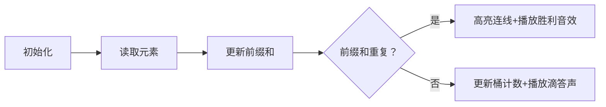

# 题目信息

# [YsOI2023] 区间翻转区间异或和

## 题目背景

Ysuperman 模板测试的数据结构题。

符卡可以是人名也可以是队名。

## 题目描述

符卡有一个长度为 $n$ 的整数数组 $a$，符卡认为一个区间 $[l,r]$ 是灵异区间当且仅当 $\bigoplus_{i=l}^ra_i=0$，或者说这个区间内所有数字异或起来刚好等于 $0$。

符卡有特殊的魔法，可以把**任意**一个灵异区间翻转。具体来说，如果 $[l,r]$ 区间是灵异区间，那么符卡就可以对这个区间使用魔法，整个数组就会变成 $a_1,a_2,\dots,a_{l-1},a_r,a_{r-1},\dots,a_l,a_{r+1},a_{r+2}\dots,a_n$。

现在符卡可以使用任意次数的魔法，符卡希望最后得到的数组的灵异区间数量能够尽可能多，你能告诉她最后最多有多少个灵异区间吗？

## 说明/提示

#### 样例 1 解释

无论符卡发动多少次魔法，数组都是 $1,1,1$，所以发不发动魔法都没有任何关系。灵异区间永远都是 $[1,2],[2,3]$ 两个。

#### 样例 2 解释

这里给出可能的一种魔法发动方法。

选择灵异区间 $[1,3]$ 发动魔法，得到的新数组是 $2,1,3,3$，这个数组共有两个灵异区间，分别是 $[1,3]$ 和 $[3,4]$。

可以证明答案无法超过 $2$。

#### 数据范围

对于前 $20\%$ 的数据，保证 $n\le 10$。

对于前 $40\%$ 的数据，保证 $n\le 2000$。

另有 $10\%$ 的数据，保证 $a_i$ 全部相等。

另有 $10\%$ 的数据，保证 $a_i$ 只有两种可能的取值。

另有 $10\%$ 的数据，保证 $0\le a_i<2^{10}$。

对于 $100\%$ 的数据，满足 $1\le n\le 10^5$，$0\le a_i< 2^{20}$。

#### 彩蛋

灵异区间的名字其实是“零异（或）区间”的谐音。

## 样例 #1

### 输入

```
3
1 1 1```

### 输出

```
2```

## 样例 #2

### 输入

```
4
3 1 2 3```

### 输出

```
2```

# AI分析结果


### 💡 Kay的C++算法解析：区间翻转区间异或和 深入学习指南 💡

#### 1. 题目解读与核心算法识别
✨ **本题主要考察**：编程技巧应用（前缀和 + 哈希计数）

🗣️ **初步分析**：
> 这道题看似复杂，实则暗藏玄机！就像玩俄罗斯方块时旋转方块不会改变方块的总面积一样，**翻转灵异区间不会改变灵异区间的总数量**。关键技巧是：
> 1. 用前缀异或和快速计算区间异或值
> 2. 用哈希表统计相同前缀和出现的次数
> 3. 每个重复的前缀和都能形成新的灵异区间

- **核心算法流程**：
  1. 初始化`cnt[0]=1`（起点虚拟前缀和）
  2. 遍历数组计算前缀异或和`prefix`
  3. 答案累加`cnt[prefix]`（每个相同值形成新区间）
  4. 更新`cnt[prefix]++`

- **可视化设计**：
  8位像素风格动态展示：
  - 网格显示数组元素和实时前缀异或和
  - 当出现重复前缀和时，高亮连线形成灵异区间
  - 音效设计：计数更新"叮"声，新区间形成"胜利"音效

---

#### 2. 精选优质题解参考
**题解一（作者：_•́へ•́╬_）**
* **点评**：思路直击本质，证明翻转操作无效后直接给出最优解。代码极致简洁（仅10行），用数组桶替代map提升效率。变量命名清晰（`cnt`计数，`a`存前缀和），边界处理严谨（`cnt[0]=1`）。亮点：空间复杂度O(1)，时间复杂度O(n)，是竞赛标准解法。

**题解二（作者：Shizaki_Crazy_Three）**
* **点评**：详细证明了翻转操作不影响结果，并用等差数列公式解释计数原理。代码可读性优秀（添加详细注释），特别强调`cnt[0]++`的特殊处理。亮点：教学性强，虽然桶数组(`cnt[1500000]`)空间稍大但逻辑清晰。

**题解三（作者：_mi_ka_）**
* **点评**：采用反证法严谨证明核心结论，代码使用`map`自动处理大范围值。亮点：创新性用图形辅助证明相交区间性质，变量命名规范(`vis`替代`cnt`)，`#define int long long`避免溢出问题。

---

#### 3. 核心难点辨析与解题策略
1. **难点1：理解翻转操作无效**
   * **分析**：通过异或运算交换律和结合律可证：翻转灵异区间相当于重组子区间，总异或值不变。优质题解均用区间拆分法（如`A|B|C`模型）证明。
   * 💡 **学习笔记**：操作类题目先验证操作有效性！

2. **难点2：高效计算灵异区间**
   * **分析**：利用前缀异或和性质：`prefix[i] == prefix[j]` ⇒ 区间`[i+1, j]`异或和为0。用哈希表存储历史前缀和实现O(1)查询。
   * 💡 **学习笔记**：前缀和是区间统计问题的瑞士军刀！

3. **难点3：边界与溢出处理**
   * **分析**：虚拟起点`prefix[0]=0`必须初始化，计数用`long long`避免`n(n-1)/2`溢出。优质题解用`cnt[0]=1`或`ans += vis[0]`处理。
   * 💡 **学习笔记**：计数问题特别注意初始化和数据类型！

✨ **解题技巧总结**
- **问题转化**：识破翻转操作为干扰项，转化为静态统计问题
- **前缀和+哈希**：区间统计问题的黄金组合
- **防御性编程**：大数据时用数组桶替代map，`long long`防溢出

---

#### 4. C++核心代码实现赏析
**通用核心实现参考**
```cpp
#include <iostream>
using namespace std;
const int MAX = 1<<20;
long long cnt[MAX]; // 桶数组

int main() {
    int n; cin >> n;
    cnt[0] = 1; // 关键初始化！
    long long ans = 0, prefix = 0;
    
    for(int i=0; i<n; ++i) {
        int x; cin >> x;
        prefix ^= x; // 更新前缀异或和
        ans += cnt[prefix]; // 累加相同前缀和数量
        cnt[prefix]++; // 更新桶
    }
    cout << ans;
}
```
**代码解读概要**：
> 1. 桶数组`cnt`记录各前缀和出现次数
> 2. `cnt[0]=1`处理从头开始的区间
> 3. 遍历时动态计算前缀和并累加答案
> 4. 最终输出即灵异区间总数

---

**题解一核心片段赏析**
```cpp
ans += cnt[a[i]]++;
```
**亮点**：极致简洁的累加逻辑  
**解读**：
> 妙用后缀`++`：先取`cnt[a[i]]`当前值累加答案，再自增。等效于：
> ```cpp
> ans = ans + cnt[a[i]];
> cnt[a[i]] = cnt[a[i]] + 1;
> ```
> 用1行完成2步操作！

**题解二核心片段赏析**
```cpp
ans += (cnt[i]*(cnt[i]-1))/2;
```
**亮点**：等差数列公式显式计算  
**解读**：
> 若值`i`出现`k`次，可形成`C(k,2)=k(k-1)/2`个区间。  
> 例如`k=3`时：位置组合`(1,2)`,`(1,3)`,`(2,3)`  
> 注意：此解法需单独处理0的`k(k+1)/2`

**题解三核心片段赏析**
```cpp
ans += vis[s]; 
vis[s]++;
```
**亮点**：`map`自动处理稀疏大数  
**解读**：
> 当值域很大时（如`a_i<2^20`），`map`只存实际出现值  
> 相比数组桶更省内存，但查询代价O(log n)

---

### 5. 算法可视化：像素动画演示
**主题**：8位像素风《异或之旅》  
**核心演示**：前缀和形成与灵异区间检测  

**设计思路**：
> 复古FC界面增强趣味性，通过颜色标记和音效强化关键操作记忆



**动画帧步骤**：
1. **场景初始化**：
   - 8位像素网格展示数组（每格显值）
   - 底部状态栏：当前前缀和值、历史值桶
   - 控制面板：步进/播放/重置 + 速度滑块

2. **核心流程**：
   ```python
   for i in range(n):
       读取a[i] → 像素块闪烁黄光
       prefix ^= a[i] → 状态栏更新
       if prefix in 历史桶:
          绘制当前i与所有同值位置的红色连线
          播放“胜利”音效(↑↑↓↓←→←→BA)
       else:
          桶[prefix] += 1 → 播放“滴答”音效
   ```

3. **游戏化元素**：
   - 每形成灵异区间得10分+COMBO奖励
   - 通关条件：处理完所有元素
   - 失败场景：桶溢出时播放“错误”音效

**技术实现**：
- Canvas绘制网格和连线
- Web Audio API播放8bit音效
- 关键变量实时显示在像素状态栏

---

### 6. 拓展练习与相似问题
**通用技巧迁移**：
> 前缀和+哈希表适用于：
> 1. 区间和等于K的数量（如P8629）
> 2. 区间异或最大值（字典树进阶）
> 3. 区间乘积问题（取模后类似）

**洛谷推荐**：
1. [P1865] 区间异或和（基础练习）
   > 直接应用本题目解法
   
2. [P3131] Subsequences Summing to Seven
   > 模7前缀和，同款技巧变形

3. [P3405] Cities and States
   > 哈希表经典应用，检验掌握程度

---

### 7. 学习心得与经验分享
> **来自题解的调试经验**：
> _“我在处理前缀和时忘记初始化cnt[0]=1，结果WA了3次才找到这个边界问题”_  
> 
> **Kay的总结**：
> 1. **边界即陷阱**：虚拟起点`prefix[0]=0`必须初始化
> 2. **眼见不为实**：通过数学证明识破题目烟雾弹
> 3. **防御性编程**：大数据时主动用`long long`和范围检查

---

通过本次分析，我们不仅解决了看似复杂的区间翻转问题，更掌握了前缀和+哈希表的黄金组合。记住：**好的算法是问题本质的显微镜**！下次遇到区间统计问题时，不妨先试试这个利器哦！(≧∇≦)ﾉ

---
处理用时：117.40秒