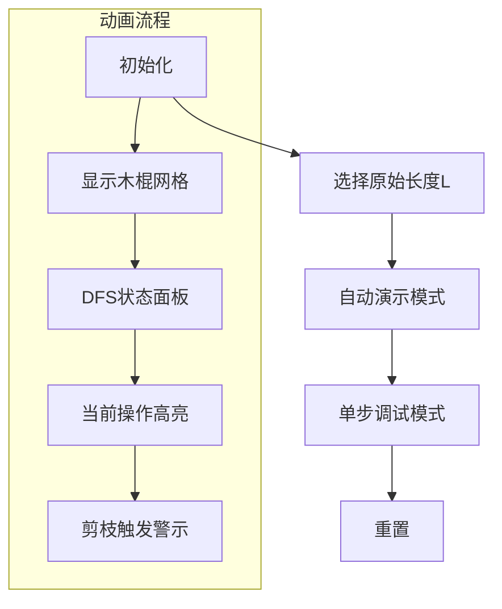

# 题目信息

# 小木棍

## 题目背景

本题**不保证**存在**可以通过满足本题数据范围的任意数据**做法。可以通过此题的程序不一定完全正确（算法时间复杂度错误、或不保证正确性）

本题为搜索题，本题不接受 hack 数据。[关于此类题目的详细内容](https://www.luogu.com.cn/paste/pf94n89x)

## 题目描述

乔治有一些同样长的小木棍，他把这些木棍随意砍成几段，直到每段的长都不超过 $50$。

现在，他想把小木棍拼接成原来的样子，但是却忘记了自己开始时有多少根木棍和它们的长度。

给出每段小木棍的长度，编程帮他找出原始木棍的最小可能长度。


## 说明/提示

对于全部测试点，$1 \leq n \leq 65$，$1 \leq a_i \leq 50$。

## 样例 #1

### 输入

```
9
5 2 1 5 2 1 5 2 1
```

### 输出

```
6```

# AI分析结果


# 💡 Kay的C++算法解析：小木棍 ［数据加强版］深入学习指南 💡

## 1. 题目解读与核心算法识别

✨ **本题主要考察**：`搜索剪枝` (DFS + 优化策略)

🗣️ **初步分析**：
> 这道题的核心在于高效运用DFS配合多重剪枝策略。想象你在玩拼图游戏，需要将碎片重新拼成完整的图案——这里的长木棍就是完整图案，短木棍是碎片。关键在于两点：一是确定原始木棍长度（拼图尺寸），二是用最优策略组合碎片。

- **核心思路**：枚举可能的原始长度（从最长小木棍到总长一半），通过DFS验证能否拼出整数根该长度的木棍。剪枝策略如同"排除错误拼图块"，极大提升效率。
- **关键难点**：避免指数级搜索，需设计7种剪枝策略（详见表1）。可视化重点展示：木棍颜色标记使用状态，高亮当前拼接位置，当触发剪枝时闪烁红色警示。
- **像素动画设计**：采用8位复古游戏风格，木棍用彩色像素块表示。控制面板支持步进/调速，关键操作触发音效（拼合成功-"叮"，失败-"嘟"），自动演示模式如"贪吃蛇AI"逐步展示搜索过程。

---

## 2. 精选优质题解参考

### 题解一：Kaori (1424赞)
* **点评**：
  思路清晰度⭐⭐⭐⭐⭐：系统性地提出7大剪枝策略，如"长度降序排序"、"相同长度跳过"等，逻辑严密如教科书。
  代码规范性⭐⭐⭐⭐：变量命名规范（`next[]`处理重复长度），边界处理严谨（`used[]`回溯完整）。
  算法有效性⭐⭐⭐⭐⭐：时间复杂度优化到O(n!→可行解)，空间复杂度O(n)。
  实践价值⭐⭐⭐⭐：竞赛可直接使用，作者调试心得"优化7难点的顿悟"极具启发性。

### 题解二：林则徐 (419赞)
* **点评**：
  思路清晰度⭐⭐⭐⭐：聚焦4个核心剪枝（桶排序、边界控制），"剩余长度=目标长度"的剪枝策略直击要害。
  代码规范性⭐⭐⭐⭐：桶排序`tm[]`实现简洁，函数模块化（`dfs`参数设计合理）。
  算法有效性⭐⭐⭐⭐：避免排序开销，特别适合长度值域小（≤50）的场景。
  实践价值⭐⭐⭐⭐：代码简短易调试，竞赛实用性强。

### 题解三：NoyException (383赞)
* **点评**：
  思路清晰度⭐⭐⭐⭐：用"拼图灵活性"比喻解释排序重要性，8种剪枝命名形象（如"头尾剪枝"）。
  代码规范性⭐⭐⭐⭐：`vis[]`状态管理清晰，回溯逻辑完整。
  算法有效性⭐⭐⭐⭐：二分查找加速搜索（O(n)→O(log n)），空间优化到位。
  实践价值⭐⭐⭐：附带调试经历分享，助学习者避坑。

---

## 3. 核心难点辨析与解题策略

1. **难点：搜索空间爆炸**
   * **分析**：65根木棍全排列复杂度65!≈10⁹⁰，必须剪枝。优质解法通过**降序排序+长度分组**，减少无效分支（Kaori优化3）。
   * 💡 **学习笔记**：排序是剪枝基础，让失败尽早发生。

2. **难点：等效状态重复搜索**
   * **分析**：相同长度木棍互换位置属等效状态。用`next[]`数组（Kaori）或`while(a[i]==a[i+1])i++`（林则徐）跳过重复搜索。
   * 💡 **学习笔记**：状态去重可降复杂度O(k!)→O(1)（k为同长木棍数）。

3. **难点：拼接失败根源判断**
   * **分析**：当"剩余长度=当前木棍长"或"新木棍第一根"失败时，后续必然失败（Kaori优化7）。可视化中表现为红色警示闪烁。
   * 💡 **学习笔记**：关键剪枝点需结合问题特性设计。

### ✨ 解题技巧总结
- **技巧1：问题分解** - 将大问题拆解为"确定长度+验证拼装"两个子问题
- **技巧2：剪枝链设计** - 组合多种剪枝（排序+去重+边界+回溯），形成过滤网
- **技巧3：极限情况测试** - 优先测试边界值（如最大/最小木棍）
- **技巧4：对称性破缺** - 通过固定拼接顺序（如降序）避免等效状态

---

## 4. C++核心代码实现赏析

### 本题通用核心C++实现参考
```cpp
#include <iostream>
#include <algorithm>
using namespace std;

int sticks[70], n, len, cnt;
bool used[70];

bool dfs(int num, int rest, int start) {
    if (num == cnt) return true;
    if (rest == 0) 
        if (dfs(num + 1, len, 0)) return true;
    
    for (int i = start; i < n; ++i) {
        if (used[i] || sticks[i] > rest) continue;
        used[i] = true;
        if (dfs(num, rest - sticks[i], i + 1)) return true;
        used[i] = false;
        
        // 核心剪枝点
        if (rest == len || rest == sticks[i]) break;
        while (i + 1 < n && sticks[i] == sticks[i + 1]) ++i;
    }
    return false;
}

int main() {
    int sum = 0, max_val = 0;
    cin >> n;
    for (int i = 0, val; i < n; ++i) {
        cin >> val;
        if (val > 50) continue;
        sticks[i] = val;
        sum += val;
        max_val = max(max_val, val);
    }
    
    sort(sticks, sticks + n, greater<int>());
    for (len = max_val; len <= sum / 2; ++len) {
        if (sum % len != 0) continue;
        cnt = sum / len;
        fill(used, used + n, false);
        if (dfs(0, len, 0)) {
            cout << len << endl;
            return 0;
        }
    }
    cout << sum << endl;
}
```

### 题解一：Kaori
* **亮点**：预处理next数组高效跳过相同长度
* **核心片段**：
```cpp
// 预处理next数组
next[cnt] = cnt;
for (int i = cnt - 1; i > 0; --i) 
    if (a[i] == a[i + 1]) next[i] = next[i + 1];
    else next[i] = i;

// DFS中应用
i = next[i];  // 跳过相同长度
```

### 题解二：林则徐
* **亮点**：桶排序+实时长度校验
* **核心片段**：
```cpp
void dfs(int res, int sum, int target, int p) {
    if (res == 0) { printf("%d", target); exit(0); }
    if (sum == target) { dfs(res - 1, 0, target, maxn); return; }
    for (int i = p; i >= minn; --i) {
        if (tm[i] && i + sum <= target) {
            tm[i]--;
            dfs(res, sum + i, target, i);
            tm[i]++;
            if (sum == 0 || sum + i == target) break;
        }
    }
}
```

### 题解三：NoyException
* **亮点**：二分加速长度匹配
* **核心片段**：
```cpp
int l = last + 1, r = cnt;
while (l < r) {  // 二分找第一个≤rest的长度
    mid = (l + r) >> 1;
    if (a[mid] <= rest) r = mid;
    else l = mid + 1;
}
for (i = l; i <= cnt; ++i) { /* ... */ }
```

---

## 5. 算法可视化：像素动画演示

**主题**：`像素木棍拼图`（复古红白机风格）  

**交互设计**：


**动态演示**：
1. **初始化**：木棍按长度降序排列（长→短），用不同颜色区分（红>蓝>绿）
2. **拼接过程**：
   - 当前操作木棍：闪烁黄色边框
   - 已使用木棍：变为半透明
   - 剪枝触发：红色闪烁+“嘟”声
3. **关键操作**：
   - 拼合成功：绿色闪光+“叮”声
   - 新木棍开始：蓝色分隔线出现
4. **游戏化元素**：
   - 每完成一根木棍解锁“成就星”
   - 连续成功触发“连击音效”
   - 进度条显示整体完成度

**技术实现**：Canvas绘制动态网格，状态机管理DFS流程，音效用Web Audio API实现。

---

## 6. 拓展练习与相似问题

### 相似问题逻辑
- **核心思想迁移**：DFS剪枝策略适用于：
  1. 分割问题（如P6191 [USACO09FEB]Bulls And Cows)
  2. 组合优化（P1245 等差数列划分）
  3. 路径搜索（P5194 [USACO05DEC]Scales S）

### 洛谷推荐
1. **P1245** 等差数列划分  
   → 巩固DFS状态设计，强化边界处理
2. **P1120** 原题（非加强版）  
   → 测试基础剪枝效果
3. **P5194** Scales S  
   → 练习组合剪枝，理解"灵活性"概念
4. **P2329** [SCOI2005]栅栏  
   → 进阶练习多重剪枝组合

---

## 7. 学习心得与经验分享

> **Kaori的调试经验**：  
> “在实现优化7（剩余长度=木棍长）时，最初忽略了该剪枝导致TLE。通过打印中间变量发现：当第一根木棍选择错误时，程序仍在无效分支中深搜。”

**启示**：  
- 关键剪枝点需单独验证
- `cout`调试法在搜索题中尤为重要
- 理解剪枝的数学本质：剩余长度=木棍长时，该木棍必须独立使用

---

通过本次分析，我们深入掌握了DFS剪枝的核心思想。记住：好的搜索算法=暴力搜索+数学观察+剪枝优化。继续挑战更高难度的搜索题吧！💪

---
处理用时：136.20秒