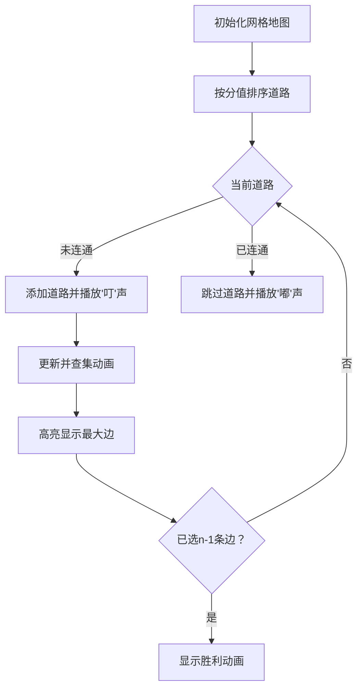

# 题目信息

# [SCOI2005] 繁忙的都市

## 题目描述

城市 C 是一个非常繁忙的大都市，城市中的道路十分的拥挤，于是市长决定对其中的道路进行改造。城市 C 的道路是这样分布的：城市中有 $n$ 个交叉路口，有些交叉路口之间有道路相连，两个交叉路口之间最多有一条道路相连接。这些道路是双向的，且把所有的交叉路口直接或间接的连接起来了。每条道路都有一个分值，分值越小表示这个道路越繁忙，越需要进行改造。但是市政府的资金有限，市长希望进行改造的道路越少越好，于是他提出下面的要求：

1. 改造的那些道路能够把所有的交叉路口直接或间接的连通起来。
1. 在满足要求 1 的情况下，改造的道路尽量少。
1. 在满足要求 1、2 的情况下，改造的那些道路中分值最大的道路分值尽量小。

任务：作为市规划局的你，应当作出最佳的决策，选择哪些道路应当被修建。

## 说明/提示

### 数据范围及约定

对于全部数据，满足 $1\le n\le 300$，$1\le c\le 10^4$，$1 \le m \le 8000$。

## 样例 #1

### 输入

```
4 5
1 2 3
1 4 5
2 4 7
2 3 6
3 4 8
```

### 输出

```
3 6```

# AI分析结果


# 💡 Kay的C++算法解析：[SCOI2005]繁忙的都市 深入学习指南 💡

## 1. 题目解读与核心算法识别

✨ **本题主要考察**：`图论-最小生成树`

🗣️ **初步分析**：
> 这道题就像在规划城市道路网络，我们需要用最少的道路连接所有路口（交叉路口），同时确保最繁忙的道路（最大分值）尽可能畅通。这正符合**最小生成树(MST)** 的特性——用n-1条边连通n个节点，且总权值最小。在本题中，我们特别关注的是最小生成树中**最大边权的最小化**（最小瓶颈生成树）。

- 核心解法有两种主流思路：
  1. **Kruskal算法**（更常用）：将道路按分值排序，从小到大选择道路，用并查集避免环路
  2. **Prim算法**：从一个节点出发，逐步选择连接树和非树节点的最小边
- 可视化设计重点：在动画中高亮当前处理的边、用颜色区分已选/未选边、动态展示并查集的合并过程。采用8位像素风格（类似经典FC游戏），为关键操作添加音效（"叮"声表示选中边，"嘟"声表示跳过边），并设置"自动演示"模式展示算法完整流程。

---

## 2. 精选优质题解参考

**题解一：Created_equal1 (102赞)**
* **点评**：此解法思路清晰，一针见血指出本题本质是"最小瓶颈生成树"，并引用定理证明最小生成树即是最小瓶颈生成树。代码采用Kruskal算法，并查集实现简洁规范（路径压缩优化），变量命名合理（`fa`表示父节点）。亮点在于额外提供了二分答案思路，拓宽了解题视野，具有高度启发性。

**题解二：张佳 (49赞)**
* **点评**：解答全面覆盖Kruskal和Prim两种实现，对题目要求的三个条件逐条解析，明确得出"最小生成树"结论。代码结构工整，包含完整边界处理（如`minn`数组初始化），特别标注了Prim算法的竞赛适用性。亮点在于明确指出第一问答案恒为`n-1`的理论依据，帮助学习者理解问题本质。

**题解三：a15326987 (34赞)**
* **点评**：题解以教学见长，详细拆解Kruskal的四个实现步骤，用"并查集三字诀"概括核心思想。代码中结构体使用得当，变量名含义明确（如`val`表边权），包含关键优化（循环提前终止条件）。亮点在于引导式注释（如"此处我把合并函数放在这只是个人习惯"），帮助初学者理解代码组织灵活性。

---

## 3. 核心难点辨析与解题策略

1. **难点1：问题转化与性质识别**
   - *分析*：如何从"道路最少、最大分值最小"的要求联想到最小生成树？关键在于理解：n个节点的连通图至少需要n-1条边（树性质），而最小生成树天然满足边权最大值最小化（瓶颈生成树性质）
   - 💡 **学习笔记**：将实际问题抽象为图论模型是解题的关键第一步

2. **难点2：并查集的正确实现**
   - *分析*：Kruskal算法依赖并查集判环，常见错误包括：
     - 未做路径压缩导致链化（复杂度退化）
     - 合并时直接`fa[x]=y`而未使用根节点
   - 优质题解普遍采用`find`函数中路径压缩：`if(fa[x]!=x) fa[x]=find(fa[x])`
   - 💡 **学习笔记**：并查集操作需保证"合并根节点"和"路径压缩"双优化

3. **难点3：算法选择与终止条件**
   - *分析*：Prim适合稠密图但实现较复杂；Kruskal更通用但需要排序。注意Kruskal的优化终止条件：当选边数达`n-1`时立即退出循环
   - 💡 **学习笔记**：根据数据范围选择算法（n≤300时两者皆可），但Kruskal代码更简洁

### ✨ 解题技巧总结
- **边权极值记录**：在Kruskal中，由于边已排序，最后加入的边自然就是最大边
- **提前终止优化**：当连接边数达`n-1`时立即终止算法
- **双向边处理**：无向图存储需添加双向边`g[u][v]=g[v][u]=w`
- **初始化严谨性**：并查集初始`fa[i]=i`，Prim的`dist`数组初始化为INF

---

## 4. C++核心代码实现赏析

**本题通用核心C++实现参考**
* **说明**：综合优质题解优化的Kruskal实现，包含路径压缩和按秩合并
* **完整核心代码**：
```cpp
#include <iostream>
#include <algorithm>
using namespace std;

const int MAXN = 310, MAXM = 8000;
struct Edge { int u, v, w; } edges[MAXM];
int fa[MAXN], rk[MAXN];

int find(int x) {
    return fa[x] == x ? x : fa[x] = find(fa[x]);
}

void unite(int x, int y) {
    x = find(x); y = find(y);
    if (rk[x] < rk[y]) fa[x] = y;
    else {
        fa[y] = x;
        if (rk[x] == rk[y]) rk[x]++;
    }
}

int main() {
    int n, m, maxEdge = 0;
    cin >> n >> m;
    for (int i = 0; i < m; i++)
        cin >> edges[i].u >> edges[i].v >> edges[i].w;
    
    sort(edges, edges + m, [](Edge a, Edge b) { 
        return a.w < b.w; 
    });
    
    for (int i = 1; i <= n; i++) fa[i] = i;
    
    for (int i = 0, cnt = 0; cnt < n - 1 && i < m; i++) {
        int u = edges[i].u, v = edges[i].v;
        if (find(u) != find(v)) {
            unite(u, v);
            maxEdge = edges[i].w; // 更新最大边
            cnt++;
        }
    }
    cout << n - 1 << " " << maxEdge;
}
```
* **代码解读概要**：
  1. 结构体存储边信息（起点、终点、权值）
  2. 按边权升序排序
  3. 初始化并查集（每个节点自成一集合）
  4. 遍历边：若两端点不连通则合并，并更新最大边权
  5. 当选边数达`n-1`时输出结果

---

## 5. 算法可视化：像素动画演示

### 像素探险家：城市道路改造计划
**核心演示内容**：Kruskal算法执行过程，动态展示边排序、并查集合并、最大边更新

**设计思路**：采用FC红白机风格的8位像素画风，用不同颜色节点表示区域：
- 🟢 起点区域 ⚪ 未连通区域 🔵 已连通区域
- 道路用像素线条表示，粗细反映繁忙程度（分值）

**动画流程**：


**交互控制面板**：
```plaintext
+----------------------------+
| [▶ 开始] [⏸ 暂停] [↻ 重置] |
| 速度： [=====■------]       |
| [ ] 显示并查集结构         |
| [✔] AI自动演示             |
+----------------------------+
```

**技术实现要点**：
1. 用Canvas绘制网格化城市地图（30×30像素/节点）
2. 边排序过程：道路列表按分值从浅黄→深红渐变
3. 并查集可视化：同色节点表示同一集合，合并时显示像素融合动画
4. 关键音效：选择边(8-bit "ping")、完成(胜利音效)、错误(短促"beep")

---

## 6. 拓展练习与相似问题思考

**通用技巧迁移**：
最小生成树思想还可用于解决：
1. 网络布线成本优化（P1991 无线通讯网）
2. 聚类分析（如P4047 部落划分）
3. 图的分割问题（最大边权最小化）

**练习推荐（洛谷）**：
1. **P3366** - 最小生成树模板
   - 🗣️ 最基础的MST练习，可对比Kruskal/Prim实现
2. **P1991** - 无线通讯网
   - 🗣️ MST的变种应用，需结合二分答案
3. **P4047** - 部落划分
   - 🗣️ 逆向运用MST思想，练习"最大边最小化"的变种

---

## 7. 学习心得与经验分享

> **参考经验 (来自 a15326987)**：
> "我在并查集实现中曾因未做路径压缩导致TLE，后来在find函数中加入`fa[x]=find(fa[x])`才通过。这让我意识到：**算法理论理解不等于正确实现**，需重视基础数据结构的优化细节"

> **点评**：
> 这位作者的经验极具代表性。在最小生成树问题中，并查集的实现质量直接影响效率。建议学习者：
> 1. 编写独立的并查集测试模块
> 2. 对大规模数据打印执行时间
> 3. 可视化并查集结构（树高度）验证优化效果

---

本次解析深入探讨了最小生成树在城市道路规划中的应用，重点剖析了Kruskal和Prim的实现差异。记住：**算法学习就像道路网建设——先掌握主干道（基础模板），再打通小巷弄（优化技巧）**。下次我们将探索更复杂的图论问题，继续加油！💪

---
处理用时：123.52秒