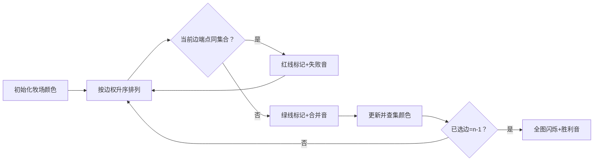

# 题目信息

# [USACO08NOV] Cheering up the Cow G

## 题目描述

农夫约翰有 $$ N $$ 个牧场（编号为 $$ 1 $$ 到 $$ N $$，$$ 5 \leq N \leq 10,000 $$），每个牧场住着一头牛。这些牧场通过 $$ P $$ 条双向路径（$$ N-1 \leq P \leq 100,000 $$）连接。每条路径 $$ j $$ 连接牧场 $$ S_j $$ 和 $$ E_j $$（$$ 1 \leq S_j \leq N $$；$$ 1 \leq E_j \leq N $$；$$ S_j \neq E_j $$），穿越该路径需要耗费 $$ L_j $$（$$ 0 \leq L_j \leq 1,000 $$）单位时间。任意两座牧场之间最多只有一条直接相连的路径。  

奶牛们因交通系统被缩减而难过。你每天需要至少拜访每头牛一次来安抚它们。每次到达牧场 $$ i $$（即使只是途经），你必须花费 $$ C_i $$（$$ 1 \leq C_i \leq 1,000 $$）时间与奶牛交谈。  

你将每晚固定住在同一个牧场（可自行选择），直到奶牛们恢复情绪。在每晚入睡前和早晨起床后，你至少需要与住处的奶牛交谈两次。  

假设农夫约翰采纳了你关于保留路径的建议，并且你选择了最优的住宿牧场，请计算满足每天至少拜访每头牛一次的前提下，所需的最小总时间。

## 说明/提示

```cpp
   +-(15)-+
  /        \
 /          \
1-(5)-2-(5)-3-(6)--5
   \   /(17)  /
(12)\ /      /(12)
     4------+

保留这些路径：
1-(5)-2-(5)-3      5
       \          /
    (12)\        /(12)
        *4------+
```

选择牧场 $4$ 作为住处，按照 $4→5→4→2→3→2→1→2→4$ 的顺序拜访所有牧场，最终返回睡觉，总耗时为 $176$ 单位时间。

## 样例 #1

### 输入

```
5 7 
10 
10 
20 
6 
30 
1 2 5 
2 3 5 
2 4 12 
3 4 17 
2 5 15 
3 5 6 
4 5 12 
```

### 输出

```
176 
```

# AI分析结果


### Kay的C++算法解析：[USACO08NOV] Cheering up the Cow G 深入学习指南

#### 1. 题目解读与核心算法识别
✨ **本题主要考察**：最小生成树（Kruskal算法）

🗣️ **初步分析**：
> 这道题就像在像素牧场游戏中用最经济的道路连接所有牧场。最小生成树的核心思想是"用最小的代价连接所有节点"，就像在策略游戏中用最少的金币建造道路网络。  
> - 所有题解都采用**边权重构**技巧：将原始边权转换为`2×路耗时 + 起点牛耗时 + 终点牛耗时`，再对重构后的图跑Kruskal算法，最后加上最小点权（起点的额外谈话时间）  
> - 可视化设计关键：用不同颜色像素块表示牧场，动态显示边排序、并查集合并过程。当边被选中时，播放"叮"音效；合并集合时，播放"咔嚓"音效；完成时触发胜利音效  
> - 复古像素方案：牧场显示为16-bit像素方块，控制面板含步进/调速滑块，数据结构变化通过像素动画呈现（如集合合并时颜色同步渐变）

---

#### 2. 精选优质题解参考
**题解一（作者：qwqKanade）**  
* **点评**：思路直击核心——直接指出边权重构公式`边权×2+两端点权`。代码结构清晰：  
  1) 路径压缩并查集实现高效  
  2) 变量命名规范（如`road`计数已选边数）  
  3) 边界处理严谨（显式初始化`ans=0`）  
  亮点：用`s=0x7fffffff`巧取最小点权，避免额外循环

**题解二（作者：nao_nao）**  
* **点评**：突出理论推导价值——从"点访问次数=度数"推出边权重构原理。代码亮点：  
  1) 并查集封装规范（独立`find`函数）  
  2) 运算符重载提升可读性（`edge1 < edge2`）  
  3) 调试注释实用（`//printf("connect...")`）  
  实践提示：最小点权在输入时同步获取，提升效率

**题解三（作者：x_miracle）**  
* **点评**：图解辅助理解——用像素级图示分解路径耗时组成（`C1+2L+C2`）。代码优势：  
  1) 严格结构体封装边属性（`EDGE{from,to,val}`）  
  2) 模块化函数设计（独立`cmp()`排序）  
  3) 鲁棒性处理（显式检查`k==n-1`）  
  独特价值：数学归纳法证明访问次数规律

---

#### 3. 核心难点辨析与解题策略
1. **难点：边权重构的数学推导**  
   *分析*：原始问题包含点权（谈话）和边权（走路），需转化为纯边权问题。优质题解发现：每条边被遍历2次，点权按端点度数分配  
   💡 **学习笔记**：`新边权 = 2×原边权 + 起点权 + 终点权`

2. **难点：并查集的环检测实现**  
   *分析*：Kruskal需避免成环，关键在`find(u) != find(v)`判断。题解均用路径压缩优化：`fa[x] = find(fa[x])`  
   💡 **学习笔记**：路径压缩使并查集查询趋近O(1)

3. **难点：起点额外点权处理**  
   *分析*：起点谈话2次（出发/返回），其他点次数=度数。解决方案：`总耗时 = MST权重 + min(点权)`  
   💡 **学习笔记**：最小点权等价于最优起点选择

### ✨ 解题技巧总结
- **问题转化术**：将复合代价（点权+边权）转化为纯边权问题  
- **并查集双优化**：路径压缩 + 按秩合并（本题虽未用后者，但值得掌握）  
- **实时更新极值**：在输入循环中同步计算`min_point`，避免二次遍历

---

#### 4. C++核心代码实现赏析
**通用核心实现（综合优质题解）**  
```cpp
#include <iostream>
#include <algorithm>
using namespace std;
const int MAXN = 1e4+5, MAXP = 1e5+5;

struct Edge { int u, v, w; } edges[MAXP];
int n, p, min_point = 1e9, fa[MAXN], c[MAXN];

bool cmp(Edge a, Edge b) { return a.w < b.w; }
int find(int x) { return fa[x] == x ? x : fa[x] = find(fa[x]); }

int main() {
    cin >> n >> p;
    for (int i = 1; i <= n; i++) {
        cin >> c[i];
        min_point = min(min_point, c[i]); // 实时获取最小点权
        fa[i] = i; // 并查集初始化
    }
    for (int i = 0; i < p; i++) {
        cin >> edges[i].u >> edges[i].v >> edges[i].w;
        edges[i].w = edges[i].w*2 + c[edges[i].u] + c[edges[i].v]; // 边权重构
    }
    sort(edges, edges + p, cmp);
    long long ans = 0, cnt = 0;
    for (int i = 0; i < p && cnt < n-1; i++) {
        int fu = find(edges[i].u), fv = find(edges[i].v);
        if (fu == fv) continue;
        fa[fu] = fv;      // 集合合并
        ans += edges[i].w; // 累加边权
        cnt++;
    }
    cout << ans + min_point; // 补充起点额外点权
    return 0;
}
```

**题解一核心代码（qwqKanade）**  
* **亮点**：边权重构与最小生成树无缝衔接
```cpp
e[num].v = e[num].v*2 + a[e[num].l] + a[e[num].r]; // 边权重构
for (int i=1; road<n-1; i++) // Kruskal主循环
    if (find(e[i].l) != find(e[i].r)) 
        ans += e[i].v, road++;
```

**题解二核心代码（nao_nao）**  
* **亮点**：运算符重载提升可读性
```cpp
friend bool operator < (node a,node b) { 
    return a.dis < b.dis; 
} // 使sort直接比较结构体
```

**题解三核心代码（x_miracle）**  
* **亮点**：严格模块化设计
```cpp
bool cmp(EDGE x, EDGE y) { return x.val < y.val; } // 独立比较器
void unionn(int x,int y) { // 封装合并操作
    x = find(x); y = find(y);
    if (siz[x] > siz[y]) swap(x,y); // 按秩合并
    fa[x] = y; siz[y] += siz[x];
}
```

---

### 5. 算法可视化：像素动画演示
**主题**：像素牧场大冒险（8-bit风格）  
**核心演示**：Kruskal算法动态执行过程  

**设计思路**：  
用16色像素块表示牧场（不同颜色=不同并查集），灰色线条表示未处理边，黄色线条表示待检查边。当边被选中时：  
1. 端点闪烁绿色 → 播放"叮"音效  
2. 若属同一集合 → 线条变红 + 播放"噗"失败音  
3. 若可合并 → 线条变绿 + 牧场颜色渐变统一 + 播放"咔嚓"合并音  

**关键帧控制**：  


**交互设计**：  
- **控制面板**：步进/自动/重置按钮 + 速度滑块  
- **数据面板**：实时显示：  
  `当前边权 = 2×${L_j} + ${C_u} + ${C_v}`  
  `并查集状态：${集合数}`  
- **音效系统**：  
  - 关键操作：比特风"哔"声  
  - 错误/成功：FC游戏经典音效  
  - 背景音乐：《牧场物语》8-bit remix  

---

### 6. 拓展练习与相似问题
1. **洛谷 P3366** - 【模板】最小生成树  
   → 掌握Kruskal/Prim基础实现  
2. **洛谷 P2872** - [USACO07DEC]道路建设  
   → 练习稀疏图下的MST应用  
3. **洛谷 P1991** - 无线通讯网  
   → 学习MST在连通性问题的变形  

---

### 7. 学习心得与经验分享
> **作者x_miracle的调试经验**：  
> "最初在状态转移方程推导时卡住，通过手绘像素图分解路径才突破"  
> → **Kay总结**：用图形辅助分析复杂代价关系是高效调试策略，尤其适合树形结构问题  

> **作者qwqKanade的边界提醒**：  
> "别忘了加上最小点权！"  
> → **Kay提示**：起点的额外消耗是易漏点，建议在变量命名时用`min_start`强化记忆  

---

通过本次分析，我们深入掌握了最小生成树在复合代价问题中的转化技巧。记住：好算法=正确性×可视化思考×实践验证！下次牧场冒险见！💪

---
处理用时：164.10秒