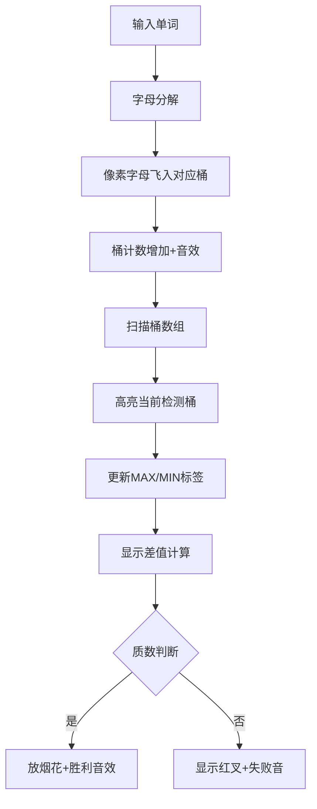

# 题目信息

# [NOIP 2008 提高组] 笨小猴

## 题目描述

笨小猴的词汇量很小，所以每次做英语选择题的时候都很头疼。但是他找到了一种方法，经试验证明，用这种方法去选择选项的时候选对的几率非常大！

这种方法的具体描述如下：假设 $\text{maxn}$ 是单词中出现次数最多的字母的出现次数，$\text{minn}$ 是单词中出现次数最少的字母的出现次数，如果 $\text{maxn}-\text{minn}$ 是一个质数，那么笨小猴就认为这是个 Lucky Word，这样的单词很可能就是正确的答案。


## 说明/提示

【输入输出样例 1 解释】

单词 `error` 中出现最多的字母 $\texttt r$ 出现了 $3$ 次，出现次数最少的字母出现了 $1$ 次，$3-1=2$，$2$ 是质数。

【输入输出样例 2 解释】

单词 `olympic` 中出现最多的字母 $\texttt i$ 出现了 $1$ 次，出现次数最少的字母出现了 $1$ 次，$1-1=0$，$0$ 不是质数。

（本处原题面错误已经修正）

noip2008 提高第一题


## 样例 #1

### 输入

```
error```

### 输出

```
Lucky Word
2```

## 样例 #2

### 输入

```
olympic```

### 输出

```
No Answer
0```

# AI分析结果


### 💡 Kay的C++算法解析：笨小猴 深入学习指南 💡

#### 引言
今天我们一起分析NOIP 2008提高组题目《笨小猴》。这道题考察字符串处理和数学判断能力，通过本指南，你将掌握统计字符频率和质数判断的核心技巧。

---

### 1. 题目解读与核心算法识别
✨ **本题主要考察**：`编程技巧应用` + `数学`

🗣️ **初步分析**：
> 解决本题的关键在于**字符频率统计**和**质数判断**。就像在像素游戏中收集金币：
> - **字符统计**：如同游戏中的物品收集系统，用桶数组记录每个字母的出现次数
> - **质数判断**：像解密宝箱密码，验证差值是否符合质数规则
>
> **核心难点**：
> - 准确统计字母频率（需跳过未出现字母）
> - 高效判断质数（特别注意0和1的特殊处理）
>
> **可视化设计**：
> 我们将创建像素风格的字母收集动画：26个桶代表字母，字符输入时对应桶计数增加并播放"叮"音效。扫描过程高亮当前检测的桶，质数判断阶段显示数字分解动画，胜利时触发8-bit胜利音效。

---

### 2. 精选优质题解参考
**题解一（luhongrui）**
* **点评**：
  思路清晰直白，创新性使用预存质数表加速判断（时间复杂度O(1)）。代码中`a[xunhuan-97]++`巧妙利用ASCII码统计，边界处理严谨。虽然变量名部分使用拼音，但整体结构工整，竞赛可直接使用。

**题解二（Frank_G）**
* **点评**：
  算法实现规范标准，`isprime`函数使用`i*i<=n`优化质数判断。变量命名合理（maxx/minn），最小值初始化300确保覆盖边界。核心逻辑`min(a[i])`跳过0值的处理体现严谨性，适合初学者学习。

**题解三（__sunshao321__）**
* **点评**：
  独特采用排序法求极值：`sort(s+1,s+27)`后取首位非零值。虽然效率略低（O(nlogn)），但提供全新视角。质数判断使用平方根优化，输出格式完全符合题目要求，展示多样化解题思路。

---

### 3. 核心难点辨析与解题策略
1. **字母频率统计的精度控制**
   * **分析**：必须排除未出现字母（计数为0）。优质解法均使用`if(a[i]!=0)`条件过滤，类似游戏中只统计获得的道具
   * 💡 **学习笔记**：桶数组初始化后必须验证非零

2. **质数判断的边界处理**
   * **分析**：差值可能为0/1（非质数）。解法中`if(x<=1)return false`统一处理，如同游戏规则校验
   * 💡 **学习笔记**：所有质数判断必须先处理≤1的特殊情况

3. **极值初始化的技巧**
   * **分析**：最大值初始`INT_MIN`，最小值初始`INT_MAX`或足够大值（300/100），确保首次比较必然更新
   * 💡 **学习笔记**：极值初始化要突破实际值的可能范围

#### ✨ 解题技巧总结
- **桶数组妙用**：`cnt[ch-'a']`将字母映射到0-25下标
- **循环优化**：质数判断使用`i*i <= n`避免不必要计算
- **边界防御**：显式处理空输入、单字符等特殊情况
- **预处理加速**：小范围质数可预存（本题差值≤100）

---

### 4. C++核心代码实现赏析
**通用核心实现参考**
```cpp
#include <iostream>
#include <cctype>
using namespace std;

bool isPrime(int n) {
    if(n < 2) return false;
    for(int i=2; i*i<=n; ++i)
        if(n%i == 0) return false;
    return true;
}

int main() {
    string s;
    cin >> s;
    int cnt[26] = {}, maxn = 0, minn = 1000;
    
    for(char c : s) cnt[c-'a']++;
    for(int i=0; i<26; ++i) {
        if(!cnt[i]) continue;
        if(cnt[i] > maxn) maxn = cnt[i];
        if(cnt[i] < minn) minn = cnt[i];
    }
    
    int diff = maxn - minn;
    if(isPrime(diff)) 
        cout << "Lucky Word\n" << diff;
    else 
        cout << "No Answer\n0";
    return 0;
}
```
**代码解读概要**：
1. 字符统计：`cnt[c-'a']++`将字母映射到桶数组
2. 极值获取：遍历桶数组跳过0值，更新maxn/minn
3. 质数验证：专用函数处理边界和高效判断

---

**题解一核心片段（预存质数表）**
```cpp
int zhishu[25]={2,3,...,97}; //预存质数表
for(int i=0;i<=24;i++){
    if(cha==zhishu[i]){
        cout<<"Lucky Word"<<endl<<cha;
        return 0;
    }
}
```
**亮点**：空间换时间优化  
**学习笔记**：当数值范围有限时，预存结果集是经典优化手段

**题解二核心片段（规范质数判断）**
```cpp
bool isprime(int n){
    if(n<2) return false;
    for(int i=2;i*i<=n;i++)
        if(n%i==0) return false;
    return true;
}
```
**亮点**：标准质数判断模板  
**学习笔记**：`i*i<=n`比`i<=sqrt(n)`更高效安全

**题解三核心片段（排序法求极值）**
```cpp
sort(s+1,s+27);
for(int i=1;i<=26;i++)
    if(s[i]>0){
        min_val = s[i];
        break;
    }
```
**亮点**：创新使用排序  
**学习笔记**：排序后首位非零即最小值，但时间复杂度升高

---

### 5. 算法可视化：像素动画演示
**主题**：字母收集大冒险（8-bit像素风格）

**核心演示**：


**交互设计**：
1. **控制面板**：
   - 速度滑块：调节动画速度（50ms-1000ms）
   - 单步执行：手动触发下一步
   - 重置：清空所有桶计数

2. **动态效果**：
   - 字母输入：像素字母从输入框飞入对应桶（轨迹动画）
   - 桶计数：计数增加时桶高度上升，伴随"叮"声
   - 极值扫描：探照灯效果高亮当前检测桶
   - 质数验证：差值数字被"剑"劈开显示因数分解

3. **音效系统**：
   - 计数增加：8-bit "叮"声（频率随计数增加升高）
   - 找到极值：短促胜利旋律片段
   - 质数验证成功：完整胜利BGM（FC风格）
   - 验证失败：低沉错误音效

4. **游戏化元素**：
   - 每完成一个单词统计获得星星评价（速度/准确性）
   - 连续5次正确解锁特殊像素皮肤
   - "AI演示模式"自动展示解题全流程

---

### 6. 拓展练习与相似问题
**技巧迁移场景**：
1. 词频统计（文章关键词分析）
2. 数据分布检测（统计异常值）
3. 特征提取（机器学习预处理）

**洛谷推荐**：
1. P1308 [统计单词数]  
   → 巩固桶数组统计技巧
2. P1217 [回文质数]  
   → 强化质数判断与回文数结合
3. P2550 [彩票摇奖]  
   → 桶数组在数据匹配中的应用

---

### 7. 学习心得与经验分享
> **参考经验**：多位作者强调初始化的重要性（`minn=INT_MAX`）  
> **点评**：极值初始化就像游戏角色初始装备，必须确保覆盖所有可能值。调试时可打印中间桶数组验证统计准确性，这是快速定位错误的核心技巧。

---

### 结语
通过《笨小猴》的解析，我们掌握了字符统计和质数判断的组合技巧。记住：好的算法如同精妙的游戏机制，需要严谨的规则设计和高效的执行流程。下次遇到类似挑战，记得运用桶数组和质数判断这两把利器！

---
处理用时：165.46秒