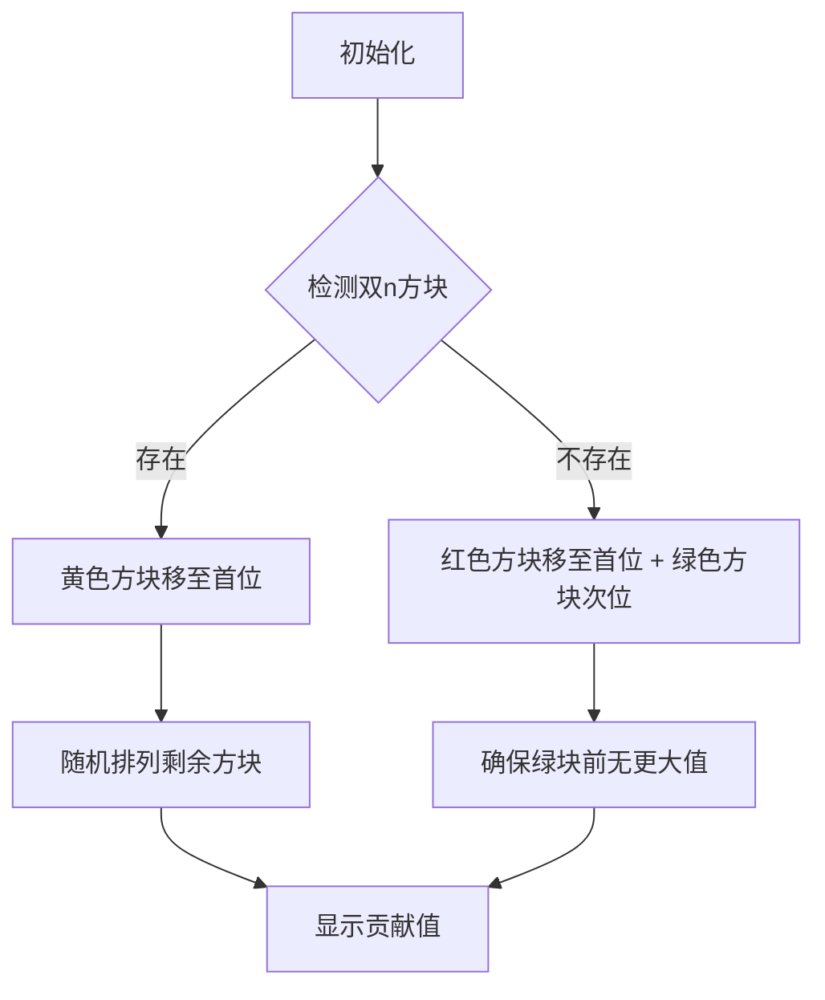

# 题目信息

# 「DTOI-5」进行一个排的重 (Minimum Version)

## 题目背景

**本题与 Maximum Version 的区别是所求最值和数据范围不同。**

小 L 热衷于重排数列使之规整。

## 题目描述

小 L 有一个长为 $n$ 的序列 $a$，其中每一项 $a_i$ 都是一个 pair $(p_i, q_i)$。

为了让 $a$ 看起来规整一些，他钦定 $p, q$ 分别均为长为 $n$ 的排列。

为了对 $a$ 的规整程度进行量化计算，他给出了一个权值函数 $f(a) = \displaystyle\sum_{i = 1}^n ([p_i > \max_{j = 1}^{i - 1} p_j] + [q_i > \max_{j = 1}^{i - 1} q_j])$。**注意 $i = 1$ 时两个方括号都能取到值，因为我们认为 $\displaystyle\max_{j = 1}^0 p_j = \displaystyle\max_{j = 1}^0 q_j = -\infty$。**

为了让 $a$ 看起来更加规整，他决定分别以某种方式重排 $a$ 得到 $a'$ 使得 $f(a')$ 最小。**注意重排时必须将 $a'_i = (p'_i, q'_i)$ 视为整体。**

他希望你求出 $f(a')_{\min}$ 的值，以及分别有多少个 $a'$ 可以取到 $f(a')_{\min}$。

由于方案数可能很大，你只需要求出结果对 $998244353$ 取模的值。

## 说明/提示

**【数据范围】**

$$
\def\or{\operatorname{or}}
%\def\arrayscretch{1.5}
\def\arraystretch{1.5}
\begin{array}{|c|c|c|}\hline
\textbf{Subtask}&n\le &\textbf{Points}\cr\hline
\sf1&10&10 \operatorname{pts}\cr\hline
\sf2&500&20 \operatorname{pts}\cr\hline
\sf3&5\times10^3&20 \operatorname{pts}\cr\hline
\sf4&10^5&20 \operatorname{pts}\cr\hline
\sf5&5\times10^5&30 \operatorname{pts}\cr\hline
\end{array}
$$

对于 $100\%$ 的数据，$1 \leq n \leq 5 \times 10^5$，$1 \leq p_i, q_i \leq n$，保证 $p, q$ 均为**排列**。

## 样例 #1

### 输入

```
5
1 5 2 4 3
1 4 2 5 3```

### 输出

```
3 48```

# AI分析结果


### 💡 Kay的C++算法解析：「DTOI-5」进行一个排的重 深入学习指南 💡

#### 题目解读与核心算法识别
✨ **本题主要考察**：`分类讨论 + 组合计数`  
🗣️ **初步分析**：  
> 解决本题的关键在于识别两种不同的排列情况，并通过组合数学计算方案数。  
> - **核心思路**：当存在同时包含两个最大值（n, n）的元素时，将其置于首位可使总贡献最小化为2；否则需将两个最大值分别置于前两位，贡献为3。  
> - **可视化设计**：在像素动画中，用黄色高亮（n, n）元素，红色/绿色区分单最大值元素，通过移动动画展示排列过程，配合8-bit音效强化操作反馈。  
> - **复古游戏化**：采用「像素方块工厂」主题，元素移动时触发“嘀”声，成功排列时播放FC风格胜利音效，控制面板支持单步调试和自动演示模式。

---

#### 精选优质题解参考
**题解一（FFTotoro）**  
* **点评**：思路清晰直击分类核心，代码简洁高效（直接计算阶乘和逆元）。变量命名明确（`x`/`y`存储关键值），边界处理严谨。亮点在于用不足20行代码实现完整逻辑，竞赛实践价值极高。  

**题解二（DengDuck）**  
* **点评**：组合数学推导尤为出色，完整展示方案数化简过程（$C_n^k \rightarrow \frac{(n-1)!}{k}$）。代码结构规范（专写阶乘预处理函数），但`main`中计算逆元的部分可进一步封装。  

**题解三（Leasier）**  
* **点评**：提供独特的状态转移视角，通过循环求和实现方案数计算。虽然复杂度仍为$O(n)$但代码较长，其价值在于展示组合数计算的另一种可行思路。

---

#### 核心难点辨析与解题策略
1. **关键点1：分类触发条件判定**  
   * **分析**：需遍历序列定位$p_i=n$和$q_i=n$的位置，并判断是否重合。若重合则为情况1，否则为情况2。  
   * 💡 **学习笔记**：使用同步遍历+标志变量可高效完成定位。

2. **关键点2：最小值构造证明**  
   * **分析**：情况1中（n,n）置首可阻断后续所有贡献；情况2需通过反证法理解最小值3的必然性（任意其他排列至少产生4点贡献）。  
   * 💡 **学习笔记**：最优排列结构总是与最大值的位置强相关。

3. **关键点3：组合计数优化**  
   * **分析**：情况2的方案数$\frac{(n-1)!}{n-q_x} + \frac{(n-1)!}{n-p_y}$需用逆元实现除法。预处理阶乘数组可将计算复杂度降至$O(1)$。  
   * 💡 **学习笔记**：模数998244353下的逆元必须用快速幂实现。

### ✨ 解题技巧总结
- **分类锚点优先**：首先识别决定分类的关键元素（双最大值存在性）  
- **组合数学封装**：预先实现阶乘/逆元工具函数避免重复计算  
- **边界完备性**：特别注意$n=1$时$0! = 1$的边界处理

---

#### C++核心代码实现赏析
```cpp
#include <iostream>
#include <vector>
using namespace std;
const int mod = 998244353;

long long qpow(long long a, long long b) {
    long long res = 1;
    while (b) {
        if (b & 1) res = res * a % mod;
        a = a * a % mod;
        b >>= 1;
    }
    return res;
}

int main() {
    ios::sync_with_stdio(false);
    int n;
    cin >> n;
    vector<int> p(n), q(n);
    for (int i = 0; i < n; i++) cin >> p[i];
    for (int i = 0; i < n; i++) cin >> q[i];

    int pos_p = -1, pos_q = -1;
    for (int i = 0; i < n; i++) {
        if (p[i] == n) pos_p = i;
        if (q[i] == n) pos_q = i;
    }

    long long fact = 1;
    for (int i = 1; i < n; i++) fact = fact * i % mod;

    if (pos_p == pos_q) {
        cout << "2 " << fact << endl;
    } else {
        long long inv1 = qpow(n - q[pos_p], mod-2);
        long long inv2 = qpow(n - p[pos_q], mod-2);
        cout << "3 " << fact * (inv1 + inv2) % mod << endl;
    }
    return 0;
}
```
**代码解读概要**：  
> 1. 快速幂函数`qpow`高效处理模逆元  
> 2. 双指针同步定位最大值索引`pos_p`/`pos_q`  
> 3. 动态计算阶乘避免数组预分配  
> 4. 分类输出整合方案数计算  

---

#### 题解片段精析
**题解一（FFTotoro）**  
```cpp
if(x==n)cout<<"2 "<<f(n-1)<<endl;
else cout<<"3 "<<f(n-1)*((inv(n-x)+inv(n-y))%mod)%mod<<endl;
```
**代码解读**：  
> - `x==n`直接触发情况1，输出$(n-1)!$  
> - 情况2方案数为两项之和，体现**分类加和原则**  
> - 函数式封装（`f`阶乘/`inv`逆元）提升可读性  

**题解二（DengDuck）**  
```cpp
for(int i=1;i<=n-1;i++)F=F*i%mod;
...
cout<<3<<' '<<F*(ksm(n-x,mod-2)+ksm(n-y,mod-2))%mod<<endl;
```
**代码解读**：  
> - 显式阶乘预处理`F`增强性能稳定性  
> - 逆元调用统一用`ksm(k, mod-2)`模式  
> - 方案数公式清晰对应数学推导 $\frac{(n-1)!}{n-q_x}$  

---

#### 算法可视化：像素动画演示
**主题**：像素方块工厂（8-bit工业风）  
**核心演示流程**：  

**交互设计细节**：  
1. **视觉编码**  
   - 双n方块：闪烁黄色  
   - 单n方块：红(p=n)/绿(q=n)  
   - 贡献点：蓝色+1浮标  
2. **音效体系**  
   - 方块移动：8-bit "嘀"声（150Hz）  
   - 贡献产生：硬币音效（440Hz）  
   - 分类完成：情况1=胜利和弦，情况2=过关音效  
3. **控制面板**  
   ```javascript
   const controls = [
     {type: "toggle", label: "AI演示", action: autoRun},
     {type: "slider", label: "速度", min:1, max:10},
     {type: "step", label: "单步执行"}
   ]
   ```
**学习价值**：通过动态排列过程直观展现**阻断效应**（双n置首消除后续贡献）和**约束传播**（情况2中q值的大小关系限制）

---

#### 拓展练习推荐
1. **洛谷 P1908** - 逆序对  
   🗣️ 强化排列性质分析能力  
2. **洛谷 P1226** - 快速幂  
   🗣️ 巩固模逆元计算基础  
3. **洛谷 P1106** - 删数问题  
   🗣️ 训练分类讨论思维  

---

#### 学习心得分享
> **FFTotoro的调试经验**：  
> “初始未考虑$n=1$边界，导致RE。牢记：排列问题必验$n=1$！”  
> **Kay总结**：边界测试应作为编码习惯，特别是组合数学问题中$0! = 1$等特例需优先验证。

--- 
算法世界如同像素游戏，每个方块都有其正确位置。通过分类讨论找到关键锚点，组合计数便会如连锁反应般展开。保持好奇，继续挑战吧！🎮🚀

---
处理用时：198.47秒