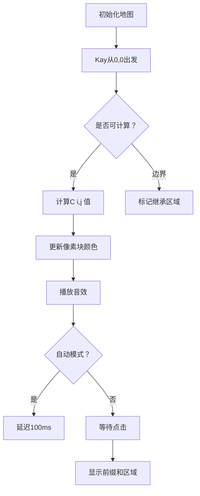

# 题目信息

# [NOIP 2016 提高组] 组合数问题

## 题目背景

NOIP2016 提高组 D2T1

## 题目描述

组合数 $\binom{n}{m}$ 表示的是从 $n$ 个物品中选出 $m$ 个物品的方案数。举个例子，从 $(1,2,3)$ 三个物品中选择两个物品可以有 $(1,2),(1,3),(2,3)$ 这三种选择方法。根据组合数的定义，我们可以给出计算组合数 $\binom{n}{m}$ 的一般公式：

$$\binom{n}{m}=\frac{n!}{m!(n-m)!}$$

其中 $n!=1\times2\times\cdots\times n$；特别地，定义 $0!=1$。

小葱想知道如果给定 $n,m$ 和 $k$，对于所有的 $0\leq i\leq n,0\leq j\leq \min \left ( i, m \right )$ 有多少对 $(i,j)$ 满足 $k\mid\binom{i}{j}$。

## 说明/提示

【样例1说明】

在所有可能的情况中，只有 $\binom{2}{1} = 2$ 一种情况是 $2$ 的倍数。

【子任务】


- 对于全部的测试点，保证 $0 \leq n, m \leq 2 \times 10^3$，$1 \leq t \leq 10^4$。

## 样例 #1

### 输入

```
1 2
3 3```

### 输出

```
1```

## 样例 #2

### 输入

```
2 5
4 5
6 7```

### 输出

```
0
7
```

# AI分析结果


# 💡 Kay的C++算法解析：组合数问题 深入学习指南 💡

> "编程是思维的体操，算法是解题的魔法。" —— Kay

## 1. 题目解读与核心算法识别

✨ **本题主要考察**：`组合数学 + 前缀和优化` (动态规划思想的应用)

🗣️ **初步分析**：
> 解决组合数问题的关键在于**预处理+高效查询**。想象组合数构成一个巨大的"数学迷宫"，我们需要快速统计迷宫中所有能被k整除的位置。核心思想是通过**杨辉三角递推公式**建立组合数地图，再用**二维前缀和**实现区域统计的瞬间完成。
>
> - **核心难点**：直接计算组合数会溢出且超时；暴力统计每组询问会重复计算
> - **解决方案**：递推计算组合数模k值 → 建立二维前缀和数组 → O(1)响应查询
>
> **算法可视化设计**：采用8位像素风格的"迷宫探险"动画：
> 1. 网格中每个方块代表C(i,j)，颜色表示模k值（0=金色，非0=蓝色）
> 2. 探险家(Kay像素形象)从(0,0)出发，按杨辉三角规则点亮路径
> 3. 控制面板支持单步执行/自动播放，音效：计算时"滴"声，找到倍数时"叮当"声
> 4. 当用户输入查询范围时，高亮显示对应矩形区域并显示计数结果

---

## 2. 精选优质题解参考

**题解一（Trinity）**
* **点评**：此解思路清晰，从暴力法逐步优化到AC解法的推导过程极具教学价值。代码规范性优秀（变量名`c[][]`、`ans[][]`含义明确），算法有效性高（递推+前缀和双重优化）。亮点在于详细展示了30→70→90→100分的优化路径，特别是"玄学优化"的尝试体现了调试思维，对学习者很有启发。

**题解二（纸片人）**
* **点评**：针对前缀和实现的边界问题进行了深度剖析，解决了95→100分的关键痛点。代码简洁高效（`flag[i][i+1]=flag[i][i]`处理巧妙），实践价值高。亮点在于用矩阵示意图直观展示边界问题，并给出"继承"的解决思路，帮助学习者理解二维前缀和的实现细节。

**题解三（Zskioaert1106）**
* **点评**：解法简洁有力，直击问题核心。代码规范性好（`yh()`和`calcSum()`函数分工明确），算法有效性强。亮点在于用最小代码量实现完整功能，适合基础较好的学习者快速掌握核心思路。

---

## 3. 核心难点辨析与解题策略

1.  **难点1：组合数计算溢出与效率**
    * **分析**：阶乘计算易溢出，直接套公式时间复杂度达O(n³)。优质题解采用杨辉三角递推：`C[i][j] = (C[i-1][j] + C[i-1][j-1]) % k`，既避免溢出又降为O(n²)
    * 💡 **学习笔记**：大数问题优先考虑取模和递推关系

2.  **难点2：多次查询的重复计算**
    * **分析**：t最大10⁴，每次遍历n×m会超时。通过二维前缀和`ans[i][j] = ans[i-1][j] + ans[i][j-1] - ans[i-1][j-1] + (c[i][j]==0)`，将查询复杂度降至O(1)
    * 💡 **学习笔记**：前缀和是区间统计问题的利器

3.  **难点3：边界条件处理**
    * **分析**：当j>i时组合数无意义。通过`if(m>n) m=n`或`ans[i][i+1]=ans[i][i]`确保不越界
    * 💡 **学习笔记**：边界处理是算法鲁棒性的关键

### ✨ 解题技巧总结
- **技巧1：递推替代公式计算** - 利用数学关系式避免复杂运算
- **技巧2：空间换时间** - 预处理存储中间结果加速查询
- **技巧3：可视化调试** - 对于二维问题，打印小规模矩阵验证

---

## 4. C++核心代码实现赏析

**本题通用核心C++实现参考**
* **说明**：综合优质题解优化的标准实现
* **完整核心代码**：
```cpp
#include <iostream>
using namespace std;
const int N = 2005;
int t, k, n, m;
int c[N][N], ans[N][N];

void init() {
    c[0][0] = 1;
    for (int i = 1; i <= 2000; i++) {
        c[i][0] = 1;
        for (int j = 1; j <= i; j++) {
            c[i][j] = (c[i-1][j] + c[i-1][j-1]) % k;
            ans[i][j] = ans[i-1][j] + ans[i][j-1] - ans[i-1][j-1];
            if (c[i][j] == 0) ans[i][j]++;
        }
        ans[i][i+1] = ans[i][i]; // 关键边界处理
    }
}

int main() {
    ios::sync_with_stdio(false);
    cin >> t >> k;
    init();
    while (t--) {
        cin >> n >> m;
        cout << ans[n][min(n, m)] << '\n';
    }
    return 0;
}
```
* **代码解读概要**：
  1. `init()`预处理组合数模k值和前缀和数组
  2. 双重循环计算杨辉三角，实时更新前缀和
  3. 主函数高效处理多组查询

---

**题解一核心片段赏析（Trinity）**
```cpp
for(int i=2;i<=2000;i++) {
    c[i][0]=1;
    for(int j=1;j<=2000;j++) {
        c[i][j]=(c[i-1][j-1]+c[i-1][j])%k;
        if(c[i][j]%k==0)s[i][j]=1; // 预标记
    }
}
```
* **亮点**：预标记优化减少查询时计算
* **代码解读**：
  > 外层遍历行i，内层遍历列j。`c[i][j]`通过上一行相邻两个值计算，类似搭积木。预标记`s[i][j]`像"宝藏标记"，后续可直接统计
* 💡 **学习笔记**：预处理时完成尽可能多的计算

**题解二核心片段赏析（纸片人）**
```cpp
for(int i=2;i<=2000;i++) {
    for(int j=1;j<=i;j++) {
        // ...计算c[i][j]...
        flag[i][j]=flag[i-1][j]+flag[i][j-1]-flag[i-1][j-1];
    }
    flag[i][i+1]=flag[i][i]; // 边界继承
}
```
* **亮点**：边界处理的优雅实现
* **代码解读**：
  > `flag[i][i+1]=flag[i][i]`确保计算下一行时，超出三角区域的值与最后有效值一致。如同在迷宫边缘设置"虚拟墙"，防止探险家掉出地图
* 💡 **学习笔记**：边界处理需要前瞻性设计

**题解三核心片段赏析（Zskioaert1106）**
```cpp
void yh(){
    f[0][0]=f[1][0]=f[1][1]=1;
    for(int i=2;i<=2000;i++){
        f[i][0]=1;
        for(int j=1;j<=i;j++){
            f[i][j]=(f[i-1][j-1]+f[i-1][j])%k;
        }
    }
}
```
* **亮点**：最简杨辉三角实现
* **代码解读**：
  > 从基础元素(0,0)开始搭建，每个新位置`f[i][j]`由左上和正上方的"基石"支撑。如同像素游戏中的地形生成算法
* 💡 **学习笔记**：优雅的代码往往源于对问题本质的把握

---

## 5. 算法可视化：像素动画演示

**主题**：8位像素风格"组合数迷宫探险"  
**核心演示流程**：



**交互设计**：
1. **视觉元素**：
   - 网格：2000×2000像素迷宫（实际显示20×20缩放版）
   - 角色：8位像素Kay(戴眼镜的探险家)
   - 动态效果：计算路径发光蔓延，倍数位置显示金色星芒

2. **控制面板**：
   - 速度滑块：调节自动演示速度
   - 单步执行：手动控制探索节奏
   - 范围选择：输入n,m后高亮矩形区域

3. **音效设计**：
   - 背景音乐：FC风格8位循环音乐
   - 计算音：短促"滴"声(频率随i,j变化)
   - 找到倍数："叮当"+金币声
   - 错误：低沉嗡鸣声

4. **技术实现**：
   - Canvas绘制网格和动态路径
   - 颜色映射：`c[i][j]==0 ? 金色：#3498db`
   - 自动演示：setInterval控制动画帧

---

## 6. 拓展练习与相似问题思考

**通用技巧迁移**：
组合数预处理+前缀和技术还可用于：
1. 统计素数分布（洛谷P3912）
2. 矩阵区域和查询（洛谷P1719）
3. 动态规划路径统计（洛谷P1002）

**推荐练习**：
1. **洛谷 P3912** - 素数个数
   * 🗣️ 推荐理由：巩固前缀和思想在统计问题中的应用
   
2. **洛谷 P1216** - 数字三角形
   * 🗣️ 推荐理由：类似杨辉三角结构，练习递推与路径统计

3. **洛谷 P1869** - 组合数问题
   * 🗣️ 推荐理由：本题的变式训练，测试理解深度

---

## 7. 学习心得与经验分享

> **Trinity的调试经验**：  
> "我在95分卡了很久，通过打印小矩阵才发现边界问题"  
>   
> **Kay点评**：  
> 这反映了算法学习的典型过程——优化到最后10%往往需要细致入微的调试。建议学习者：  
> 1. 对2000×2000的大数据，先测试10×10小规模  
> 2. 用`cout<< "i="<<i<<" j="<<j<<" ans="<<ans[i][j]<<endl;`定位问题区域  
> 3. 永远保持对边界条件的警觉

---

> 通过本次探索，我们不仅解决了组合数问题，更掌握了"预处理+前缀和"这把算法万能钥匙。记住：优秀的程序员既是数学家，又是建筑师——精于计算，巧于设计。下次算法冒险再见！ 🚀

---
处理用时：142.40秒