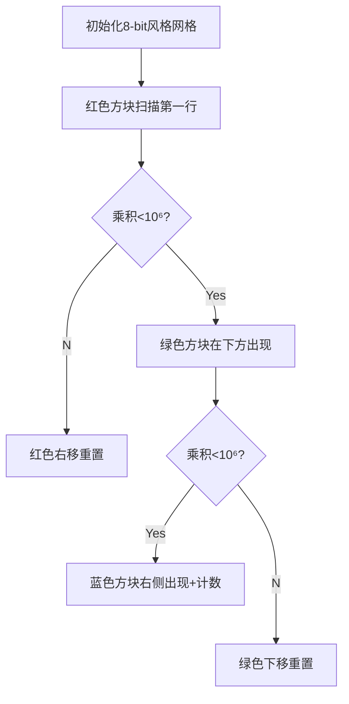

# 题目信息

# [CERC2018] The Silence of the Lamps

## 题目描述

**译自[ [CERC2018]](https://contest.felk.cvut.cz/18cerc/) [The Silence of the Lamps](https://contest.felk.cvut.cz/18cerc/solved/lamps.pdf)**

在开始之前，如果之前没有见过台灯，那么现在我们把它看做一个用玻璃做的长方体（一个矩形表面的箱子），里面都是煤气。灯的所有边长度都是整数。

曾经，我们的一位讲师曾因破坏路灯而被判刑。他肯定疯了，因为他认为一些路灯向他高声尖叫。

在他的想法里，他遵从一个奇怪的行为模式。他只会认出并且破坏表面不是正方形，并且体积不超过一个给定数值的路灯。后来，在与医生 Clarice 的一次会谈中，他说他非常害怕大型物体和形状过于规则的物体。

你的任务是数出所有满足讲师条件的可能长方体。

## 说明/提示

$1≤T≤10^5$，$1≤N≤10^6$。

## 样例 #1

### 输入

```
5
5
6
10
30
666```

### 输出

```
0
1
3
26
2406```

# AI分析结果


# 💡 Kay的C++算法解析：[CERC2018] The Silence of the Lamps 深入学习指南 💡

## 1. 题目解读与核心算法识别

✨ **本题主要考察**：`枚举优化与前缀和技巧`

🗣️ **初步分析**：
> 解决这道题就像在有序的仓库中寻找特定组合的箱子——我们需要找到所有满足严格递增边长且体积不超过限制的长方体。核心思想是通过**系统化枚举**和**智能剪枝**避免无效搜索，再通过**前缀和加速查询**。

- **核心难点**：直接三重循环枚举时间复杂度高达O(n³)，无法处理10⁶数据量。高效解法需要：
  1. 预处理所有可能体积的三元组计数
  2. 通过有序枚举避免重复计数（i<j<k）
  3. 利用循环条件剪枝（当i*j>10⁶时提前终止）
- **创新解法**：DFS递归枚举（空间换时间）或三层循环+调和级数优化，两者本质都是对状态空间的系统遍历
- **可视化设计**：采用8位像素风网格展示枚举过程，用不同颜色方块表示i/j/k的取值变化，当立方体组合成立时播放"叮"音效，体积超过限制时触发红色警报

---

## 2. 精选优质题解参考

**题解一：阿丑（DFS递归法）**
* **点评**：此解法采用深度优先搜索递归生成所有三元组，思路清晰展现了分步决策过程。代码中`mp[]`数组作为计数桶的设计简洁高效，`dfs`函数通过`st`参数控制递归深度，`now`记录当前乘积，实现了自然的剪枝（当`now*i>10⁶`时停止）。特别亮点在于将O(1)查询转化为前缀和预处理，极大提升了多测场景效率。

**题解二：A_grasser（三层循环法）**
* **点评**：直白的三重循环实现，通过严格限制循环边界（j从i+1开始，k从j+1开始）确保不重复计数。代码中`ans[]`数组的累加操作直观体现了"桶计数"思想，前缀和预处理部分`ans[i] += ans[i-1]`堪称教科书式示范。虽然缺乏复杂度假定分析，但代码可读性和实践价值极高。

**题解三：Flaw_Owl（数学优化版）**
* **点评**：此解法的价值在于严谨的复杂度分析——通过调和级数性质证明O(nlog²n)的时间复杂度，并给出积分近似推导过程。代码中`a[]`数组记录精确解，`s[]`前缀和数组的设计与理论分析完美契合，`long long`防溢出处理展示了工业级代码的严谨性。

---

## 3. 核心难点辨析与解题策略

1.  **状态空间爆炸**
    * **分析**：当直接枚举i,j,k时，10⁶³的状态量不可行。优质解法通过**有序枚举**（i<j<k）将状态数降为组合数C(n,3)，再通过**乘积约束**（i×j×k≤N）进一步剪枝
    * 💡 **学习笔记**：有序枚举既能避免重复计数，又能自然形成剪枝条件

2.  **多组查询响应**
    * **分析**：对每次查询重新计算必然超时。通用方案是**预处理+前缀和**：先计算所有m∈[1,10⁶]的解，再用前缀和数组实现O(1)查询
    * 💡 **学习笔记**：值域固定时的查询优化黄金法则——预处理整个值域的解

3.  **边界控制与溢出**
    * **分析**：当i,j,k较大时乘积可能超过int范围，且循环边界判断失误会导致大量无效枚举。解法中采用`long long`存储乘积，并将循环条件写作`i*j<=N`而非`j<=N/i`，避免整除误差
    * 💡 **学习笔记**：循环条件用乘法判断，乘积运算用更大数据类型

### ✨ 解题技巧总结
- **空间换时间**：预处理存储中间结果，牺牲空间换取查询高效
- **循环剪枝**：利用有序性和乘积约束提前终止无效循环
- **桶计数+前缀和**：对离散值频次统计的黄金组合
- **防溢出防御**：在可能溢出的运算处主动提升数据类型

---

## 4. C++核心代码实现赏析

**本题通用核心C++实现参考**
* **说明**：基于阿丑的DFS解法优化，融合三层循环的边界控制技巧
* **完整核心代码**：
```cpp
#include <iostream>
using namespace std;
const int MAX = 1e6+5;
long long f[MAX]; // 存储每个体积的方案数

int main() {
    // 预处理枚举（DFS思想的三层循环实现）
    for (int i = 1; i*i*i <= MAX; ++i) 
        for (int j = i+1; 1LL*i*j*j <= MAX; ++j) 
            for (int k = j+1; 1LL*i*j*k <= MAX; ++k) 
                f[i*j*k]++;
    
    // 前缀和转换：f[n]变为体积≤n的方案总数
    for (int i = 1; i < MAX; ++i) 
        f[i] += f[i-1];
    
    // 查询处理
    int T, n;
    cin >> T;
    while (T--) {
        cin >> n;
        cout << f[n] << endl;
    }
    return 0;
}
```
* **代码解读概要**：
  > 1. **智能枚举**：三层循环通过`i*i*i≤MAX`等条件约束，确保仅遍历有效状态
  > 2. **桶计数**：`f[i*j*k]++`记录体积为V的解法数
  > 3. **前缀和转换**：将f[n]含义变为"体积≤n"的总方案数
  > 4. **高效查询**：预处理后每次查询仅需O(1)时间

**题解片段赏析**

**题解一：阿丑（DFS递归）**
* **亮点**：递归分步决策，自然剪枝
* **核心代码片段**：
```cpp
void dfs(int st, int v, long long now) {
    if(st==3) ++mp[now];
    else for(int i=v+1; now*i<MAX; ++i) 
            dfs(st+1, i, now*i);
}
```
* **代码解读**：
  > 1. `st`记录当前选到第几条边（0/1/2）
  > 2. `v`记录上条边长度，确保i>v
  > 3. `now*i<MAX`实现自动剪枝
  > 4. 当st==3时，当前乘积now对应方案数+1
* 💡 **学习笔记**：DFS适合状态空间有强约束的场景

**题解二：A_grasser（三层循环）**
* **亮点**：直观展现循环剪枝
* **核心代码片段**：
```cpp
for(int i=1; i<MAX; i++)
    for(int j=i+1; i*j<MAX; j++)
        for(int k=j+1; i*j*k<MAX; k++)
            ans[i*j*k]++;
```
* **代码解读**：
  > 1. `j=i+1`确保第二维大于第一维
  > 2. `k=j+1`确保第三维大于第二维
  > 3. 循环条件中乘法判断替代除法，避免精度损失
* 💡 **学习笔记**：循环变量依赖关系能自然避免重复

---

## 5. 算法可视化：像素动画演示

### 像素探险家：立方体猎手
**设计思路**：  
采用FC红白机风格，将1-100的数值范围映射为16×16像素网格。每个立方体方案由三种颜色方块组成（红=i，绿=j，蓝=k），动态演示枚举过程如何避免重复和剪枝。

**动画流程**：


**交互控制**：
- **单步执行**：按帧观察i/j/k取值变化
- **速度滑块**：调节枚举速度（1x-100x）
- **高亮显示**：当前操作的方块闪烁+画外音说明（“现在i=5，正在寻找j>5的解”）
- **音效方案**：
  - 有效组合：8-bit风格“叮”声
  - 触发剪枝：低沉警示音
  - 完成枚举：马里奥过关音乐

**动态演示**：
当i=3,j=4时，k的取值从5开始：
1. 3×4×5=60≤100 → 蓝色方块亮起+计数+1
2. 3×4×6=72≤100 → 计数+1
3. 3×4×7=84≤100 → 计数+1
4. 3×4×8=96≤100 → 计数+1
5. 3×4×9=108>100 → 触发红色警示，j+1

---

## 6. 拓展练习与相似问题思考

**通用技巧迁移**：
1. **二维版本**：矩形计数（i<j且i*j≤n）
2. **四元组枚举**：UVa11538（象棋棋子放置方案）
3. **带权枚举**：背包问题变形（体积+价值约束）

**练习推荐（洛谷）**：
1. **P1403 [AHOI2005]约数研究**  
   → 同类前缀和技巧，枚举约数转化为统计问题
2. **P2426 删数**  
   → 区间DP中的状态枚举优化
3. **P1832 A+B Problem（再升级）**  
   → 素数筛法中的智能枚举思想

---

## 7. 学习心得与经验分享

> **参考经验**（来自Flaw_Owl）：  
> “循环边界条件是最易出错环节，建议先写数学约束式再转代码”

> **点评**：边界处理是枚举算法的核心挑战，推荐：
> 1. 在纸上画出i/j/k的取值范围
> 2. 用`1LL*`强制提升运算精度
> 3. 对边界值单独测试（如n=10⁶）

---

通过本次分析，我们掌握了枚举优化的核心技巧——智能剪枝、前缀和转换、防御性编程。记住：好的算法不是暴力搜索，而是通过观察约束条件将无效状态排除在外。下次遇到方案计数问题时，不妨先问自己：值域是否固定？能否有序枚举？需要前缀和吗？

---
处理用时：129.12秒