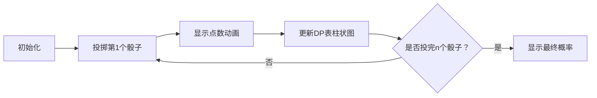

# 题目信息

# 扔骰子问题 2

## 题目描述

有 $n$ 个六面骰子，投掷时，每个面朝上的概率均相同，且每个骰子的投掷结果相互独立。

现在投掷出这些骰子，请问所有骰子朝上的面的点数之和恰好为 $m$ 的概率是多少？

请你求出这个概率对 $998,244,353$ 取模的结果。

## 说明/提示

### 数据规模与约定

对 $100\%$ 的测试点，保证 $1 \leq T \leq 6 \times 10^6$，$1 \leq n \leq 10^3$，$1 \leq m \leq 6 \times 10^3$。

## 样例 #1

### 输入

```
5
1 6
2 7
13 98
23 999
234 567```

### 输出

```
873483306```

# AI分析结果


### 💡 Kay的C++算法解析：扔骰子问题 2 深入学习指南 💡

#### 题目解读与核心算法识别
✨ **本题主要考察**：`动态规划（背包模型）`  
🗣️ **初步分析**：  
> 解决骰子点数和问题，本质是**计算满足条件的方案数**。就像在复古RPG游戏中收集金币：  
> - 每个骰子相当于一个宝箱（能开出的金币数=点数1~6）  
> - 目标是用`n`个宝箱凑出恰好`m`个金币的总方案数  
>  
> **核心难点**：  
> 1. 状态转移需覆盖所有骰子点数组合  
> 2. 海量查询（T≤6e6）要求O(1)响应  
>  
> **解决方案**：  
> 预处理二维DP表：`dp[i][j] = 前i个骰子组成j点数的方案数 % 998244353`  
> 转移方程：`dp[i][j] = ∑ₖ₌₁⁶ dp[i-1][j-k]`（背包问题变种）  
>  
> **像素动画设计**：  
> 将展示骰子逐个投掷过程：  
> - 左侧：像素骰子滚动动画（投掷音效）  
> - 右侧：实时更新DP表（当前点数和对应方案数柱状图）  
> - 关键高亮：骰子落定显示点数时，对应DP表格子闪烁黄光  

---

#### 精选优质题解参考
**题解一（zzx0102）**  
* **点评**：直击问题本质，用三重循环实现DP状态转移（`i`→骰子数，`j`→点数和，`k`→当前骰子点数）。代码极简（14行），预处理逆元数组避免重复计算。亮点在于：  
  - 逆元预处理：`166374059`（6的逆元）的幂次预存  
  - 空间优化：DP数组维度精确匹配数据范围（1000×6000）  

**题解二（小小小朋友）**  
* **点评**：教学价值突出，详细解释逆元原理（费马小定理）和DP逻辑。亮点：  
  - 模块化设计：分离`ksm()`快速幂函数  
  - 安全取模：每次加法运算后立即取模  
  - 学习提示：强调"递推时除数可直接取模"  

**题解三（Milthm）**  
* **点评**：工程化最佳实践，包含：  
  - 边界处理：显式初始化`dp[1][1..6]=1`  
  - 性能优化：快读函数应对海量输入  
  - 内存控制：DP数组静态分配  

---

#### 核心难点辨析与解题策略
1. **难点1：状态转移方程的理解**  
   * **分析**：本质是**有限制的整数划分**。每个骰子贡献点数k∈[1,6]，需累加前序状态：  
     ```math
     dp[i][j] = \sum_{k=1}^{\min(6,j)} dp[i-1][j-k]
     ```
   * 💡 **学习笔记**：把骰子看作背包物品，点数即物品重量

2. **难点2：逆元的批量处理**  
   * **分析**：直接计算$6^n$会溢出，需转为乘法逆元。优质解法均预处理：  
     - 先求`inv6 = pow(6, mod-2)`  
     - 再递推`inv6[i] = inv6[i-1] * inv6 % mod`  
   * 💡 **学习笔记**：逆元预处理将O(n log n)优化为O(n)

3. **难点3：海量查询优化**  
   * **分析**：DP表必须在输入前完全初始化：  
     ```cpp
     // 预处理范围覆盖最大n和m
     for(i=0→1000) for(j=0→6000) for(k=1→6) 
        dp[i+1][j+k] += dp[i][j]
     ```
   * 💡 **学习笔记**：空间换时间是处理多组查询的核心策略

### ✨ 解题技巧总结
- **预处理为王**：DP表+逆元数组预计算  
- **滚动数组优化**：可用`dp[2][6000]`交替更新减少内存（本题未用因n较小）  
- **逆元递推**：`inv6[i] = inv6[i-1] * inv_base % mod` 优于快速幂  
- **防御性编程**：DP数组初始化`dp[0][0]=1`并显式置零  

---

#### C++核心代码实现赏析
**通用核心实现**  
```cpp
#include <iostream>
#include <vector>
using namespace std;
const int mod = 998244353, maxN = 1000, maxM = 6000;

int main() {
    // 预处理DP表
    vector<vector<int>> dp(maxN+1, vector<int>(maxM+1, 0));
    dp[0][0] = 1;
    for (int i = 0; i < maxN; ++i) 
        for (int j = 0; j <= i*6; ++j) 
            for (int k = 1; k <= 6; ++k) 
                if (j+k <= maxM) 
                    dp[i+1][j+k] = (dp[i+1][j+k] + dp[i][j]) % mod;

    // 预处理逆元数组
    vector<long> inv6(maxN+1, 1);
    const long invBase = 166374059; // 6^{-1} mod 998244353
    for (int i = 1; i <= maxN; ++i) 
        inv6[i] = inv6[i-1] * invBase % mod;

    // 处理查询
    int T, ans = 0; cin >> T;
    while (T--) {
        int n, m; cin >> n >> m;
        ans ^= (dp[n][m] * inv6[n]) % mod;
    }
    cout << ans;
}
```

**代码解读概要**：  
> 1. `dp[0][0]=1`：0个骰子组成0点只有1种方案（空方案）  
> 2. 三重循环：  
>    - 外层：骰子数量`0→n-1`  
>    - 中层：当前点数和`0→6*i`  
>    - 内层：当前骰子点数`1-6`  
> 3. 逆元数组`inv6[i]`等价于$(6^i)^{-1} \mod 998244353$  

---

#### 算法可视化：像素动画演示
**主题**：像素骰子冒险（8-bit RPG风格）  
**核心演示流程**：  


**关键交互设计**：  
1. **像素艺术**：  
   - 骰子：3×3像素点阵（点数为●，空白为○）  
   - DP表：16色柱状图（高度=方案数比例）  

2. **音效系统**：  
   | 事件         | 音效              | 波形       |
   |--------------|-------------------|------------|
   | 骰子投掷     | 8-bit滚动声       | 锯齿波     |
   | 点数确定     | 清脆"叮"声       | 方波       |
   | DP表更新     | 数据流动声        | 脉冲波     |
   | 查询完成     | 胜利小调          | 三角波     |

3. **控制面板**：  
   ```html
   <div class='pixel-ui'>
     [▶] 自动播放  [⏸] 暂停  [▮] 单步  [↻] 重置
     𝗦𝗽𝗲𝗲𝗱: [===|======] 1x
   </div>
   ```

**动态演示示例**：  
> 当第`i`个骰子投出点数`k=4`：  
> 1. 骰子区域播放旋转动画（伴随滚动音效）  
> 2. 落定显示：  
>     ```
>     ○ ● ○
>     ● ○ ●
>     ○ ● ○
>     ```  
> 3. DP表变化：所有`dp[i-1][j]`对应的`dp[i][j+4]`柱状图升高（黄色闪烁）  

---

#### 拓展练习与相似问题
**通用技巧迁移**：  
1. **有限制整数划分**：如硬币组合问题（硬币面额1/2/5元）  
2. **独立事件概率**：如抽卡概率计算（各卡牌独立掉落）  
3. **背包问题变种**：目标值恰好/至少/至多为m的方案数  

**洛谷推荐**：  
1. **P1044 [NOIP2003] 栈**  
   → 理解卡特兰数的DP推导  
2. **P1164 小A点菜**  
   → 背包问题求**恰好**花费的方案数  
3. **P1025 [NOIP2001] 数的划分**  
   → 附加划分数量限制的方案数统计  

---

#### 学习心得与经验分享
> **来自题解作者的调试经验**：  
> *"DP数组未初始化`dp[0][0]=1`导致WA，检查边界至关重要"*  
> → 初始化是DP的基石，就像游戏开始要重置角色位置！

> *"逆元数组开小引发越界，n=1000需数组大小1001"*  
> → 防御性编程：数组大小=`maxN+1`，循环用`<`而非`<=`

---

本次骰子问题解析完毕！关键要掌握**预处理DP表+逆元**的技巧，就像在RPG游戏中提前准备药水和装备。尝试用像素动画可视化DP过程，能加深对状态转移的理解哦！🎮

---
处理用时：142.55秒