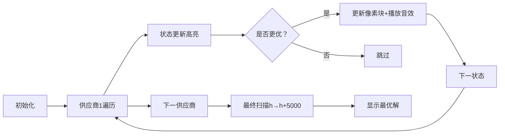

# 题目信息

# [USACO08NOV] Buying Hay S

## 题目描述

Farmer John is running out of supplies and needs to purchase H (1 <= H <= 50,000) pounds of hay for his cows.

He knows N (1 <= N <= 100) hay suppliers conveniently numbered 1..N. Supplier i sells packages that contain P\_i (1 <= P\_i <= 5,000) pounds of hay at a cost of C\_i (1 <= C\_i <= 5,000) dollars. Each supplier has an unlimited number of packages available, and the packages must be bought whole.

Help FJ by finding the minimum cost necessary to purchase at least H pounds of hay.

约翰的干草库存已经告罄，他打算为奶牛们采购 $H(1 \leq H \leq 50000)$ 磅干草。

他知道 $N(1 \leq N\leq 100)$ 个干草公司，现在用 $1$ 到 $N$ 给它们编号。第 $i$ 公司卖的干草包重量为 $P_i (1 \leq P_i \leq 5,000)$ 磅，需要的开销为 $C_i (1 \leq C_i \leq 5,000)$ 美元。每个干草公司的货源都十分充足， 可以卖出无限多的干草包。

帮助约翰找到最小的开销来满足需要，即采购到至少 $H$ 磅干草。

## 说明/提示

FJ can buy three packages from the second supplier for a total cost of 9.


## 样例 #1

### 输入

```
2 15 
3 2 
5 3 
```

### 输出

```
9 
```

# AI分析结果


### 💡 Kay的C++算法解析：购买干草 深入学习指南 💡

#### 1. 题目解读与核心算法识别
✨ **本题主要考察**：`完全背包` (动态规划变体)  
🗣️ **初步分析**：
> 解决"购买干草"问题，核心是运用**完全背包**思想。想象你是个采购员，需要在多个无限供应的供应商中组合购买干草包（每个包有固定重量和价格），目标是**至少获得H磅干草且花费最少**。这就像在超市选购米袋：米袋规格不同，你可以买多袋，只要总重≥H磅且总价最低。

- **核心难点**：题目要求"至少H磅"，意味着实际购买量可超过H，且超重部分可能带来更低开销（比如大包装优惠）
- **算法流程**：  
  1. 创建DP数组`f[j]`表示获得**至少j磅**干草的最小开销  
  2. 遍历每个供应商的干草包（重量`P_i`，价格`C_i`）  
  3. 状态转移：`f[j] = min(f[j], f[j-P_i] + C_i)`  
  4. 最终在`f[H]`到`f[H+5000]`范围找最小值（单包最大5000磅）

- **可视化设计**：  
  采用**8位像素风格**呈现动态规划过程：
  - 横轴：干草重量（0 → H+5000） 
  - 纵轴：当前开销（颜色深浅表示开销值）
  - 关键动画：当状态更新时，高亮当前重量`j`和前驱状态`j-P_i`，若发现更优解则播放"叮"音效
  - 游戏化：每完成一个供应商的更新视为"过关"，显示像素星星特效

---

#### 2. 精选优质题解参考
**题解一（CCF_zkskyer）**  
* **点评**：思路清晰指出"完全背包+扩展容量"的核心，代码规范（变量名`weight`/`val`含义明确）。亮点在于用`h+Max`巧妙处理"至少"要求，且用`0x3f3f3f3f`初始化避免溢出。DP状态转移简洁，可直接用于竞赛。

**题解二（Egg_eating_master）**  
* **点评**：创新性地将重量作为价值、开销作为限制条件。亮点在于反向思维：先计算各开销能买到的最大重量，再找首个≥H磅的开销。提供独特视角但空间效率略低。

**题解三（EarthGiao）**  
* **点评**：详细解释"为何扩展到h+5000"（关键洞察：超重>5000磅时必可移除一包），代码边界处理严谨。用`bb[]`命名DP数组稍简但注释充分，教学价值高。

---

#### 3. 核心难点辨析与解题策略
1. **难点1：状态定义模糊**  
   * **分析**：`f[j]`应表示"至少j磅"而非"恰好j磅"。优质题解通过`f[0]=0`初始化（0磅花费0），其他初始化为无穷大，确保状态转移正确性。  
   💡 **学习笔记**：清晰的状态定义是DP的基石。

2. **难点2：处理"至少"要求**  
   * **分析**：由于单包≤5000磅，最优解必在`[H, H+5000]`范围内。若只算到H，会错过"买多省钱"的情况（如样例中买3包5磅=15磅花9元）。  
   💡 **学习笔记**：遇到"至少"时，扩展计算范围=目标值+单件最大值。

3. **难点3：背包循环设计**  
   * **分析**：完全背包需**正序枚举重量**（允许重复选择）。核心循环：
     ```cpp
     for(int i=1; i<=n; i++) 
        for(int j=P_i; j<=H+5000; j++) 
            f[j] = min(f[j], f[j-P_i] + C_i);
     ```
   💡 **学习笔记**：正序循环保证物品无限选用。

### ✨ 解题技巧总结
- **扩展容量法**：处理"至少/至多"时，扩展计算范围=目标值±单件极值
- **反向思维**：当直接求解困难时，尝试转换状态定义（如题解二）
- **边界初始化**：DP中`f[0]=0`+其他设为极大值，避免状态污染
- **数学优化**：利用题目特性（如单包≤5000）缩小搜索范围

---

#### 4. C++核心代码实现赏析
**本题通用核心实现**  
```cpp
#include <iostream>
#include <cstring>
#include <algorithm>
using namespace std;

const int MAXN = 105, MAXH = 50000, MAXP = 5000, INF = 0x3f3f3f3f;

int main() {
    int n, h, p[MAXN], c[MAXN];
    cin >> n >> h;
    for (int i = 0; i < n; i++) 
        cin >> p[i] >> c[i];

    int dp[MAXH + MAXP + 1];
    memset(dp, 0x3f, sizeof(dp)); 
    dp[0] = 0;

    // 完全背包核心
    for (int i = 0; i < n; i++) 
        for (int j = p[i]; j <= h + MAXP; j++) 
            dp[j] = min(dp[j], dp[j - p[i]] + c[i]);

    // 找最小开销
    int ans = INF;
    for (int i = h; i <= h + MAXP; i++) 
        ans = min(ans, dp[i]);
    
    cout << ans << endl;
    return 0;
}
```
**代码解读概要**：  
1. 初始化`dp`数组为极大值（`0x3f3f3f3f`），`dp[0]=0`  
2. 双循环遍历供应商与重量（正序），状态转移更新最小开销  
3. 在`[h, h+5000]`范围线性搜索最优解  

**题解一片段赏析**  
```cpp
for(register int i=1; i<=n; i++) 
   for(register int j=weight[i]; j<=h+Max; j++) 
       f[j] = min(f[j], f[j-weight[i]] + val[i]);
```
* **亮点**：使用`register`关键字优化循环变量访问速度  
* **解读**：  
  - 外层遍历供应商`i`，内层从`weight[i]`开始正序更新  
  - `f[j]`通过`f[j-weight[i]] + val[i]`更新（买当前包）  
  - `register`建议编译器将变量存入寄存器，加速访问（竞赛技巧）  
* 💡 **学习笔记**：`register`适用于密集循环，但现代编译器已能自动优化。

---

### 5. 算法可视化：像素动画演示
**主题**：8位像素风《干草大采购》  
**核心演示**：背包DP状态更新过程  

#### 动画设计


**关键实现**：  
1. **像素网格**：  
   - X轴：重量（0 → H+5000），每像素=100磅  
   - Y轴：开销（颜色梯度：深红=高价 → 浅绿=低价）  
   - 特殊标记：起点(0,0)绿色，H位置黄色警示线  

2. **动态更新**：  
   - 当更新`f[j]`时：高亮当前`j`（闪烁蓝框）+ 前驱`j-P_i`（黄框）  
   - 若发现更优解：像素块颜色变浅，播放"叮！"音效（8-bit合成声）  
   - 供应商切换：显示供应商像素图标（牛头/干草堆）  

3. **控制面板**：  
   - 速度滑块：调节DP执行速度（1x→10x）  
   - 单步执行：手动控制每一步更新  
   - AI模式：自动演示完整流程（类似贪吃蛇AI寻路）  

4. **游戏化元素**：  
   - 每完成一个供应商，显示"供应商X通关！"+得分（基于优化程度）  
   - 最终找到最优解时：播放胜利音乐+像素烟花特效  

---

#### 6. 拓展练习与相似问题
**通用技巧迁移**：  
完全背包思想还可用于：  
1. 硬币找零（用最少硬币凑金额）  
2. 资源组合优化（如混合饲料最低成本）  
3. 时间管理（在限定时间完成最多任务）  

**洛谷推荐**：  
1. [P1616 疯狂的采药](https://www.luogu.com.cn/problem/P1616)  
   🗣️ **推荐理由**：标准完全背包求最大价值，巩固基础DP框架  
2. [P1853 投资的最大效益](https://www.luogu.com.cn/problem/P1853)  
   🗣️ **推荐理由**：结合利息再投资的背包变体，训练建模能力  
3. [P2918 [USACO08NOV]Buying Hay S](https://www.luogu.com.cn/problem/P2918)  
   🗣️ **推荐理由**：本题加强版，测试理解深度  

---

#### 7. 学习心得与经验分享
> **参考经验（CCF_zkskyer）**：  
> "我在状态转移时卡了很久，后来通过模拟小数据才定位到问题"  
>   
> **点评**：这印证了**手动模拟**的重要性！建议：  
> 1. 取小样例（如输入`2 5`，包1:3磅/$2，包2:2磅/$3）  
> 2. 画DP表跟踪`j=0→7`时`f[j]`的更新  
> 3. 特别注意`j<P_i`时的边界处理  

---

### 结语  
通过本次分析，我们深入掌握了完全背包的变体应用。记住：动态规划的核心在于**状态定义**与**边界处理**。建议用可视化工具理解状态转移，并尝试拓展练习巩固技能。下次遇到"至少/至多"类问题时，记得扩展计算范围哦！🚀

---
处理用时：155.33秒