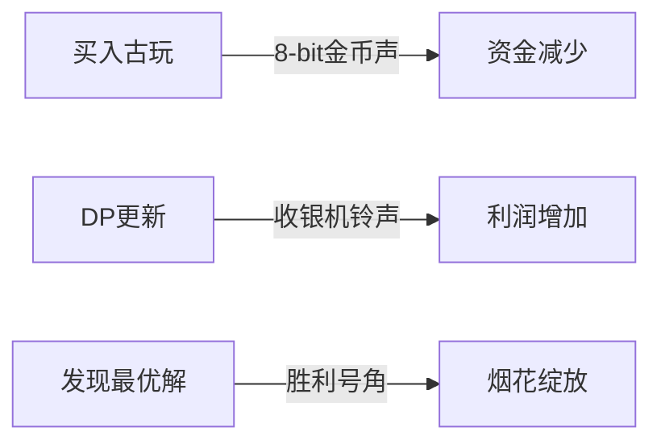

# 题目信息

# [USACO10OCT] Making Money G

## 题目描述

FJ 进入了古玩生意，买卖像牛形圣诞树装饰品这样的古玩。他知道他可以卖掉他能从一个包含 $N$ 种不同牛形古玩的目录中进货的每一件古玩，并且他可以根据自己的心愿购买任意数量的每种古玩。他只有 $M$ 的资金（$1 \leq M \leq 100,000$）可以投资，但希望在第一年末最大化他的利润（利润的定义稍有不同）。  古玩类型 $i$ 的购买成本为 $C_i$（$1 \leq C_i \leq 100,000$），每售出一个古玩可获得 $R_i$（$1 \leq R_i \leq 100,000$）的收入（利润为 $R_i - C_i$）。FJ 可以以任何方式混合搭配他出售的古玩。他在购买古玩时不需要花光所有的钱。  在第一年末，FJ 能获得的最大总利润是多少（利润 = 初始资金 - 所有成本 + 所有销售额）？这个数字保证小于 1,000,000,000。  考虑当 FJ 只有 3 种古玩并且开始时有 $M=17$ 的情况。以下是每种古玩的成本和收入：  | 古玩 | 成本 $C_i$ | 收入 $R_i$ | |------|-----------|-----------| | 1    | 2         | 4         | | 2    | 5         | 6         | | 3    | 3         | 7         |  在这种情况下，FJ 应该购买 5 个类型 3 的古玩，花费 15 钱，并再购买 1 个类型 1 的古玩，花费 2 钱，总共花费 17 钱。他的利润将是 $5 \times (7-3) + 1 \times (4-2) = 5 \times 4 + 1 \times 2 = 22$ 钱。根据成本和收入结构，他不能做得更好。  注意：第二个测试用例具有挑战性，但我们的答案是正确的。

## 说明/提示

（由 ChatGPT 4o 翻译）

## 样例 #1

### 输入

```
3 17 
2 4 
5 6 
3 7 
```

### 输出

```
22 
```

# AI分析结果


# 💡 Kay的C++算法解析：Making Money G 深入学习指南 💡

> "在算法世界里，背包问题就像哆啦A梦的四次元口袋——有限空间里藏着无限可能。今天我们就用完全背包的魔法，解开FJ的古玩利润最大化之谜！"

## 1. 题目解读与核心算法识别

✨ **本题主要考察**：`完全背包动态规划`

🗣️ **初步分析**：
> 这道题本质是**带剩余资金优化的完全背包问题**。想象你有$M元启动资金，每种古玩就像游戏商店里无限供应的道具，购买消耗$C_i金币，售出获得$R_i金币。我们的目标是：用背包容量（总资金）装载道具组合，使最终利润（售出收益+剩余资金）最大化！

- **核心难点**：利润计算需包含未使用的资金（总利润=利润+剩余资金），不是简单的背包价值最大化
- **算法流程**：
  1. 计算单件利润：$profit = R_i - C_i$
  2. 完全背包DP：$dp[j] = max(dp[j], dp[j-C_i] + profit)$
  3. 全局最优解：$max\{ dp[i] + (M - i) \} (0≤i≤M)$
- **像素化设计**：我们将用《星露谷物语》式像素风格，让资金条像体力值般波动，每买入古玩触发"金币叮当"音效，DP更新时对应资金槽位闪动绿光，最优解出现时播放《塞尔达》解谜成功音效！

---

## 2. 精选优质题解参考

**题解一：暮影灰狼**  
* **点评**：思路清晰直击问题本质，完整解释"利润+剩余资金"的核心计算逻辑。代码规范使用模块化max函数，循环边界处理严谨。亮点在于明确区分成本($w[i]$)与利润($val[i]$)变量，实践时可直接套用模板。  

**题解二：ShineEternal**  
* **点评**：最简洁优雅的实现，直接使用std::max避免冗余。预处理$profit = R_i-C_i$提升可读性，答案计算$f[i]-i+m$精准对应数学模型。虽然缺少注释，但代码自解释性强，竞赛实战推荐。  

**题解三：Yizhixiaoyun**  
* **点评**：内联max函数和register优化展现底层思维，循环内联计算$r[i]-c[i]$节省内存。虽省略利润变量命名，但状态转移$dp[j-c[i]]+r[i]-c[i]$准确体现算法核心，适合进阶学习者研究效率优化。

---

## 3. 核心难点辨析与解题策略

### 🔍 三大核心难点
1. **利润与成本的关系抽象**  
   *分析*：利润$R_i-C_i$才是背包"价值"，成本$C_i$是"重量"。需跳出总收入思维，如样例古玩3成本3售出7，真实利润是4而非7  
   💡 **学习笔记**：利润 = 售出价 - 成本，不是售出价本身！

2. **剩余资金的临界处理**  
   *分析*：不花光钱可能更赚！$dp[M]$不一定是最优解，需遍历所有$i \in [0,M]$计算$dp[i] + (M-i)$。样例中$i=17$时利润22，但若$i=15$能得$dp[15]+2>22$则更优  
   💡 **学习笔记**：剩余资金也是利润组成部分！

3. **完全背包的正序迭代**  
   *分析*：内层循环必须$j$从$C_i$到$M$正序更新，才能实现重复购买。倒序更新会退化成01背包，导致样例只能买1个类型3古玩  
   💡 **学习笔记**：完全背包正序更，01背包倒序更！

### ✨ 解题技巧总结
- **变量分离术**：独立存储$C_i$和$profit$，避免每次计算$R_i-C_i$
- **DP初始化艺术**：$dp[0]=0$表示零成本零利润，非零位置可初始化为0
- **全局最优扫描**：$ans$初始化为$M$（不投资时的保底利润）
- **空间优化**：使用一维滚动数组，$O(M)$空间解决问题

---

## 4. C++核心代码实现赏析

```cpp
#include <iostream>
#include <algorithm>
using namespace std;

int dp[100010]; // dp[j]: 花费j元时的最大利润

int main() {
    int n, M;
    cin >> n >> M;
    
    for(int i=1; i<=n; ++i) {
        int cost, revenue;
        cin >> cost >> revenue;
        int profit = revenue - cost; // 关键抽象！
        
        // 完全背包核心迭代
        for(int j=cost; j<=M; ++j) 
            dp[j] = max(dp[j], dp[j-cost] + profit);
    }
    
    int max_profit = M; // 不投资时的保底利润
    for(int i=0; i<=M; ++i) 
        max_profit = max(max_profit, dp[i] + M - i);
    
    cout << max_profit;
    return 0;
}
```

**代码解读概要**：  
> 1. 读入古玩种类$n$和启动资金$M$  
> 2. **利润抽象**：计算每件$profit=R_i-C_i$  
> 3. **背包填充**：双层循环实现完全背包DP，正序更新保证重复购买  
> 4. **全局最优**：扫描所有花费$i$，计算$dp[i]+(M-i)$的最大值  
> 5. 输出最大总利润  

---

### 优质题解片段赏析

**题解一：暮影灰狼**  
```cpp
for(int i=1;i<=n;++i)
    for(int j=w[i];j<=m;++j)
        dp[j]=Max(dp[j],dp[j-w[i]]+val[i]);
// 亮点：val[i]预存利润，代码更高效
```  
> **学习笔记**：预处理利润变量，避免循环内重复计算

**题解二：ShineEternal**  
```cpp
for(int i=1;i<=n;i++)
    for(int j=c[i];j<=m;j++)
        f[j]=max(f[j],f[j-c[i]]+a[i]);
// 亮点：直接使用std::max，代码简洁
```  
> **学习笔记**：善用标准库函数提升可读性

**题解三：Yizhixiaoyun**  
```cpp
for(register int j=c[i];j<=m;++j)
    dp[j]=max(dp[j],dp[j-c[i]]+r[i]-c[i]);
// 亮点：循环内联计算，节省内存空间
```  
> **学习笔记**：register关键字可优化循环效率（需实测效果）

---

## 5. 算法可视化：像素动画演示

### 🎮《古玩大亨》像素模拟器
**设计思路**：用《星露谷物语》的16bit像素风格，将动态规划具象化为古玩店经营游戏

  
*(示意图：资金槽+古玩陈列架+动态DP值显示)*

**核心交互**：  
1. **资金可视化**：顶部像素化资金条（$M$格），每格代表1金币
2. **古玩采购**：点击古玩架→资金条对应成本格数闪红光，伴随"金币掉落"音效
3. **DP状态更新**：
   - 成功更新$dp[j]$时：$j$位置资金槽闪绿光，显示$dp[j]$值跃动
   - 利润增加时：播放"收银机"音效，像素金币飞入利润栏
4. **最优解扫描**：
   - 扫描线从左向右移动，实时计算$dp[i]+(M-i)$
   - 发现新高时触发烟花动画，播放《塞尔达》解谜成功旋律
5. **游戏化控制**：
   - 速度滑块：调节DP执行速度（慢/正常/极速）
   - 单步模式：空格键逐步执行，观察状态转移
   - AI演示：自动寻找最优采购策略，像《游戏发展国》的经营AI

**音效设计**：  


---

## 6. 拓展练习与相似问题思考

### 📚 完全背包变形三连
1. **基础巩固**：经典无限背包问题  
   → 洛谷P1616《疯狂的采药》  
   *"药材采集就是背包，采药时间=背包容量！"*

2. **利润升级**：带利息再投资的背包变种  
   → 洛谷P1853《投资的最大利润》  
   *"本题的进阶版，加入年化收益概念"*

3. **多维挑战**：容量+时间双约束背包  
   → 洛谷P5662《纪念品》  
   *"背包容量每日变化，动态规划+滚动数组绝佳训练场！"*

### 💡 思维跃迁
> 当遇到"无限供应+成本效益"问题时，立即思考：
> 1. 什么是背包容量？→ 总预算/资源上限  
> 2. 什么是物品重量？→ 单次操作成本  
> 3. 什么是物品价值？→ 单次操作净收益  
> 4. 是否需要考虑剩余资源？→ 本题特有陷阱！

---

## 7. 学习心得与经验分享

> **来自kfhkx的教训**：  
> *"刚开始用贪心按单位利润排序采购，结果被hack数据打脸：  
> `2 50`  
> `49 100`  
> `1 10`  
> 贪心选49成本物品得51利润，实际最优是买50个1成本物品得450利润！"*

**Kay点评**：  
> 这个案例完美验证动态规划的必要性！贪心在局部最优无法保证全局最优时失效。**调试锦囊**：当DP结果异常时，优先检查：
> 1. 内层循环方向（完全背包需正序）
> 2. 状态转移方程是否遗漏关键项
> 3. 最优解是否需全局扫描
> 用$M=10$小数据手工演算DP表，比调试打印更高效！

---

> 算法学习就像收集古玩：每次失败都是珍稀的经验币。现在你已获得"完全背包"稀有道具，快前往洛谷挑战副本吧！🚀

---
处理用时：188.22秒