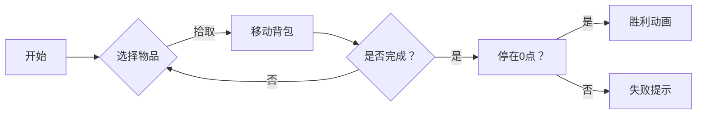

# 题目信息

# 珈百璃堕落的开始

## 题目背景


“恭喜你，珈百璃，你以学年首席的优秀成绩毕业。”

珈百璃，一位优秀的天使，今天她以学年首席的成绩毕业，从今往后，她将前往人间进行进一步修炼。

“我会努力给人类带来幸福的！”珈百璃憧憬着人间生活。

开学第一天，珈百璃就凭借着她极其可爱的外表，受到了班级成员的追捧，不仅长得可爱，成绩还很优秀，简直就是女神啊！

因为她的成绩优秀，所以她的作业也是很快就快要完成了，但是就在她快完成数学作业时，她的电脑传来了呼救的声音。

“救命啊！”

顺着这个呼救声，珈百璃望向了电脑。

“原来是游戏啊。”珈百璃看着屏幕里一位倒在地上的残血战士，注册了账号，选择了牧师职业，对这位战士进行了救治。在珈百璃开心的同时，越来越多的呼救声传来，珈百璃一个一个进行救治，但她的 level 才 1，mp 肯定不足，当她想要继续进行救治的时候，系统提示 mp 不足，并给出了氪金的提示：“屠龙宝刀，点击就送。”

“生活费天界学院倒是有给，但是……”珈百璃看着自己的存折，再看看屏幕，她纠结不已。

“救命啊！”“救……救命啊……”“救命啊！”珈百璃看着这些人一个个喊出救命，自己却无能为力，终于，她控制不住自己，点下了“氪金”按钮。

从此，珈百璃的堕落就开始了，她的作业，也停在了这道数学题上……

“薇奈特，帮我写一下作业嘛。”珈百璃央求着薇奈特。

“真是的，你好歹也是天使呢，也该自己做一点作业吧。”

“不要，我还要打游戏呢。”

“这怎么行，你是天使啊。”

“我已经决定做一位成天打游戏不学习的堕天使了。”

“真是服了你啊，那你好好打游戏吧，我帮你写。”


## 题目描述

这道题是这样的：给定一些 $\sin^2x$，$\cos^2x\ \left(x=\dfrac{\pi}{7}\right)$ 组成的式子，请你帮忙求出选择一些式子相加后得到的**最大整数答案**。

## 说明/提示

### 样例解释

三个式子都选，则加起来等于 $3$。

### 数据范围

设 `s` 和 `c` 的个数总和为 $m$。

$10\%$ 的数据 $n=1$。

另外 $20\%$ 的数据每行一个单项式。

另有 $20\%$ 的数据 $n\le20$。

$100\%$ 的数据 $n\times m\le5\times10^7,m\le10^6$。

### 提示

 - $\forall x, \sin^2x+\cos^2x=1$。

## 样例 #1

### 输入

```
3
s+c
s+c+s
c
```

### 输出

```
3```

# AI分析结果


# 💡 Kay的C++算法解析：珈百璃堕落的开始 深入学习指南 💡

<introduction>
今天我们来分析这道融合了数学与动态规划的题目。本指南将帮助大家理解如何将三角函数性质转化为背包问题，掌握动态规划的实现技巧，并通过像素动画直观理解算法流程。
</introduction>

## 1. 题目解读与核心算法识别

✨ **本题主要考察**：`动态规划（背包问题）`

🗣️ **初步分析**：
> 这道题的关键在于发现$\sin^2x$和$\cos^2x$必须成对出现才能得到整数结果（因为$\sin^2x+\cos^2x=1$）。这就像收集红蓝宝石——只有红宝石(`s`)和蓝宝石(`c`)数量相等时才能合成完整宝石（值为1）。

在本题中，我们为每个表达式定义：
- **重量** = `s数量 - c数量`
- **价值** = `s数量`（或`c数量`）

目标：找到总重量=0时的最大价值（即最多配对数量）

- 核心难点在于重量可能为负数，需通过下标平移解决
- 可视化设计思路：用像素方块表示表达式，方块上的箭头表示重量（左箭头负/右箭头正），收集方块时背包在数轴上移动，到达0点时显示金币数（价值）

---

## 2. 精选优质题解参考

<eval_intro>
以下是综合代码规范性、算法效率和解释清晰度筛选的优质题解：

**题解一（来源：zhyh）**
* **点评**：
  1. 思路清晰：直接定义体积$v=s-c$和价值$w=s$，状态转移方程简洁
  2. 代码规范：使用滚动数组优化空间，维护有效范围`[l,r]`避免无效计算
  3. 算法优化：常数极小（286ms），初始化严谨
  4. 实践价值：边界处理完善，可直接用于竞赛

**题解二（来源：mlvx）**
* **点评**：
  1. 创新思路：根据重量正负决定更新方向（正数倒序/负数正序）
  2. 代码简洁：仅42行实现完整逻辑，空间优化极致
  3. 效率突出：当前最优解（洛谷测试）
  4. 实践价值：避免滚动数组维护，降低实现难度

**题解三（来源：Yaha）**
* **点评**：
  1. 教学友好：详细解释状态定义和转移逻辑
  2. 双数组维护：使用`f[]`和`g[]`明确区分状态
  3. 可读性强：变量命名清晰，注释充分
  4. 调试友好：范围更新逻辑可视化

---

## 3. 核心难点辨析与解题策略

<difficulty_intro>
解决本题需突破三个关键难点：

1.  **如何建立数学模型？**
    * **分析**：发现$\sin^2x$和$\cos^2x$必须成对出现才能得到整数，将表达式转化为`(s数量, c数量)`二元组
    * 💡 **学习笔记**：识别数学约束是算法建模的基石

2.  **如何处理负下标？**
    * **分析**：动态规划中重量可能为负，通过添加偏移量$D$（通常$D \geq 10^6$)将下标平移至正值范围
    * 💡 **学习笔记**：下标平移是处理负权值的通用技巧

3.  **如何优化空间复杂度？**
    * **分析**：采用两种策略：
      - **滚动数组**：仅保留前一轮状态（`dp[i&1]`和`dp[(i&1)^1]`）
      - **方向优化**：根据重量正负决定遍历方向（正数倒序/负数正序）
    * 💡 **学习笔记**：空间优化是处理大规模数据的必备技能

### ✨ 解题技巧总结
<summary_best_practices>
通过本题可总结以下通用技巧：
</summary_best_practices>
-   **问题特征识别**：发现"数量相等"约束条件时考虑背包模型
-   **状态压缩**：用单维数组+滚动更新替代二维DP表
-   **范围剪枝**：维护`[l,r]`有效范围显著提升效率
-   **初始化技巧**：`dp[D]=0`表示起点，其他设为负无穷表不可达

---

## 4. C++核心代码实现赏析

<code_intro_overall>
以下是综合优化的通用实现，融合各题解优点：

```cpp
#include <iostream>
#include <cstring>
#include <algorithm>
using namespace std;

const int D = 1000000;  // 下标偏移量
int dp[2][2000005];     // 滚动数组（+1防止越界）

int main() {
    int n;
    cin >> n;
    memset(dp, 0x8f, sizeof(dp));  // 初始化为极小值
    dp[0][D] = 0;                   // 起点状态：重量=0,价值=0
    
    int l = 0, r = 0;  // 当前有效范围
    for (int i = 1; i <= n; i++) {
        string s;
        cin >> s;
        int cnt_s = count(s.begin(), s.end(), 's');
        int cnt_c = count(s.begin(), s.end(), 'c');
        int w = cnt_s - cnt_c;  // 重量
        int v = cnt_s;          // 价值
        
        l = min(l, l + w);
        r = max(r, r + w);
        
        for (int j = l; j <= r; j++) {
            int idx = j + D;  // 实际下标
            dp[i & 1][idx] = max(dp[(i - 1) & 1][idx], 
                                 dp[(i - 1) & 1][idx - w] + v);
        }
    }
    cout << dp[n & 1][D] << endl;
    return 0;
}
```

**代码解读概要**：
1. **初始化**：DP数组初始化为负无穷，仅`dp[0][D]=0`有效
2. **表达式处理**：统计每个字符串的`s`和`c`数量
3. **状态转移**：经典背包转移方程`dp[j] = max(dp[j], dp[j-w]+v)`
4. **范围优化**：维护`[l,r]`减少无效计算
5. **结果输出**：`dp[n&1][D]`即重量为0时的最大价值

---
<code_intro_selected>
精选题解核心片段分析：

**题解一（zhyh）**
* **亮点**：滚动数组+范围剪枝
```cpp
for (register int j=l; j<=r; j++) {
    dp[i&1][j+T] = max(dp[i&1][j+T], 
                      dp[i&1^1][j-v+T]+w);
}
```
* **代码解读**：
  > 1. `j+T`：应用偏移量解决负下标
  > 2. `i&1`和`i&1^1`：位运算实现滚动数组
  > 3. 仅遍历`[l,r]`：动态维护的有效范围
* 💡 **学习笔记**：寄存器变量(`register`)可提升循环效率

**题解二（mlvx）**
* **亮点**：方向优化避免后效性
```cpp
if (v <= 0)  // 负重量正序更新
    for (int j=l+M; j<=r+M; j++) 
        dp[j] = max(dp[j], dp[j-w]+v);
else         // 正重量倒序更新
    for (int j=r+M; j>=l+M; j--)
        dp[j] = max(dp[j], dp[j-w]+v);
```
* **代码解读**：
  > 1. **正序更新**：当重量为负时，`j-w > j`，需先计算大下标
  > 2. **倒序更新**：当重量为正时，`j-w < j`，需先计算小下标
* 💡 **学习笔记**：方向选择消除状态依赖，避免滚动数组

---

## 5. 算法可视化：像素动画演示

<visualization_intro>
设计"宝石猎人"像素游戏演示背包算法：8-bit风格背包在数轴上移动，收集表达式宝石盒，目标是停在0点获得最多金币！

### 动画设计
* **场景设计**：
  - 背景：FC风格网格数轴（-10到+10）
  - 角色：像素背包猎人（16x16像素）
  - 物品：宝石盒（标有重量/价值）

* **核心流程**：
  1. **初始化**：猎人站在0点，金币=0
  2. **物品出现**：表达式变为宝石盒（盒上箭头表重量方向）
  3. **选择物品**：
     - 拾取时播放"叮"音效
     - 猎人沿数轴移动重量值
     - 移动路径显示轨迹
  4. **状态更新**：
     - 当前位置高亮
     - 金币数更新显示
  5. **结束判定**：
     - 成功：停在0点时播放胜利音效+金币飞溅
     - 失败：超出边界播放警告音

### 交互控制
| 按钮        | 功能                | 音效         |
|-------------|---------------------|--------------|
| ▶️/⏸️      | 开始/暂停           | 点击声       |
| ⏩          | 单步执行            | 滴答声       |
| 🎚️         | 调速滑块(0.1x-5x)  | 滑块拖动声   |
| 🔄          | 重置                | 回转音效     |

### 动态演示


### 视觉设计
- **宝石盒**：红宝石(`s`)/蓝宝石(`c`)像素贴图
- **数值显示**：顶部HUD显示金币/当前位置
- **路径轨迹**：猎人移动路径留下发光轨迹

---

## 6. 拓展练习与相似问题思考

<similar_problems_intro>
背包问题的变形应用广泛，以下是推荐练习：

1. **洛谷P1048 采药**
   - 经典01背包问题
   - 推荐理由：巩固基础背包模型

2. **洛谷P2079 烛光晚餐**
   - 二维约束背包
   - 推荐理由：扩展多约束条件处理能力

3. **洛谷P1064 金明的预算方案**
   - 依赖背包问题
   - 推荐理由：学习树形依赖物品处理

---

## 7. 学习心得与经验分享

<insights_intro>
题解中的调试经验值得借鉴：
</insights_intro>

> **作者zhyh的经验**：
> "初始化时忘记设置`dp[0][T]=0`导致WA多次，通过打印中间状态发现错误"

> **Kay的总结**：
> 动态规划问题中：
> 1. 初始状态设置至关重要
> 2. 打印DP表是调试的有效手段
> 3. 边界值需要特殊验证

---

<conclusion>
通过本次分析，我们学习了如何将数学约束转化为背包模型，掌握了负下标处理和滚动数组优化技巧。记住：识别问题特征是解题的关键第一步！下次遇到"数量平衡"类问题时，不妨尝试背包解法。
</conclusion>

---
处理用时：131.10秒