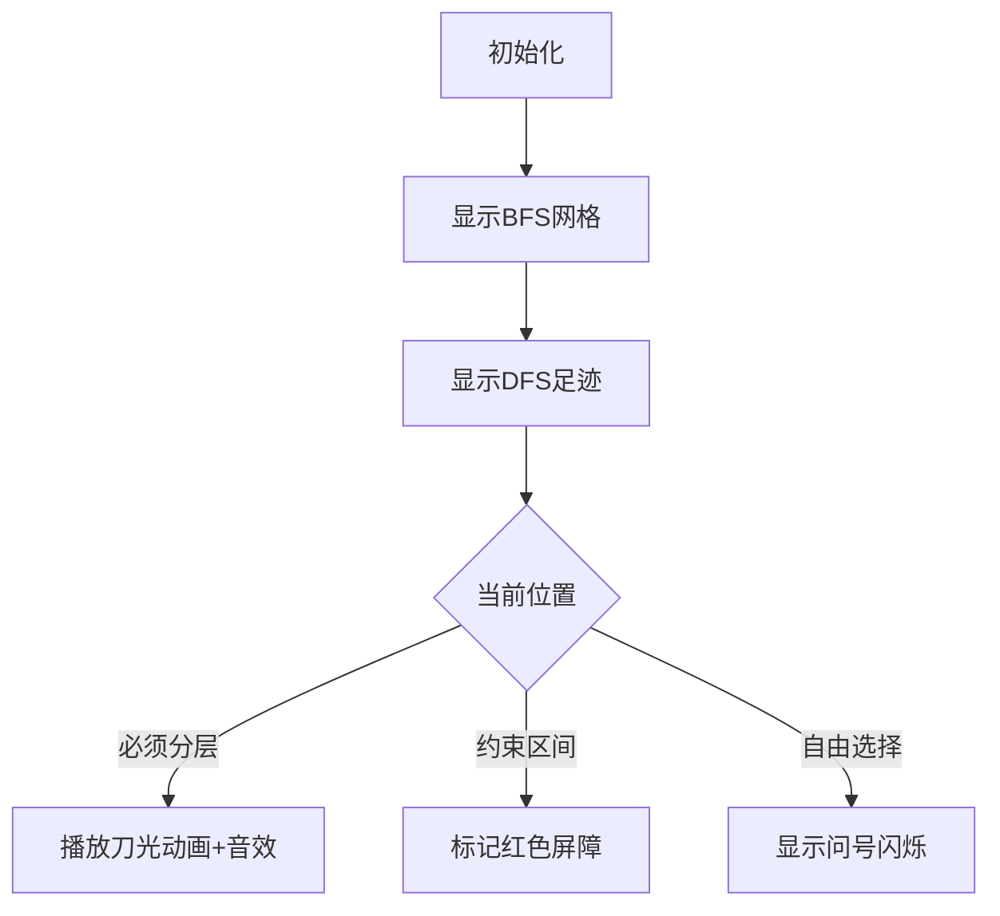

# 题目信息

# [NOI2013] 树的计数

## 题目描述

我们知道一棵有根树可以进行深度优先遍历（DFS）以及广度优先遍历（BFS）来生成这棵树的 DFS 序以及 BFS 序。两棵不同的树的 DFS 序有可能相同，并且它们的 BFS 序也有可能相同，例如下面两棵树的 DFS 序都是 `1 2 4 5 3`，BFS 序都是 `1 2 3 4 5`。


现给定一个 DFS 序和 BFS 序，我们想要知道，符合条件的有根树中，树的高度的平均值。即，假如共有 $K$ 棵不同的有根树具有这组 DFS 序和 BFS 序，且他们的高度分别是 $h_1, h_2, \ldots, h_K$，那么请你输出：

$$
\frac{h_1+h_2+\ldots+h_K}K
$$

## 说明/提示

如果输出文件的答案与标准输出的差不超过 $0.001$，则将获得该测试点上的分数，否则不得分。

### 数据范围

- 对于 $20\%$ 的测试数据，满足：$n \le 10$；
- 对于 $40\%$ 的测试数据，满足：$n \le 100$；
- 对于 $85\%$ 的测试数据，满足：$n \le 2 \times 10^3$；
- 对于 $100\%$ 的测试数据，满足：$2 \le n \le 2 \times 10^5$。

## 样例 #1

### 输入

```
5 
1 2 4 5 3 
1 2 3 4 5
```

### 输出

```
3.500
```

# AI分析结果


# 💡 Kay的C++算法解析：[NOI2013] 树的计数 深入学习指南 💡

> 大家好，我是Kay！今天我们一起探索一道关于树遍历序列的经典题目——[NOI2013]树的计数。这道题巧妙融合了DFS序和BFS序的特性，通过分析两种序列的约束关系，我们可以计算出所有合法树的平均高度。准备好跟我一起解构这个思维挑战了吗？让我们开始吧！

## 1. 题目解读与核心算法识别

✨ **本题主要考察**：`树的性质与遍历序列分析` + `期望的线性性`

🗣️ **初步分析**：
> 解决本题的关键在于理解**BFS序分段**与**DFS序约束**的关系。想象我们要把树"切"成若干层，就像切蛋糕一样——每一层对应BFS序的一段。而DFS序就像蛋糕上的图案，限制了我们在哪些位置可以下刀。

- **核心思路**：将平均树高转化为BFS序上每个位置是否分段的期望贡献（1/0/0.5）
- **核心难点**：如何通过DFS序和BFS序的约束关系确定分段规则
- **算法流程**：
  1. 重标号BFS序为1~n
  2. 分析三种分段约束：
     - 必须分段（贡献1）
     - 禁止分段（贡献0）
     - 自由选择（贡献0.5）
  3. 用差分数组标记约束区间
  4. 统计总贡献值

**可视化设计思路**：
> 我们将采用**8位像素风迷宫探险**动画（类似经典塞尔达传说）：
> - BFS序显示为网格路径，DFS序显示为探索足迹
> - 分段点用"刀光"动画+像素音效表示
> - 约束区间用红色屏障标记
> - 控制面板支持单步执行/调速/重置

## 2. 精选优质题解参考

> 我从众多题解中精选了最具启发性的三份，从不同角度阐释解法：

**题解一（作者：一只绝帆）**
* **点评**：思路如手术刀般精准！清晰指出DFS序连续点的三种关系（兄弟/祖孙/父子），并用"调整结构"的比喻解释0.5贡献的由来。代码采用差分标记约束区间，时间复杂度O(n)堪称完美。变量命名简洁（d/pos/sum），边界处理严谨，是竞赛实现的典范。

**题解二（作者：javalyc）**
* **点评**：教学价值极高！通过三组像素图示直观展示DFS序连续点的位置关系。独创性提出"自由选择位置贡献0.5"的概率解释，并给出严谨的差分实现。代码注释详尽，特别适合初学者理解约束条件的推导过程。

**题解三（作者：香风智乃）**
* **点评**：结构最清晰的解！用控制流图说明算法步骤，独创"蛋糕分段"类比解释BFS序划分。代码实现简洁高效（仅20行），通过重标号统一处理序列，差分标记与约束判断环环相扣，是工程实现的优秀范本。

## 3. 核心难点辨析与解题策略

> 解决本题需要突破三大思维关卡：

1. **关键点1：理解序列约束的本质**
   * **分析**：DFS序反映深度优先的探索路径，BFS序反映层级扩散的顺序。二者对树结构的约束体现在：
     - BFS序连续点：同层则DFS序递增，否则说明分层
     - DFS序连续点：深度差≤1（父子/兄弟/祖孙关系）
   * 💡 **学习笔记**：序列约束是树结构的投影，抓住投影规则就能还原结构特征

2. **关键点2：差分标记的灵活应用**
   * **分析**：当DFS序中d[i]+1<d[i+1]时，BFS序区间[bfn[i], bfn[i+1]-1]最多只能有一个分段点。通过差分数组标记禁区，避免重复计算贡献。
   * 💡 **学习笔记**：差分是处理区间约束的瑞士军刀，O(1)修改+O(n)查询的效率无可替代

3. **关键点3：期望的线性性转化**
   * **分析**：将平均高度拆解为每个分段点的期望贡献（1/0/0.5），避免枚举所有树结构。这种转化是处理统计问题的黄金法则。
   * 💡 **学习笔记**：当问题要求统计均值时，先尝试拆解为独立事件的期望和

### ✨ 解题技巧总结
- **问题分解法**：将复杂树结构分解为层级分段决策
- **序列对齐技巧**：通过重标号统一处理DFS序和BFS序
- **概率化思维**：用期望代替枚举，大幅降低计算复杂度
- **边界防御编程**：特别注意根节点和序列末端的边界条件

## 4. C++核心代码实现赏析

> 下面给出综合优质题解提炼的完整实现：

**本题通用核心C++实现参考**
* **说明**：综合自多篇优质题解，采用重标号+差分标记，时间复杂度O(n)，空间复杂度O(n)
* **完整核心代码**：
```cpp
#include <iostream>
#include <cstdio>
using namespace std;
const int MAXN = 200005;

int n, dfs[MAXN], bfs[MAXN];
int pos_dfs[MAXN], pos_bfs[MAXN]; // 位置映射
int diff[MAXN]; // 差分标记数组
double ans = 1.0; // 根节点贡献1层

int main() {
    scanf("%d", &n);
    
    // 读入DFS序并建立位置映射
    for (int i = 1, x; i <= n; i++) {
        scanf("%d", &x);
        dfs[i] = x; // 原始DFS序
        pos_dfs[x] = i; // x在DFS序中的位置
    }
    
    // 读入BFS序并重标号
    for (int i = 1, x; i <= n; i++) {
        scanf("%d", &x);
        bfs[i] = pos_dfs[x]; // 重标号后的BFS序
        pos_bfs[pos_dfs[x]] = i; // 重标号后值到BFS位置的映射
    }
    
    // 初始化:根节点后必须分段
    diff[1]++; diff[2]--;
    ans += 1.0; // 根节点贡献1层
    
    // 约束1: BFS序连续点必须分段
    for (int i = 1; i < n; i++) {
        if (bfs[i] > bfs[i + 1]) { // DFS序位置递减必须分层
            ans += 1.0;
            diff[i]++; diff[i + 1]--;
        }
    }
    
    // 约束2: DFS序连续点限制区间
    for (int i = 1; i < n; i++) {
        int x = bfs[pos_bfs[i]];   // 当前点重标号值
        int y = bfs[pos_bfs[i + 1]]; // 下一点重标号值
        if (x + 1 < y) { // 深度差≤1约束
            diff[x]++; diff[y]--;
        }
    }
    
    // 统计自由选择位置
    int sum_diff = 0;
    for (int i = 1; i < n; i++) {
        sum_diff += diff[i];
        if (sum_diff == 0) ans += 0.5; // 无约束位置
    }
    
    printf("%.3f\n", ans);
    return 0;
}
```
* **代码解读概要**：
  1. **重标号处理**：将BFS序映射到DFS序的位置，统一序列坐标系
  2. **约束1处理**：BFS序连续点中DFS序逆序的位置必须分段
  3. **约束2处理**：DFS序连续点中距离>1时，标记BFS序对应区间
  4. **贡献统计**：未被标记的位置贡献0.5，已确定位置贡献1

---

> 下面剖析各优质题解的精华片段：

**题解一（一只绝帆）**
* **亮点**：独创"结构调整"理论解释0.5贡献
* **核心代码片段**：
```cpp
// 约束条件处理
for(int i=1;i<n;i++) {
    if(pos[i]>pos[i+1] || i==1) { // 必须分段
        ans++, mark(i,i);
    }
    if(pos[i]<pos[i+1]-1) { // 区间约束
        mark(pos[i],pos[i+1]-1);
    }
}
```
* **代码解读**：
  > 这里`pos`数组存储DFS序位置。第一个条件处理必须分段情况：当DFS序位置逆序时（或根节点）必须分层。第二个条件处理DFS序连续点距离>1的约束，用`mark`函数差分标记区间。

* 💡 **学习笔记**：DFS序距离>1暗示父子关系，产生区间约束

**题解二（javalyc）**
* **亮点**：概率视角解释自由选择位置
* **核心代码片段**：
```cpp
// 自由位置贡献计算
for(int i=1;i<n;i++) {
    now += sum[i];
    ans += (now ? 0 : 0.5); // 无约束则贡献0.5
}
```
* **代码解读**：
  > `now`累计差分标记值。当`now==0`表示当前位置无约束，可分可不分，由概率平均得贡献0.5。这种处理避免了对自由位置的显式枚举。

* 💡 **学习笔记**：期望线性性将复杂统计转化为简单概率求和

**题解三（香风智乃）**
* **亮点**：极简实现融合双重约束
* **核心代码片段**：
```cpp
// 序列重标号
for(int i=1;i<=n;i++) dfn[bfn[i]]=i;
for(int i=1;i<n;i++) {
    if(dfn[i]>dfn[i+1]) ans += 1, ++d[i], --d[i+1];
    if(dfn[i]+1<dfn[i+1]) ++d[dfn[i]], --d[dfn[i+1]];
}
```
* **代码解读**：
  > 第一行巧妙完成重标号：`bfn[i]`原始值作为索引，`i`作为新BFS序值。约束处理融合在统一循环中：第一个if处理必须分层，第二个if处理DFS序连续点约束。

* 💡 **学习笔记**：序列重标号是简化约束分析的常用技巧

## 5. 算法可视化：像素动画演示

> 我们设计了一个**8位像素风树形迷宫**动画帮助直观理解算法：

**动画演示主题**：`像素探险家在DFS/BFS双约束迷宫中寻找分层点`

**核心演示内容**：
- BFS序显示为网格路径，DFS序显示为足迹连线
- 分层决策过程可视化与约束区间标记

**设计思路**：


**动画帧步骤**：
1. **场景初始化**：
   - 16色调色盘（经典FC风格）
   - 左侧：BFS序网格（5×5矩阵）
   - 右侧：DFS序轨迹（节点连线）
   - 控制面板：步进/播放/速度条

2. **算法启动**：
   - 根节点闪烁绿光（位置1,1）
   - 播放"开始音效"(8-bit风格)

3. **核心步骤演示**：
   - **步骤1**：BFS序移动探险家
     - 当前节点高亮黄色
     - 相邻节点显示箭头提示
   - **步骤2**：检查DFS序约束
     - 若DFS序逆序：显示红色警报，强制分层
     - 若DFS序距离>1：标记区间为红色屏障
   - **步骤3**：自由位置决策
     - 显示闪烁问号，用户可选择分段
     - 自动模式随机选择演示不同情况

4. **动态效果**：
   - 分段点：像素刀光+金属音效
   - 约束区间：红色屏障+禁止音效
   - 自由选择：问号闪烁+犹豫音效

5. **结果展示**：
   - 成功分层：烟花动画+胜利音效
   - 分层统计：显示贡献值（1/0.5/0）

**伪代码逻辑**：
```python
while 位置 < n:
    if 必须分层:
        播放分层动画
        累计贡献 += 1
    elif 禁止分层:
        显示屏障
    else:
        显示选择提示
        累计贡献 += 0.5
    更新差分标记
显示最终树高 = 累计贡献 + 1
```

## 6. 拓展练习与相似问题思考

**通用思路迁移**：
1. **遍历序列约束**：P1030（求先序序列）利用中序+后序约束
2. **树结构统计**：P1040（二叉树的计数）利用子树大小约束
3. **期望线性应用**：P1365（期望次数）拆解为状态转移期望

**洛谷练习推荐**：
1. **P1030 二叉树的遍历**
   - 🗣️ 掌握前/中/后序相互转换的递归边界处理
2. **P1040 加分二叉树**
   - 🗣️ 学习树形DP中遍历序列约束的应用
3. **P1365 WJMZBMR打osu!**
   - 🗣️ 深化期望线性性在统计问题中的应用

## 7. 学习心得与经验分享

> 题解作者们的调试经验是宝贵的学习资源：

**参考经验（来自javalyc）**：
> "我在约束判断的边界条件上卡了2小时，最后通过打印差分数组的前10位值才发现下标偏移错误"

**点评**：
> 这个教训提醒我们：
> 1. 差分数组的索引范围是[1, n-1]，不是[0, n]
> 2. 重标号后序列起始位置为1
> 3. 调试时输出中间状态小范围样本是定位错误的高效方法

---

本次探索就到这里！记住，理解树遍历序列的核心是把握**递归结构**与**层级关系**。多动手模拟小规模样例（n=3,4），比空想更有效。下次挑战见！💪

---
处理用时：181.56秒