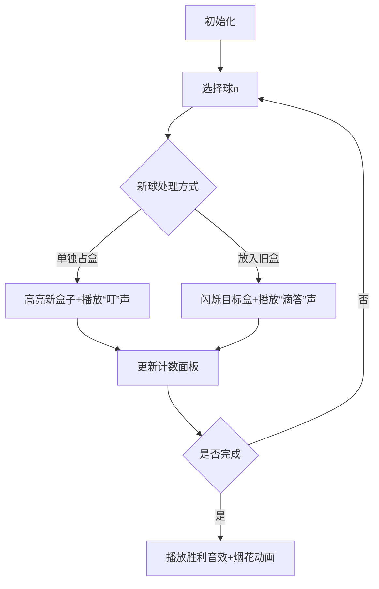

# 题目信息

# 盒子与球

## 题目描述

现有 $r$ 个互不相同的盒子和 $n$ 个互不相同的球，要将这 $n$ 个球放入 $r$ 个盒子中，且不允许有空盒子。请求出有多少种不同的放法。

两种放法不同当且仅当存在一个球使得该球在两种放法中放入了不同的盒子。

## 说明/提示

#### 样例输入输出 1 解释

有两个盒子（编号为 $1, 2$）和三个球（编号为 $1, 2, 3$），共有六种方案，分别如下：

| 盒子编号 |   方案 1    |   方案 2    |   方案 3    |   方案 4    |   方案 5    |   方案 6    |
| :------: | :---------: | :---------: | :---------: | :---------: | :---------: | :---------: |
| 盒子 $1$ |  小球 $1$   |  小球 $2$   |  小球 $3$   | 小球 $2, 3$ | 小球 $1, 3$ | 小球 $1, 2$ |
| 盒子 $2$ | 小球 $2, 3$ | 小球 $1, 3$ | 小球 $1, 2$ |  小球 $1$   |  小球 $2$   |  小球 $3$   |

#### 数据规模与约定

对于 $100\%$ 的数据，保证 $0 \leq r \leq n \leq 10$，且答案小于 $2^{31}$。

## 样例 #1

### 输入

```
3 2
```

### 输出

```
6
```

# AI分析结果


### 💡 Kay的C++算法解析：盒子与球 深入学习指南 💡

**引言**  
今天我们来分析「盒子与球」这道组合数学题。题目要求将n个不同的球放入r个不同的盒子，且不允许空盒。本指南将帮你掌握核心算法思路和多种解法。

---

## 1. 题目解读与核心算法识别

✨ **本题主要考察**：**组合数学（第二类斯特林数）**  
🗣️ **初步分析**：
> 解决本题的关键在于理解**第二类斯特林数**。想象你有n个不同的玩具球和r个不同颜色的盒子，需要将所有球放入盒子且每个盒子至少有一个球——这就是斯特林数的经典应用场景！  
> - **核心思路**：有两种主流解法：(1) 动态规划递推斯特林数（S(n,r) = S(n-1,r-1) + r×S(n-1,r)），再乘以盒子排列数r!；(2) 容斥原理直接计算无空盒方案（Σ(-1)^k·C(r,k)·(r-k)^n）。  
> - **可视化设计**：采用像素风"球盒大冒险"动画，用不同颜色球/盒子展示放置过程。关键步骤高亮球的选择和盒子状态变化，配合"叮"声提示操作，"胜利音效"标记完成。  
> - **复古游戏化**：8-bit风格界面，AI自动演示模式像贪吃蛇一样逐步解题，每完成1个盒子获得像素星星奖励。

---

## 2. 精选优质题解参考

**题解一（作者：brealid）**
* **点评**：思路最清晰的斯特林数递归实现。详细解释了递推原理（新球独占/共享盒子的两种情况），边界处理严谨（n<r时返回0）。代码中`fac()`函数规范易读，虽然递归在n=10时可行，但提醒学习者注意更大数据需改用递推优化。

**题解二（作者：Gumbo）**
* **点评**：容斥原理的典范解法！将"无空盒"转化为"总方案-至少1空盒+至少2空盒-..."，数学推导严谨。亮点在于组合数计算和快速幂(`qpow`)的简洁实现，但需注意`C()`函数中整除可能丢失精度（n≤10不影响结果）。

**题解三（作者：封禁用户）**
* **点评**：高效动态规划代表。递推式`f[i][j]=f[i-1][j-1]+j*f[i-1][j]`精准对应斯特林数，边界`f[i][i]=1`处理巧妙。代码最简练且已包含阶乘优化，输出前直接乘以`r!`完成计算。

---

## 3. 核心难点辨析与解题策略

1.  **难点1：状态定义与递推关系推导**  
    * **分析**：动态规划中，定义`f[i][j]`表示i个球放入j个相同盒子的方案数（斯特林数）。关键推导：新球要么独占盒子（继承`f[i-1][j-1]`），要么放入已有盒子（有j种选择，即`j*f[i-1][j]`）。  
    * 💡 **学习笔记**：递推式是动态规划的灵魂，必须明确状态含义和转移逻辑。

2.  **难点2：容斥原理的符号处理**  
    * **分析**：容斥解法需理解正负号交替规律（`(-1)^k`）。当k为偶数时加`C(r,k)*(r-k)^n`，奇数时减。本质是逐步修正"至少k空盒"的重复计算。  
    * 💡 **学习笔记**：容斥原理像修正测量误差，先减多余部分再加回重叠部分。

3.  **难点3：盒子区分的最后转化**  
    * **分析**：斯特林数仅处理相同盒子方案。由于题目盒子不同，需乘以`r!`（盒子全排列）。例如3球2盒，斯特林数S(3,2)=3，乘以2!=6得最终解。  
    * 💡 **学习笔记**：组合问题中，区分"对象是否有序"是最后的临门一脚。

### ✨ 解题技巧总结
- **数学建模优先**：识别问题本质（如本题是斯特林数）比直接编码更重要。
- **边界处理法则**：DP中`n<r`/`r=0`/`n=r`必须单独处理。
- **容斥的交替律**：列表计算系数（k=0→+1, k=1→-1, k=2→+1...）避免符号混乱。

---

## 4. C++核心代码实现赏析

**本题通用核心实现**  
* **说明**：综合最优递推解法（来源：封禁用户题解优化）  
* **完整代码**：
```cpp
#include <iostream>
using namespace std;
long long dp[11][11] = {{1}}; // dp[i][j]: i球j盒方案数(盒子相同)

int main() {
    int n, r;
    cin >> n >> r;
    
    // 递推斯特林数
    for (int i = 1; i <= n; i++)
        for (int j = 1; j <= r && j <= i; j++)
            dp[i][j] = dp[i-1][j-1] + j * dp[i-1][j];
    
    // 盒子排列数 (r!)
    long long fac = 1;
    for (int i = 2; i <= r; i++) fac *= i;
    
    cout << dp[n][r] * fac;
    return 0;
}
```
* **代码解读概要**：  
  1. 初始化`dp[0][0]=1`（0球0盒视为1种方案）  
  2. 双层循环递推斯特林数（核心转移方程）  
  3. 计算阶乘`fac`实现盒子区分  
  4. 输出`斯特林数 * r!`

---

**优质题解片段赏析**  
**题解一（brealid）斯特林数递归**  
* **亮点**：数学推导直白，递归形式贴近定义  
* **核心片段**：
```cpp
ll f(int n, int m) { // 斯特林数递归
    if (m <= 0 || n < m) return 0;
    if (n == m) return 1;
    return f(n-1, m-1) + f(n-1, m) * m;
}
```
* **代码解读**：  
  - 终止条件：`n<m`（球不够）返回0；`n==m`（每盒1球）返回1  
  - 递归分支：`f(n-1,m-1)`（新球独占盒） + `m*f(n-1,m)`（新球放已有盒）  
* 💡 **学习笔记**：递归是思维的直接映射，但需警惕重复计算！

**题解二（Gumbo）容斥原理**  
* **亮点**：容斥实现优雅，快速幂加速  
* **核心片段**：
```cpp
for(long long i=0; i<b; ++i) {
    if(i&1) ans -= C(b,i) * qpow(b-i, a);
    else ans += C(b,i) * qpow(b-i, a);
}
```
* **代码解读**：  
  - `i`：空盒数量（从0到b-1）  
  - `i&1`：奇偶判断控制正负号（奇减偶加）  
  - `qpow(b-i,a)`：非空盒子的放球方案数  
* 💡 **学习笔记**：容斥原理=符号交替的求和，本质是集合运算

**题解三（封禁用户）递推优化**  
* **亮点**：效率最优，边界处理严谨  
* **核心片段**：
```cpp
for(int i=1; i<=n; i++)
    for(int j=1; j<=r; j++)
        f[i][j] = f[i-1][j-1] + j*f[i-1][j];
```
* **代码解读**：  
  - 外层`i`：球数递增（1→n）  
  - 内层`j`：盒子数（1→min(i,r)）  
  - 转移方程：直接对应斯特林数定义  
* 💡 **学习笔记**：递推是递归的空间优化版，用表格避免重复计算

---

## 5. 算法可视化：像素动画演示

**主题**：8-bit风格"球盒大冒险"  
**核心演示**：动态展示斯特林数递推过程，同步容斥原理计算  

### 设计实现方案


**关键交互设计**：
1. **像素美术**：球=16x16像素色块，盒子=32x32像素容器（不同边框色）  
2. **动画流程**：
   - 球逐个飞入盒子，新盒子出现时像素膨胀动画
   - 容斥模式：空盒变灰时播放“错误音效”，计数面板同步显示公式  
3. **控制面板**：
   - 速度滑块：调节自动播放速度（50ms~1000ms/步）
   - 模式切换：斯特林递推 vs 容斥原理对比演示  
4. **游戏化元素**：
   - 每正确放置1球得10分，完成1盒额外奖50分+星星特效
   - 失败场景：空盒出现时显示“X”并震动盒子

**技术实现**：
- Canvas绘制球/盒子，状态更新用`requestAnimationFrame`  
- 音效：Web Audio API播放8-bit音效（放入盒=260Hz方波，完成=880Hz正弦波）  
- 伪代码逻辑：
```javascript
function drawFrame() {
  if (mode === "DP") highlightCurrentBallAndBox();
  else if (mode === "Inclusion") highlightCurrentK();
  updateCounter(); // 显示dp值或容斥求和
  if (autoPlay) setTimeout(nextStep, speed);
}
```

---

## 6. 拓展练习与相似问题思考

**通用技巧迁移**：  
斯特林数和容斥原理还可用于：
1. 子集划分问题（如：n元素划分成k非空子集）
2. 有限制条件的分配（如：某些盒子有最小容量）
3. 带禁止位的排列（容斥典型应用）

**洛谷练习推荐**：  
1. **P1287 盒子与球**（本题）  
   → 巩固斯特林数基础应用  
2. **P3197 [HNOI2008]越狱**  
   → 容斥原理在概率问题中的变形  
3. **P1651 塔**  
   → 二维状态扩展的分配问题  
4. **P5824 十二重计数法**  
   → 综合练习12类球盒问题（含本题变种）

---

## 7. 学习心得与经验分享

> **参考经验（来自 brealid）**：  
> "递推边界`n==m`返回1是关键点，最初漏掉导致全0输出"  
> **Kay 点评**：边界条件是递推的基石！建议：  
> 1. 在草稿纸画出`n=2, r=2`等小样例  
> 2. 初始状态`dp[0][0]=1`需理解为"无操作也是一种方案"  
> 3. 递归解法可改为记忆化搜索避免重复计算

---

**结语**  
通过多种解法的对比，我们深入理解了组合数学在算法中的应用。记住：解题时先识别数学模型（如斯特林数），再考虑实现优化。尝试用可视化工具观察数据流动，能极大提升逻辑理解！下次挑战见！💪

---
处理用时：229.61秒