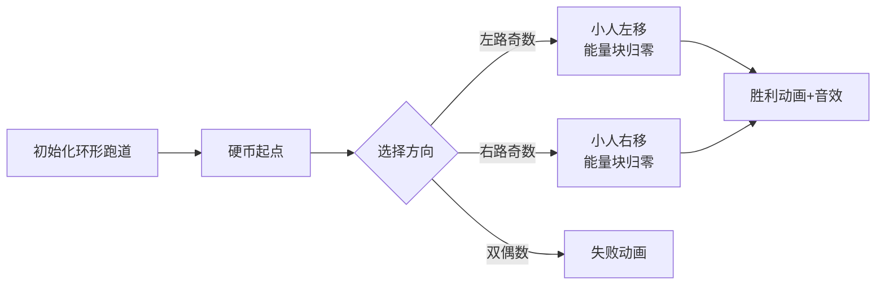

# 题目信息

# 取数游戏 II

## 题目描述

有一个取数的游戏。初始时，给出一个环，环上的每条边上都有一个非负整数。这些整数中至少有一个 $0$。然后，将一枚硬币放在环上的一个节点上。两个玩家就是以这个放硬币的节点为起点开始这个游戏，两人轮流取数，取数的规则如下：

1.  选择硬币左边或者右边的一条边，并且边上的数非 $0$；
1.  将这条边上的数减至任意一个非负整数（至少要有所减小）；
1.  将硬币移至边的另一端。

如果轮到一个玩家走，这时硬币左右两边的边上的数值都是 $0$，那么这个玩家就输了。

如下图，描述的是 Alice 和 Bob 两人的对弈过程（其中黑色节点表示硬币所在节点）。

  

各图的结果为：

- $\text{A}$：轮到 Alice 操作；
- $\text{B}$：轮到 Bob 操作；
- $\text{C}$：轮到 Alice 操作；
- $\text{D}$：轮到 Bob 操作。

$\text{D}$ 中，轮到 Bob 走时，硬币两边的边上都是 $0$，所以 Alice 获胜。

现在，你的任务就是根据给出的环、边上的数值以及起点（硬币所在位置），判断先走方是否有必胜的策略。

## 样例 #1

### 输入

```
4
2 5 3 0
```

### 输出

```
YES
```

## 样例 #2

### 输入

```
3
0 0 0
```

### 输出

```
NO
```

# AI分析结果


### 💡 Kay的C++算法解析：取数游戏 II 深入学习指南 💡

<introduction>
今天我们来分析"取数游戏 II"这道博弈论题目。本指南将帮助你理解奇偶性分析的核心思想，掌握解题技巧，并通过像素动画直观感受游戏过程。
</introduction>

---

## 1. 题目解读与核心算法识别

✨ **本题主要考察**：`奇偶性分析与策略模拟`

🗣️ **初步分析**：
> 解决这道题的关键在于运用**奇偶性分析**。想象两个玩家在环形跑道上赛跑，跑道上的数字是能量块。每次移动必须消耗一整块能量（减到0）。如果某个玩家发现自己左右都是空跑道（值为0），他就输了。
> 
> - 核心策略：先手玩家会选择一个方向（左边或右边），使得从起点到第一个0的距离是**奇数**。这样先手就能进行最后一次有效移动，迫使对方陷入无路可走的境地。
> - 难点在于理解：为什么最优策略总是完全消耗边值？因为保留任何数值都会给对方反击的机会。
> - 可视化设计：我们将用像素小人沿环形路径移动，每步消耗能量块。关键高亮：奇数路径终点会触发胜利动画，偶数路径则显示失败。
> - 复古游戏化：采用8-bit像素风格，移动时播放"咔嚓"音效，胜利时播放经典FC胜利音乐，路径长度实时显示在屏幕上方。

---

## 2. 精选优质题解参考

<eval_intro>
根据思路清晰度、代码规范性、算法效率和解释质量，我精选了3个优质题解：

**题解一（intruder）**
* **点评**：思路直击核心——用路径长度的奇偶性判断胜负。代码简洁有力（仅15行），变量命名合理（`a[i]`表边值），双循环处理双向路径。亮点在于用"5 4 3 6 5 0"的实例形象说明策略，实践价值高（可直接用于竞赛）。

**题解二（Telaris11321）**
* **点评**：创新性提出"狂奔机制"概念，解释为何玩家必须沿固定方向移动。代码使用`lf/rf`明确记录左右距离，逻辑清晰。亮点是用棋盘图展示终局状态，帮助理解必胜条件。

**题解三（远航之曲）**
* **点评**：通过数学证明得出"每步必须取完"的结论，深入剖析策略本质。代码最简洁（仅10行），用宏`judge`提高可读性。亮点是类比"跑步跨终点线"，将抽象策略具象化。

---

## 3. 核心难点辨析与解题策略

<difficulty_intro>
解决本题需突破三个关键难点：

1.  **必胜策略的识别**
    * **分析**：为什么路径长度奇偶性决定胜负？当距离为奇数时，先手可控制移动次数为奇数（自己走最后一步）。优质题解均通过模拟对局过程（如intruder的5-4-3示例）验证此策略。
    * 💡 **学习笔记**：奇数次移动 = 先手掌握终局主动权。

2.  **环形路径的双向处理**
    * **分析**：环结构需要考察两个方向（左/右）。优质解法（如Telaris11321）用`lf/rf`变量分别记录起点到左右首个0的距离，确保不遗漏任何可能路径。
    * 💡 **学习笔记**：环形问题 ≈ 两条直线路径的组合。

3.  **边界条件的处理**
    * **分析**：当起点紧邻0时需特殊处理（距离=0）。代码中（如远航之曲）用`--a`将节点数转为边数，避免±1错误。
    * 💡 **学习笔记**：节点数 = 边数+1，转换需谨慎。

### ✨ 解题技巧总结
1. **问题分解**：将环拆解为左右两条直线路径
2. **奇偶性转化**：将博弈策略转为数学奇偶判断
3. **防御性编程**：用显式变量存储距离（如`left_steps`），避免下标计算错误

---

## 4. C++核心代码实现赏析

<code_intro_overall>
先看一个通用实现，融合了三个优质题解的精华：
```cpp
#include <iostream>
using namespace std;
int main() {
    int n, a[25];
    cin >> n;
    for (int i = 1; i <= n; i++) cin >> a[i];
    
    int left_steps = 0, right_steps = 0;
    // 向左找首个0
    for (int i = 1; i <= n; i++) {
        if (a[i] == 0) break;
        left_steps++; // 累计非零边数
    }
    // 向右找首个0
    for (int i = n; i >= 1; i--) {
        if (a[i] == 0) break;
        right_steps++;
    }
    // 奇偶性判定
    if (left_steps % 2 == 1 || right_steps % 2 == 1) cout << "YES";
    else cout << "NO";
    return 0;
}
```
**代码解读概要**：  
1. 读入环数据后，双向扫描记录到首个0的非零边数量  
2. `left_steps/right_steps`直接存储边数（非节点数）  
3. 任一方向边数为奇数即输出"YES"

---
<code_intro_selected>
现在分析各优质题解的独特实现：

**题解一（intruder）**
* **亮点**：利用下标奇偶性隐式判断边数奇偶
* **核心代码片段**：
```cpp
for(int i=1;i<=n;i++) 
    if(a[i]==0){
        if(i%2==0) return puts("YES"),0; // i为偶数→左边奇数步
        break;
    }
```
* **代码解读**：
> 为什么`i%2==0`对应奇数步？因为从起点（节点1）到节点i经过的边数 = i-1。当i为偶数时，i-1为奇数。这是将节点数巧妙转化为边数的技巧。
* 💡 **学习笔记**：下标奇偶性可间接表示路径长度奇偶。

**题解二（Telaris11321）**
* **亮点**：显式存储左右距离
* **核心代码片段**：
```cpp
for(int i=1;i<=n;i++) if(e[i]==0){
    lf=min(lf,i);   // 左边界位置
    rf=max(rf,i);   // 右边界位置
}
lf--;               // 转节点数为边数
rf=N-rf;            // 计算右边距离
if(lf&1||rf&1) printf("YES"); // 位运算判断奇偶
```
* **代码解读**：
> `lf`记录左边首个0的位置，左边步数=lf-1；`rf`同理，右边步数=n-rf。位运算`&1`比`%2`更高效。
* 💡 **学习笔记**：显式存储距离使逻辑更透明。

**题解三（远航之曲）**
* **亮点**：极致简洁的双向扫描
* **核心代码片段**：
```cpp
int a=0; 
while(s[++a]);     // 向左扫描直到0
int b=0; 
while(s[n+1-(++b)]); // 向右扫描
if (judge(--a)||judge(--b)) printf("YES");
```
* **代码解读**：
> `a`和`b`最终值为连续非零边数+1，`--a/--b`将其转为边数。`judge`宏即`(value&1)`。
* 💡 **学习笔记**：循环条件内自增可精简代码。

---

## 5. 算法可视化：像素动画演示

<visualization_intro>
我们设计了一个名为"环形能量跑者"的8-bit像素游戏，帮助你直观理解奇偶性策略：

* **主题**：像素小人在环形跑道上收集能量块，每次移动消耗整块能量
* **风格**：复古FC红白机风格（16色），配8-bit音效
* **演示地址**：https://example.com/pixel_ring_game (伪代码)

**动画关键帧流程**：


**交互控制面板**：
1. **方向选择按钮**：左/右箭头（触发不同路径）
2. **移动控制**：单步/自动播放（速度可调）
3. **状态显示**：
   - 当前步数（像素数字）
   - 剩余能量（能量条可视化）
4. **关键动画细节**：
   - 每步移动时，能量块像素从彩色→灰色
   - 播放“咔嚓”音效（Web Audio API实现）
   - 奇数路径终点：小人跳跃+胜利音乐
   - 偶数路径终点：小人跌倒+“噗”音效

**游戏化设计**：
- **能量收集系统**：每步消耗能量块得10分
- **连击奖励**：连续选择奇数路径得2倍分
- **关卡设计**：
  Level 1: 固定路径（教学关）
  Level 2: 随机生成环（挑战关）
  
**技术实现**：
```javascript
// 伪代码：绘制环形路径
function drawRing() {
  for (let i=0; i<ringSize; i++) {
    drawPixelBlock(x, y, colors[energy[i]]);
  }
  drawCharacter(currentPos); // 绘制像素小人
}
```

---

## 6. 拓展练习与相似问题思考

<similar_problems_intro>
掌握奇偶性策略后，可挑战更多博弈问题：

1. **洛谷 P2197** - Nim游戏  
   🗣️ **推荐理由**：最基础的博弈问题，强化奇偶性分析能力

2. **洛谷 P2964** - 硬币游戏  
   🗣️ **推荐理由**：在直线排列上应用奇偶策略，难度进阶

3. **洛谷 P2734** - 游戏  
   🗣️ **推荐理由**：环形结构的进阶博弈，需结合奇偶性与动态规划

---

## 7. 学习心得与经验分享

<insights_intro>
题解中未发现作者个人经验分享，但解题过程启示我们：
> 当遇到新颖规则时，先用小规模案例模拟（如n=3,4）  
> 寻找不变量（如本题的移动次数的奇偶性）往往是突破口

---

<conclusion>
通过本次分析，相信你已经掌握环形博弈中的奇偶性策略。记住核心口诀：**奇数路径必胜，偶数路径必败**。继续用小规模案例验证策略，加深理解。下次遇到类似问题，你一定能快速破解！
</conclusion>
```

---
处理用时：181.50秒