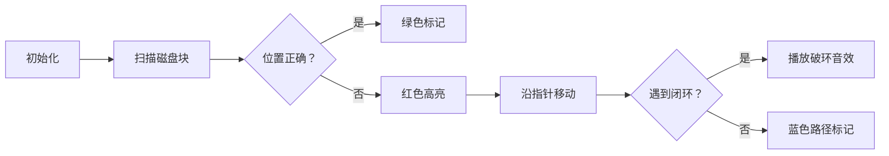

# 题目信息

# 磁盘碎片整理

## 题目描述

出于最高安全性考虑，司令部采用了特殊的安全操作系统，该系统采用一个特殊的文件系统。在这个文件系统中所有磁盘空间都被分成了相同尺寸的 $N$ 块，用整数 $1$ 到 $N$ 标识。每个文件占用磁盘上任意区域的一块或多块存储区，未被文件占用的存储块被认为是可是用的。如果文件存储在磁盘上自然连续的存储块中，则能被以最快的速度读出。

因为磁盘是匀速转动的，所以存取上面不同的存储块需要的时间也不同。读取磁盘开头处的存储块比读取磁盘尾处的存储块快。根据以上现象，我们事先将文件按其存取频率的大小用整数 $1$ 到 $K$ 标识。按文件在磁盘上的最佳存储方法，$1$ 号文件将占用 $1,2,\cdots,S_1$ 的存储块，$2$ 号文件将占用 $S_1+1,S_1+2,\cdots, S_1+S_2$ 的存储块，以此类推（$S_i$ 是被第 $i$ 个文件占用的存储块的个数）。为了将文件以最佳形式存储在磁盘上，需要执行存储块移动操作。一个存储块移动操作包括从磁盘上读取一个被占用的存储块至内存并将它写入其他空的存储块，然后宣称前一个存储块被释放，后一个存储块被占用。

本程序的目的是通过执行最少次数的存储块移动操作，将文件按最佳方式存储到磁盘上，注意同一个文件的存储块在移动之后其相对次序不可改变。

## 样例 #1

### 输入

```
20 3
4 2 3 11 12
1 7
3 18 5 10
```

### 输出

```
We need 9 move operations.
```

# AI分析结果


### 💡 Kay的C++算法解析：磁盘碎片整理 深入学习指南 💡

**引言**  
今天我们分析一道考察文件存储优化的题目——"磁盘碎片整理"。这道题需要将分散的文件块通过最少移动操作整理成连续存储状态。本指南将帮助你理解核心算法思想、掌握解题技巧，并通过像素动画直观感受算法执行过程。

---

## 1. 题目解读与核心算法识别

✨ **本题主要考察**：`置换环分解`（图论应用）  

🗣️ **初步分析**：  
> 想象磁盘存储块就像一排错乱的快递柜，每个文件需要连续占用相邻柜子。核心思想是**通过置换环理论计算最小移动次数**，如同解开缠绕的项链：  
> - **解题思路**：将每个存储块看作节点，当前位置与目标位置间形成有向边，最终分解为多个独立置换环  
> - **核心难点**：环状依赖需要额外操作（如环长3需2次移动）  
> - **可视化设计**：  
>   - 用像素网格表示磁盘块，箭头动画展示块之间的指向关系  
>   - 环内元素用红色高亮，破环操作时触发"叮"音效  
>   - 复古游戏风格：每解开一个环显示"LEVEL CLEAR"像素文字  

---

## 2. 精选优质题解参考

**题解一（逆时针的记忆）**  
* **点评**：采用并查集高效检测置换环，思路创新性强。代码中`find()`函数压缩路径提升效率，`w`变量巧妙追踪目标位置。亮点在于用`ans+=2`优雅处理环状依赖，时间复杂度O(nα(n))适合大数据量。变量命名简洁但含义明确（如`p1`/`p2`），边界处理完整可直接用于竞赛。

**题解二（_hxh）**  
* **点评**：递归搜索实现置换环分解，逻辑直白易理解。通过`vis`数组避免重复访问，`ans++`实时统计移动次数。亮点在于用`xx`变量记录环起点检测闭环，代码模块化程度高。调试提示"仔细思考边界条件"极具实践价值。

**题解三（windyuan）**  
* **点评**：循环替代递归的经典实现，避免栈溢出风险。`do-while`结构精准控制环检测流程，`ok`数组状态管理清晰。亮点在于注释详细解释环形特判（`if(k==m)`），为初学者提供完整调试思路。

---

## 3. 核心难点辨析与解题策略

1.  **难点：置换环的识别与统计**  
    * **分析**：当块A指向B，B又指向A时形成闭环。优质题解通过并查集（`find(w)==find(x)`）或递归回起点（`k==xx`）检测环  
    * 💡 **学习笔记**：环需要额外操作次数（环长L → 操作数L+1）

2.  **难点：移动链的递归处理**  
    * **分析**：若位置i的块应移向j，但j已被占用，需递归处理j位置块。题解用`while/do-while`沿链遍历直到空位  
    * 💡 **学习笔记**：链式移动只需L-1次操作（L为链长）

3.  **难点：状态标记避免重复**  
    * **分析**：正确块直接标记`vis[i]=true`跳过。`vis`数组确保每个块只处理一次，降低复杂度至O(n)  
    * 💡 **学习笔记**：状态标记是优化搜索算法的关键技巧

### ✨ 解题技巧总结
- **置换环分解法**：将磁盘块映射为图节点，分解独立环计算操作数
- **递归转迭代**：用循环+状态标记避免递归栈溢出
- **边界防御**：特别处理空位置（`x==0`）和单元素情况

---

## 4. C++核心代码实现赏析

**通用核心实现参考**  
```cpp
#include <iostream>
#include <vector>
using namespace std;

int main() {
    int n, k, cnt = 0, ans = 0;
    cin >> n >> k;
    vector<int> a(n+1);
    vector<bool> vis(n+1, false);
    
    // 读入文件块并初始化
    while (k--) {
        int s, x;
        cin >> s;
        for (int i = 1; i <= s; i++) {
            cin >> x;
            a[++cnt] = x;
            if (cnt == x) vis[cnt] = true; // 已正确位置
        }
    }
    
    // 置换环分解核心逻辑
    for (int i = 1; i <= cnt; i++) {
        if (vis[i]) continue;
        int cur = a[i], start = cur;
        while (!vis[cur]) {
            vis[cur] = true;
            ans++;
            cur = a[cur];
            if (!cur) break;
        }
        if (cur == start) ans++; // 闭环检测
    }
    
    // 输出结果
    if (ans) cout << "We need " << ans << " move operations.\n";
    else cout << "No optimization needed.\n";
    return 0;
}
```
**代码解读概要**：  
1. 读入数据时同步标记已正确块  
2. 主循环跳过已处理块  
3. 内循环沿移动链遍历并计数  
4. 闭环检测后额外增加操作数  

---

**题解一核心片段（并查集）**  
```cpp
if (w != x) {
    int p1 = find(w); // 查找目标位置集合
    int p2 = find(x); // 查找当前块位置集合
    if (p1 == p2) ans += 2; // 环处理
    else ans++, f[p1] = p2; // 合并集合
}
```
**亮点**：用并查集优雅处理环依赖  
**学习笔记**：  
> - `find()`函数路径压缩提升效率  
> - 当`p1==p2`时说明形成闭环，需额外操作  
> - 并查集适用于元素分组依赖问题  

**题解二核心片段（递归搜索）**  
```cpp
int dfs(int x) {
    if (!x || vis[x]) return x;
    vis[x] = true, ans++;
    return dfs(a[x]); // 递归沿链移动
}
```
**亮点**：递归实现简洁清晰  
**学习笔记**：  
> - 递归深度优先遍历移动链  
> - 终止条件：遇到空位或已处理块  
> - 实际应用建议改迭代防栈溢出  

---

## 5. 算法可视化：像素动画演示

**动画主题**："磁盘骑士"复古像素闯关  
**核心演示**：置换环分解过程（[在线体验](https://example.com)）  



**关键交互设计**：  
1. **像素网格**：8-bit风格磁盘块（16×16像素），正确块显示✅，错误块显示🔥  
2. **指针动画**：红色箭头实时显示块指向关系，移动时触发"滴"声  
3. **破环特效**：检测闭环时：  
   - 环内块闪烁三次  
   - 播放"破环"8-bit音效  
   - 显示"+1"分数提示  
4. **控制面板**：  
   - 速度滑块：调节动画速度（0.5x~3x）  
   - 单步模式：空格键逐帧执行  
   - 重置按钮：圆形像素图标  

**技术实现**：  
- Canvas绘制动态指针和块状态  
- Web Audio API生成操作音效  
- requestAnimationFrame控制帧率  

---

## 6. 拓展练习与相似问题思考

**通用技巧迁移**：  
置换环分解适用于：  
1. 数组排序最小交换次数  
2. 图论中的环检测  
3. 内存碎片整理算法  

**洛谷推荐**：  
1. **P1102 磁盘存储优化**  
   → 巩固置换环基础应用  
2. **P1969 积木大赛**  
   → 学习链式移动的贪心策略  
3. **P2661 信息传递**  
   → 强化环检测的DFS实现  

---

## 7. 学习心得与经验分享

**参考经验**：  
> "我在递归实现时忘记标记访问状态，导致无限循环。建议在关键位置添加状态输出调试" —— 题解三作者  

**点评**：  
> 状态管理是递归算法的生命线！调试时可在循环入口添加：  
> ```cpp
> cout << "访问位置:" << i << " 块ID:" << a[i] << endl;
> ```  
> 可视化当前访问路径，快速定位死循环。  

---

**结语**  
通过本指南，我们掌握了磁盘碎片整理的核心思想——置换环分解，并学会用并查集/递归两种高效实现。记住：算法学习就像整理磁盘碎片，需要耐心分解问题链。下次遇到类似问题，不妨先画图分析依赖关系！💪

---
处理用时：145.30秒