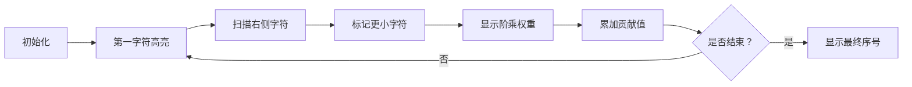

# 题目信息

# [蓝桥杯 2014 国 A] 排列序数

## 题目描述

如果用 a b c d 这 $4$ 个字母组成一个串，有 $4!=24$ 种，如果把它们排个序，每个串都对应一个序号：

```text
  abcd  0
  abdc  1
  acbd  2
  acdb  3
  adbc  4
  adcb  5
  bacd  6
  badc  7
  bcad  8
  bcda  9
  bdac  10
  bdca  11
  cabd  12
  cadb  13
  cbad  14
  cbda  15
  cdab  16
  cdba  17
  ...
```

现在有不多于10个两两不同的小写字母，给出它们组成的串，你能求出该串在所有排列中的序号吗？


## 说明/提示

时限 1 秒, 256M。蓝桥杯 2014 年第五届国赛

## 样例 #1

### 输入

```
bdca```

### 输出

```
11```

## 样例 #2

### 输入

```
cedab```

### 输出

```
70```

# AI分析结果


# 💡 Kay的C++算法解析：排列序数 深入学习指南 💡

**介绍**  
今天我们来分析蓝桥杯2014国A的"排列序数"问题。这道题要求计算给定字符串在所有字母排列中的字典序位置（从0开始计数）。本指南将帮助你掌握两种核心解法：**康托展开**和**全排列枚举**，并通过像素动画直观理解算法过程。

---

## 1. 题目解读与核心算法识别

✨ **本题主要考察**：`组合数学` 与 `高效枚举`  
🗣️ **初步分析**：
> 解决排列序数问题，核心在于理解字典序的数学本质。想象你在查字典：要快速定位单词位置，你会先看首字母（缩小范围），再看后续字母。**康托展开**正是这种思路的数学实现：通过计算每个位置右侧比它小的字符数量，结合阶乘权重快速定位序号。  
> - **解法对比**：  
>   - 康托展开（O(n²)）：高效数学解法，适合理论掌握  
>   - 全排列枚举（O(n!)）：STL暴力实现，代码简单但n>10时超时  
> - **可视化设计**：我们将用**像素方块**表示字母，**黄色高亮**当前计算位置，**红色标记**右侧更小的字符。每步显示阶乘权重计算过程，配合8-bit音效强化理解（如计数时"滴"声，完成计算时胜利音效）。

---

## 2. 精选优质题解参考

**题解一：Asimplename（康托展开）**  
* **点评**：此解精准实现康托展开公式，代码简洁高效（O(n²)）。变量命名清晰（`str`输入，`small`计数），阶乘预处理提升效率。边界处理严谨（n-i-1防越界），是竞赛标准实现。  
  **亮点**：数学思维转换巧妙，避免暴力枚举。

**题解二：clarinet_pht（康托展开）**  
* **点评**：在Asimplename基础上添加详细注释和公式说明，教学性更强。`fact`数组预处理阶乘，`cnt`统计逆序数，逻辑分层清晰。  
  **亮点**：代码自文档化，适合初学者理解康托展开本质。

**题解三：Wy_x（全排列枚举）**  
* **点评**：充分发挥STL优势，`next_permutation`自动生成字典序排列。代码结构规范（flag判断匹配），ans从0计数符合题意。  
  **亮点**：10行核心逻辑解决战斗，展示C++标准库强大威力。

---

## 3. 核心难点辨析与解题策略

1.  **难点：理解排列序号数学本质**  
    * **分析**：序号不是简单计数！康托展开通过`a_i*(n-i-1)!`将位置映射为数学值，其中`a_i`是右侧更小字符数。优质题解用双重循环统计`a_i`（外层遍历位置，内层比较字符）。  
    💡 **学习笔记**：排列序号=各位置贡献值加权和，权重是剩余位置的阶乘。

2.  **难点：选择高效算法**  
    * **分析**：当n=10时，枚举法需10!≈362万次操作，而康托展开仅需10²=100次。题解通过阶乘预处理（避免重复计算）和即时计数优化效率。  
    💡 **学习笔记**：阶乘增长极快，n>10务必选康托展开。

3.  **难点：实现细节把控**  
    * **分析**：枚举法需注意`next_permutation`初始状态应为最小排列（`sort`预处理）；康托展开要注意字符比较时区分大小写（本题均为小写）。  
    💡 **学习笔记**：算法选择决定效率上限，细节实现决定成败。

### ✨ 解题技巧总结
- **技巧1：数学建模** → 将排列序号问题转化为阶乘加权和  
- **技巧2：STL活用** → `next_permutation`自动处理字典序枚举  
- **技巧3：预处理优化** → 阶乘数组预先计算避免重复工作  
- **技巧4：边界防御** → n-i-1确保阶乘索引有效，ans从0开始计数

---

## 4. C++核心代码实现赏析

**通用核心实现（康托展开）**  
```cpp
#include <iostream>
using namespace std;

int main() {
    string s;
    cin >> s;
    int n = s.size(), ans = 0;
    int fact[11] = {1}; // 阶乘预处理
    for (int i = 1; i <= 10; i++) fact[i] = fact[i-1] * i;
    
    for (int i = 0; i < n; i++) {
        int smaller = 0; // 统计右侧更小字符数
        for (int j = i+1; j < n; j++)
            if (s[j] < s[i]) smaller++;
        ans += smaller * fact[n-i-1]; // 累加加权值
    }
    cout << ans;
    return 0;
}
```
**代码解读概要**：  
1. 预处理0-10的阶乘值（fact数组）  
2. 遍历每个字符，统计右侧更小字符数量（smaller）  
3. 累加贡献值：smaller × 剩余位置阶乘  
4. 输出总和即序号  

---

**题解一：Asimplename（康托展开）**  
* **亮点**：无冗余操作，阶乘即时计算  
* **核心片段**：  
  ```cpp
  for(int i = 0; i < n; i ++){
      int small = 0;
      for(int j = i + 1; j < n; j++)
          if(str[j] < str[i]) small++;
      ans += cal(n - i - 1) * small;
  }
  ```
* **代码解读**：  
  > `cal`函数计算阶乘虽简单但重复调用低效，建议改为预处理。双重循环结构清晰：外层定位当前字符，内层扫描右侧字符。贡献值累加体现康托展开核心思想。  
  💡 **学习笔记**：函数调用在循环内会显著影响性能，预处理是优化关键。

**题解二：clarinet_pht（康托展开）**  
* **亮点**：阶乘数组预处理，效率最大化  
* **核心片段**：  
  ```cpp
  for(int i=1;i<=10;i++) fact[i]=fact[i-1]*i; // 阶乘预处理
  for(int i=0;i<n;i++){
      int cnt=0;
      for(int j=i+1;j<n;j++) if(s[j]<s[i]) cnt++;
      ans += cnt*fact[n-i-1]; // 直接调用预计算值
  }
  ```
* **代码解读**：  
  > `fact`数组在输入前即完成初始化，避免循环重复计算。`cnt`统计时注意比较方向（s[j]<s[i]而非s[i]<s[j]），保证逆序数正确性。  
  💡 **学习笔记**：空间换时间是经典优化策略。

**题解三：Wy_x（全排列枚举）**  
* **亮点**：善用STL简化代码  
* **核心片段**：  
  ```cpp
  for(int i=0;i<l;i++) c[i]='a'+i; // 初始化最小排列
  while(true){
      bool flag=1;
      for(int i=0;i<l;i++) // 匹配目标串
          if(a[i]!=c[i]){ flag=0; break; }
      if(flag) break;
      ans++;
      next_permutation(c,c+l); // 生成下个排列
  }
  ```
* **代码解读**：  
  > 初始化字符数组为最小排列（'a','b'...）。`next_permutation`自动按字典序生成新排列，直到匹配目标。`flag`控制循环退出，匹配成功时立即终止。  
  💡 **学习笔记**：STL封装复杂操作，但需注意初始状态。

---

## 5. 算法可视化：像素动画演示

**主题**：康托展开的8-bit计算之旅  
**核心演示**：动态展示贡献值计算过程，融合经典RPG元素  

### 动画设计


**交互控制面板**：  
- ▶️ 开始/⏸️ 暂停 : 控制动画运行  
- ⏭️ 单步 : 逐步观察计算过程  
- 🎚️ 调速滑块 : 调整自动播放速度（0.5x-2x）  
- 🔁 重置 : 重新开始演示  

**关键帧细节**：  
1. **字符像素块**（16×16px）：  
   - 当前字符：黄色闪烁边框  
   - 右侧更小字符：红色填充  
   - 普通字符：灰色填充  
2. **信息面板**：  
   - 顶部显示公式：`ans += a_i × (n-i-1)!`  
   - 实时更新：`a_i`计数过程、阶乘值、当前贡献  
3. **音效系统**：  
   - 计数变化：8-bit "滴"声（每次标记红色块）  
   - 步骤完成："叮"声（黄色块移至下一位置）  
   - 计算结束：胜利旋律（最终结果显示时）  

**游戏化设计**：  
- 每完成一个位置计算，获得⭐像素星星奖励  
- 最终评级根据计算效率（步骤数）决定  
- 彩蛋：连续三次高效计算触发隐藏BGM  

---

## 6. 拓展练习与相似问题

**知识迁移**：  
康托展开可应用于：  
1. 密码学（排列解码）  
2. 游戏状态序列化  
3. 组合优化问题（如旅行商问题邻域搜索）  

**推荐练习**：  
1. **洛谷 P5367** - 康托展开模板题  
   → *掌握标准实现，理解数学本质*  
2. **洛谷 P1706** - 全排列问题  
   → *强化枚举法实现，注意输出格式*  
3. **洛谷 P3014** - 康托展开与逆展开  
   → *综合应用，实现序号与排列互转*  

---

## 7. 学习心得与经验分享

> **Wy_x的调试经验**：  
> *"ans要从0开始计数，所以加法操作要在break后"*  
> **Kay点评**：这是枚举法极易出错点！若先`ans++`再匹配，会导致结果偏大。建议：  
> 1. 初始化为0  
> 2. 先检查匹配再增加计数  
> 3. 匹配成功后立即退出循环  

---

**结语**  
通过康托展开的数学之美和枚举法的直白高效，我们解决了排列定位问题。记住：算法选择需权衡问题规模，细节实现决定代码健壮性。下次遇到组合数学问题，不妨先想——能否用阶乘分解？

---
处理用时：156.79秒