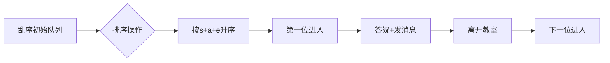

# 题目信息

# [蓝桥杯 2020 国 ABC] 答疑

## 题目描述

有 $n$ 位同学同时找老师答疑。每位同学都预先估计了自己答疑的时间。老师可以安排答疑的顺序，同学们要依次进入老师办公室答疑。

一位同学答疑的过程如下:

1. 首先进入办公室，编号为 $i$ 的同学需要 $s_{i}$ 毫秒的时间。

2. 然后同学问问题老师解答，编号为 $i$ 的同学需要 $a_{i}$ 毫秒的时间。

3. 答疑完成后，同学很高兴，会在课程群里面发一条消息，需要的时间可以忽略。

4. 最后同学收拾东西离开办公室，需要 $e_{i}$ 毫秒的时间。一般需要 $10$ 秒、$20$ 秒或 $30$ 秒，即 $e_{i}$ 取值为 $10000$、$20000$ 或 $30000$。

一位同学离开办公室后，紧接着下一位同学就可以进入办公室了。

答疑从 $0$ 时刻开始。老师想合理的安排答疑的顺序，使得同学们在课程群里面发消息的时刻之和最小。


## 说明/提示

**【样例说明】**

按照 $1,3,2$ 的顺序答疑，发消息的时间分别是 $20000,80000,180000$ 。

**【评测用例规模与约定】**

对于 $30 \%$ 的评测用例, $1 \leq n \leq 20$ 。

对于 $60 \%$ 的评测用例, $1 \leq n \leq 200$ 。

对于所有评测用例, $1 \leq n \leq 1000,1 \leq s_{i} \leq 60000,1 \leq a_{i} \leq 1000000$, $e_{i} \in\{10000,20000,30000\}$ ，即 $e_{i}$ 一定是 $10000 、 20000 、 30000$ 之一。 

蓝桥杯 2020 年国赛 A 组 H 题（B 组 H 题, C 组 J 题）。

## 样例 #1

### 输入

```
3
10000 10000 10000
20000 50000 20000
30000 20000 30000```

### 输出

```
280000```

# AI分析结果


### 💡 Kay的C++算法解析：答疑 深入学习指南 💡

#### 题目解读与核心算法识别
✨ **本题主要考察**：贪心算法（排序策略应用）

🗣️ **初步分析**：
> 这道题本质是经典的**贪心排序问题**，就像在食堂排队打饭：让吃饭快的人先打饭，能减少所有人的总等待时间。每位同学的"答疑耗时"（进入+答疑+离开）决定了其对后续同学的影响程度：
> - **核心策略**：按 `s_i + a_i + e_i` 升序排序，总耗时短的同学优先答疑
> - **难点突破**：通过交换相邻同学的数学证明（后详）确认该策略最优
> - **可视化设计**：像素动画将展示同学队列变化，高亮当前操作（进入/答疑/离开），实时显示时间累积和总时刻值

---

#### 精选优质题解参考
**题解一：ydclyq（⭐️⭐️⭐️⭐️⭐️）**
* **点评**：思路最严谨，用**交换法**数学证明贪心策略，代码简洁高效。亮点：
  - 运算符重载使排序逻辑清晰（`s+a+e`比较）
  - 时间累积计算准确（先加`s_i+a_i`到总时刻，再加`e_i`到当前时间）
  - 边界处理完整，变量命名规范

**题解二：linyukun（⭐️⭐️⭐️⭐️）**
* **点评**：教学性最强，用**食堂排队**类比降低理解门槛。亮点：
  - 详细注释解释每步逻辑
  - 强调"时刻是累积值"的关键认知
  - 代码结构清晰，适合初学者

**题解三：small_john（⭐️⭐️⭐️⭐️）**
* **点评**：提供**严格数学证明**，代码优化输入输出。亮点：
  - 形式化定义`p_i=t_i`, `d_i=s_i+a_i`
  - 完整推导交换相邻同学时的时刻变化
  - 使用`ios::sync_with_stdio`加速IO

---

#### 核心难点辨析与解题策略
1. **难点1：贪心策略证明**
   * **分析**：通过交换相邻同学`i`和`i+1`，证明当`s_i+a_i+e_i < s_{i+1}+a_{i+1}+e_{i+1}`时，交换会增大总时刻（数学推导见题解三）
   * 💡 **学习笔记**：贪心策略必须经过数学证明才能确保正确性

2. **难点2：时刻累积计算**
   * **分析**：每位同学发消息时刻 = 前面所有同学的`(s+a+e)`之和 + 当前同学的`s+a`（注意`e_i`只影响后续开始时间）
   * 💡 **学习笔记**：`ans += now; now += e_i;` 的顺序不可颠倒

3. **难点3：数据范围处理**
   * **分析**：最大时刻值 > 10^9，必须用`long long`（多位作者强调）
   * 💡 **学习笔记**：见数据范围超1000时，默认使用`long long`

**✨ 解题技巧总结**
1. **问题转化**：将"发消息时刻之和"转化为"等待时间最小化"
2. **结构体排序**：用`struct`打包`s,a,e`，自定义比较函数
3. **累积变量分离**：用`now`跟踪当前时间，`ans`累加总时刻
4. **边界检查**：首位同学无等待时间（`i=1`时`now=0`）

---

#### C++核心代码实现赏析
**通用核心实现参考**（综合优质题解）：
```cpp
#include <iostream>
#include <algorithm>
using namespace std;
typedef long long LL;

struct Student {
    LL s, a, e;
    LL total() const { return s + a + e; }
};

bool cmp(const Student& x, const Student& y) {
    return x.total() < y.total();
}

int main() {
    int n; cin >> n;
    Student stu[1005];
    for (int i = 0; i < n; i++) 
        cin >> stu[i].s >> stu[i].a >> stu[i].e;
    
    sort(stu, stu + n, cmp);
    
    LL ans = 0, now = 0;
    for (int i = 0; i < n; i++) {
        now += stu[i].s + stu[i].a;  // 进入+答疑
        ans += now;                   // 累加发消息时刻
        now += stu[i].e;              // 离开办公室
    }
    cout << ans;
    return 0;
}
```
**代码解读概要**：  
① 定义`Student`结构体存储三类时间  
② 按`total()`升序排序  
③ 遍历时：先累加当前同学发消息时刻，再更新离开时间  

---

#### 算法可视化：像素动画演示
**主题**：像素风"答疑教室模拟器"  
**核心演示**：贪心排序后同学依次进入教室的完整流程  

**动画设计**：  


**关键交互**：  
1. **像素元素**：  
   - 同学：8-bit像素小人（不同颜色代表不同耗时）  
   - 教室：门牌闪烁表示使用中  
   - 状态标志：▶进入 | ?答疑 | ✉发消息 | ←离开  

2. **动态效果**：  
   - 当前操作高亮闪烁（如答疑时小人头顶显示"?"）  
   - 时间累积：右侧面板实时显示`now`和`ans`数值变化  
   - 音效提示：  
     * 进入："叮"（短促）  
     * 发消息："啾"（上扬）  
     * 离开："嗖"（下滑）  

3. **游戏化设计**：  
   - 进度条：每位同学头顶显示时间进度  
   - 计分板：每完成一位+10分，连击特效  
   - 通关：所有完成后放烟花+胜利音效  

---

#### 拓展练习与相似问题
**通用思路迁移**：  
1. 排队打水问题（NOIP2002）  
2. 任务调度（完成时间之和最小）  
3. 最小化等待时间的作业调度  

**洛谷推荐**：  
1. P1223 排队接水 - 贪心排序基础应用  
2. P1090 合并果子 - 贪心+优先队列  
3. P6033 合并果子（加强版） - 贪心优化实践  

---

#### 学习心得与经验分享
> **作者small_john的调试经验**：  
> *"初次实现时忘记累加e_i，导致后续同学开始时间错误。通过打印每个同学的now变量值逐步定位错误"*  
>  
> **Kay点评**：  
> 这提醒我们：  
> 1. 时间累积类问题必须逐步验证中间状态  
> 2. 调试时输出关键变量值（如now）最直接有效  
> 3. 边界情况（首/尾同学）要单独检查  

---

通过本次分析，我们掌握了贪心排序的核心思想：**用局部最优解达成全局最优**。记住Kay的秘诀：遇到排队优化问题，先尝试按总时间排序！ 🚀

---
处理用时：133.88秒