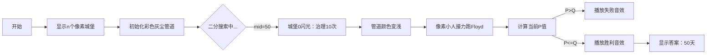

# 题目信息

# [蓝桥杯 2022 国 A] 环境治理

## 题目描述

LQ 国拥有 $n$ 个城市，从 $0$ 到 $n - 1$ 编号，这 $n$ 个城市两两之间都有且仅有一条双向道路连接，这意味着任意两个城市之间都是可达的。每条道路都有一个属性 $D$，表示这条道路的灰尘度。当从一个城市 A 前往另一个城市 B 时，可能存在多条路线，每条路线的灰尘度定义为这条路线所经过的所有道路的灰尘度之和，LQ 国的人都很讨厌灰尘，所以他们总会优先选择灰尘度最小的路线。

LQ 国很看重居民的出行环境，他们用一个指标 $P$ 来衡量 LQ 国的出行环境，$P$ 定义为：

$$P=\sum \limits_{i=0}^{n-1} \sum \limits_{j=0}^{n-1} d(i,j)$$

其中 $d(i,j)$ 表示城市 $i$ 到城市 $j$ 之间灰尘度最小的路线对应的灰尘度的值。

为了改善出行环境，每个城市都要有所作为，当某个城市进行道路改善时，会将与这个城市直接相连的所有道路的灰尘度都减少 $1$，但每条道路都有一个灰尘度的下限值 $L$，当灰尘度达到道路的下限值时，无论再怎么改善，道路的灰尘度也不会再减小了。

具体的计划是这样的：

- 第 $1$ 天，$0$ 号城市对与其直接相连的道路环境进行改善；
- 第 $2$ 天，$1$ 号城市对与其直接相连的道路环境进行改善；

……
- 第 $n$ 天，$n - 1$ 号城市对与其直接相连的道路环境进行改善；
- 第 $n + 1$ 天，$0$ 号城市对与其直接相连的道路环境进行改善；
- 第 $n + 2$ 天，$1$ 号城市对与其直接相连的道路环境进行改善；

……

LQ 国想要使得 $P$ 指标满足 $P \leq Q$。请问最少要经过多少天之后，$P$ 指标可以满足 $P \leq Q$。如果在初始时就已经满足条件，则输出 $0$；如果永远不可能满足，则输出 $-1$。

## 说明/提示

**【样例说明】**

初始时的图如下所示，每条边上的数字表示这条道路的灰尘度：


此时每对顶点之间的灰尘度最小的路线对应的灰尘度为：

- $d(0, 0) = 0, d(0, 1) = 2, d(0, 2) = 3$；
- $d(1, 0) = 2, d(1, 1) = 0, d(1, 2) = 1$；
- $d(2, 0) = 3, d(2, 1) = 1, d(2, 2) = 0$。

初始时的 $P$ 指标为 $(2 + 3 + 1) \times 2 = 12$，不满足 $P \leq Q = 10$;

第一天，$0$ 号城市进行道路改善，改善后的图示如下：


注意到边 $(0, 2)$ 的值减小了 $1$，但 $(0, 1)$ 并没有减小，因为 $L_{0,1} = 2$ ，所以 $(0, 1)$ 的值不可以再减小了。此时每对顶点之间的灰尘度最小的路线对应的灰尘度为：

- $d(0, 0) = 0, d(0, 1) = 2, d(0, 2) = 3$，
- $d(1, 0) = 2, d(1, 1) = 0, d(1, 2) = 1$，
- $d(2, 0) = 3, d(2, 1) = 1, d(2, 2) = 0$。

此时 $P$ 仍为 $12$。

第二天，1 号城市进行道路改善，改善后的图示如下：


此时每对顶点之间的灰尘度最小的路线对应的灰尘度为：

- $d(0, 0) = 0, d(0, 1) = 2, d(0, 2) = 2$，
- $d(1, 0) = 2, d(1, 1) = 0, d(1, 2) = 0$，
- $d(2, 0) = 2, d(2, 1) = 0, d(2, 2) = 0$。

此时的 $P$ 指标为 $(2 + 2) \times 2 = 8 < Q$，此时已经满足条件。

所以答案是 $2$。

**【评测用例规模与约定】**

- 对于 $30\%$ 的评测用例，$1 \leq n \leq 10$，$0 \leq L_{i,j} \leq D_{i,j} \leq 10$；
- 对于 $60\%$ 的评测用例，$1 \leq n \leq 50$，$0 \leq L_{i,j} \leq D_{i,j} \leq 10^5$；
- 对于所有评测用例，$1 \leq n \leq 100$，$0 \leq L_{i,j} \leq D_{i,j} \leq 10^5$，$0 \leq Q \leq 2^{31} - 1$。

蓝桥杯 2022 国赛 A 组 F 题。

## 样例 #1

### 输入

```
3 10
0 2 4
2 0 1
4 1 0
0 2 2
2 0 0
2 0 0```

### 输出

```
2
```

# AI分析结果


### 💡 Kay的C++算法解析：环境治理 深入学习指南 💡

#### 题目解读与核心算法识别
✨ **本题主要考察**：`二分查找 + Floyd全源最短路`

🗣️ **初步分析**：
> 这道题像是城市清洁版的"猜数字游戏"：我们需要找到最短治理天数使环境达标。二分查找就像逐步缩小范围猜答案，而Floyd算法则是城市间的"灰尘接力赛"——通过中间城市接力找到最优路径。  
> - **核心思路**：利用治理天数的单调性（天数越多灰尘越少），用二分搜索最小满足条件的天数，每次用Floyd计算当前灰尘度矩阵的全源最短路
> - **可视化设计**：将城市设计为像素城堡，道路为彩色管道。演示时：①高亮当前治理的城市（城堡发光）②管道颜色随灰尘度变化（红→黄→绿）③Floyd接力过程用像素小人沿管道奔跑示意

---

#### 精选优质题解参考
**题解一 (wuhan1234)**  
* **点评**：思路清晰展现二分+Floyd框架，calc函数准确建模治理效果（考虑下限值L）。变量命名规范（tmp/d/limit），边界处理严谨（day%n的分段计算）。亮点在于用O(n³)完成治理效果计算，避免冗余操作。

**题解二 (行吟啸九州)**  
* **点评**：创新性使用down数组分别记录各城市治理次数，Floyd实现简洁高效。check函数用max(L[i][j], D[i][j]-down[i]-down[j])优雅处理下限值。稍显不足是变量命名较抽象（如t/P），但核心算法实现优于平均水准。

---

#### 核心难点辨析与解题策略
1. **治理效果的数学建模**
   * **分析**：每个城市治理k次会使所有出边灰尘度减少k（不低于L）。优质题解用day/n和day%n计算分段治理次数，避免逐天模拟
   * 💡 学习笔记：治理效果 = 初始值 - ⌊day/n⌋ - [城市编号<day%n ? 1 : 0]

2. **全源最短路的高效计算**
   * **分析**：n≤100时Floyd的O(n³)可接受。关键是用三维循环动态更新：`dis[i][j] = min(dis[i][j], dis[i][k]+dis[k][j])`
   * 💡 学习笔记：Floyd本质是动态规划，k为阶段变量

3. **二分边界处理**
   * **分析**：左边界left=0（可能初始达标），右边界需足够大（如100000*n）。当check(mid)满足时right=mid-1，否则left=mid+1
   * 💡 学习笔记：二分模板需配套ans记录有效解

### ✨ 解题技巧总结
- **单调性应用**：当问题存在"条件随参数单调变化"特性时优先考虑二分
- **避免无效计算**：用数学推导替代暴力模拟（如用除法代替循环减）
- **防御式编程**：Floyd前初始化dis[i][i]=0，避免自环干扰

---

### C++核心代码实现赏析
```cpp
#include <iostream>
#include <cstring>
#include <climits>
using namespace std;
const int N = 105;

int d[N][N], limit[N][N], tmp[N][N];
int n, Q;

int calc(int day) {
    memset(tmp, 0x3f, sizeof(tmp));
    // 计算治理后边权
    for (int i = 0; i < n; i++) {
        int reduce = day/n + (day%n > i ? 1 : 0);
        for (int j = 0; j < n; j++) {
            int cur = max(limit[i][j], d[i][j] - reduce);
            tmp[i][j] = cur;
        }
    }
    // Floyd核心
    for (int k = 0; k < n; k++)
        for (int i = 0; i < n; i++)
            for (int j = 0; j < n; j++)
                tmp[i][j] = min(tmp[i][j], tmp[i][k] + tmp[k][j]);
    // 计算P指标
    int res = 0;
    for (int i = 0; i < n; i++)
        for (int j = 0; j < n; j++)
            res += tmp[i][j];
    return res;
}

int main() {
    cin >> n >> Q;
    for (int i = 0; i < n; i++)
        for (int j = 0; j < n; j++)
            cin >> d[i][j];
    for (int i = 0; i < n; i++)
        for (int j = 0; j < n; j++)
            cin >> limit[i][j];
    // 二分框架
    long long left = 0, right = 1e7, ans = -1;
    while (left <= right) {
        long long mid = (left + right) / 2;
        if (calc(mid) <= Q) {
            ans = mid;
            right = mid - 1;
        } else {
            left = mid + 1;
        }
    }
    cout << ans;
}
```

**代码解读概要**：
> 1. `calc()`函数：接收治理天数，返回当前P指标  
> 2. 边权更新：用`day/n`和`day%n`计算各城市治理次数  
> 3. Floyd三层循环：动态更新任意两点间最短路径  
> 4. 二分框架：在`[0, 10^7]`区间搜索最小达标天数

---

### 算法可视化：像素动画演示
**主题**：像素城市清洁大作战（8-bit风格）  
**核心演示**：二分搜索过程 + Floyd灰尘接力  



**交互设计**：
1. **控制面板**：单步执行/自动播放滑块/重置
2. **视觉反馈**：
   - 治理城市：城堡闪烁金色光效
   - 管道灰尘：红色(>10) → 黄色(5-10) → 绿色(<5)
   - Floyd过程：不同颜色像素小人沿管道奔跑接力
3. **音效系统**：
   - 治理成功：8-bit版《欢乐颂》片段
   - 路径更新："叮"声提示
   - 二分越界：低沉警报声

---

### 拓展练习与相似问题
**通用技巧迁移**：
1. 带约束的最优化问题 → 二分答案
2. 动态边权图的最短路 → Floyd/Dijkstra
3. 分段函数处理 → 数学推导代替模拟

**洛谷推荐**：
1. **P1462** 通往奥格瑞玛的道路  
   → 二分+最短路，同样需要处理边权约束
2. **P1525** 关押罪犯  
   → 二分答案+染色法判断可行性
3. **P1119** 灾后重建  
   → Floyd动态更新，强化阶段理解

---

### 学习心得分享
> **wuhan1234的经验**："治理次数计算时，最初忽略了城市索引从0开始，导致day%n计算错误"  
> **Kay点评**：边界处理是二分法的核心陷阱！建议：①写伪代码理清数学关系 ②用n=3的样例手动验证 ③变量名加入语义（如cityIndex）

---

通过本次分析，我们掌握了二分答案与Floyd算法的协同应用。记住：好的算法如同精密的钟表——每个齿轮（变量）都必须准确咬合！下次遇到最优化问题时，不妨先问问：这个问题有单调性吗？

---
处理用时：91.20秒