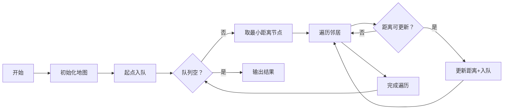

# 题目信息

# [蓝桥杯 2022 国 B] 出差

## 题目描述

$\mathrm{A}$ 国有 $N$ 个城市，编号为 $1 \ldots N$ 小明是编号为 $1$ 的城市中一家公司的员工，今天突然接到了上级通知需要去编号为 $N$ 的城市出差。

由于疫情原因，很多直达的交通方式暂时关闭，小明无法乘坐飞机直接从城市 $1$ 到达城市 $N$，需要通过其他城市进行陆路交通中转。小明通过交通信息网，查询到了 $M$ 条城市之间仍然还开通的路线信息以及每一条路线需要花费的时间。

同样由于疫情原因，小明到达一个城市后需要隔离观察一段时间才能离开该城市前往其他城市。通过网络，小明也查询到了各个城市的隔离信息。（由于小明之前在城市 $1$，因此可以直接离开城市 $1$，不需要隔离）

由于上级要求，小明希望能够尽快赶到城市 $\mathrm{N}$, 因此他求助于你，希望你能帮他规划一条路线，能够在最短时间内到达城市 $N$ 。


## 说明/提示

**【样例说明】**


**【评测用例规模与约定】**

对于 $100 \%$ 的数据, $1 \leq N \leq 1000,1 \leq M \leq 10000,1 \leq C_{i} \leq 200,1 \leq u, v \leq$ $N, 1 \leq c \leq 1000$ 


蓝桥杯 2022 国赛 B 组 E 题。

## 样例 #1

### 输入

```
4 4
5 7 3 4
1 2 4
1 3 5
2 4 3
3 4 5```

### 输出

```
13```

# AI分析结果


### 💡 Kay的C++算法解析：出差问题（蓝桥杯2022国B）深入学习指南 💡

**目标用户**：10-18岁有基础C++能力的青少年学习者  
**学习目标**：掌握带点权的最短路问题解法，理解Dijkstra算法核心思想

---

## 1. 题目解读与核心算法识别

✨ **本题主要考察**：`图论（最短路）` + `数据结构应用`

🗣️ **初步分析**：
> 本题可比喻为"疫情下的快递员配送任务"：城市是配送点，道路是运输路线，隔离时间是签收包裹所需的额外处理时间。核心是**带点权的最短路问题**——在常规路径耗时基础上，增加进入城市的隔离时间。
> - **核心难点**：将点权（隔离时间）合理融入边权计算
> - **解决方案**：所有题解均采用**Dijkstra堆优化**，将目标城市的隔离时间加到相邻边权上
> - **可视化设计**：
>   - 像素城市地图中，用不同颜色标记：起点(绿色)、终点(金色)、普通城市(蓝色)
>   - 算法执行时高亮：当前处理节点(闪烁红光)、被更新的边(黄色流光)
>   - 复古元素：节点入队时播放"叮"音效，路径更新时显示像素粒子特效

---

## 2. 精选优质题解参考

**题解一（Strelizia_Qy）**  
* **点评**：思路清晰解释了"点权转边权"的核心技巧（边权=原权重+目的地点权）。代码规范：使用`vector<pair<int,int>>`存图，优先队列语法简洁。亮点是完整处理了终点隔离时间的细节（输出时减`add[n]`），变量名`dis`/`vis`语义明确，可直接用于竞赛。

**题解二（Zvelig1205）**  
* **点评**：采用链式前向星存图，适合处理稀疏图。创新点在于自定义`dijk`结构体重载运算符，展示了优先队列的底层原理。虽然实现稍复杂，但对理解STL容器原理很有帮助，边界处理严谨（初始化`dis[1]=a[1]=0`）。

**题解三（__Cartesian__Tree__）**  
* **点评**：最简洁完整的实现，特别强调双向边空间处理（`e[maxm*2]`）。亮点是注释提醒"终点减隔离时间"和"双向边开两倍空间"两个易错点，适合初学者规避常见错误。

---

## 3. 核心难点辨析与解题策略

1.  **点权如何融入边权？**
    * **分析**：所有题解将目标城市隔离时间加到相邻边权（如`G[a].push_back({b, len+add[b]})`）。这保证到达某城市时，隔离时间已被计入路径成本。
    * 💡 **学习笔记**：点权本质是"进入城市的代价"，应计入到达该城市的边权

2.  **终点隔离时间特殊处理**
    * **分析**：因终点不需要隔离，需在输出时减去`add[n]`（如`cout<<dis[n]-add[n]`）。题解一特别在注释中强调此细节。
    * 💡 **学习笔记**：算法设计需考虑业务场景的特殊性

3.  **数据结构选择**
    * **分析**：
      - `priority_queue`：必需！O(log n)快速获取最小距离节点
      - 存图方式：`vector<pii>`（题解一）适合快速实现，链式前向星（题解二）省内存
    * 💡 **学习笔记**：稠密图用vector，稀疏图用链式前向星

### ✨ 解题技巧总结
- **技巧1：问题转化** - 将点权转化为等效边权
- **技巧2：STL高效组合** - `priority_queue` + `vector`/`pair`实现堆优化
- **技巧3：边界预置** - 起点距离初始化为0（`dis[1]=0`）
- **技巧4：终点修正** - 输出时减去终点多余隔离时间

---

## 4. C++核心代码实现赏析

**通用核心实现参考**  
```cpp
#include <bits/stdc++.h>
using namespace std;
const int MAXN = 1005;

vector<pair<int, int>> G[MAXN];  // 邻接表：<目标城市, 边权+目标点权>
int dis[MAXN], add[MAXN];        // 最短距离/城市隔离时间

void dijkstra() {
    priority_queue<pair<int, int>, vector<pair<int, int>>, greater<>> pq;
    memset(dis, 0x3f, sizeof(dis));
    dis[1] = 0;
    pq.push({0, 1});  // <距离, 城市>

    while (!pq.empty()) {
        auto [d, u] = pq.top(); pq.pop();
        if (d != dis[u]) continue;  // 旧数据跳过
        
        for (auto [v, w] : G[u]) {
            int new_d = dis[u] + w;
            if (new_d < dis[v]) {
                dis[v] = new_d;
                pq.push({new_d, v});
            }
        }
    }
}

int main() {
    int n, m; cin >> n >> m;
    for (int i = 1; i <= n; i++) cin >> add[i];
    
    while (m--) {
        int a, b, len;
        cin >> a >> b >> len;
        // 点权转边权：加入目标城市隔离时间
        G[a].push_back({b, len + add[b]});
        G[b].push_back({a, len + add[a]});
    }
    
    dijkstra();
    cout << dis[n] - add[n];  // 减去终点多余隔离时间
}
```

**题解一核心片段赏析**  
```cpp
priority_queue<pii,vector<pii>,greater<pii>> p;
p.push({0,1});
while(!p.empty()){
    int u = p.top().second; p.pop();
    for(auto [v, cost] : G[u]) {  // 结构化绑定(C++17)
        if(dis[v] > dis[u] + cost) {
            dis[v] = dis[u] + cost;
            p.push({dis[v], v});
        }
    }
}
```
> **亮点**：使用C++17结构化绑定简化遍历  
> **代码解读**：  
> - `greater<pii>`使优先队列按距离升序排列  
> - 当发现更短路径(`dis[v] > dis[u]+cost`)，更新距离并重新入队  
> 💡 **学习笔记**：优先队列存储`<距离,节点>`对，便于快速获取最小距离节点

**题解二核心片段赏析**  
```cpp
struct dijk{  // 自定义优先队列元素
    int pos, val;
    bool operator <(const dijk &b)const {
        return val > b.val;  // 小顶堆
    }
};
priority_queue<dijk> h; 
h.push({1, 0});  // 起点入队
```
> **亮点**：通过重载运算符自定义排序规则  
> **代码解读**：  
> 运算符重载使`priority_queue`按`val`升序排列（默认大顶堆，通过`return val>b.val`反转）  
> 💡 **学习笔记**：理解STL容器底层原理能写出更高效的代码

---

## 5. 算法可视化：像素动画演示

**主题**："疫情快递员"像素模拟（FC游戏风格）  
**核心演示**：Dijkstra算法在带点权地图中的执行过程



**动画设计**：  
1. **8位像素地图**  
   - 城市：16x16像素方块（起点绿/终点金/普通蓝）  
   - 道路：灰色连线，宽度反映实际距离  

2. **算法执行效果**  
   - 当前节点：红色闪烁边框  
   - 待检查边：黄色流光动画  
   - 距离更新：显示`dis[u]+cost`计算式浮动文字  

3. **复古交互控制**  
   ```javascript
   // 伪代码示例
   class PixelDijkstra {
     constructor(map) {
       this.queue = new MinHeap()  // 像素化优先队列
       this.dis = Array(n).fill(Infinity)
     }
     
     step() {
       let u = queue.pop()        // 弹出时播放"咔嚓"音效
       u.setBorderColor(RED)      // 当前节点变红
       
       for (let edge of u.edges) {
         edge.highlight(YELLOW)   // 边高亮
         let newCost = dis[u] + edge.weight
         if (newCost < dis[v]) {
           dis[v] = newCost        // 显示更新公式浮动文字
           v.setBorderColor(GREEN) // 更新节点闪绿光
           queue.push(v, newCost)  // 入队音效"叮"
         }
       }
     }
   }
   ```

4. **游戏化元素**  
   - 每扩展一个城市视为"送达包裹"，+10分  
   - 最终路径显示为金色光带，播放8-bit胜利音乐  
   - 控制面板：速度滑块调节单步执行间隔

---

## 6. 拓展练习与相似问题

**通用技巧迁移**  
1. 点权处理：将节点代价转化为入边/出边权重  
2. 多层图问题：通过拆点处理复杂约束  
3. 动态边权：根据路径状态实时计算权重  

**洛谷推荐**  
1. [P4779] 单源最短路（标准版）  
   → **推荐理由**：巩固Dijkstra基础实现  
2. [P4568] 飞行路线（分层图）  
   → **推荐理由**：学习用拆点法处理特殊约束  
3. [P1629] 邮递员送信（往返最短路）  
   → **推荐理由**：练习反向建图技巧  

---

## 7. 学习心得与经验分享

> **参考经验**（综合自题解）：  
> "初始化时容易忽略`dis[1]=0`"  
> "双向边忘记开两倍空间导致RE"  
> "终点隔离时间修正常被遗漏"

> **Kay的总结**：  
> 最短路问题需建立标准检查清单：  
> 1. 初始化距离数组  
> 2. 起点距离设为0  
> 3. 边界条件处理（如终点特殊逻辑）  
> 4. 数据结构内存分配（尤其链式前向星）  
> 通过打印中间状态(`dis`数组)可快速定位逻辑错误！

---

通过本指南，相信大家已掌握带点权最短路问题的解法精髓。记住：将复杂问题分解为"图构建+算法应用+边界处理"三个步骤，就能逐步攻克难题！下次遇到类似问题时，不妨先画图建模再编码实现哦~ 🚀

---
处理用时：130.02秒