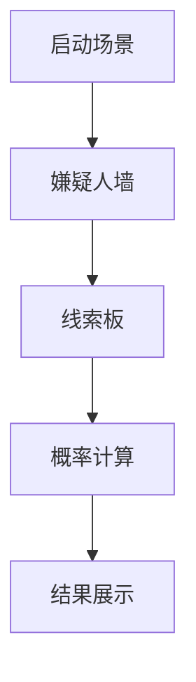

# 题目信息

# [蓝桥杯 2022 国 B] 故障

## 题目描述

在软件或系统开发中，我们会遇到各种各样的故障。为了从故障现象反推故障原因，工程师们会总结一种叫做相关性矩阵的二维表格，来表示故障原因与故障现象之间的关系。比如:


其中每行表示一种故障原因，每一列表示一种故障现象。该矩阵表示故障原因 $A$ 可能产生故障现象 $2$、$3$、$4$，故障原因 $B$ 可能产生故障现象 $1$、$3$。

在实际开发过程中，如果出现了故障原因，工程师就可以根据故障现象，去计算每种故障原因产生的概率，并按照概率大小对故障原因进行排查，以达到快速定位故障原因的目的。

现在，我们假设系统开发中同一时间只会出现一种故障原因, 并且故障原 因引起各故障现象是独立事件。举个例子来说:

假设系统现在发生了故障原因 $A$, 有 $\frac{1}{3}$ 的概率出现故障现象 $2$，有 $\frac{1}{4}$ 的概率出现故障现象 $3$，有 $\frac{1}{2}$ 的概率出现故障现象 $4$。由于 $3$ 种现象是独立发生的，因此有 $\frac{1}{2 \times 3 \times 4}$ 的概率同时出现故障 $2$、$3$、$4$。

约定若相关性矩阵中没有 `x` 记号, 则表示该故障原因一定不会产生某故障现象，比如故障原因 $A$，一定不会产生故障现象 $1$。根据历史经验数据，我们统计得到了每一种故障原因出现的概率以及每一种故障原因对应的故障现象产生概率。

现在已知系统出现的故障现象，求问各个故障原因发生的概率。

## 说明/提示

对于所有测试用例，$1 \leq N \leq 40,1 \leq M \leq 20,0 \leq P_{i} \leq 100, \sum\left(P_{i}\right)=100$, $0 \leq P_{i j} \leq 100$。

蓝桥杯 2022 国赛 B 组 G 题。

## 样例 #1

### 输入

```
3 5
30 20 50
0 50 33 25 0
30 0 35 0 0
0 0 0 25 60
1
3```

### 输出

```
2 56.89
1 43.11
3 0.00```

# AI分析结果


# 💡 Kay的C++算法解析：故障概率分析 深入学习指南 💡

> 今天我们来分析蓝桥杯2022国赛B组的"故障"问题。这道题融合了概率论与算法实现，能帮助大家理解贝叶斯公式在实际问题中的应用。

## 1. 题目解读与核心算法识别

✨ **本题主要考察**：`概率论（贝叶斯公式）` + `模拟实现`

🗣️ **初步分析**：
> 解决"故障概率分析"就像当侦探破案：已知案发现场线索（故障现象），要推断各种嫌疑人（故障原因）的作案可能性。贝叶斯公式就是我们的"推理工具"，它能结合先验知识和现场证据计算后验概率。
> - **核心思路**：对每个故障原因，计算其导致已观察现象的概率，再归一化得到最终概率
> - **关键难点**：① 理解贝叶斯公式的物理意义 ② 处理未出现现象的概率 ③ 避免浮点精度误差
> - **可视化设计**：像素化侦探办公室场景，嫌疑人（故障原因）在左侧排开，右侧显示线索板（现象）。计算时，线索板高亮当前现象，嫌疑人头上概率条动态变化，配以打字机音效和"线索确认"音效

---

## 2. 精选优质题解参考

**题解一（FS_qwq）**
* **点评**：思路清晰直白，完整实现贝叶斯公式计算流程。代码结构规范（如独立概率转小数、现象标记数组），特别亮点是处理了浮点精度问题（比较时用1e-6容差）。变量命名`dp[i]`直观体现概率计算本质，边界处理严谨，可直接用于竞赛。

**题解二（行吟啸九州）**
* **点评**：算法实现高效简洁，使用`long double`提高计算精度。亮点是宏定义简化循环，结构体封装结果数据。核心逻辑`a[i].w *= (100 - p[i][j])`巧妙处理未出现现象，实践价值高。

**题解三（yanzixuan2024）**
* **点评**：面向对象风格突出，使用vector和set管理数据。亮点是通过结构体运算符重载实现多条件排序，"似然度计算"步骤注释清晰。适合学习现代C++特性，但部分操作（如set查找）略增加复杂度。

---

## 3. 核心难点辨析与解题策略

1.  **贝叶斯公式的应用转化**
    * **分析**：需将题目场景映射到概率公式 $P(原因|现象)=\frac{P(现象|原因)×P(原因)}{P(现象)}$。优质题解通过`dp[i]=a[i]`（先验）乘`b[i][j]`（似然）实现分子计算
    * 💡 **学习笔记**：贝叶斯本质是"用新证据更新原有认知"

2.  **未出现现象的概率处理**
    * **分析**：未发生的现象j需按$1-P(j|原因)$计算。题解中用`if(vis[j])...else...`结构区分处理，`(100 - p[i][j])/100`巧妙实现互补概率
    * 💡 **学习笔记**：未发生现象的影响同样重要！

3.  **浮点精度与稳定性**
    * **分析**：概率连乘可能导致下溢或精度误差。题解一采用容差比较，题解二使用long double，归一化时用`sum`变量避免重复计算
    * 💡 **学习笔记**：概率计算要警惕累积误差

### ✨ 解题技巧总结
- **问题建模能力**：将现实问题抽象为概率模型
- **边界完备性**：特别注意0概率和100%概率的边界情况
- **数值稳定性**：小概率连乘时考虑对数变换或高精度浮点

---

## 4. C++核心代码实现赏析

**通用核心实现参考**
```cpp
#include <iostream>
#include <algorithm>
#include <iomanip>
using namespace std;

struct Reason {
    int id;
    double prob;
};

int main() {
    // 输入处理
    int N, M, K, tmp;
    cin >> N >> M;
    double prior[41] = {0};      // 先验概率
    double matrix[41][21] = {0}; // 现象概率矩阵
    bool occur[21] = {false};     // 出现现象标记
    
    for (int i = 1; i <= N; i++) 
        cin >> prior[i];
    
    for (int i = 1; i <= N; i++)
        for (int j = 1; j <= M; j++)
            cin >> matrix[i][j];
    
    cin >> K;
    for (int i = 0; i < K; i++) {
        cin >> tmp;
        occur[tmp] = true;
    }
    
    // 贝叶斯计算
    Reason res[41];
    double total = 0;
    
    for (int i = 1; i <= N; i++) {
        double p = prior[i] / 100.0; // 先验概率
        
        for (int j = 1; j <= M; j++) {
            if (occur[j]) p *= matrix[i][j] / 100.0;
            else p *= (100 - matrix[i][j]) / 100.0;
        }
        
        res[i] = {i, p};
        total += p;
    }
    
    // 归一化与排序
    for (int i = 1; i <= N; i++)
        res[i].prob = (res[i].prob / total) * 100;
    
    sort(res + 1, res + N + 1, [](auto& a, auto& b) {
        return a.prob > b.prob || 
              (a.prob == b.prob && a.id < b.id);
    });
    
    // 输出
    cout << fixed << setprecision(2);
    for (int i = 1; i <= N; i++)
        cout << res[i].id << " " << res[i].prob << endl;
}
```

**代码解读概要**：
> 1. 输入处理：读取故障原因数(N)、现象数(M)、先验概率和概率矩阵
> 2. 现象标记：用bool数组记录出现的故障现象
> 3. 概率计算：对每个原因，先乘先验概率，再根据现象出现与否连乘条件概率
> 4. 归一化：所有原因概率求和后，计算各原因占比
> 5. 排序输出：按概率降序排列，概率相同则按ID升序

---

## 5. 算法可视化：像素动画演示

* **主题**："侦探事务所"像素破案模拟
* **核心演示**：贝叶斯公式动态计算过程

**动画设计**：


1. **场景初始化**：
   - 左侧：8-bit像素风嫌疑人墙（每个故障原因）
   - 右侧：线索板（故障现象列表）
   - 控制面板：步进/播放/速度滑块

2. **现象输入阶段**：
   - 选择现象时像素放大+闪烁
   - 音效：线索确认"叮"声

3. **概率计算阶段**：
   - 当前计算的现象高亮闪烁
   - 嫌疑人头上概率条实时变化
   - 音效：键盘敲击声（每步计算）

4. **归一化演示**：
   - 所有概率条汇总为总概率池
   - 按比例重新分配概率条长度

5. **结果展示**：
   - 嫌疑人按概率排序出场
   - 概率最高者获得"侦探勋章"
   - 音效：胜利小调+掌声

**交互设计**：
- 步进模式：按空格键分步执行
- 自动模式：像素侦探自动推理
- 对比模式：并行展示不同现象组合的影响

---

## 6. 拓展练习与相似问题思考

* **通用技巧迁移**：
  贝叶斯公式适用于所有"由果推因"场景：
  1. 医疗诊断：根据症状推断疾病
  2. 垃圾邮件过滤：根据关键词判断邮件类型
  3. 系统诊断：根据报错日志定位故障模块

* **练习推荐**：
  1. **P1541 疾病诊断**  
     🗣️ 直接应用贝叶斯公式，巩固基础
  2. **P1868 条件概率**  
     🗣️ 强化概率计算与边界处理能力
  3. **P2119 贝叶斯分类器**  
     🗣️ 进阶练习，涉及概率与机器学习

---

本次故障分析指南就到这里。记住，贝叶斯公式是强大的"概率推理引擎"，掌握它你就能在算法世界中化身侦探！💪

---
处理用时：107.28秒