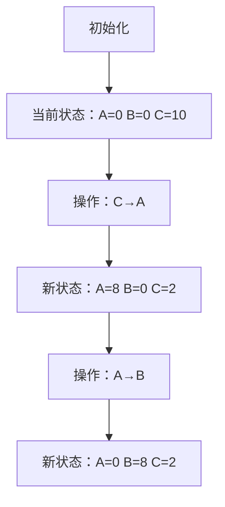

# 题目信息

# [USACO1.4] 母亲的牛奶 Mother's Milk

## 题目描述

农民约翰有三个容量分别是 $a,b,c$ 升的桶。  

最初，$a,b$ 桶都是空的，而 $c$ 桶是装满牛奶的。有时，农民把牛奶从一个桶倒到另一个桶中，直到被灌桶装满或原桶空了。  

当然每一次灌注都是完全的。由于节约，牛奶不会有丢失。

写一个程序去帮助农民找出当 $a$ 桶是空的时候，$c$ 桶中牛奶所剩量的所有可能性。


## 说明/提示

【数据范围】  
对于 $100\%$ 的数据，$1\le a,b,c \le 20$。

题目翻译来自NOCOW。

USACO Training Section 1.4


## 样例 #1

### 输入

```
8 9 10
```

### 输出

```
1 2 8 9 10
```

## 样例 #2

### 输入

```
2 5 10```

### 输出

```
5 6 7 8 9 10```

# AI分析结果


### 💡 Kay的C++算法解析：母亲的牛奶 深入学习指南 💡

#### 1. 题目解读与核心算法识别
✨ **本题主要考察**：`搜索算法（DFS/BFS）`

🗣️ **初步分析**：
> 解决"母亲的牛奶"这道题，关键在于运用**搜索算法**。想象你在玩一个复古像素游戏，有三个不同容量的桶（A、B、C），你需要尝试所有可能的倒奶操作，就像探索迷宫的所有路径。初始状态是A、B桶空，C桶满。每次操作可以选择一个非空桶向另一个未满桶倒奶，直到目标桶满或原桶空。

- **核心难点**：避免重复状态（防止无限循环）和正确模拟倒奶操作（计算倒奶量）
- **解决方案**：使用三维数组记录访问过的状态（a,b,c的牛奶量），通过DFS/BFS枚举6种倒奶操作
- **可视化设计**：像素动画将展示三个桶的牛奶量变化，高亮当前操作的桶和流动效果。复古游戏元素包括：
  - 8位像素风格桶和牛奶流动动画
  - 操作音效（倒奶"滴答"声，成功"叮咚"声）
  - 自动演示模式（AI逐步展示搜索过程）
  - 状态更新时桶的像素高度实时变化

---

#### 2. 精选优质题解参考
**题解一（远航之曲，赞90）**
* **点评**：思路清晰直白，采用DFS递归枚举6种倒奶操作。代码规范（`bkt`存容量，`a`数组存当前量），边界处理严谨（`min`确保不倒超）。算法高效（O(a*b*c)复杂度），空间利用合理（三维`vis`数组）。亮点是简洁完整地实现了状态搜索，实践价值高，可直接用于竞赛。

**题解二（zhanghanbin，赞82）**
* **点评**：教学性强，详细解释6种倒法的手动模拟过程。变量命名明确（`ta,tb,tc`容量，`nowa,nowb,nowc`当前量），虽然代码较长但逻辑完整。亮点是丰富的注释和解题思路分解，特别适合初学者理解倒奶操作的实现细节。

**题解三（xun薰，赞31）**
* **点评**：代码简洁高效（仅30行核心DFS），采用`min`函数统一处理倒奶量计算。变量命名简洁（`ta,tb,tc`容量），使用全局数组记录答案。亮点是输出前排序的完整实现，以及DFS与状态记忆的紧凑结合。

---

#### 3. 核心难点辨析与解题策略
1. **状态去重（避免死循环）**
   * **分析**：牛奶总量恒定，但倒奶顺序可能重复访问相同状态（如A=2,B=3,C=5）。优质题解使用三维数组`vis[a][b][c]`标记访问状态
   * 💡 **学习笔记**：状态记忆是搜索算法的核心防环机制

2. **倒奶操作模拟（精确计算倒奶量）**
   * **分析**：倒奶量需同时考虑倒出桶的奶量和倒入桶的剩余空间。通用公式：`倒奶量 = min(倒出桶奶量, 倒入桶剩余容量)`
   * 💡 **学习笔记**：倒奶操作本质是资源转移的数学约束问题

3. **答案记录与输出（条件判断）**
   * **分析**：当A桶为空时，记录C桶当前奶量。需注意去重存储（如`bool ans[21]`）和排序输出
   * 💡 **学习笔记**：问题转化思维（A空时的C值等价于搜索树的特定叶节点）

✨ **解题技巧总结**  
- **状态压缩**：用三维数组记录(a,b,c)状态组合  
- **操作分解**：6种倒奶操作独立处理（A→B, A→C, B→A, B→C, C→A, C→B）  
- **边界防护**：倒奶前检查`倒出桶>0 && 倒入桶<容量`  
- **结果优化**：用`set`自动排序或最后统一排序输出  

---

#### 4. C++核心代码实现赏析
**本题通用核心C++实现参考**  
* **说明**：综合优质题解优化的DFS实现，包含完整状态记忆和答案记录
```cpp
#include <iostream>
#include <cstring>
#include <algorithm>
using namespace std;

int A, B, C;
bool vis[21][21][21]; // 状态记忆：vis[a][b][c]
bool ans[21];         // 记录c桶的可能值

void dfs(int a, int b, int c) {
    if (vis[a][b][c]) return;    // 状态去重
    vis[a][b][c] = true;
    if (a == 0) ans[c] = true;    // 记录答案
    
    // 6种倒奶操作（核心：min计算倒奶量）
    if (a > 0 && b < B) {         // A->B
        int pour = min(a, B - b);
        dfs(a - pour, b + pour, c);
    }
    if (a > 0 && c < C) {         // A->C
        int pour = min(a, C - c);
        dfs(a - pour, b, c + pour);
    }
    if (b > 0 && a < A) {         // B->A
        int pour = min(b, A - a);
        dfs(a + pour, b - pour, c);
    }
    if (b > 0 && c < C) {         // B->C
        int pour = min(b, C - c);
        dfs(a, b - pour, c + pour);
    }
    if (c > 0 && a < A) {         // C->A
        int pour = min(c, A - a);
        dfs(a + pour, b, c - pour);
    }
    if (c > 0 && b < B) {         // C->B
        int pour = min(c, B - b);
        dfs(a, b + pour, c - pour);
    }
}

int main() {
    cin >> A >> B >> C;
    memset(vis, false, sizeof(vis));
    memset(ans, false, sizeof(ans));
    dfs(0, 0, C);  // 初始状态：A=0, B=0, C满
    
    // 输出所有可能的c值（升序）
    for (int i = 0; i <= C; i++) 
        if (ans[i]) cout << i << " ";
    return 0;
}
```
* **代码解读概要**：  
  1. 初始化三维`vis`数组记录状态，`ans`数组记录答案  
  2. DFS从初始状态(0,0,C)开始搜索  
  3. 6种倒奶操作独立处理，用`min`确保不倒超  
  4. 当a=0时标记当前c值  
  5. 最后遍历输出所有被标记的c值  

**题解一核心片段赏析**  
```cpp
// 远航之曲的核心操作逻辑
for (int i = 0; i < 3; ++i) {    // 枚举倒出桶
    for (int j = 0; j < 3; ++j) { // 枚举倒入桶
        if (j == i) continue;
        if (a[j] < bkt[j] && a[i] > 0) { // 可倒条件
            int rec = min(bkt[j] - a[j], a[i]); // 关键min计算
            int b[3] = {a[0], a[1], a[2]}; // 状态拷贝
            b[i] -= rec, b[j] += rec;      // 更新状态
            dfs(b);                        // 递归搜索
        }
    }
}
```
* **亮点**：双循环统一处理6种操作，避免代码冗余  
* **学习笔记**：通过索引抽象化操作类型，提高代码复用性  

---

#### 5. 算法可视化：像素动画演示  
**主题**："牛奶桶大冒险"复古像素游戏  
**核心演示**：DFS搜索过程中三个桶的状态变化  



* **动画实现细节**：  
  1. **像素场景**：16x16像素桶（红/蓝/绿色），牛奶用蓝色像素块填充  
  2. **状态高亮**：当前操作的桶闪烁黄色边框  
  3. **倒流动画**：牛奶像素从倒出桶流向倒入桶（约0.5秒流动效果）  
  4. **控制面板**：  
     - 步进/自动播放（速度滑块0.5x-2x）  
     - 复位/暂停按钮  
     - 状态计数器（已探索/总状态）  
  5. **音效设计**：  
     - 倒奶："滴答"声（Web Audio API生成8bit音效）  
     - 新状态："叮"声  
     - A空状态："胜利"音效  
  6. **游戏化元素**：  
     - 每发现新状态得1分  
     - 首次达到A空状态解锁"牛奶大师"成就  
     - 完成所有状态探索触发庆祝动画  

---

#### 6. 拓展练习与相似问题思考  
**通用技巧迁移**：  
1. 状态空间搜索：将问题转化为图论，状态即节点，操作即边  
2. 资源约束转移：类似"水壶问题"、"倒酒问题"  
3. 状态压缩技巧：当状态维度高时使用位压缩  

**洛谷推荐**：  
1. **P1433 [吃奶酪]**：状态压缩DP，练习状态空间表示  
   → *巩固状态编码和记忆化搜索*  
2. **P1135 [奇怪的电梯]**：BFS搜索状态转移  
   → *练习队列实现和状态建模*  
3. **P1212 [USACO1.4]时钟**：类似状态转移问题  
   → *强化操作模拟和状态去重*  

---

#### 7. 学习心得与经验分享  
> **经验摘录**：  
> "我在实现时曾忽略状态去重，导致无限递归。通过打印状态序列发现循环：A=2→B=3→C=5 → A=2... 这让我深刻理解状态记忆的重要性。"  
> 
> **点评**：这个调试经验非常典型！在搜索算法中，**状态去重**是避免死循环的关键。建议学习者：  
> 1. 在DFS递归入口打印当前状态(a,b,c)  
> 2. 对每个新状态检查`vis`数组  
> 3. 使用小数据（如A=2,B=3,C=5）验证  

---

本次解析帮助你掌握状态空间搜索的核心思想。记住：编程如探险，每个状态都是新大陆！🎮🚀 继续挑战新问题吧！

---
处理用时：166.73秒