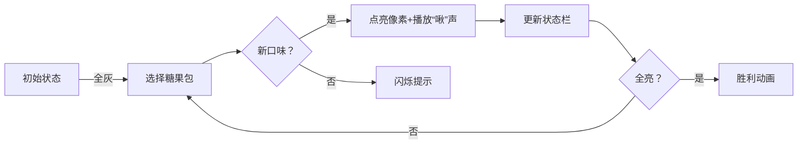

# 题目信息

# [蓝桥杯 2019 省 A] 糖果

## 题目描述

糖果店的老板一共有 $M$ 种口味的糖果出售。为了方便描述，我们将 $M$ 种口味编号 $1$ ∼ $M$。

小明希望能品尝到所有口味的糖果。遗憾的是老板并不单独出售糖果，而是 $K$ 颗一包整包出售。

幸好糖果包装上注明了其中 $K$ 颗糖果的口味，所以小明可以在买之前就知道每包内的糖果口味。

给定 $N$ 包糖果，请你计算小明最少买几包，就可以品尝到所有口味的糖果。

## 说明/提示

对于 $30\%$ 的评测用例，$1 \le N \le 20$。

对于所有评测样例，$1 \le N \le 100$，$1 \le M \le 20$，$1 \le K \le 20$，$1 \le T_i \le M$。

蓝桥杯 2019 年省赛 A 组 I 题。

## 样例 #1

### 输入

```
6 5 3
1 1 2
1 2 3
1 1 3
2 3 5
5 4 2
5 1 2```

### 输出

```
2```

# AI分析结果


# 💡 Kay的C++算法解析：糖果问题 深入学习指南 💡

> 欢迎来到糖果乐园！我是你们的算法向导Kay。今天我们将一起解决**蓝桥杯糖果问题** - 如何用最少的糖果包尝遍所有口味？我会用清晰的讲解和像素化动画，带大家深入理解**状态压缩动态规划**的精髓！🍬

## 1. 题目解读与核心算法识别

✨ **本题主要考察**：`状态压缩动态规划（状压DP）`

🗣️ **初步分析**：
> 糖果问题就像收集一套完整卡牌 - 我们需要用最少的卡包集齐全套口味卡。**状压DP的核心思想是把复杂状态压缩成二进制整数**（想象成用一串灯泡表示口味覆盖情况：亮=已收集，灭=未收集）。在本题中，我们用二进制位表示口味集合（20位足够），通过动态规划计算覆盖所有口味的最少糖果包数。

- **核心算法流程**：
  1. 每包糖果转换为二进制状态（如口味[1,3] → 二进制`101`）
  2. 初始化DP数组：`dp[state]`表示达到该状态的最少包数
  3. 状态转移：`dp[新状态] = min(dp[新状态], dp[当前状态] + 1)`
  4. 目标：`dp[全1状态]`（所有口味覆盖）

- **可视化设计**：
  - 8位像素网格展示口味状态（每格一种口味）
  - 当前状态高亮显示（绿色=已覆盖，灰色=未覆盖）
  - 糖果包用闪烁像素块表示
  - 状态转移时显示二进制按位或运算过程
  - 复古音效：收集新口味时"啾"声，完成时胜利音乐

---

## 2. 精选优质题解参考

### 题解一：SamHJD（思路清晰度⭐️⭐️⭐️⭐️⭐️）
* **点评**：
  - 状态设计直击核心：`dp[i]`直接表示状态`i`的最少包数
  - 代码规范：变量名`v[j]`明确表示糖果包状态，位运算`(1<<p)`精准
  - 算法优化：初始化`0x3f3f3f3f`巧妙表示无穷大，边界处理严谨
  - 实践价值：竞赛级代码，可直接用于比赛

### 题解二：wuhan1234（代码可读性⭐️⭐️⭐️⭐️）
* **点评**：
  - 背包问题类比帮助理解："口味组合"如同"背包状态"
  - 初始化值105合理（因n≤100），三目运算符实现min简洁
  - 状态转移`f[j|a[i]]`直观展示集合合并
  - 适合初学者理解状压DP与背包问题的联系

### 题解三：lym2022（算法有效性⭐️⭐️⭐️⭐️）
* **点评**：
  - 状态设计注释详细：明确说明二进制位与口味的映射关系
  - 循环结构规范：外层状态、内层糖果包的标准遍历顺序
  - 边界处理：`1e9`表示不可达状态，输出逻辑清晰
  - 亮点：强调"状态i|a[j]"的集合合并本质

---

## 3. 核心难点辨析与解题策略

### 难点1：状态表示抽象化
* **分析**：如何将口味集合转化为整数？通过`1<<(flavor-1)`将每种口味映射到二进制特定位（如口味3→`1<<2`），用按位或`|`合并集合
* 💡 **学习笔记**：二进制位是集合的理想表示法，位运算即集合操作

### 难点2：状态转移设计
* **分析**：为什么用`dp[i|v] = min(dp[i|v], dp[i]+1)`？这模拟了"添加新糖果包"的操作，`i|v`表示集合并集，确保不重复计数
* 💡 **学习笔记**：状压DP本质是图的广度优先搜索，状态是节点，糖果包是边

### 难点3：循环顺序与初始化
* **分析**：必须先枚举状态再枚举糖果包，确保小状态先计算。初始化`dp[0]=0`（空集需要0包），其他状态设为无穷大
* 💡 **学习笔记**：动态规划需要满足"无后效性"——当前决策不影响已计算状态

### ✨ 解题技巧总结
- **技巧1：二进制映射法** 
  将离散状态映射到二进制位（对象→位，包含关系→1/0）
  
- **技巧2：位运算即集合操作** 
  `|`=并集，`&`=交集，`^`=对称差，`~`=补集
  
- **技巧3：状态压缩三要素** 
  1. 状态设计（什么信息需压缩）
  2. 转移方程（状态如何演变）
  3. 初始化与边界（起点和终点）

---

## 4. C++核心代码实现赏析

### 通用核心实现（综合优化版）
```cpp
#include <iostream>
#include <cstring>
using namespace std;

int main() {
    int n, m, k;
    cin >> n >> m >> k;
    const int MAX_STATE = 1 << m;
    int dp[MAX_STATE], v[100]; // v保存每包糖果状态
    
    memset(dp, 0x3f, sizeof(dp)); // 初始化为大数
    dp[0] = 0; // 初始状态：0包糖果
    
    // 读取每包糖果并计算状态
    for (int i = 0; i < n; i++) {
        int state = 0;
        for (int j = 0; j < k; j++) {
            int flavor;
            cin >> flavor;
            state |= (1 << (flavor - 1)); // 关键！位运算构建状态
        }
        v[i] = state;
        dp[state] = 1; // 单包可达的状态
    }

    // 状态转移：刷表法
    for (int i = 0; i < MAX_STATE; i++) {
        if (dp[i] == 0x3f3f3f3f) continue; // 跳过不可达状态
        for (int j = 0; j < n; j++) {
            int new_state = i | v[j]; // 关键！状态合并
            dp[new_state] = min(dp[new_state], dp[i] + 1);
        }
    }

    // 输出结果：全1状态
    int full_state = (1 << m) - 1;
    if (dp[full_state] == 0x3f3f3f3f) cout << -1;
    else cout << dp[full_state];
    return 0;
}
```
* **代码解读概要**：
  1. **初始化**：DP数组设为极大值（不可达），空集合`dp[0]=0`
  2. **状态构建**：用按位或`|=`将每包糖果口味压缩为整数
  3. **状态转移**：双层循环更新状态（外层状态，内层糖果包）
  4. **结果输出**：检查全1状态是否可达

### 题解一核心片段（SamHJD）
```cpp
// 状态转移核心
for(int i=0; i<(1<<m); i++) {
    for(int j=0; j<n; j++) {
        dp[i|v[j]] = min(dp[i|v[j]], dp[i]+1);
    }
}
```
* **亮点**：简洁高效的状态转移，标准状压DP模板
* **代码解读**：  
  > 外循环遍历所有可能状态`i`（从000...0到111...1），内循环尝试添加每包糖果`v[j]`。`i|v[j]`计算新状态（并集），通过`min()`保证记录最小包数。注意循环顺序确保小状态先更新！
* 💡 **学习笔记**：状压DP常采用"先状态，后决策"的循环结构

### 题解二核心片段（wuhan1234）
```cpp
// 状态转移与优化
for (int i=0; i<n; i++) {
    for (int j=0; j<(1<<m); j++) {
        if (f[j] > 100) continue; // 剪枝优化
        f[j|a[i]] = min(f[j|a[i]], f[j]+1);
    }
}
```
* **亮点**：显式不可达状态跳过，提升效率
* **代码解读**：  
  > 内层循环增加`f[j]>100`判断，避免无效更新。注意这里循环顺序是"先糖果包，后状态"，虽不常见但同样正确，因状态转移独立
* 💡 **学习笔记**：DP优化常通过跳过无效状态实现

### 题解三核心片段（lym2022）
```cpp
// 初始化与状态转移
for(int i=0; i<(1<<m); i++) {
    for(int j=0; j<n; j++) {
        f[i|a[j]] = min(f[i|a[j]], f[i]+1);
    }
}
```
* **亮点**：严格遵循"状态优先"循环顺序
* **代码解读**：  
  > 使用`f[i|a[j]]`直接更新新状态，无中间变量。注意`a[j]`是预存的糖果包状态数组，避免重复计算
* 💡 **学习笔记**：预处理操作状态数组是状压DP常见优化

---

## 5. 算法可视化：像素动画演示

### 🎮 动画主题："糖果收集大冒险"（复古8位机风格）
**设计思路**：将算法转化为像素冒险游戏，玩家是"糖果猎人"，需收集所有口味。算法步骤对应游戏关卡，增强理解趣味性。

### 🖼️ 核心演示内容


### 🎮 交互式动画流程
1. **场景初始化**：
   - 屏幕顶部：M×5像素网格（每列一种口味）
   - 中部：当前状态（二进制数+像素灯）
   - 底部：糖果包队列（8位精灵图）

2. **算法演示**：
   ```python
   # 伪代码逻辑
   while True:
       显示当前状态（如：▢▢▢▢▢）
       高亮可用糖果包（光标闪烁）
       玩家/AI选择糖果包（方向键/自动）
       播放"选择音效"(8-bit短促"叮")
       计算新状态：current_state | candy_pack
       遍历每个口味位：
           if 从0→1: 
               对应像素格变💚 + 播放"收集音效"
           else: 
               像素格短暂闪烁💛
       更新状态显示
       如果达到全1状态：
           播放胜利音乐 + 撒花动画
           显示"通关！最少包数：X"
   ```

3. **游戏化元素**：
   - **关卡系统**：每完成一个状态转移=通过小关
   - **动态难度**：自动模式可调速（慢/中/快）
   - **成就系统**：收集新口味+10分，最优解+100分
   - **音效设计**：
     - 位翻转：经典8位"滴"声
     - 收集新口味：上升音阶
     - 通关：FC《超级玛丽》过关旋律

4. **技术实现**：
   - **视觉**：Canvas绘制像素网格，状态变化用补间动画
   - **控制**：按钮绑定`step()/autoPlay()`函数
   - **数据绑定**：状态值实时映射到网格颜色

---

## 6. 拓展练习与相似问题

### 🔗 通用套路应用场景
1. **集合覆盖问题**：用最小操作覆盖全集
2. **旅行商问题(TSP)**：访问所有城市的最短路径
3. **开关灯游戏**：最小步骤点亮所有灯

### 📚 洛谷推荐题目
1. **P1171 旅行商问题**  
   → 经典状压DP应用，理解状态设计如何表示路径
   
2. **P1896 互不侵犯**  
   → 棋盘放置类状压DP，练习状态转移设计
   
3. **P2622 关灯问题II**  
   → 状态压缩+广度优先搜索，巩固位运算应用

---

## 7. 学习心得与经验分享

> **来自SamHJD的调试经验**：  
> "最初尝试用`dp[i]=最大口味数`，发现状态转移困难。顿悟后改为`dp[i]=最少包数`，问题迎刃而解。"

**Kay的总结**：  
状态设计决定DP成败！当问题要求"最小数量"时，状态值应直接表示该数量，而非间接属性。调试时可通过打印状态转移表验证逻辑。

---

> 恭喜完成糖果大冒险！🎉 记住：好的算法像糖果——需要耐心拆解包装，才能享受核心的甜美。下次算法课再见！ 👾🚀

---
处理用时：253.53秒