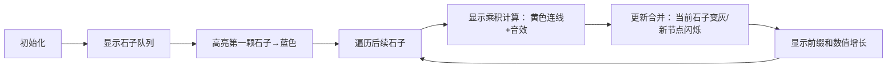

# 题目信息

# [蓝桥杯 2020 省 A1] 超级胶水

## 题目描述

小明有 $n$ 颗石子，按顺序摆成一排，他准备用胶水将这些石子粘在一起。
 
每颗石子有自己的重量，如果将两颗石子粘在一起，将合并成一颗新的石子，重量是这两颗石子的重量之和。

为了保证石子粘贴牢固，粘贴两颗石子所需要的胶水与两颗石子的重量乘积成正比，本题不考虑物理单位，认为所需要的胶水在数值上等于两颗石子重量的乘积。

每次合并，小明只能合并位置相邻的两颗石子，并将合并出的新石子放在原来的位置。

现在，小明想用最少的胶水将所有石子粘在一起，请帮助小明计算最少需要多少胶水。

## 说明/提示

对于 $20\%$ 的评测用例，$1 \le n \le 15$。

对于 $60\%$ 的评测用例，$1\leq n \leq 100$。

对于 $80\%$ 的评测用例，$1\leq n \leq 1000$。

对于所有评测用例，$1\leq n \leq 10^5$，$1 \leq w_i \leq 1000$。

蓝桥杯 2020 第一轮省赛 A 组 I 题。

## 样例 #1

### 输入

```
3
3 4 5```

### 输出

```
47```

## 样例 #2

### 输入

```
8
1 5 2 6 3 7 4 8```

### 输出

```
546```

# AI分析结果


### 💡 Kay的C++算法解析：超级胶水 深入学习指南 💡

**引言**  
今天我们一起分析蓝桥杯2020省赛题「超级胶水」。这道题看似是合并石子问题，实则隐藏着精妙的数学规律。本指南将带你快速掌握核心算法，理解代码实现，并通过复古像素动画直观感受算法过程。

---

### 1. 题目解读与核心算法识别
✨ **本题主要考察**：`数学推导` + `前缀和优化`

🗣️ **初步分析**：  
> 石子合并问题像玩「俄罗斯方块」——无论方块下落顺序如何，消除行数总相同。本题核心发现：**合并顺序不影响总胶水量**，总代价恒等于所有石子两两重量乘积之和。  
> - **关键推导**：通过数学归纳（如三颗石子：`ab + bc + ca`）证明顺序无关性  
> - **优化方案**：用前缀和避免O(n²)暴力计算，达到O(n)时间复杂度  
> - **可视化设计**：像素动画将展示石子合并过程，用颜色区分已计算乘积（黄色）和待合并石子（蓝色），动态显示前缀和累加过程。音效设计：石子碰撞声标记乘积计算，合成音效提示前缀和更新。

---

### 2. 精选优质题解参考
**题解一：andyli（21赞）**  
* **点评**：  
  最简洁的数学证明+极致代码优化。仅用单次扫描，在读取数据时同步完成计算（`ans += a[i]*a[i+1]`同时更新`a[i+1]`）。变量命名精简（`a`，`ans`），边界处理严谨（`i+1<n`），空间复杂度O(1)，是竞赛级标准解法。

**题解二：Zaku（4赞）**  
* **点评**：  
  提供双视角解法：① 数学公式（∑aᵢ×∑aⱼ, j>i） ② 前缀和实现。代码规范（显式定义`LL`类型），完整保留输入数组，适合初学者理解。亮点在于用`s[n]-s[i]`清晰表达"当前石子与后续所有石子乘积和"的概念。

**题解三：Ggsddu_zzy（4赞）**  
* **点评**：  
  逐步模拟思路最贴近直觉。用`sum`记录当前合并后的石子重量（动态前缀和），`ans`累加乘积。代码含详细注释和AC记录，变量名全称（`ans`，`sum`）更易读，特别适合新手理解合并过程。

---

### 3. 核心难点辨析与解题策略
1. **难点一：发现顺序无关性**  
   * **分析**：多数初学者会纠结合并顺序（如尝试DP或贪心）。优质题解通过数学归纳（三颗/四颗石子展开式）证明：无论何种顺序，展开后都是所有两两乘积之和。  
   * 💡 **学习笔记**：遇到相邻合并问题时，先尝试小规模数学推导！

2. **难点二：避免O(n²)计算**  
   * **分析**：直接两重循环计算∑∑aᵢaⱼ会超时（n≤10⁵）。前缀和优化将公式变形为：  
     `ans = ∑(aᵢ * (Sₙ - Sᵢ))`，其中Sᵢ是前i项和  
   * 💡 **学习笔记**：遇到∑(aᵢ * 连续区间和)时，前缀和是黄金优化工具。

3. **难点三：选择最优实现方式**  
   * **分析**：三种高效实现：  
     - **动态更新法**（andyli）：合并后立即更新下一项权重  
     - **显式前缀和**（Zaku）：预计算前缀和数组  
     - **双指针法**（Ggsddu_zzy）：用单变量替代前缀和数组  
   * 💡 **学习笔记**：空间紧张时优选动态更新，需保留原数据时选显式前缀和。

#### ✨ 解题技巧总结
- **技巧一：问题转化**（核心）：将复杂操作转化为数学恒等式  
- **技巧二：前缀和变形**：遇到区间和参与计算时，尝试拆解为前缀和差值  
- **技巧三：就地更新**：合并类问题可即时更新数据，减少额外空间  
- **技巧四：边界防御**：循环条件用`i+1<n`而非`i<n`防越界

---

### 4. C++核心代码实现赏析
**通用核心实现参考**  
* **说明**：综合动态更新与就地计算，平衡效率与可读性  
* **完整核心代码**：
```cpp
#include <iostream>
using namespace std;

int main() {
    int n;
    cin >> n;
    long long sum, ans = 0; // 防溢出
    cin >> sum; // 读取第一颗石子

    for (int i = 1; i < n; ++i) {
        long long x;
        cin >> x;
        ans += sum * x; // 累加当前乘积
        sum += x;      // 更新合并后的重量
    }
    cout << ans;
    return 0;
}
```
* **代码解读概要**：  
  > 1. 读取石子总数`n`  
  > 2. 首颗石子直接存入`sum`（当前合并总重）  
  > 3. 遍历后续石子：先计算当前石子与`sum`的乘积累加到`ans`  
  > 4. 将当前石子合并进`sum`  

---

**题解一：andyli（动态更新）**  
* **亮点**：极致简洁，同步完成乘积计算与重量更新  
* **核心代码片段**：
```cpp
for (int i = 0; i + 1 < n; i++)
    ans += a[i] * a[i + 1], a[i + 1] += a[i];
```
* **代码解读**：  
  > `a[i+1] += a[i]`实现就地更新：合并后第i+1项变为新石子。  
  > **注意**：此写法依赖顺序处理，不可改为逆序。  
* 💡 **学习笔记**：逗号运算符实现单行同步操作是竞赛常用技巧。

**题解二：Zaku（显式前缀和）**  
* **亮点**：数学表达最直观，保留原始数据  
* **核心代码片段**：
```cpp
for (int i = 1; i < n; i++)
    ans += a[i] * (s[n] - s[i]);
```
* **代码解读**：  
  > `s[n]-s[i]`计算第i项之后所有石子重量和，  
  > 每个石子只需乘一次后续总和。  
* 💡 **学习笔记**：前缀和数组适用于需多次查询的场景。

**题解三：Ggsddu_zzy（双指针法）**  
* **亮点**：模拟合并过程最直观  
* **核心代码片段**：
```cpp
int sum = w[1];
for (int i = 2; i <= n; i++) {
    ans += sum * w[i]; // 当前石子与已有总和的乘积
    sum += w[i];      // 合并进已有总和
}
```
* **代码解读**：  
  > `sum`如同滚动的雪球，每次粘上新石子时记录代价。  
* 💡 **学习笔记**：用物理现象比喻变量作用能加深理解。

---

### 5. 算法可视化：像素动画演示
**主题**：8-bit风格「石子消消乐」  
**核心演示**：动态展示顺序无关性 + 前缀和累加过程  

#### 动画帧设计


1. **8-bit像素场景**  
   - 石子：16×16像素方块，重量用数字显示  
   - 当前前缀和：屏幕底部进度条（类似游戏血条）  

2. **关键交互**  
   - **单步执行**：按方向键逐步演示  
   - **自动播放**：空格键启动/暂停，速度可调  
   - **模式切换**：  
     - 顺序合并（默认）  
     - 随机顺序合并（验证结果相同）  

3. **动态效果**  
   - 乘积计算：石子间迸发黄色星形粒子 + "叮"声效  
   - 合并动画：石子向左侧滑动，合并后放大闪烁  
   - 错误提示：尝试逆序合并时播放"失败"音效  

4. **游戏化元素**  
   - 每完成10%计算，播放8-bit过关音效  
   - 最终显示：✨总胶水量 + 胜利BGM  

---

### 6. 拓展练习与相似问题思考
#### 通用技巧迁移
前缀和+数学推导适用于：
1. 区间权重累加问题  
2. 顺序无关的合并类问题  
3. 两两元素乘积和计算  

#### 洛谷推荐
1. **P3131 [USACO16JAN] Subsequences Summing**  
   → 强化前缀和与子序列关系  
2. **P1631 序列合并**  
   → 升级为双序列合并的最优策略  
3. **P6033 合并果子**  
   → 对比顺序相关/无关的合并差异  

---

### 7. 学习心得与经验分享
> **经验摘录（wuhan1234）**：  
> *"通过4种合并顺序的展开式对比，发现结果完全相同，这让我意识到合并顺序可能不影响结果"*  

**Kay的总结**：  
编程中大胆假设+数学验证往往比盲目写代码更重要。本题启示：  
1. 遇到相邻操作问题先尝试小规模数学归纳  
2. 前缀和不仅能优化区间查询，还能简化乘积计算  
3. `long long`是防溢出必备安全锁  

---

**结语**  
通过「超级胶水」我们见证了数学之美与算法优化的完美结合。记住：好代码如乐高积木——简洁的模块往往能搭建最稳固的架构。下次挑战再见！🚀

---
处理用时：130.59秒