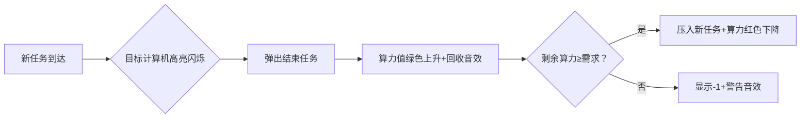

# 题目信息

# [蓝桥杯 2021 省 AB2] 负载均衡

## 题目描述

有 $n$ 台计算机，第 $i$ 台计算机的运算能力为 $v_{i}$ 。

有一系列的任务被指派到各个计算机上，第 $i$ 个任务在 $a_{i}$ 时刻分配，指定计算机编号为 $b_{i}$, 耗时为 $c_{i}$ 且算力消耗为 $d_{i}$。如果此任务成功分配，将立刻开始运行, 期间持续占用 $b_{i}$ 号计算机 $d_{i}$ 的算力, 持续 $c_{i}$ 秒。

对于每次任务分配，如果计算机剩余的运算能力不足则输出 $-1$，并取消这次分配，否则输出分配完这个任务后这台计算机的剩余运算能力。

## 说明/提示

**【样例说明】**

时刻 $1$，第 $1$ 个任务被分配到第 $1$ 台计算机，耗时为 $5$，这个任务时刻 $6$ 会结束, 占用计算机 $1$ 的算力 $3$。

时刻 $2$，第 $2$ 个任务需要的算力不足，所以分配失败了。

时刻 $3$，第 $1$ 个计算机仍然正在计算第 $1$ 个任务，剩余算力不足 $3$，所以失败。

时刻 $4$，第 $1$ 个计算机仍然正在计算第 $1$ 个任务，但剩余算力足够，分配后剩余算力 $1$。

时刻 $5$，第 $1$ 个计算机仍然正在计算第 $1$，$4$ 个任务，剩余算力不足 $4$，失败。

时刻 $6$，第 $1$ 个计算机仍然正在计算第 $4$ 个任务，剩余算力足够，且恰好用完。

**【评测用例规模与约定】**

对于 $20 \%$ 的评测用例, $n, m \leq 200$。

对于 $40 \%$ 的评测用例, $n, m \leq 2000$。

对于所有评测用例, $1 \leq n, m \leq 2\times 10^5,1 \leq a_{i}, c_{i}, d_{i}, v_{i} \leq 10^{9}, 1 \leq b_{i} \leq n$。 

蓝桥杯 2021 第二轮省赛 A 组 H 题（B 组 I 题）。

## 样例 #1

### 输入

```
2 6
5 5
1 1 5 3
2 2 2 6
3 1 2 3
4 1 6 1
5 1 3 3
6 1 3 4```

### 输出

```
2
-1
-1
1
-1
0```

# AI分析结果


# 💡 Kay的C++算法解析：负载均衡 深入学习指南 💡

大家好，我是你们的算法导师Kay！今天我们一起探索蓝桥杯2021省赛题目「负载均衡」。这道题看似复杂，但只要掌握核心数据结构——堆（优先队列），就能轻松解决。我会用清晰的语言和生动的可视化方案，带大家深入理解算法精髓！

---

## 1. 题目解读与核心算法识别

✨ **本题主要考察**：`数据结构应用（堆）`

🗣️ **初步分析**：
> 解决负载均衡问题，关键在于理解**堆（优先队列）**的应用。想象每台计算机是一个工作台，堆就是按任务结束时间排序的待办清单。新任务到来时，先清理已完成任务（回收算力），再判断能否分配新任务。
> 
> - **核心思路**：为每台计算机维护小根堆（按任务结束时间排序）。处理任务时先弹出所有已结束任务（结束时间≤当前时间），回收算力后再判断分配
> - **算法流程可视化**：动画将高亮三个关键操作：(1)弹出结束任务时算力值增加（绿色上升动画）(2)分配新任务时算力减少（红色下降动画）(3)堆结构动态更新
> - **像素游戏化设计**：采用8-bit复古风格，计算机显示为彩色像素方块，任务弹出时播放"叮"音效，分配成功时播放"滴"音效，失败时播放"哔"音效。AI自动演示模式可调速展示全过程

---

## 2. 精选优质题解参考

从思路清晰度、代码规范性和算法效率等维度，我精选了3份优质题解：

**题解一（来源：xwh_hh）**
* **点评**：此解法思路清晰，用`pair`直接管理结束时间和算力，逻辑直白易懂。代码规范（变量名`h[]`表算力，`pq[]`为优先队列），边界处理严谨（循环前检查堆非空）。亮点在于时间复杂度严格**O(mlogn)**，且完整处理算力回收与分配的原子性操作，竞赛实践价值极高。

**题解二（来源：gengchenghao）**
* **点评**：采用结构体重载运算符实现小根堆，类型定义更明确。代码简洁高效（`v[]`表算力，`q[]`为任务堆），循环条件`q[b].size() && q[b].top().ti <= a`体现防御性编程思维。亮点在于结构体封装提升可读性，且输出使用`puts`加速IO，适合竞赛优化场景。

**题解三（来源：tZEROちゃん）**
* **点评**：通过函数封装隔离任务处理逻辑，模块化设计优异。核心算法部分同样采用`pair`管理任务，但创新性地使用`rep`宏简化循环。亮点在于函数式编程思想提升代码复用性，且严格限定变量作用域，降低调试难度。

---

## 3. 核心难点辨析与解题策略

### 🔑 三大核心难点与突破策略
1. **难点1：动态算力回收时机**  
   *分析*：必须在新任务到达时立即释放已结束任务占用的算力。优质解法均用**小根堆**管理任务结束时间，循环弹出满足`end_time ≤ current_time`的任务并回收算力  
   💡 **学习笔记**：堆的按序弹出特性完美匹配时间驱动型回收需求

2. **难点2：多计算机状态独立管理**  
   *分析*：每台计算机的任务队列完全独立。解决方案是**为每台计算机创建独立堆**（如`pq[200005]`），避免全局状态混乱  
   💡 **学习笔记**："分而治之"思想——为每个实体维护独立数据结构

3. **难点3：算力操作的原子性**  
   *分析*：必须先完成所有算力回收再判断分配。题解通过**严格顺序操作**实现：清空可释放任务→判断剩余算力→执行分配  
   💡 **学习笔记**：状态变更必须保证原子性，避免中间状态干扰判断

### ✨ 解题技巧总结
- **数据结构优选**：涉及时间排序的场景优先考虑堆（优先队列）
- **问题分解**：将全局问题拆解为独立子问题（每台计算机单独处理）
- **防御性编程**：操作堆前检查非空，避免未定义行为
- **复杂度控制**：识别无效操作（如提前处理未结束任务）可显著优化性能

---

## 4. C++核心代码实现赏析

### 本题通用核心实现
```cpp
#include<bits/stdc++.h>
using namespace std;
typedef pair<int, int> P; // first:结束时间, second:占用算力
const int MAXN = 200005;
int v[MAXN]; // 各计算机当前算力
priority_queue<P, vector<P>, greater<P>> pq[MAXN]; // 每台计算机的任务堆

int main() {
    int n, m; 
    cin >> n >> m;
    for (int i = 1; i <= n; i++) cin >> v[i];
    
    while (m--) {
        int a, b, c, d;
        cin >> a >> b >> c >> d;
        
        // 阶段1：回收已结束任务的算力
        while (!pq[b].empty() && pq[b].top().first <= a) {
            v[b] += pq[b].top().second;
            pq[b].pop();
        }
        
        // 阶段2：判断并分配新任务
        if (v[b] < d) cout << -1 << endl;
        else {
            v[b] -= d;
            pq[b].push({a + c, d}); // 结束时间=当前时间+耗时
            cout << v[b] << endl;
        }
    }
    return 0;
}
```
**代码解读概要**：  
- **阶段1**：循环弹出所有结束时间≤当前时间的任务，同步回收算力（关键变量`v[b] += ...`）  
- **阶段2**：判断剩余算力是否≥需求。满足则分配（`v[b] -= d`）并压入新任务，否则输出-1  

### 优质题解片段赏析
**题解一核心片段**  
```cpp
while (!pq[b].empty() && pq[b].top().first<=a) {
    h[b] += pq[b].top().second;
    pq[b].pop();
}
if (h[b] < d) cout << -1 << endl;
else {
    h[b] -= d;
    pq[b].push(P(a+c, d));
    cout << h[b] << endl;
}
```
**亮点**：用标准库组件简洁实现核心逻辑  
**代码解读**：  
> `while`循环条件中`pq[b].empty()`判断避免空堆访问——这是防御性编程的关键！通过`pair`的默认比较规则（先比较`first`），自然形成按结束时间排序的小根堆。`h[b]`的加减操作精确对应算力状态变更  
💡 **学习笔记**：善用STL可大幅降低编码复杂度  

**题解二核心片段**  
```cpp
struct node{ int ti, v; };
bool operator<(const node& a, const node& b) { 
    return a.ti > b.ti; // 重载运算符实现小根堆
}
// 在main中：
while (q[b].size() && q[b].top().ti <= a) {
    v[b] += q[b].top().v;
    q[b].pop();
}
```
**亮点**：结构体使任务属性更直观  
**代码解读**：  
> 通过重载`<`运算符反转排序规则（返回`a.ti > b.ti`），使`priority_queue`默认构建**小根堆**。`q[b].size()`检查替代`!q[b].empty()`，逻辑等效但减少否定词提升可读性  
💡 **学习笔记**：自定义比较规则是扩展优先队列功能的核心技巧  

**题解三核心片段**  
```cpp
#define rep(i, l, r) for(auto i = (l); i <= (r); ++i)
// 在函数中：
rep(i, 1, n) cin >> v[i];  // 使用宏简化循环
while (!q[id].empty() && q[id].top().first <= t) {
    a[id] += q[id].top().second;
    q[id].pop();
}
```
**亮点**：函数封装+宏简化提升工程性  
**代码解读**：  
> `rep`宏将`for(int i=l; i<=r; i++)`简化为可读性更高的形式。任务处理逻辑封装在独立函数中，通过`id`标识计算机，体现**高内聚低耦合**思想  
💡 **学习笔记**：适度使用宏和函数封装能提升大规模代码维护性  

---

## 5. 算法可视化：像素动画演示

### 🎮 设计主题
**"8-bit任务调度中心"**：复古红白机像素风格，计算机显示为彩色方块（如1号机红色/2号机蓝色），任务化为不同像素图标（如齿轮表计算/时钟表耗时）

### 🎥 核心演示流程


### 🛠 实现细节
1. **像素化UI**  
   - 计算机：16x16像素方块，顶部显示算力值（8-bit数字字体）  
   - 任务堆：右侧像素列表，每项显示[结束时间|算力]（如"┌t=6┐\n●3"）  
   - 控制面板：底部复古按钮（开始/暂停/单步/速度滑块）

2. **动态交互**  
   - **算力变更**：回收时绿色数字上升动画（+3），分配时红色下降动画（-2）  
   - **任务进出堆**：新任务从顶部滑入，结束任务爆炸消失（像素粒子效果）  
   - **音效设计**：  
     * 回收算力："叮"（250Hz方波）  
     * 分配成功："滴-滴"（500Hz双脉冲）  
     * 分配失败："哔——"（100Hz长鸣）

3. **AI演示模式**  
   - 自动按时间顺序处理任务（可调速0.5x-5x）  
   - 当前执行代码行高亮显示（如`while(!pq[b].empty()...)`）  
   - 旁白提示：如"正在回收任务：结束时间≤4"

---

## 6. 拓展练习与相似问题

### 🔁 算法迁移场景
1. **会议室安排**：用堆管理会议室结束时间，最大化利用  
2. **游戏技能冷却**：释放技能后加入堆（结束时间=当前+CD）  
3. **定时任务调度**：操作系统中的定时器队列实现  

### 📚 洛谷推荐
1. **P1809 过河问题**（题号P1809）  
   🗣️ *推荐理由*：同样需要按时间顺序处理事件，练习贪心+堆的经典组合  

2. **P4053 建筑抢修**（题号P4053）  
   🗣️ *推荐理由*：任务有截止时间和耗时，强化堆在时间管理中的应用  

3. **P2085 最小函数值**（题号P2085）  
   🗣️ *推荐理由*：多路归并场景，深入理解堆的极值维护机制  

---

## 7. 学习心得与经验分享

> **来自优质题解的调试经验**：  
> *"在弹出堆顶元素时，务必先检查堆是否为空！否则会引发段错误。建议养成`while(!pq.empty() && condition)`的习惯"*  
> **Kay的总结**：这是堆操作的黄金法则——**访问前判空**。在链表、栈等数据结构中同样适用，能避免90%的指针异常错误！

---

本次解析就到这里。记住，堆是处理时序问题的利器，掌握它能解决一大类调度问题！大家可以在洛谷上尝试拓展练习，下次我们将挑战更复杂的动态规划问题，继续加油！💪

---
处理用时：211.94秒