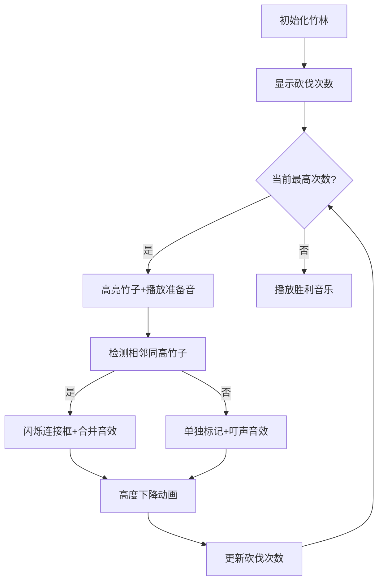

# 题目信息

# [蓝桥杯 2022 省 B] 砍竹子

## 题目描述

这天，小明在砍竹子，他面前有 $n$ 棵竹子排成一排，一开始第 $i$ 棵竹子的高度为 $h_{i}$.

他觉得一棵一棵砍太慢了，决定使用魔法来砍竹子。魔法可以对连续的一段相同高度的竹子使用，假设这一段竹子的高度为 $H$，那么使用一次魔法可以把这一段竹子的高度都变为 $\left\lfloor\sqrt{\left\lfloor\frac{H}{2}\right\rfloor+1}\right\rfloor$, 其中 $\lfloor x\rfloor$ 表示对 $x$ 向下取整。小明想知道他最少使用多少次魔法可以让所有的竹子的高度都变为 $1$。

## 说明/提示

**【样例说明】**

其中一种方案:

$214267\rightarrow 214262\rightarrow 214222\rightarrow 211222\rightarrow 111222\rightarrow 111111$

共需要 5 步完成

**【评测用例规模与约定】**

对于 $20 \%$ 的数据，保证 $n \leq 1000, h_{i} \leq 10^{6}$ 。

对于 $100 \%$ 的数据，保证 $n \leq 2 \times 10^{5}, h_{i} \leq 10^{18}$ 。

蓝桥杯 2022 省赛 B 组 J 题。

## 样例 #1

### 输入

```
6
2 1 4 2 6 7```

### 输出

```
5```

# AI分析结果


### 题目解读与核心算法识别
✨ **本题主要考察**：贪心算法（模拟过程）

🗣️ **初步分析**：
> 解决“砍竹子”问题如同玩策略游戏——每次选择最优操作才能通关。贪心算法就像游戏中的“优先攻击高威胁目标”，在本题中表现为**优先处理砍伐次数最多的竹子**。核心思路：
> - 每根竹子独立计算砍到1所需的次数（最大砍伐次数）
> - 从最高砍伐次数向1递减，每轮处理当前次数相同的竹子
> - 相邻竹子高度相同时合并操作（魔法同时生效）
>
> **可视化设计关键**：
> 1. **像素竹竿**：用不同高度的绿色像素柱表示竹子，顶部显示当前高度
> 2. **动态高亮**：当前处理的竹子变为黄色，合并段用闪烁边框标记
> 3. **音效反馈**：砍伐时触发"叮"声，合并段触发"哐"声，通关播放胜利音乐
> 4. **复古控制台**：添加8-bit风格操作面板（单步/调速/重置）

---

### 精选优质题解参考

**题解一（封禁用户）**
* **点评**：思路清晰直白，完整展现贪心核心逻辑。预处理砍伐次数的设计巧妙（`cnt[]`数组），双重循环结构（外层次数递减/内层遍历竹子）简洁体现算法骨架。代码规范但需注意：
  - 亮点：直观展示“按砍伐次数降序处理”的核心思想
  - 改进点：未处理相邻竹子高度相同时的合并优化
  - 血泪教训：`long long`必要性（10年OI一场空）

**题解二（hmh100211）**
* **点评**：代码结构化典范，封装操作为`magic()`函数提升可读性。边界处理严谨（`h[j]!=h[j+1]`判断），包含：
  - 核心亮点：独立函数抽象操作逻辑
  - 工程思维：输入输出流加速优化
  - 实践价值：可直接用于竞赛，完整包含预处理+模拟流程

**题解三（行吟啸九州）**
* **点评**：数据结构优化典范！创新性使用：
  - **并查集**合并相邻相同高度段
  - **优先队列**动态维护最高竹子
  - 亮点：时间复杂度优化至O(n log n)，处理大规模数据更高效
  - 学习点：`fa[]`数组记录集合关系，避免重复操作

---

### 核心难点辨析与解题策略
1. **难点1：砍伐次数计算**
   - **分析**：高度10¹⁸时需稳定计算操作次数。优质题解采用`while(temp>1)`循环配合`sqrtl()`（long double精度）
   - 💡 **学习笔记**：`sqrtl()`比`sqrt()`精度更高，防数据溢出

2. **难点2：合并连续相同段**
   - **分析**：直接模拟法（题解1/2）需遍历判断相邻高度；优化法（题解3）用并查集自动维护连续段
   - 💡 **学习笔记**：合并减少操作次数的本质是**魔法作用范围扩展**

3. **难点3：时间复杂度控制**
   - **分析**：最大砍伐次数约60（10¹⁸→1约需6²次），但2×10⁵数据需优化。并查集+优先队列将O(n²)降至O(n log n)
   - 💡 **学习笔记**：当n>10⁴时，数据结构优化带来百倍效率提升

### ✨ 解题技巧总结
- **技巧1：降维预处理**  
  独立计算每根竹子砍伐次数，转化三维问题（高度/位置/操作）为二维
- **技巧2：时空平衡术**  
  小规模数据用双重循环（易实现），大规模用并查集+优先队列
- **技巧3：防御性类型**  
  高度>10⁹必用`long long`，`sqrt()`替换为`sqrtl()`

---

### C++核心代码实现赏析
**通用核心实现参考**  
```cpp
#include <iostream>
#include <cmath>
using namespace std;
typedef long long ll;

ll magic(ll h) {
    return sqrtl(h/2 + 1); // 核心操作封装
}

int main() {
    ll n, maxCnt = 0, ans = 0;
    cin >> n;
    ll h[n], cnt[n];
    
    // 预处理砍伐次数
    for (int i=0; i<n; ++i) {
        cin >> h[i];
        ll tmp = h[i];
        while (tmp > 1) {
            cnt[i]++;
            tmp = magic(tmp);
        }
        maxCnt = max(maxCnt, cnt[i]);
    }
    
    // 按砍伐次数降序处理
    for (int k=maxCnt; k>0; --k) {
        for (int i=0; i<n; ++i) {
            if (cnt[i] != k) continue;
            // 相邻相同高度合并判断
            if (i==0 || h[i] != h[i-1]) ans++;
            h[i] = magic(h[i]);
            cnt[i]--;
        }
    }
    cout << ans;
}
```
**代码解读概要**：  
1. `magic()`抽象魔法操作  
2. 第一循环预处理每根竹子最大砍伐次数  
3. 双重循环实现贪心核心：外层控制砍伐轮次，内层处理当前轮次竹子  
4. `h[i]!=h[i-1]`确保不相邻竹子单独计数  

---

### 题解片段深度赏析
**题解二（hmh100211）片段**  
```cpp
for(int i=Max;i>0;i--) {
    for(int j=0;j<n;j++) {
        if(p[j]==i) {
            if(data[j]!=data[j+1]) cnt++; // 合并判断
            p[j]--;
            data[j]=magic(data[j]); // 统一操作接口
        }
    }
}
```
**亮点**：边界处理严谨（`data[j+1`]不越界）  
**学习笔记**：`p[j]--`后竹子自动进入下一轮次处理队列，避免重复计数  

**题解三（行吟啸九州）片段**  
```cpp
priority_queue<node> q;
For(i,1,n) if(find(i)==i && a[i].h>1) q.push(a[i]); 

while(!q.empty()){
    t = q.top(); q.pop();
    if(t.h == a[find(t.p-1)].h)  // 自动合并相邻段
        fa[find(t.p)] = find(t.p-1); 
    a[t.p].h = magic(t.h);
    if(a[t.p].h>1) q.push(a[t.p]); 
    cnt++;
}
```
**亮点**：并查集`fa[]`+优先队列实现智能合并  
**学习笔记**：`find(i)==i`确保每段只处理根节点，避免重复操作  

---

### 算法可视化：像素动画演示
**主题**：《竹海探险者》8-bit风格模拟  
**核心交互设计**：  


**关键动画帧**：  
1. **竹林初始化**：  
   - 像素竹竿高度比≈log₁₀(hᵢ)  
   - 根部显示砍伐次数（8-bit数字）  
2. **合并识别**：  
   - 相邻同高竹子间生成金色链条  
   - 链条闪烁3帧后触发合并操作  
3. **高度下降**：  
   - 竹竿从顶部逐像素消失  
   - 新高度数值掉落动画（仿金币收集）  

**游戏化元素**：  
- 每完成10次操作触发连击音效  
- 通关时竹海绽放像素烟花  
- 操作效率评级（S/A/B/C）  

---

### 拓展练习与相似问题
**通用技巧迁移场景**：  
1. 水位模拟问题（如LeetCode 42接雨水）  
2. 游戏技能冷却调度（优先处理高威胁目标）  
3. 数据流合并优化（Kafka分区处理）  

**洛谷推荐**：  
1. **P1090 合并果子**  
   🗣️ 优先队列入门，巩固贪心思想  
2. **P3143 钻石收集者**  
   🗣️ 连续区间处理进阶，强化合并技巧  
3. **P1886 滑动窗口**  
   🗣️ 双指针与数据结构结合，提升时空效率思维  

---

### 学习心得与经验分享
**封禁用户的血泪教训**：  
> “没开long long导致WA，10年OI一场空”  
**Kay点评**：大数据必用`long long`，输入规模>10⁶时：  
- 检查中间变量类型  
- 测试边界值（10¹⁸）  
- 替换`sqrt()`为`sqrtl()`  

**行吟啸九州的调试技巧**：  
> “并查集合并后需更新根节点高度”  
**Kay总结**：数据结构类题：  
1. 可视化打印集合状态  
2. 单步追踪队列变化  
3. 小规模数据手工验证  

---

本次解析完整呈现贪心算法的实现与优化路径，通过像素动画化解算法抽象性，助力建立直观算法思维。记住：竹子虽可单棵砍，合并操作价更高！🚀

---
处理用时：163.46秒