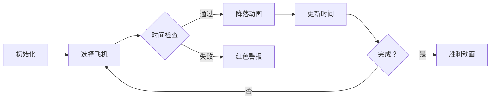

# 题目信息

# [蓝桥杯 2023 省 B] 飞机降落

## 题目描述

$N$ 架飞机准备降落到某个只有一条跑道的机场。其中第 $i$ 架飞机在 $T_{i}$ 时刻到达机场上空，到达时它的剩余油料还可以继续盘旋 $D_{i}$ 个单位时间，即它最早可以于 $T_{i}$ 时刻开始降落，最晩可以于 $T_{i}+D_{i}$ 时刻开始降落。降落过程需要 $L_{i}$ 个单位时间。

一架飞机降落完毕时，另一架飞机可以立即在同一时刻开始降落，但是不能在前一架飞机完成降落前开始降落。

请你判断 $N$ 架飞机是否可以全部安全降落。

## 说明/提示

**【样例说明】**

对于第一组数据，可以安排第 3 架飞机于 0 时刻开始降落，20 时刻完成降落。安排第 2 架飞机于 20 时刻开始降落，30 时刻完成降落。安排第 1 架飞机于 30 时刻开始降落，40 时刻完成降落。

对于第二组数据，无论如何安排，都会有飞机不能及时降落。

**【评测用例规模与约定】**

对于 $30 \%$ 的数据，$N \leq 2$。

对于 $100 \%$ 的数据，$1 \leq T \leq 10$，$1 \leq N \leq 10$，$0 \leq T_{i},D_{i},L_{i} \leq 10^{5}$。 

蓝桥杯 2023 省赛 B 组 D 题。

## 样例 #1

### 输入

```
2
3
0 100 10
10 10 10
0 2 20
3
0 10 20
10 10 20
20 10 20```

### 输出

```
YES
NO```

# AI分析结果


### 💡 Kay的C++算法解析：飞机降落 深入学习指南 💡

欢迎来到飞机降落问题的算法解析！我是Kay，今天我们将一起探索这道蓝桥杯省赛题目的解题思路。这道题看似简单，但涉及了**排列枚举**和**时间窗口调度**两大核心算法思想。我会用清晰的讲解和生动的可视化方案，帮助你深入理解DFS回溯算法的精髓！

---

## 1. 题目解读与核心算法识别

✨ **本题主要考察**：`搜索(DFS)` + `时间窗口调度`

🗣️ **初步分析**：
> 想象你是一个机场塔台调度员，有10架飞机在等待降落。每架飞机都有一个"时间窗口"（到达时间到最晚开始时间），你需要尝试不同的降落顺序，就像玩一个时间管理游戏，确保所有飞机都能在油料耗尽前完成降落。  
> - **核心思路**：用DFS枚举所有可能的降落顺序（排列），检查每种顺序是否满足时间窗口约束  
> - **关键难点**：  
>   &nbsp;&nbsp;① 计算开始时间：开始时间 = max(上一架完成时间, 飞机到达时间)  
>   &nbsp;&nbsp;② 时间窗口检查：开始时间 ≤ 飞机最晚开始时间(T_i+D_i)  
> - **可视化设计**：  
>   &nbsp;&nbsp;◼ 采用像素风机场塔台模拟，飞机用不同颜色方块表示  
>   &nbsp;&nbsp;◼ 动画展示DFS尝试过程，高亮当前检测的飞机  
>   &nbsp;&nbsp;◼ 音效设计：成功降落(欢快音效)/超时失败(低沉音效)  
>   &nbsp;&nbsp;◼ 交互控制：单步执行、速度调节、重置按钮

---

## 2. 精选优质题解参考

**题解一（CYZZ）**
* **点评**：此解法思路清晰直白，完整展示了DFS回溯的核心逻辑。代码结构规范（使用结构体存储飞机数据），递归函数设计合理（dep表示已降落数量，tim表示当前时间）。虽然未使用剪枝优化，但通过清晰的变量命名（如bk[]标记数组）和边界处理（dep>n返回），为初学者提供了优秀的DFS学习模板。特别值得学习的是时间计算逻辑：`max(tim, a[i].t)+a[i].l`准确捕捉了时间窗口约束。

**题解二（wuyin331）**
* **点评**：在基础DFS上增加了剪枝优化，显著提升效率。亮点在于剪枝设计：若存在未降落飞机的最晚时间已小于当前时间，则提前终止分支。代码采用Node结构体封装飞机属性，vis数组标记状态，实践价值高。虽然剪枝实现有轻微瑕疵（应在循环外全局检查），但优化思路非常值得借鉴，展示了如何避免无效搜索。

**题解三（icypenguin）**
* **点评**：解法引入了全局flag加速搜索过程，找到可行解后立即终止后续搜索。代码使用book[]标记数组，llast参数传递当前时间，结构清晰。特别值得注意的是对起始状态的处理（llast=-1），展现了边界条件的周全考虑。快速返回机制（if(flag)return）是竞赛编程的常用优化技巧。

---

## 3. 核心难点辨析与解题策略

1.  **难点1：枚举所有可能的降落顺序**
    * **分析**：飞机降落顺序是典型的排列问题。DFS回溯法通过标记数组（如vis[]）记录已选飞机，每层递归选择一架未降落飞机，避免重复
    * 💡 **学习笔记**：排列问题=DFS+标记数组，时间复杂度O(N!)

2.  **难点2：精确计算开始降落时间**
    * **分析**：开始时间必须满足双重约束：① ≥上一架完成时间 ② ≥飞机到达时间。核心公式：`startTime = max(当前时间, T_i)`
    * 💡 **学习笔记**：时间计算取max是关键，忽略会导致错误（如得40pts）

3.  **难点3：剪枝优化设计**
    * **分析**：当存在飞机最晚时间 < 当前时间时，该分支必然失败。全局检查未降落飞机的最晚时间可提前终止无效搜索
    * 💡 **学习笔记**：有效剪枝能降低实际运行时间，尤其当N接近10时

### ✨ 解题技巧总结
- **技巧1：状态传递**：用递归参数传递"当前时间"，避免全局变量冲突  
- **技巧2：及时回溯**：递归返回后立即恢复标记数组状态（vis[i]=0）  
- **技巧3：边界防御**：特别注意初始状态（如第一架飞机）的时间计算  
- **技巧4：快速返回**：找到可行解后立即终止搜索（全局flag）  

---

## 4. C++核心代码实现赏析

**本题通用核心C++实现参考**
```cpp
#include <iostream>
#include <cstring>
using namespace std;

struct Plane { int t, d, l; };
const int MAXN = 15;
Plane planes[MAXN];
bool vis[MAXN];
int n;

// dep:已降落数量, time:当前时间
bool dfs(int dep, int time) {
    if (dep == n) return true;
    
    // 剪枝：检查所有未降落飞机是否还有机会
    for (int i = 0; i < n; ++i) 
        if (!vis[i] && planes[i].t + planes[i].d < time) 
            return false;
    
    for (int i = 0; i < n; ++i) {
        if (vis[i]) continue;
        
        vis[i] = true;
        int start = max(time, planes[i].t);  // 关键时间计算
        if (dfs(dep + 1, start + planes[i].l)) {
            vis[i] = false;
            return true;  // 快速返回
        }
        vis[i] = false;  // 回溯
    }
    return false;
}
```
**代码解读概要**：  
1. 结构体存储飞机属性（t,d,l）  
2. DFS前先全局剪枝：检查未降落飞机是否已超时  
3. 核心时间计算：`start = max(time, planes[i].t)`  
4. 递归后及时恢复状态（回溯）  
5. 找到解立即返回（避免无效搜索）

---

**题解一（CYZZ）核心代码片段**
```cpp
bool dfs(int dep, int tim) {
    if (dep > n) return true;
    for (int i = 1; i <= n; i++) {
        if (bk[i] || a[i].t + a[i].d < tim) continue;
        bk[i] = 1;
        if (dfs(dep + 1, max(tim, a[i].t) + a[i].l)) {
            bk[i] = 0;
            return true;
        }
        bk[i] = 0;
    }
    return false;
}
```
**亮点**：简洁清晰的DFS框架  
**解读**：  
- `dep > n` 作为终止条件  
- 遍历时跳过已选(`bk[i]`)或超时飞机  
- 时间计算嵌套在递归调用中  
- 回溯时恢复标记状态  
💡 **学习笔记**：递归参数传递当前时间是DFS处理时序问题的经典模式

**题解二（wuyin331）核心代码片段**
```cpp
void dfs(int deep, int now) {
    if (deep == n) { flag = 1; return; }
    for (int i = 1; i <= n; i++) {
        if (!vis[i] && fj[i].r < now) return;  // 剪枝
        if (!vis[i] && fj[i].r >= now) {
            vis[i] = 1;
            if (fj[i].l > now) dfs(deep + 1, fj[i].l + fj[i].t);
            else dfs(deep + 1, now + fj[i].t);
            vis[i] = 0;
        }
    }
}
```
**亮点**：剪枝优化尝试  
**解读**：  
- 剪枝条件：`fj[i].r < now`（最晚时间<当前时间）  
- 根据到达时间分情况递归：  
  - 飞机未到达：`fj[i].l > now`  
  - 飞机已到达：直接累加时间  
💡 **学习笔记**：剪枝应放在循环外全局检查，避免漏解

**题解三（icypenguin）核心代码片段**
```cpp
int dfs(int step, int llast) {
    if (step == n + 1) { flag = true; return 0; }
    if (flag) return 0;  // 快速返回
    for (int i = 1; i <= n; i++) {
        if (!book[i]) {
            if (t[i] + d[i] < llast) continue;  // 跳过不可行
            book[i] = 1;
            int s = max(t[i], llast);
            dfs(step + 1, s + l[i]);
            book[i] = 0;
        }
    }
    return 0;
}
```
**亮点**：全局flag加速搜索  
**解读**：  
- `flag`标记找到可行解后快速返回  
- 循环内跳过超时飞机（continue）  
- 显式计算开始时间 `s = max(t[i], llast)`  
💡 **学习笔记**：全局flag是DFS优化的重要手段

---

## 5. 算法可视化：像素动画演示

**动画主题**："像素塔台调度员"（8-bit风格机场模拟）  
**核心演示**：DFS枚举过程 + 时间窗口检查  
**设计思路**：用复古游戏风格降低算法理解门槛，通过视觉反馈强化时间窗口概念  



**动画实现细节**：
1. **场景设计**：
   - 像素化机场：跑道(横线)+等待区(飞机队列)
   - 飞机图标：不同颜色方块+T/D/L悬浮提示
   - 控制面板：开始/暂停/单步/速度滑块

2. **动态演示**：
   - DFS路径可视化：当前尝试分支用高亮路径显示
   - 时间计算演示：弹出`max(当前时间, T_i)`比较窗口
   - 降落过程：飞机移动至跑道+进度条填充+L_i计时
   - 剪枝提示：超时飞机闪烁红光+警报音效

3. **游戏化元素**：
   - 成功降落：飞机变绿+"叮!"音效+积分+1
   - 完全通关：烟花动画+8-bit胜利音乐
   - 失败分支：飞机爆炸特效+低沉音效
   - 关卡进度：每架飞机降落作为小关卡

4. **音效方案**：
   - 背景音乐：FC游戏风格循环BGM
   - 关键操作：选择飞机("滴")、开始降落("噔")
   - 状态反馈：成功("叮!")、失败("嗡...")
   - 全局事件：找到解(胜利旋律)、无解(游戏结束音)

---

## 6. 拓展练习与相似问题思考

**通用思路迁移**：  
DFS枚举排列+条件检查的模式还可用于：
1. 工序调度（前序任务约束） 
2. 路径规划（节点访问顺序） 
3. 游戏关卡破解（操作序列验证）

**洛谷推荐题目**：
1. **P1706 全排列问题**  
   🗣️ *推荐理由*：DFS生成排列的入门必做题，巩固基础
   
2. **P1219 [USACO1.5]八皇后**  
   🗣️ *推荐理由*：经典DFS+剪枝优化，理解约束传播
   
3. **P1036 [NOIP2002]选数**  
   🗣️ *推荐理由*：组合枚举+质数判断，拓展排列思想

---

## 7. 学习心得与经验分享

> **参考经验 (来自题解作者)**：  
> *"我在处理时间计算时，最初直接使用tim + L_i导致WA。后来发现必须取max(tim, T_i)作为实际开始时间，这个边界条件容易被忽略"*  
> **点评**：这位作者的调试经历非常典型！时间计算中的max操作是本题核心难点，建议同学们：  
> 1. 用样例手工模拟时间线  
> 2. 在递归入口打印tim和飞机参数  
> 3. 特别注意第一架飞机的特殊处理  

---

通过今天的分析，相信大家已掌握DFS回溯在排列问题中的应用精髓。记住：算法学习就像飞机降落，找准切入点（问题抽象），控制好节奏（剪枝优化），就能平稳着陆（AC）！下次遇到排列问题时，不妨回想下今天的塔台调度游戏哦 ✈️

---
处理用时：262.70秒