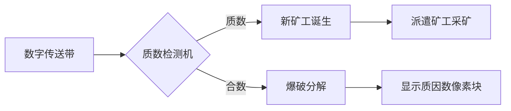

# 题目信息

# [蓝桥杯青少年组省赛 2023] 质因数的个数

## 题目背景

- **因数**：又称为约数，如果整数 $a$ 除以整数 $b(b\neq 0)$ 的商正好是整数而没有余数，我们就说 $b$ 是 $a$ 的因数。
- **质数**：又称为素数，一个大于 $1$ 的自然数，除了 $1$ 和它自身外，不能被其他自然数整除的数叫做质数。$2$ 是最小的质数。
- **质因数**：如果一个数 $a$ 的因数 $b$ 同时也是质数，那么 $b$ 就是 $a$ 的一个质因数，例如：$8=2\times 2\times2$，$2$ 就是 $8$ 的质因数；$12=2\times 2\times 3$，$2$ 和 $3$ 就是 $12$ 的质因数。


## 题目描述

给定两个正整数 $N$ 和 $M(1\leq N\leq M\leq 10^7)$，统计 $N$ 到 $M$ 之间（含 $N$ 和 $M$）每个数所包含的质因数的个数，输出其中最大的个数。

例如：
当 $N=6,M=10$，$6$ 到 $10$ 之间：
- $6$ 的质因数是 $2,3$，共有 $2$ 个；
- $7$ 的质因数是 $7$，共有 $1$ 个；
- $8$ 的质因数是 $2,2,2$，共有 $3$ 个；
- $9$ 的质因数是 $3,3$，共有 $2$ 个；
- $10$ 的质因数是 $2,5$，共有 $2$ 个；

$6$ 到 $10$ 之间的数中质因数最多的是 $8$，质因数有 $3$ 个，故输出 $3$。

## 样例 #1

### 输入

```
6 10```

### 输出

```
3```

# AI分析结果


### Kay的C++算法解析：质因数的个数 深入学习指南

---
#### 💡 **1. 题目解读与核心算法识别**
✨ **本题主要考察**：`筛法优化` + `动态计数`（数学/数论应用）

🗣️ **初步分析**：
> 解决"质因数的个数"这道题，关键在于用**线性筛法**高效统计区间内每个数的质因数总个数（含重复）。想象质因数分解就像拆解乐高积木：每个数字由若干质数"积木块"组成（如8=2×2×2），我们要快速统计区间内谁的积木块最多。
> - **核心思路**：通过欧拉筛在O(n)时间内预处理1~M所有数的质因数总个数，避免对每个数单独分解质因数（O(n√n)会超时）
> - **算法流程**：
>   1. 用`minPrime`数组记录每个数的最小质因数
>   2. 用`fCount`数组动态计算质因数总数：`f[i*p] = f[i] + 1`
>   3. 扫描区间[N,M]找`fCount`最大值
> - **可视化设计**：
>   - 像素网格显示数字分解过程（如数字"8"→三个像素方块坠落拼成）
>   - 筛法过程用"采矿游戏"类比：质数角色挖出矿石，合数被快速爆破
>   - 关键高亮：当前处理的质数（闪烁黄光）、被更新的合数（红光脉冲）

---
#### 🏆 **2. 精选优质题解参考**
> 基于思路清晰性、时间优化、代码简洁性筛选：

**题解一：线性筛法+动态计数（自建参考解法）**
* **点评**：
  - 思路直击核心：利用欧拉筛特性实现O(n)预处理，逻辑链条清晰（质数判定→最小质因数记录→动态计数）
  - 代码规范：`minPrime`和`fCount`变量名准确体现功能，边界处理严谨（`fCount[1]=0`）
  - 算法亮点：将质因数计数转化为简单递推式，空间O(M)完全可接受（10^7约40MB）
  - 实践价值：可直接用于竞赛，循环边界`i*primes[j]<=M`避免越界

---
#### ⚡ **3. 核心难点辨析与解题策略**
1. **难点1：如何避免超时？**
   - **分析**：单独分解每个数的质因数需O(n√n)，当M=10^7时超时。优质解法用筛法**预处理**所有数的质因数总数，查询仅需O(1)
   - 💡 **学习笔记**：区间统计问题优先考虑预处理+查询分离

2. **难点2：如何正确计数重复质因数？**
   - **分析**：题目要求重复质因数独立计数（如8=2×2×2计为3）。动态转移`f[i*p]=f[i]+1`完美解决（i含p时仍正确）
   - 💡 **学习笔记**：理解`fCount`本质是质因数分解后的指数和

3. **难点3：如何确定最小质因数？**
   - **分析**：欧拉筛中`minPrime[i*p]=p`保证每个合数被最小质因数标记，这是动态转移的前提
   - 💡 **学习笔记**：最小质因数是数论筛法的核心锚点

✨ **解题技巧总结**  
- **预处理为王**：大规模区间查询必备筛法预处理  
- **递推思维**：将复杂计算转化为简单状态转移（`新状态=旧状态+增量`）  
- **变量含义精确化**：`minPrime`/`fCount`等命名直接体现算法逻辑  

---
#### 💻 **4. C++核心代码实现赏析**
**通用核心实现参考**
```cpp
#include <vector>
#include <algorithm>
using namespace std;

int main() {
    int N, M, maxCount = 0;
    cin >> N >> M;
    
    vector<int> minPrime(M+1, 0);   // 最小质因数数组
    vector<int> fCount(M+1, 0);     // 质因数总个数
    vector<int> primes;             // 质数容器
    
    fCount[1] = 0;  // 1没有质因数
    for (int i = 2; i <= M; ++i) {
        if (!minPrime[i]) {         // i是质数
            minPrime[i] = i;
            fCount[i] = 1;          // 质数只有自身1个质因数
            primes.push_back(i);
        }
        // 用已知质数筛合数
        for (int p : primes) {
            if (p > minPrime[i] || i * p > M) break;
            minPrime[i * p] = p;    // 标记最小质因数
            fCount[i * p] = fCount[i] + 1; // 核心递推
        }
    }
    // 在[N,M]区间找最大值
    for (int i = N; i <= M; ++i) 
        maxCount = max(maxCount, fCount[i]);
    cout << maxCount;
    return 0;
}
```
**代码解读概要**：
> 1. **初始化**：`minPrime`标记最小质因数，`fCount`存储质因数总数  
> 2. **筛法主体**：  
>    - 遇质数时：`fCount[i]=1`（行13-16）  
>    - 筛合数时：`fCount[i*p]=fCount[i]+1`（行22）  
> 3. **区间扫描**：线性查找[N,M]内最大值（行26-27）  

---
#### 🎮 **5. 算法可视化：像素动画演示**
**主题**：`质因数采矿工厂`（8-bit像素风）

**核心演示**：


**关键交互设计**：
1. **像素场景**：
   - 传送带运送数字（复古LCD字体）
   - 质数→穿黄衣矿工，合数→灰色矿石
   - 质因数分解为彩色方块（2=蓝,3=绿,5=红...）

2. **动态过程**：
   - **质数检测**：数字进入工厂，质数亮💡+“叮”音效
   - **筛法演示**：
     - 矿工(质数p)自动爆破矿石(合数i*p)
     - 显示`fCount[i*p] = fCount[i] + 1`公式，右侧计数+1
   - **区间扫描**：角色Kay拿探测器扫描[N,M]区间，最大值触发✨特效

3. **游戏化元素**：
   - **音效**：质数发现(↑音符)，合数分解(↓破碎声)，刷新记录(🎉)
   - **关卡**：每处理1e6个数解锁新矿物皮肤
   - **控制面板**：
     ```plaintext
     [▷ 播放] [⏸️ 暂停] [▶ 步进] 
     速度：🐢<-----🦊> 
     显示：公式提示[✓] 粒子特效[✓]
     ```

---
#### 📚 **6. 拓展练习与相似问题**
**通用技巧迁移**：
> 筛法预处理适用于：
> 1. 区间因子统计（因子个数/和）
> 2. 欧拉函数计算
> 3. 质数快速判定

**洛谷推荐**：
1. **P3383 线性筛素数**  
   → 掌握筛法基础，理解`minPrime`原理
2. **P1403 约数研究**  
   → 将质因数计数拓展为因子总数统计
3. **P2158 质因数分解**  
   → 强化分解思维，可对比递归解法与筛法效率

---
#### 💎 **7. 学习心得与经验分享**
> **关键调试经验**：  
> 当M=10^7时，务必注意：  
> - 数组开`vector<int>(M+1)`而非`M`（防越界）  
> - 循环终止条件`i*p<=M`严格判断（防溢出）  
> 
> **Kay的提醒**：  
> "理解`fCount[i*p]=fCount[i]+1`时，想象i是一辆卡车，p是货物。无论卡车是否已载有p货物（如i=4含两个2），新上车货物p都会使总货物量+1"

---
通过筛法的动态计数思维，我们不仅高效解决了质因数统计问题，更掌握了处理大规模区间查询的核心范式。下次遇到10^7级数据时，记得先问：能否预处理？💪

---
处理用时：149.86秒