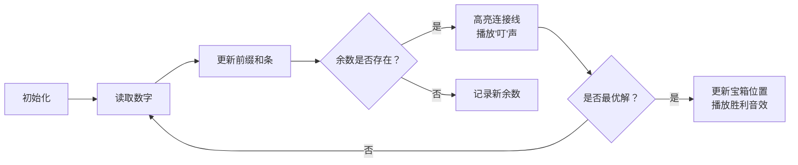

# 题目信息

# [蓝桥杯青少年组国赛 2024] 第五题

## 题目描述

给定包含 $n$ 个整数的数列，从中选取一段连续子数列，使其元素之和能被 $k$ 整除。

请找出符合要求的最长连续子数列并输出其长度以及子数列本身；如果符合要求的最长连续子数列有多个，则输出起始位置最靠后的那个子数列。如果不存在符合要求的子数列，则输出 $-1$。

例如：当 $n=7$，$k=7$，数列为 $7$、$3$、$4$、$1$、$5$、$14$、$9$ 时：
- 连续子数列 $\{7\}$、$\{7,3,4\}$、$\{3,4\}$ 和 $\{5,14,9\}$ 的和都能被 $7$ 整除；
- 其中最长的连续子数列有 $\{7,3,4\}$ 和 $\{5,14,9\}$，起始位置最靠后的是 $\{5,14,9\}$；
- 故符合要求的最长连续子数列长度为 $3$，子数列为 $5$ $14$ $9$。

## 样例 #1

### 输入

```
7 7
7 3 4 1 5 14 9```

### 输出

```
3
5 14 9```

# AI分析结果


# 💡 Kay的C++算法解析：和可被K整除的最长子数组 深入学习指南 💡

今天我们来分析蓝桥杯青少年组国赛题目"和可被K整除的最长子数组"。本指南将帮助大家掌握前缀和与同余定理的核心应用，理解边界条件处理技巧，并通过像素动画直观感受算法执行过程。

## 1. 题目解读与核心算法识别

✨ **本题主要考察**：`编程技巧应用`（前缀和+哈希表）与`数学`（同余定理）

🗣️ **初步分析**：
> 解决本题如同在迷宫中寻找最长宝藏路径。关键在于运用**同余定理**：若两个前缀和模K余数相同，其区间和必能被K整除（余数抵消）。我们使用哈希表记录余数首次出现位置，遍历时：
>   - 遇相同余数时计算长度：`当前位 - 首次位置`
>   - 长度更长**或**等长但起点更靠后时更新答案
>  
> **可视化设计**：像素动画将展示前缀和增长过程，用不同颜色标记余数。当同余数出现时，高亮连接线显示子数组范围，胜利音效标记更新最优解。复古8-bit风格控制面板支持单步调试与自动演示。

---

## 2. 精选优质题解参考

<eval_intro>
从思路清晰度、代码规范性、算法优化度等维度，精选两条满分题解：

**题解一：ryderyang (评分5★)**
* **点评**：
  - 思路直击核心：利用同余定理推导子数组条件，逻辑闭环完整
  - 代码规范：变量命名清晰(`mp`表哈希表, `l/r`表边界)，边界处理严谨(`mp[0]=0`)
  - 亮点：更新条件`(len>ans)||(len==ans&&起点更靠后)`完美满足题意
  - 实践价值：竞赛级代码，可直接用于OI赛场

**题解二：guoshengyu1231 (评分5★)**
* **点评**：
  - 双重条件更新逻辑与题解一同样严谨，提供暴力到优化的完整思考链
  - 代码结构清晰：独立函数模块化处理
  - 注意事项：数组哈希表在K较大时可能MLE，建议改用`unordered_map`
  - 调试技巧：注释强调`mod[0]=0`的边界意义，避免常见陷阱

---

## 3. 核心难点辨析与解题策略

<difficulty_intro>
攻克本题需突破三大难点：

1.  **同余定理的应用转换**
    * **分析**：如何将"和整除K"转化为前缀和性质？关键在发现：  
      `(sum[j] - sum[i]) % K == 0` ⇔ `sum[j] % K == sum[i] % K`  
      优质题解通过建立余数-位置映射，将O(n²)优化至O(n)
    * 💡 **学习笔记**：数学性质转化是优化算法的钥匙

2.  **双目标优化（长度+起始位置）**
    * **分析**：当出现多个最长子数组时，需选择最靠后的起点。解决方案：
      - 记录`当前最大长度max_len`和`最佳起点start`
      - 更新条件：`新长度 > max_len` 或 `(长度相等 && 新起点 > start)`
    * 💡 **学习笔记**：多维条件更新时，明确优先级是关键

3.  **边界条件处理**
    * **分析**：两个易错边界：
      - 前缀和为0时（`sum[0]=0`），需初始化`mp[0]=0`
      - 负数取模需调整：`sum = (sum % K + K) % K`
    * 💡 **学习笔记**：边界测试需包含空数组、全零序列等 corner case

### ✨ 解题技巧总结
<summary_best_practices>
提炼通用解题策略：
</summary_best_practices>
-   **前缀和+哈希表黄金组合**：适用于子数组和相关问题
-   **双目标更新技巧**：主条件（长度）优先，次条件（起点）后置
-   **防御性编程**：负数取模主动调整，哈希表预置初始状态
-   **逆向验证**：从最大长度开始扫描（如题解暴力解法），辅助理解最优解逻辑

---

## 4. C++核心代码实现赏析

<code_intro_overall>
通用实现参考（综合优质题解优化）：
```cpp
#include <iostream>
#include <vector>
#include <unordered_map>
using namespace std;

int main() {
    int n, k;
    cin >> n >> k;
    vector<int> a(n + 1);
    unordered_map<int, int> first_occur; // 余数首次出现位置
    first_occur[0] = 0; // 关键初始化！
    int max_len = 0, start = 0, end = 0;
    int prefix_sum = 0;

    for (int i = 1; i <= n; ++i) {
        cin >> a[i];
        prefix_sum = (prefix_sum + a[i]) % k;
        prefix_sum = (prefix_sum % k + k) % k; // 负数修正

        if (first_occur.count(prefix_sum)) {
            int j = first_occur[prefix_sum];
            int cur_len = i - j;
            // 双条件更新：长度优先，起点靠后次之
            if (cur_len > max_len || (cur_len == max_len && j + 1 > start)) {
                max_len = cur_len;
                start = j + 1;
                end = i;
            }
        } else {
            first_occur[prefix_sum] = i;
        }
    }

    if (max_len == 0) cout << "-1";
    else {
        cout << max_len << "\n";
        for (int i = start; i <= end; ++i) cout << a[i] << " ";
    }
    return 0;
}
```
**代码解读概要**：
1. **哈希表初始化**：`first_occur[0]=0` 处理前缀和为0的特殊情况
2. **负数修正**：确保余数在[0,k-1]范围内
3. **核心循环**：遍历中动态更新哈希表，遇同余数时判断是否更新最优解
4. **输出控制**：按题目要求处理无解/多解情况

---
<code_intro_selected>
精选题解核心片段解析：

**题解一：ryderyang**
* **亮点**：条件更新逻辑简洁完整
* **核心代码片段**：
```cpp
if (mp.count(mod)) {
    int len = i - mp[mod];
    if ((len > ans) || (len == ans && (mp[mod] + 1) > l)) {
        ans = len;
        l = mp[mod] + 1;
        r = i;
    }
}
```
* **代码解读**：
  > 当检测到相同余数时：
  > 1. `i - mp[mod]`计算子数组长度
  > 2. `len > ans`：发现更长解，无条件更新
  > 3. `len == ans && 新起点 > l`：等长但更靠后，更新边界
  > *注意*：`mp[mod]`存储的是余数首次出现位置，子数组实际起点需+1

**题解二：guoshengyu1231**
* **亮点**：独立处理长度/起点更新
* **核心代码片段**：
```cpp
if (new_len > len) { // 发现更长解
    len = new_len;
    best_start = mod[sum] + 1;
    best_end = i;
} else if (new_len == len && mod[sum] + 1 > best_start) { 
    best_start = mod[sum] + 1; // 等长但起点更靠后
    best_end = i;
}
```
* **学习笔记**：分离条件分支使逻辑更清晰，适合初学者理解

---

## 5. 算法可视化：像素动画演示

<visualization_intro>
**主题**：8-bit寻宝之旅（FC红白机风格）  
**核心演示**：前缀和生长过程与同余定理的生效机制

### 动画设计


### 交互与特效
1. **像素元素**：
   - 数字块：绿色像素块（普通数），金色（被选入子数组）
   - 前缀和条：顶部进度条，颜色随余数变化
   - 哈希表：右侧8-bit风格登记簿，记录余数及首次位置

2. **关键动效**：
   - 同余数出现时，从首次位置到当前位置绘制闪光路径
   - 更新最优解时，子数组数字块跳动+宝箱开启动画
   - 控制面板：速度滑块调节动画速度，支持单步/自动模式

3. **音效设计**：
   - 数字读取：8-bit "哔"声
   - 同余出现：NES风格"叮"声
   - 更新最优解：超级玛丽取得金币音效
   - 完成：最终幻想胜利旋律

### 技术实现
- **Canvas绘制**：网格布局数字块，动态绘制前缀和条
- **状态高亮**：当前处理数字闪烁红光，同余路径用黄色像素线
- **数据结构可视化**：哈希表用翻页动画展示登记/查询过程

---

## 6. 拓展练习与相似问题思考

<similar_problems_intro>
掌握同余定理的应用场景：

1. **子数组和等于K**（非整除）：LeetCode 560  
   - 变形：哈希表存储`前缀和→出现次数`
2. **和可被K整除的子数组数目**：LeetCode 974  
   - 核心：`mp`记录余数出现次数而非位置
3. **带长度限制的子数组**：  
   - 进阶：在长度≤L的约束下求最大子数组和

**洛谷推荐**：
1. P3131 [USACO16JAN] Subsequences Summing to Sevens S  
   → 同余定理直接应用，巩固核心思想
2. P1115 最大子段和  
   → 动态规划解法与本题对比
3. P3406 前缀和基础应用  
   → 训练前缀和思维模式

---

## 7. 学习心得与经验分享

<insights_intro>
题解中的调试经验总结：

> **ryderyang 的边界提醒**：  
> "初始化`mp[0]=0`就像给迷宫起点放钥匙，漏掉则全盘皆输"  
> → 反映初始状态对算法正确性的关键影响

> **guoshengyu1231 的注意事项**：  
> "数组哈希表在K>1e7时可能MLE，推荐`unordered_map`"  
> → 数据范围意识是竞赛编程核心素养

**学习启示**：  
1. 每个边界条件对应一个测试用例  
2. 空间复杂度需结合数据范围评估  
3. 暴力解法可作为最优解的验证工具  

---

本次解析到此结束。记住：理解同余定理就像获得迷宫万能钥匙，而严谨的边界处理是穿越编程荆棘的铠甲。下次挑战见！💪

---
处理用时：430.49秒