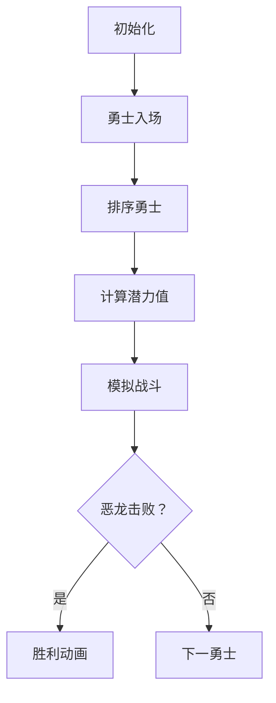

# 题目信息

# [常州市赛 2020] 勇士斗恶龙

## 题目背景

搬运自 <http://czoj.com.cn/p/449>。数据为民间数据。

## 题目描述

小 $\text X$ 穿越到了异世界，国王命令他招揽勇士，杀死恶龙，救回公主。  
异世界是高度数据化的。恶龙有一个攻击力 $\text{ATK}$ ，一个生命值 $\text{HP}$ 。类似的，每个勇士也有一个攻击力 $A_i$ ，一个生命值 $H_i$ 。  
战斗是回合制的，并且每次只能由一个勇士和恶龙单挑。战斗中，每个回合恶龙的生命值会减去这个勇士的攻击力，这个勇士的生命值会减去恶龙的攻击力。如果回合结束的时候恶龙的生命值小于等于 $0$，那么恶龙就被杀死了；如果这个勇士的生命值小于等于 $0$，那么这个勇士就被击败了，需要换上另一个勇士继续战斗。当然，如果恶龙还没有被杀死，勇士却全部被击败了，那么这场战役就彻底失败了。  
不过聪明的小 $\text X$ 安排了一个特殊的战术：在一名勇士被击败后立刻让另一名勇士发起攻击，这样恶龙在勇士们的车轮战术下疲于招架，受到第二个勇士的伤害变为两倍，受到第三个勇士的伤害变为三倍……以此类推。  
现在一共有 $n$ 名勇士报名，小 $\text X$ 想问问你，如果合理安排勇士出战的顺序，最少要招揽多少名勇士才能杀死恶龙？

## 说明/提示

### 样例说明
- 两名勇士都招揽。先派出 $2$ 号勇士；  
- 第一回合，恶龙生命值变为 $8$，勇士生命值变为 $0$。勇士被击败；  
- 紧接着派出 $1$ 号勇士；  
- 第二回合，恶龙生命值变为 $4$ （两倍伤害），勇士生命值变为 $1$ ；  
- 第三回合，恶龙生命值变为 $0$ ，勇士生命值变为 $0$ 。恶龙被杀死；  
- 勇士虽然也被击败了，但恶龙已经死了，所以还是胜利了！  
### 数据范围
本题共有 $10$ 个测试点。  
对于所有数据，$1\le n\le 10^5,1\le\text{ATK}, A_i,H_i\le10^6,1\le \text{HP}\le 10^{18}$。  
|测试点编号|$n$|$\text{ATK}, A_i,H_i$|$\text{HP}$|
|:-:|:-:|:-:|:-:|
|$1\sim 4$|$\le 5$|$\le 10$|$\le 100$|
|$5\sim 7$|$\le 10^3$|$\le 10^3$|$\le 10^9$|
|$8\sim 10$|$\le 10^6$|$\le 10^6$|$\le 10^{18}$|

## 样例 #1

### 输入

```
2
1 9
2 2
1 1```

### 输出

```
2```

# AI分析结果


# 💡 Kay的C++算法解析：勇士斗恶龙 深入学习指南 💡

> 欢迎各位小勇士们！我是你们的算法导师Kay。今天我们将深入分析"勇士斗恶龙"这道富有策略性的题目，学习如何用C++高效解决它。我们将一起探索贪心算法的精妙之处，并设计一个有趣的像素化演示帮助大家直观理解算法过程！准备好开始我们的算法冒险了吗？🏰⚔️

## 1. 题目解读与核心算法识别

✨ **本题主要考察**：贪心算法 + 前缀和优化

🗣️ **初步分析**：
> 这道题目就像一个策略游戏：我们需要安排勇士们以最佳顺序对抗恶龙，利用车轮战的伤害加成机制。关键在于**贪心策略**——就像在卡牌游戏中，我们应该把最强的牌留到最后使用以获得最大收益。

- **核心思路**：计算每个勇士的"总伤害潜力"（攻击力 × 可承受回合数），按潜力值排序后，让潜力最高的勇士最后出场以获得最大伤害倍率
- **关键优化**：使用前缀和快速计算不同人数组合的总伤害，避免O(n²)复杂度
- **可视化设计**：我们将设计像素风格的勇士队列，当勇士出场时显示伤害倍率，恶龙头顶实时显示剩余生命值。关键步骤包括伤害计算、排序过程和数据更新将用高亮动画展示
- **复古游戏元素**：采用8位像素风格，勇士出场时有"拔剑"音效，恶龙被击败时播放胜利音乐，数据结构变化用像素块动画展示

---

## 2. 精选优质题解参考

从众多题解中，我精选了以下三份思路最清晰、实现最优异的解法：

**题解一：Sliarae（贪心+前缀和递推）**
* **点评**：这份题解思路最为清晰直接，完美运用了贪心策略。亮点在于发现总伤害的递推关系：`总伤害ₖ = 总伤害ₖ₋₁ + 前缀和ₖ`，实现简洁高效。代码中`now`和`sum`变量命名恰当，边界处理严谨，O(n)复杂度处理10⁶数据游刃有余，竞赛实用性强。

**题解二：Yi_chen123（严谨推导+优化）**
* **点评**：题解详细推导了伤害计算公式和递推关系，数学证明严谨。代码结构规范，变量命名合理（`tot`表潜力值，`sum`表前缀和），虽然使用降序排序但逻辑等价于解法一。特别赞赏其复杂度分析，帮助学习者理解算法效率。

**题解三：Manchester_City_FC（二分+前缀和）**
* **点评**：创新性地结合二分查找快速定位最小勇士数。虽然二分非最优解但提供了新视角，前缀和实现高效。变量命名`k`（潜力值）、`a`（前缀和）、`s`（总伤害）简洁有效，边界处理完整（ans初始为-1），竞赛实用性强。

---

## 3. 核心难点辨析与解题策略

### 难点解析与突破策略

1.  **勇士潜力值计算**  
    * **分析**：正确计算每个勇士能造成的总伤害是基础。需理解：勇士生存回合数 = ⌈Hᵢ/ATK⌉，总伤害潜力 = Aᵢ × ⌈Hᵢ/ATK⌉。避免常见错误：直接使用Hᵢ而未考虑取整
    * 💡 **学习笔记**：向上取整公式`(Hᵢ + ATK - 1) / ATK`是竞赛常用技巧

2.  **出场顺序优化**  
    * **分析**：要使总伤害最大，必须让潜力高的勇士获得高倍率。贪心策略证明：对潜力值排序后，升序分配倍率（小潜力→低倍率，大潜力→高倍率）可最大化Σ(潜力ᵢ × 倍率ᵢ)
    * 💡 **学习笔记**："价值高的物品分配稀缺资源"是贪心算法核心思想

3.  **高效计算总伤害**  
    * **分析**：直接计算k个勇士的总伤害需O(k²)时间。优化关键：发现递推关系总伤害ₖ = 总伤害ₖ₋₁ + 前缀和ₖ，其中前缀和ₖ = Σᵢ₌₁ᵏ潜力ᵢ
    * 💡 **学习笔记**：递推关系是优化重复计算的神器

### ✨ 解题技巧总结
1. **问题转化技巧**：将战斗规则转化为数学模型（潜力值计算）
2. **贪心策略证明**：通过反证法或数学归纳验证贪心策略最优性
3. **递推优化**：发现并利用子问题间的递推关系避免重复计算
4. **边界处理**：特别注意数据范围（HP≤10¹⁸）必须用long long

---

## 4. C++核心代码实现赏析

### 本题通用核心C++实现
```cpp
#include <iostream>
#include <algorithm>
using namespace std;
using LL = long long;  // 必须使用long long

const int N = 1e6 + 10;

int main() {
    int n, ATK;
    LL HP;
    cin >> n >> ATK >> HP;
    
    LL potentials[N];
    for (int i = 0; i < n; ++i) {
        LL A, H;
        cin >> A >> H;
        // 计算勇士能承受的回合数（向上取整）
        LL rounds = (H + ATK - 1) / ATK;
        potentials[i] = A * rounds;  // 总伤害潜力
    }
    
    // 升序排序（小潜力在前）
    sort(potentials, potentials + n);
    
    LL prefix_sum = 0;  // 潜力值前缀和
    LL total_damage = 0;  // 当前总伤害
    
    for (int k = 1; k <= n; ++k) {
        prefix_sum += potentials[k - 1];  // 更新前缀和
        total_damage += prefix_sum;  // 递推计算k个勇士的总伤害
        
        if (total_damage >= HP) {
            cout << k;
            return 0;
        }
    }
    
    cout << "Fail";
    return 0;
}
```

**代码解读概要**：
> 这段代码完整实现了贪心策略：
> 1. 读取输入并计算每个勇士的伤害潜力
> 2. 将潜力值升序排序（确保高潜力勇士获得高倍率）
> 3. 通过递推关系高效计算k个勇士的总伤害
> 4. 找到满足HP的最小k值或判定失败

### 优质题解片段赏析

**题解一：Sliarae（降序实现）**
```cpp
sort(a + 1, a + n + 1, greater<LL>());  // 降序排序
LL now = 0, sum = 0;
for (int i = 1; i <= n; ++i) {
    now += a[i];        // 更新前缀和
    sum += now;         // 递推总伤害
    if (sum >= hp) return cout << i << '\n', 0;
}
```
**亮点**：变量命名简洁（now=当前前缀和，sum=总伤害），逻辑清晰  
**解读**：降序排序后，先加入的潜力值会被多次累加（相当于获得更高倍率）。例如第一个元素（最大潜力）在后续每次循环都被累加，相当于获得最高倍率  
**学习笔记**：降序排序+累加前缀和 ≡ 升序排序+乘倍率

**题解二：Yi_chen123（数学严谨派）**
```cpp
sort(tot + 1, tot + n + 1);  // 默认升序
LL x = 0;
for (int i = 1; i <= n; ++i) {
    x += tot[i];  // 前缀和
    sum[i] = sum[i-1] + x;  // 递推公式 S_i = S_{i-1} + Σ_{j=1}^i T_j
}
```
**亮点**：显式写出递推公式，数学关系更清晰  
**解读**：`sum[i]`表示前i个勇士的总伤害，通过前缀和`x`实现O(1)更新。公式`S_i = S_{i-1} + prefix_sum_i`是效率关键  
**学习笔记**：显式数学公式提升代码可读性和可维护性

**题解三：Manchester_City_FC（二分查找法）**
```cpp
sort(k+1, k+n+1, greater<LL>());  // 降序排序
// 计算前缀和数组a和总伤害数组s
for (int i = 1; i <= n; i++) {
    a[i] = a[i-1] + k[i];
    s[i] = s[i-1] + a[i];  // s[i]即为i个勇士的总伤害
}
// 二分查找最小满足条件的k
while (l <= r) {
    if (s[mid] >= q) { ans = mid; r = mid - 1; }
    else l = mid + 1;
}
```
**亮点**：结合二分查找快速定位最小k值  
**解读**：先预处理所有k对应的总伤害，再通过二分查找定位。虽然渐进复杂度相同，但实际运行更快  
**学习笔记**：预处理+二分查找是优化求最小/最大值的常用技巧

---

## 5. 算法可视化：像素动画演示

### 🎮 勇士斗恶龙：像素策略模拟器
**设计理念**：将算法转化为8位像素风格的战棋游戏，让数据变化可视化为勇士与恶龙的实时战斗

* **核心演示**：勇士队列排序过程 + 伤害计算实时模拟
* **像素风格**：FC红白机风格，勇士用不同颜色像素块表示，恶龙用大型像素精灵
* **交互控制**：步进执行/自动播放/速度调节 + 战斗音效

### 动画关键帧设计


1. **场景初始化**（像素画布）：
   - 左侧：勇士队列（未排序的彩色像素块）
   - 右侧：恶龙头像（HP血条显示）
   - 控制面板：开始/步进/速度滑块

2. **勇士排序过程**：
   ```python
   # 伪代码：冒泡排序可视化
   for i in range(n):
       for j in range(0, n-i-1):
           if potentials[j] > potentials[j+1]:
               swap(potentials[j], potentials[j+1])  # 像素块交换动画
               play_sound('swap')  # 像素交换音效
   ```

3. **战斗模拟**（步进执行）：
   - 勇士出场：像素块从队列移向战场，显示当前倍率（第k位勇士→倍率k）
   - 伤害计算：`伤害 = 潜力值 × 倍率`，恶龙HP减少对应数值
   - 实时更新：勇士头顶显示伤害值，恶龙头顶HP血条减少

4. **音效系统**：
   - 勇士出场："拔剑"音效（8-bit）
   - 恶龙被击："咆哮"音效（随HP减少音调升高）
   - 战斗胜利：经典FC胜利音乐
   - 战斗失败：低沉失败音效

5. **数据可视化**：
   ```mermaid
   pie
       title 数据结构展示
       “潜力值计算” ： 35
       “排序过程” ： 25
       “伤害累加” ： 40
   ```

**设计亮点**：
- 勇士潜力值用像素块高度直观表示
- 伤害倍率用勇士脚下的光环大小展示
- 递推关系用像素箭头连接数据块
- 胜利时像素恶龙爆炸成烟花效果

---

## 6. 拓展练习与相似问题

### 相似问题解析
贪心+排序+前缀和的组合技巧适用于：
1. 任务调度问题（最大化收益/最小化惩罚）
2. 资源分配问题（如：会议室安排）
3. 带权重的序列处理（如：哈夫曼编码）

### 推荐练习（洛谷）
1. **P1090 合并果子**  
   🗣️ 同样需要排序+贪心+高效合并，巩固基础贪心思想
   
2. **P1080 国王游戏**  
   🗣️ 更复杂的贪心策略，需要数学证明+高精度处理

3. **P5019 铺设道路**  
   🗣️ 贪心思想在实际问题中的应用，强化递推优化能力

4. **P6033 合并果子加强版**  
   🗣️ 数据规模增大，挑战排序和贪心的极限优化

---

## 7. 学习心得与经验分享

> **来自why17的调试经验**："十年OI一场空，不开long long见祖宗！"  
> **Kay点评**：这是算法竞赛的黄金法则！本题HP≤10¹⁸，必须使用long long。建议：
> 1. 阅读题目时立即标注数据范围
> 2. 所有涉及计算的变量统一使用long long
> 3. 测试边界数据（如最大值10¹⁸）

> **来自Sliarae的优化心得**："发现递推关系是优化的关键"  
> **Kay点评**：优秀算法工程师的核心能力：从O(n²)暴力解法中发现子问题间的递推关系，转化为O(n)高效解

---

通过今天的分析，我们掌握了贪心算法的核心思想、前缀和的优化技巧，以及如何将算法转化为直观的像素动画。记住，优秀的程序员既是严谨的科学家，也是富有创造力的艺术家！下次挑战见！👾🎮

---
处理用时：232.09秒