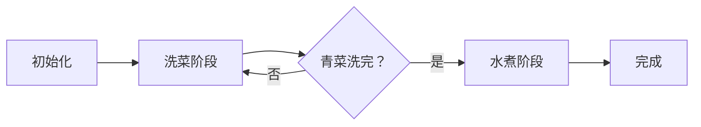

# 题目信息

# [常州市赛 2021] 烧菜

## 题目背景

搬运自 <http://czoj.com.cn/p/440>。

## 题目描述

小 $\text{X}$ 正在指挥 $M$ 个机器人做一道家常菜：白灼青菜。  
把一根青菜烧成菜肴需要两个步骤：洗菜和水煮。显然，一根青菜不可能同时被清洗和水煮，也不可能先被水煮后被清洗。  
现在小 $\text{X}$ 告诉你他是怎么指挥的。每当一个机器人空下来： 
- 如果有青菜还没被清洗，就让这个机器人清洗这根青菜
- 否则如果有青菜还没被水煮，就让这个机器人水煮这根青菜
- 都没有就让这个机器人关机

现在一共需要把 $N$ 根青菜烧成菜肴，任何一个机器人清洗都要花 $A$ 分钟，水煮要花 $B$ 分钟。小 $\text X$ 想请你告诉他多少分钟后所有菜能被烧好。

## 说明/提示

### 样例解释
为了方便说明，把机器人标号为 $1$ 号机器人和 $2$号机器人；把青菜标号为 $1$ 号、 $2$ 号、 $3$ 号青菜。实际上，机器人间是没有区别的，青菜间也是没有区别的。  
- 第 $0$ 分钟， $1$ 号机器人开始洗 $1$ 号青菜， $2$ 号机器人开始洗 $2$ 号青菜。  
- 第 $9$ 分钟， $1$ 号机器人开始洗 $3$ 号青菜， $2$ 号机器人开始煮 $1$ 号青菜。  
- 第 $14$ 分钟， $2$ 号机器人开始煮 $2$ 号青菜。  
- 第 $18$ 分钟， $1$ 号机器人开始煮 $3$ 号青菜。  
- 第 $19$ 分钟， $2$ 号机器人关机。  
- 第 $23$ 分钟，所有菜都被烧好了， $1$ 号机器人关机。
### 数据范围
本题共有 $20$ 个测试点。  
对于所有数据，满足 $1\le N,M,A,B\le 2000$。
|测试点编号|$N,M,A,B$|特殊性质|
|:-:|:-:|:-:|
|$1\sim2$|$\le50$|$M>N$|
|$3\sim4$|$\le50$|$M=1$|
|$5\sim6$|$\le50$|$A=B$|
|$7\sim10$|$\le50$|无|
|$11\sim12$|$\le2000$|$M>N$|
|$13\sim14$|$\le2000$|$M=1$|
|$15\sim16$|$\le2000$|$A=B$|
|$17\sim20$|$\le2000$|无|

## 样例 #1

### 输入

```
3 2 9 5```

### 输出

```
23```

# AI分析结果


### 💡 Kay的C++算法解析：烧菜 深入学习指南 💡

#### 题目解读与核心算法识别
✨ **本题主要考察**：`贪心策略与模拟调度`  
🗣️ **初步分析**：
> 这道题就像管理一个高效的厨房团队！机器人是厨师，青菜是订单。核心挑战在于**合理安排任务顺序**和**处理任务依赖**（洗菜必须在水煮前完成）。  
> - **解题思路**：用优先队列（小根堆）动态管理机器人的空闲时间，按优先级分配任务。关键难点在于处理洗菜与水煮的依赖关系——水煮任务必须等待对应的青菜完成清洗。  
> - **可视化设计**：我们将用**像素厨房模拟动画**展示过程。机器人显示为像素小人，青菜用颜色标记状态（白色=未洗，绿色=已洗，棕色=已煮）。当机器人等待时显示"ZZZ"动画，关键操作（如任务分配）触发8位音效。时间轴进度条显示当前时刻与总耗时。

---

#### 精选优质题解参考
**题解一（作者：why17）**
* **点评**：思路清晰且完整解决了任务依赖问题。亮点在于**三个独立优先队列**（空闲机器人、洗菜完成时间、水煮完成时间）的分工设计，完美处理了"水煮必须等待洗菜完成"的核心难点。代码中`cnt1`/`cnt2`计数器命名直观，`max(time, t1.top())`精准处理了任务启动时间，边界条件严谨可直接用于竞赛。

**题解二（作者：Manchester_City_FC）**
* **点评**：采用**分阶段模拟**策略，先完成所有洗菜再处理水煮。亮点在于通过数组排序保证水煮任务按洗菜完成顺序分配，避免依赖冲突。虽然时间复杂度O(nm)较高，但代码结构平实易懂（`x[]`/`y[]`/`z[]`数组分工明确），特别适合初学者理解任务调度本质。

**题解三（作者：Sliarae）**
* **点评**：创新性使用**双堆互相修正**策略。`p`堆存储洗菜完成时间，当分配水煮时若当前时间`tp < p.top()`，则让机器人"重新排队"到洗菜完成时刻。这种隐式等待机制巧妙但稍难理解，代码中`t`变量用途不够明确（同时计数青菜和任务），建议配合注释阅读。

---

#### 核心难点辨析与解题策略
1. **任务依赖处理**  
   *分析*：水煮必须等待对应青菜洗净。优质解法通过**显式检查洗菜完成时间**（why17的`t1.top()`）或**按洗菜完成顺序分配**（Manchester的排序）解决。  
   💡 学习笔记：像"接力赛"——必须接到洗菜完成的"接力棒"才能开始水煮！

2. **高效机器人调度**  
   *分析*：直接遍历找最早空闲机器人（Manchester）在m较大时效率低。堆优化（why17/Sliarae）将查询时间从O(m)降为O(log m)，通过`priority_queue`自动维护最小空闲时间。  
   💡 学习笔记：优先队列是调度问题的"时间管家"！

3. **状态同步与终止判定**  
   *分析*：需同时跟踪未洗青菜数、未煮青菜数、机器人在岗状态。why17用`cnt1`/`cnt2`双计数器，Sliarae用`n`/`t`变量，而Manchester通过两阶段分离降低复杂度。  
   💡 学习笔记：像记账本——每个任务转移都要更新"科目余额"！

✨ **解题技巧总结**  
- **依赖映射法**：为水煮任务显式绑定洗菜完成时间（如why17的`t1`堆）  
- **堆优化调度**：用优先队列管理资源（机器人）的可用时间  
- **分阶段处理**：将强依赖任务拆解为独立阶段（如Manchester）  

---

### C++核心代码实现赏析
**通用核心参考（基于why17解法优化）**  
```cpp
#include <bits/stdc++.h>
using namespace std;

int main() {
    int n, m, a, b;
    cin >> n >> m >> a >> b;
    
    priority_queue<int, vector<int>, greater<int>> idleRobots; // 空闲机器人队列
    priority_queue<int, vector<int>, greater<int>> washTimes;   // 洗菜完成时间
    priority_queue<int, vector<int>, greater<int>> cookTimes;   // 水煮完成时间

    for (int i = 0; i < m; i++) idleRobots.push(0); // 初始化机器人

    int washed = 0, cooked = 0; // 任务计数器
    while (washed < n || cooked < n) {
        int t = idleRobots.top(); idleRobots.pop();
        if (washed < n) { // 优先分配洗菜
            washTimes.push(t + a);
            idleRobots.push(t + a);
            washed++;
        } 
        else if (!washTimes.empty()) { // 洗菜完成后再水煮
            int start = max(t, washTimes.top()); // 关键依赖处理！
            washTimes.pop();
            cookTimes.push(start + b);
            idleRobots.push(start + b);
            cooked++;
        }
    }

    int total = 0;
    while (!cookTimes.empty()) total = cookTimes.top(), cookTimes.pop();
    cout << total;
}
```
**代码解读概要**：  
> 1. 三队列分工：`idleRobots`管理机器人空闲时间，`washTimes`/`cookTimes`记录任务完成时刻  
> 2. 循环分配：优先洗菜（`washed < n`），洗菜完成后才分配水煮  
> 3. 依赖处理：水煮开始时间 = `max(机器人空闲时刻, 青菜洗净时刻)`  
> 4. 终止判定：当洗菜和水煮计数均达n时结束  

---

#### 题解片段赏析
**why17解法核心**  
```cpp
if (cnt1 < n) { // 洗菜分配
    t1.push(time + a);
    idleRobots.push(time + a);
    cnt1++;
}
else if (!t1.empty()) { // 水煮分配
    int start = max(time, t1.top()); // 显式依赖处理
    t1.pop();
    t2.push(start + b);
    idleRobots.push(start + b);
    cnt2++;
}
```
**学习笔记**：`max(time, t1.top())`如同"双保险锁"，确保水煮不早于洗菜完成！  

**Manchester解法核心**  
```cpp
// 第一阶段：洗菜
for (int i = 1; i <= n; i++) {
    int robot = 1;
    for (int j = 2; j <= m; j++) // 找最早空闲机器人
        if (x[j] < x[robot]) robot = j;
    y[i] = x[robot] + a; // 记录洗菜完成时间
    x[robot] = y[i];
}
sort(y + 1, y + n + 1); // 按完成时间排序

// 第二阶段：水煮
for (int i = 1; i <= n; i++) {
    int robot = 1;
    for (int j = 2; j <= m; j++) // 再找最早空闲
        if (z[j] < z[robot]) robot = j;
    z[robot] = max(z[robot], y[i]) + b; // 确保洗菜完成
}
```
**学习笔记**：分阶段+排序是处理依赖的"化繁为简"妙招！  

---

### 算法可视化：像素厨房模拟
**主题**：8位像素风《机器人厨师》  
**演示流程**：  


**动画设计**：  
1. **像素场景**：  
   - 顶部：青菜队列（白色→绿色→棕色图标演变）  
   - 中部：洗菜区（蓝色水槽动画+倒计时）  
   - 底部：水煮区（红色炉火动画+倒计时）  
   - 机器人：戴厨师帽的像素小人，状态色块（蓝=洗菜，红=水煮，灰=空闲）  

2. **关键交互**：  
   - 时间轴：底部进度条显示当前时刻/A/B/总时长  
   - 开始水煮时：青菜图标从洗菜区"跳转"到水煮区  
   - 机器人等待：头顶显示"💤"动画并播放等待音效  

3. **音效方案**：  
   - 洗菜开始：水滴声（持续流水声直到完成）  
   - 水煮开始："滋啦"油炸声  
   - 任务完成：8位上升音阶  
   - 等待状态：循环播放待机"嘀嗒"声  

4. **教学提示**：  
   ```python
   # 伪代码：水煮依赖检测
   if 当前时间 < 青菜洗净时间：
       显示"等待中..."提示框
       青菜图标闪烁红色边框
       播放警告音效
   ```

---

### 拓展练习与相似问题
**通用技巧迁移**：  
1. 多阶段依赖调度（如：工件需先车削后抛光）  
2. 资源竞争管理（如：共享打印机任务队列）  
3. 时间窗口约束（如：快递必须在收货后才能配送）  

**洛谷推荐**：  
1. **P1541 机器翻译**  
   🗣️ 考察队列维护资源池，与本题机器人调度高度相似  
2. **P1164 小A点菜**  
   🗣️ 强化阶段依赖思维（点菜→做菜→上菜）  
3. **P1090 合并果子**  
   🗣️ 优先队列经典应用，理解`priority_queue`工作原理  

---

### 学习心得分享
> **why17的调试经验**：  
> *"分配水煮时忘了检查洗菜是否完成，导致机器人提前关机卡死循环... 添加`!t1.empty()`检查后解决"*  
>  
> **Kay总结**：这提醒我们**严格验证前置条件**——如同做饭前检查食材是否备齐！多阶段任务中，建议用独立容器（如`washTimes`）显式跟踪依赖项状态。

---

通过本次分析，我们深入掌握了任务调度与依赖处理的核心技巧。记住：**好算法如做菜——讲究火候与顺序！** 下次遇到类似问题，不妨想想今天的"像素厨房"哦~ 🍳

---
处理用时：209.73秒