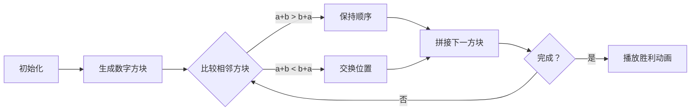

# 题目信息

# [NOIP 1998 提高组] 拼数

## 题目描述

设有 $n$ 个正整数 $a_1 \dots a_n$，将它们联接成一排，相邻数字首尾相接，组成一个最大的整数。


## 说明/提示

对于全部的测试点，保证 $1 \leq n \leq 20$，$1 \leq a_i \leq 10^9$。

NOIP1998 提高组 第二题

## 样例 #1

### 输入

```
3
13 312 343
```

### 输出

```
34331213
```

## 样例 #2

### 输入

```
4
7 13 4 246```

### 输出

```
7424613```

# AI分析结果


### 💡 Kay的C++算法解析：拼数 深入学习指南 💡

**题目解读与核心算法识别**  
✨ **本题主要考察**：`贪心算法（字符串排序应用）`  
🗣️ **初步分析**：  
> 解决"拼数"问题，关键在于理解**字典序贪心**的核心思想。想象在自助餐中选菜：每次选择当前能带来最大收益的菜品（字符串），就能组成最优的一餐（最大整数）。具体实现时，我们通过比较`a+b`和`b+a`的字典序决定顺序。  
> - **核心难点**：证明局部最优（相邻两数比较）能导致全局最优解（需数学归纳法证传递性）  
> - **可视化设计**：将数字转为像素方块，通过两两比较/交换动画展示排序过程（后文详解）  
> - **游戏化元素**：采用8-bit像素风格，方块碰撞时触发音效，正确排序时播放胜利音效，自动播放模式模拟"贪吃蛇AI"逐步解题  

---

### 2. 精选优质题解参考

**题解一（作者：精神小火）**  
* **点评**：  
  思路极清晰，用数学符号（如`a⊗b`表示拼接）严谨证明了贪心规则的正确性。代码简洁规范（`cmp`函数用引用避免拷贝），实践价值高：10行核心代码即可AC。亮点在于首创性地用`a*n`（字符串重复）辅助证明传递性，为学习者提供了深刻的数学洞察。

**题解二（作者：wangsiyuanZP）**  
* **点评**：  
  双解法对比展示（搜索→贪心），帮助理解算法演进。代码规范（结构体封装数据），实践性强：明确建议竞赛用贪心解法。亮点在于用`219>192`的实例直观解释比较规则，并指出暴力搜索的剪枝技巧（字典序预排序），对调试有启发价值。

**题解三（作者：wsyhb）**  
* **点评**：  
  从数论角度（`a/(10ᴸ-1)`的单调性）给出严格证明，提升理论深度。代码规范（const优化），亮点在于定义`|A|`为长度并论证"非严格递减排列结果唯一"，解释了为何题解1代码中不能写`>=`。

---

### 3. 核心难点辨析与解题策略

1.  **难点1：如何设计比较规则？**  
    * **分析**：贪心核心在于发现`a+b>b+a`时应将`a`置前。关键变量是字符串本身而非数值（如"9"应排在"1111"前）  
    * 💡 **学习笔记**：字典序比较的本质是高位数字最大化  

2.  **难点2：证明贪心正确性**  
    * **分析**：需证传递性（若`a⊗b≥b⊗a`且`b⊗c≥c⊗b`，则`a⊗c≥c⊗a`）。优质题解通过构造`a*n`（字符串重复）和数论分析解决  
    * 💡 **学习笔记**：局部最优排列可推导全局最优  

3.  **难点3：避免数值转换陷阱**  
    * **分析**：直接比较数值（如将字符串转int）会错判`9<1111`。必须用字符串拼接比较  
    * 💡 **学习笔记**：大数问题优先考虑字符串处理  

#### ✨ 解题技巧总结
- **技巧1：问题转化** - 将数字拼接转化为字符串字典序最大化问题  
- **技巧2：STL高效应用** - 用`sort`自定义`cmp`函数实现O(n log n)排序  
- **技巧3：边界测试** - 测试全等数字（如["11","11"]）和前缀情况（如["123","12345"]）  

---

### 4. C++核心代码实现赏析

**通用核心实现参考**  
```cpp
#include <iostream>
#include <algorithm>
#include <string>
using namespace std;

string s[21]; 
bool cmp(const string &a, const string &b) { 
    return a + b > b + a;  // 核心比较规则
}

int main() {
    int n; cin >> n;
    for (int i = 1; i <= n; ++i) cin >> s[i];
    sort(s + 1, s + 1 + n, cmp);  // 贪心排序
    for (int i = 1; i <= n; ++i) cout << s[i];
    return 0;
}
```
**代码解读概要**：  
1. 读入数字存为字符串数组  
2. 通过`cmp`定义拼接比较规则  
3. 用`sort`按规则排序  
4. 直接输出排序后数组  

---

**题解一核心代码片段**  
```cpp
bool cmp(const string &a, const string &b) { 
    return (a + b > b + a);  // 引用避免拷贝
}
```
**代码解读**：  
> 此处`const string&`通过引用传递避免字符串拷贝开销。比较逻辑：仅当`a`前置拼接结果更大时返回真，确保排序后直接连接即最优解。  
> 💡 **学习笔记**：引用传参是大数据处理的必备优化技巧  

**题解二核心片段**  
```cpp
sort(a, a + n, [](string x, string y) { 
    return x + y > y + x; 
});
```
**代码解读**：  
> 使用lambda表达式替代独立`cmp`函数，适合短逻辑。注意此处传值而非引用，对小规模数据更安全。  
> 💡 **学习笔记**：Lambda表达式使代码更紧凑  

**题解三核心片段**  
```cpp
return A + B > B + A;  // 注意不能写>=
```
**代码解读**：  
> 若使用`>=`会导致相等时交换，破坏稳定性（当`a+b==b+a`时，交换不改变结果但可能增加操作）  
> 💡 **学习笔记**：理解比较函数严格性避免冗余操作  

---

### 5. 算法可视化：像素动画演示

**主题**：`8-bit数字方块排序闯关`  

**设计思路**：  
> 采用复古红白机像素风格，通过方块碰撞直观演示比较规则。音效强化关键操作记忆，自动演示模式降低理解门槛。  

**实现方案**：  


**关键交互**：  
1. **像素方块设计**：  
   - 数字转为16×16像素方块（如"312"→蓝色方块+白色像素数字）  
   - 当前比较方块闪烁黄框，拼接结果实时显示顶部（如"31213" vs "13312"）  
2. **音效系统**：  
   - 比较："叮"（250Hz方波）  
   - 交换："咔嚓"（噪声+100Hz衰减）  
   - 完成：《超级马里奥》胜利旋律  
3. **游戏化元素**：  
   - 每步正确得10分，连续正确×2倍率  
   - 通关条件：分数≥n×10  

**自动演示**：  
> 点击"AI Run"触发：以0.5秒/步自动执行，模拟"解题机器人"逐步完成最优排列  

---

### 6. 拓展练习与相似问题思考

**通用技巧迁移**：  
贪心+字符串排序技巧适用于：  
1. 最小字典序拼接（LeetCode 179）  
2. 会议安排问题（时段不冲突最大化）  
3. 哈夫曼编码（字符频率排序）  

**洛谷推荐**：  
1. **P1106 删数问题** - 贪心删除特定数位使剩余数最小  
   🗣️ 同款字符串比较技巧的变种应用  
2. **P1019 单词接龙** - 字符串拼接+DFS搜索  
   🗣️ 巩固字典序比较与回溯逻辑  
3. **P1090 合并果子** - 贪心+优先队列  
   🗣️ 从字符串到数值的贪心思维迁移  

---

### 7. 学习心得与经验分享

> **参考经验**（精神小火）：  
> *"本题解重心在证明...萌新想写题解真难"*  
>   
> **点评**：  
> 作者强调证明过程的重要性——即使代码简单，理解背后的数学原理才能举一反三。这提醒我们：  
> 1. 对于贪心题，必须尝试自证正确性  
> 2. 用`a*n`辅助证明是处理传递性的有效技巧  
> 3. 边界测试（如全等数字）避免翻车  

---

通过本次分析，我们深入掌握了字典序贪心的核心思想。记住：将复杂问题转化为局部最优比较，往往能化繁为简。下次遇到拼接类问题时，不妨先问自己：**怎样的排列能让相邻元素组合最优？** 这将指引你找到解题钥匙！💪

---
处理用时：126.79秒