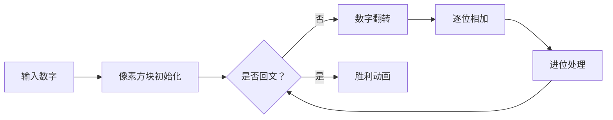

# 题目信息

# [NOIP 1999 普及组] 回文数

## 题目描述

若一个数（首位不为零）从左向右读与从右向左读都一样，我们就将其称之为回文数。

例如：给定一个十进制数 $56$，将 $56$ 加 $65$（即把 $56$ 从右向左读），得到 $121$ 是一个回文数。

又如：对于十进制数 $87$：

STEP1：$87+78=165$  
STEP2：$165+561=726$  
STEP3：$726+627=1353$   
STEP4：$1353+3531=4884$  

在这里的一步是指进行了一次 $N$ 进制的加法，上例最少用了 $4$ 步得到回文数 $4884$。

写一个程序，给定一个 $N$（$2 \le N \le 10$ 或 $N=16$）进制数 $M$（$100$ 位之内），求最少经过几步可以得到回文数。如果在 $30$ 步以内（包含 $30$ 步）不可能得到回文数，则输出 `Impossible!`。

## 样例 #1

### 输入

```
10
87
```

### 输出

```
STEP=4
```

# AI分析结果


### 💡 Kay的C++算法解析：回文数 深入学习指南 💡

**引言**  
今天我们一起分析NOIP1999普及组"回文数"这道经典题目。本指南将帮助大家掌握高精度模拟的核心技巧，理解N进制加法的实现逻辑，并通过像素动画直观感受算法流程。

---

## 1. 题目解读与核心算法识别

✨ **本题主要考察**：`高精度模拟` + `N进制运算`

🗣️ **初步分析**：
> 解决"回文数"问题的关键在于**高精度模拟N进制加法**。这就像在复古游戏中操作像素方块：每个数字位是一个像素块，加法操作如同方块移动重组。核心难点在于：
> - **进制转换**：处理16进制时需在数字（0-9）和字母（A-F）间转换
> - **进位机制**：N进制下进位阈值是N而非10（如16进制满16进1）
> - **回文判断**：检查数字正反读是否相同
> 
> 可视化设计思路：用像素方块表示数字位，加法时方块翻转重组，进位时顶部新增方块。关键步骤高亮当前操作位，用不同颜色区分正常位/进位位。复古游戏风格中，每步加法视为"闯关"，成功时播放8-bit胜利音效。

---

## 2. 精选优质题解参考

**题解一：Haishu (赞507)**
* **点评**：此解法严谨规范，强调用正确的高精度方法而非数据漏洞。思路清晰：模块化实现加法、反转、判断功能。代码亮点：
  - 字符转换处理优雅（`c[i]-'0'`和`c[i]-'A'+10`）
  - 进位处理精炼（`c[i+1] += c[i]/n`）
  - 边界处理完善（`while(!c[l-1]) --l`）
  实践价值高，可直接用于竞赛，作者反思"避免走捷径"的调试心得极具启发。

**题解二：Strong_Jelly (赞294)**
* **点评**：优秀模块化范例，将高精加、反转、判断拆解为独立函数。亮点：
  - 函数接口简洁（`add()`, `turn()`, `f()`）
  - 数据结构清晰（数组`q`存原数，`w`存反转数）
  - 进制处理统一（`%n`和`/n`替代十进制操作）
  代码像乐高积木般可组装，对理解高精度本质帮助极大。

**题解三：hong123 (赞27)**
* **点评**：巧妙运用STL简化实现，亮点：
  - 用`reverse()`一键反转字符串
  - 字符转换简洁（`isdigit()`配合三元运算符）
  - 进位逻辑直观（`jw`标志位控制）
  适合熟悉STL的学习者，但需注意大数性能优化。

---

## 3. 核心难点辨析与解题策略

1. **难点：进制转换与字符处理**
   * **分析**：16进制需处理A-F字符转换。优质解法通过统一转换函数解决（如`char→int`映射），避免冗余判断
   * 💡 **学习笔记**：建立数字与字符的双向映射表是进制转换核心

2. **难点：高精度加法进位**
   * **分析**：N进制进位需满足`当前值≥进制数`。关键变量`carry`记录进位值，循环中更新`carry = sum/n`和`当前位=sum%n`
   * 💡 **学习笔记**：进位操作是垂直的"像素方块上移"，最高位进位需扩容数组

3. **难点：回文判断优化**
   * **分析**：无需完整反转，双指针从两端向中间比较（`i=0, j=len-1`），发现不同立即终止
   * 💡 **学习笔记**：时间复杂度O(n/2)优于完整反转的O(n)

### ✨ 解题技巧总结
- **技巧1：模块化设计**：拆解为转换、反转、加法、判断函数
- **技巧2：防御性编程**：特别注意最高位进位和16进制边界
- **技巧3：可视化调试**：打印中间结果验证每步操作

---

## 4. C++核心代码实现赏析

**本题通用核心C++实现参考**  
* **说明**：综合优质题解思路，体现模块化与防御性编程
* **完整核心代码**：
```cpp
#include <iostream>
#include <cstring>
using namespace std;

const int MAX_LEN = 150;

// 字符转数字（支持16进制）
int charToInt(char c) {
    if (c >= '0' && c <= '9') return c - '0';
    return c - 'A' + 10;
}

// 数字转字符（支持16进制）
char intToChar(int x) {
    if (x < 10) return '0' + x;
    return 'A' + x - 10;
}

// 判断回文
bool isPalindrome(int num[], int len) {
    for (int i = 0; i < len / 2; i++) {
        if (num[i] != num[len - 1 - i]) 
            return false;
    }
    return true;
}

// N进制高精加法
void add(int a[], int &len, int base) {
    int b[MAX_LEN] = {0};
    // 创建反转副本
    for (int i = 0; i < len; i++) {
        b[i] = a[len - 1 - i];
    }

    int carry = 0;
    for (int i = 0; i < len; i++) {
        int sum = a[i] + b[i] + carry;
        carry = sum / base;
        a[i] = sum % base;
    }

    // 处理最高位进位
    if (carry > 0) {
        a[len++] = carry;
    }
}

int main() {
    int n;
    char s[MAX_LEN];
    cin >> n >> s;
    
    int num[MAX_LEN] = {0};
    int len = strlen(s);
    
    // 字符串转数字数组
    for (int i = 0; i < len; i++) {
        num[i] = charToInt(s[len - 1 - i]);
    }

    int steps = 0;
    while (!isPalindrome(num, len)) {
        if (steps++ >= 30) break;
        add(num, len, n);
    }

    if (steps <= 30) cout << "STEP=" << steps;
    else cout << "Impossible!";
    return 0;
}
```
* **代码解读概要**：
  1. 字符/数字转换函数处理16进制
  2. `isPalindrome`双指针法高效判断回文
  3. `add`函数实现带进位的N进制加法
  4. 主函数控制30步内模拟流程

**题解一：Haishu核心片段**
```cpp
// 字符转换处理
if (c[i] >= '0' && c[i] <= '9') c[i] -= '0';
else c[i] = c[i] - 'A' + 10;

// 进位核心逻辑
c[i] += d[i];
if (c[i] >= n) {
    c[i+1]++;
    c[i] -= n;
}
```
* **亮点**：紧凑的字符转换和进位处理
* **学习笔记**：通过统一减字符值实现高效类型转换

**题解二：Strong_Jelly模块化**
```cpp
void add(int a[], int b[]) {
    for(int i = 1; i <= len; i++) {
        a[i] += b[i];
        a[i+1] += a[i] / n; 
        a[i] %= n;
    }
    if(a[len+1] > 0) len++; 
}
```
* **亮点**：分离进位处理，逻辑清晰
* **学习笔记**：函数应专注单一功能，如进位只更新数组

**题解三：hong123的STL应用**
```cpp
string add(int k, string b) {
    string a = b;
    reverse(a.begin(), a.end());
    // ... 统一处理字符转换
    for (int i = 0; i < len; i++) {
        int sum = a[i] + b[i] + carry;
        carry = sum / k;
        res += toChar(sum % k);
    }
}
```
* **亮点**：`reverse`简化反转操作
* **学习笔记**：STL可减少造轮子，但需注意大数性能

---

## 5. 算法可视化：像素动画演示

**动画演示主题**：`像素探险家的回文之旅`（8-bit风格）

**核心演示流程**：


**关键交互设计**：
1. **像素网格**：数字每位用16x16像素块表示，不同颜色区分值（0-9：蓝系，A-F：红系）
2. **动画步骤**：
   - **翻转阶段**：原数字方块向左平移，反转副本向右平移（伴随"咔嗒"音效）
   - **加法阶段**：对应方块碰撞融合，显示相加值（如`7+8=15`）
   - **进位阶段**：值≥进制数的方块闪烁变红，分裂为新方块（顶部新增，播放"滴"声）
3. **控制面板**：
   - 步进控制：←/→键单步执行
   - 速度滑块：调整自动播放速度
   - 暂停/继续：空格键控制
4. **游戏化元素**：
   - 每步成功：像素小人跳过关卡，得分+10
   - 达成回文：烟花动画+胜利音效
   - 超30步：显示"Game Over"像素文字

**技术实现**：
```javascript
// 伪代码示例
function drawAdditionStep() {
  drawGrid(currentNumber); // 绘制当前数字
  highlight(currentDigit, 'yellow'); // 高亮当前位
  playSound('click'); 
  
  if (sum >= base) {
    drawCarryAnimation(); // 进位动画
    playSound('beep');
  }
}
```

---

## 6. 拓展练习与相似问题

**通用技巧迁移**：  
高精度N进制处理技巧适用于：
1. 大数运算系统（如RSA加密）
2. 进制转换工具开发
3. 数学模拟问题（如阶乘计算）

**洛谷练习推荐**：
1. **P1604 B进制星球**  
   → 掌握高精度加/减/乘的通用实现
2. **P1255 数楼梯**  
   → 练习斐波那契数列的高精度实现
3. **P1015 回文数（NOIP1999普及组）**  
   → 本题的十进制特例，可对比优化

---

## 7. 学习心得与经验分享

> **Haishu的调试经验**：  
> "最初在16进制转换时卡壳，通过逐位打印中间值发现字符转换错误。这提醒我们：高精度问题要善用输出调试"

> **Kay的总结**：  
> 调试高精度问题的黄金法则：  
> 1. 打印每步的输入输出
> 2. 可视化进位过程
> 3. 边界测试（0值、最大值）

---

**结语**  
通过本指南，相信大家已掌握高精度模拟的核心技巧。记住：编程如搭积木，模块化设计是应对复杂问题的利器。下次我们将探索更多算法谜题！💪

---
处理用时：140.23秒