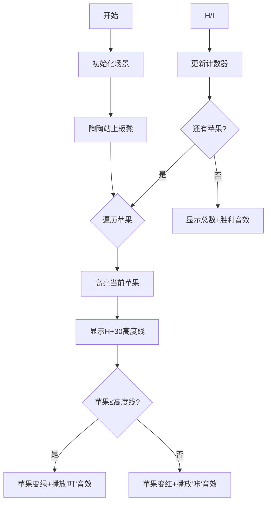

# 题目信息

# [NOIP 2005 普及组] 陶陶摘苹果

## 题目描述

陶陶家的院子里有一棵苹果树，每到秋天树上就会结出 $10$ 个苹果。苹果成熟的时候，陶陶就会跑去摘苹果。陶陶有个 $30$ 厘米高的板凳，当她不能直接用手摘到苹果的时候，就会踩到板凳上再试试。


现在已知 $10$ 个苹果到地面的高度，以及陶陶把手伸直的时候能够达到的最大高度，请帮陶陶算一下她能够摘到的苹果的数目。假设她碰到苹果，苹果就会掉下来。


## 说明/提示

**【题目来源】**

NOIP 2005 普及组第一题

## 样例 #1

### 输入

```
100 200 150 140 129 134 167 198 200 111
110
```

### 输出

```
5```

# AI分析结果


### 💡 Kay的C++算法解析：陶陶摘苹果 深入学习指南 💡

**引言**  
今天我们分析NOIP 2005普及组的经典题目《陶陶摘苹果》。这道题通过简单的模拟过程，帮助初学者掌握数组遍历和条件判断的核心编程技巧。

---

### 1. 题目解读与核心算法识别

✨ **本题主要考察**：`模拟应用`（基础编程技巧）  

🗣️ **初步分析**：  
> 解决本题如同玩一个"跳一跳摘苹果"的像素游戏——陶陶的身高是角色属性，板凳是装备加成，苹果高度是关卡障碍。核心思想是：  
> **1. 预处理**：将板凳高度(30cm)直接加到陶陶身高上，统一判断条件  
> **2. 遍历比较**：用for循环检查每个苹果是否≤（身高+板凳）的总高度  
> **3. 计数输出**：统计符合条件的苹果数量  
>  
> **可视化设计**：  
> - 像素小人（陶陶）站在板凳上，头顶显示"H+30"高度线  
> - 苹果按输入高度分布在树上，比较时高亮当前苹果  
> - 摘到苹果时：苹果变绿+播放"叮"音效；否则变红+短促提示音  
> - 控制面板：单步执行/自动播放（调速滑块）+ 重置按钮  

---

### 2. 精选优质题解参考

**题解一（作者：RedContritio）**  
* **点评**：亮点在于优化技巧——用布尔运算`s+=!(H<height[i])`替代if分支。这种将逻辑值直接转为整数的技巧（true=1/false=0），在竞赛中能减少分支预测开销。代码简洁规范（变量名清晰），虽在本题数据量下优化不明显，但展现了高效的编程思维。

**题解二（作者：mairuisheng）**  
* **点评**：标准解法典范。逻辑直白（读数据→加板凳高度→遍历计数），代码结构工整。特别适合初学者学习基础循环和条件判断的实现方式，边界处理严谨（数组索引从1开始），实践参考价值高。

**题解三（作者：kunkun127）**  
* **点评**：采用更安全的常量命名（MAXN=10），强调代码可读性。计数器初始化为0的显式写法避免未初始化风险，适合培养工程习惯。虽然无特殊优化，但完整呈现了问题分解的思维过程。

---

### 3. 核心难点辨析与解题策略

1. **预处理技巧**  
   *分析*：是否意识到板凳高度可提前加到身高？优质题解统一先用`H+=30`简化后续判断，避免重复计算。  
   💡 **学习笔记**：预处理能显著简化逻辑分支  

2. **遍历与比较的实现**  
   *分析*：所有解都使用for循环遍历数组。关键在理解`height[i] <= H`的比较本质——内存中实际是CPU的减法运算和标志位检查  
   💡 **学习笔记**：数组遍历是模拟类问题的基础骨架  

3. **计数优化选择**  
   *分析*：`if`分支 vs 布尔转整数（`s+=!(H<height[i])`）。前者直观易读，后者避免分支预测惩罚（但需编译器优化）  
   💡 **学习笔记**：可读性优先，性能优化视场景而定  

✨ **解题技巧总结**  
- **数据预处理**：先整合固定参数（如H+30）  
- **安全遍历**：数组长度用常量（如`const int N=10`）替代魔数  
- **防御性编程**：计数器显式初始化（`int cnt=0`）  

---

### 4. C++核心代码实现赏析

**通用核心实现参考**  
```cpp
#include <iostream>
using namespace std;
int main() {
    int apples[10], H, cnt = 0;  // 显式初始化计数器
    for (int i=0; i<10; i++) cin >> apples[i]; // 读入苹果高度
    cin >> H; 
    H += 30;  // 关键预处理：整合板凳高度
    for (int i=0; i<10; i++) {
        if (apples[i] <= H) cnt++; // 比较并计数
    }
    cout << cnt;
    return 0;
}
```
* **说明**：综合优质题解的最简实现，突出可读性  
* **解读概要**：  
  1. 数组存储苹果高度（`apples[10]`）  
  2. 输入后立即整合板凳高度（`H+=30`）  
  3. 单次循环完成比较计数，时间复杂度O(10)  

**题解片段赏析**  
1. RedContritio的布尔技巧：  
```cpp
s += !(H < height[i]);  // 核心行：布尔转整数计数
```
> **解读**：`H < height[i]`返回布尔值（true/false），`!`运算符反转结果（false→1/true→0）。相当于：  
> `true(不可摘)→0`，`false(可摘)→1`  
> **学习笔记**：利用语言特性消除分支，但可能降低可读性  

2. mairuisheng的标准实现：  
```cpp
for(i=1;i<=10;i++) 
    if(a[i]<=ha) ans++;  // 显式条件判断
```
> **解读**：经典`if`分支结构。`a[i]<=ha`触发CPU比较指令，根据结果跳转到计数代码块  
> **学习笔记**：清晰的流程控制是模拟问题的首选方案  

---

### 5. 算法可视化：像素动画演示  
**主题**：*8-bit果园大冒险*  

**核心交互设计**：  


**技术细节**：  
- **像素艺术**：FC红白机风格，陶陶使用16x16像素精灵，苹果用8x8红/绿方块  
- **关键动画**：  
  - 高度线绘制：Canvas画黄色虚线（`ctx.setLineDash([2,2])`）  
  - 苹果状态切换：`requestAnimationFrame`实现颜色渐变  
- **音效触发**：  
  ```js
  if(appleHeight <= totalHeight) 
      playSound('ding.wav'); // Web Audio API
  ```
- **游戏化**：每摘到3个苹果触发连击特效（像素烟花动画）  

---

### 6. 拓展练习与相似问题思考  

**通用技巧迁移**：  
1. 带条件的计数问题（如统计考试及格人数）  
2. 物理场景模拟（水位上升后淹没的物体数量）  
3. 资源分配校验（背包容量能否装下物品）  

**洛谷推荐**：  
1. P1428 小鱼比可爱（数组遍历+条件比较）  
   *推荐理由*：强化遍历比较思维，统计逆序对数量  
2. P1047 校门外的树（区间标记模拟）  
   *推荐理由*：进阶版模拟问题，引入状态覆盖概念  
3. P5734 文字处理软件（字符串操作模拟）  
   *推荐理由*：将比较思维扩展到字符串领域  

---

### 7. 学习心得与经验分享  
> **经验摘录（RedContritio）**：  
> “布尔转整数的技巧在卡常题中有奇效，但日常编程要权衡可读性”  
>  
> **Kay点评**：  
> 优化技巧如同魔法——强大但需谨慎使用。初学者应先掌握标准解法，再探索进阶技巧。调试时可用`cout`输出中间变量验证逻辑，例如：  
> ```cpp
> cout << "Checking apple:" << i << " height:" << apples[i];
> ```

---

**结语**  
通过这道题，我们巩固了数组遍历和条件判断的核心技能。记住：所有复杂算法都始于基础模拟！尝试用可视化工具重现摘苹果过程，能加深对程序运行机制的理解。下次挑战见！🚀

---
处理用时：162.37秒