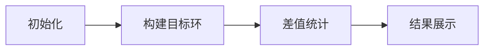

# 题目信息

# [NOIP 2005 提高组] 篝火晚会

## 题目描述

佳佳刚进高中，在军训的时候，由于佳佳吃苦耐劳，很快得到了教官的赏识，成为了“小教官”。在军训结束的那天晚上，佳佳被命令组织同学们进行篝火晚会。一共有 $n$ 个同学，编号从 $1$ 到 $n$。一开始，同学们按照 $1,2,\cdots ,n$ 的顺序坐成一圈，而实际上每个人都有两个最希望相邻的同学。如何下命令调整同学的次序，形成新的一个圈，使之符合同学们的意愿，成为摆在佳佳面前的一大难题。


佳佳可向同学们下达命令，每一个命令的形式如下：

$$(b_1, b_2,... b_{m-1}, b_m)$$

这里 $m$ 的值是由佳佳决定的，每次命令 $m$ 的值都可以不同。这个命令的作用是移动编号是 $b_1,b_2,\cdots, b_m$ 的这 $m$ 个同学的位置。要求 $b_1$ 换到 $b_2$ 的位置上，$b_2$ 换到 $b_3$ 的位置上，……，要求 $b_m$ 换到 $b_1$ 的位置上。执行每个命令都需要一些代价。我们假定如果一个命令要移动 $m$ 个人的位置，那么这个命令的代价就是 $m$。我们需要佳佳用最少的总代价实现同学们的意愿，你能帮助佳佳吗？


## 说明/提示

- 对于 $30\%$ 的数据，满足 $n \le 1000$；
- 对于 $100\%$ 的数据，满足 $3\le n  \le  50000$。

**【题目来源】**

NOIP 2005 提高组第三题

## 样例 #1

### 输入

```
4
3 4
4 3
1 2
1 2
```

### 输出

```
2```

# AI分析结果


### 💡 Kay的C++算法解析：篝火晚会 深入学习指南 💡
大家好，我是Kay！今天我们一起分析NOIP2005提高组的经典题目《篝火晚会》。这道题考察如何通过最小代价调整同学位置满足相邻关系。我将带大家逐步拆解核心思路，并提供直观的像素动画演示方案！

---

## 1. 题目解读与核心算法识别

✨ **本题主要考察**：`模拟应用`与`数学（环的处理）`

🗣️ **初步分析**：
> 解决篝火晚会题目的核心，如同在旋转的齿轮中寻找契合点。想象初始的1~n座位是一个固定齿轮，目标座位是另一个可旋转的齿轮。我们需要找到两个齿轮齿槽对齐最多的旋转角度，这样只需调整未对齐的"齿"即可。  
> - **核心思路**：先构建目标环（根据相邻关系），再通过位置差统计最优旋转角度。关键技巧在于用差值统计避免实际旋转环，极大优化效率  
> - **难点突破**：目标环构建需验证相邻关系一致性；处理环的双向旋转需分别计算顺/逆时针差值  
> - **可视化设计**：动画将高亮位置差计算过程（像素色块标记差值），旋转操作通过齿轮转动动画呈现，成功匹配时播放8-bit胜利音效

---

## 2. 精选优质题解参考

**题解一（来源：Actinoi）**
* **点评**：思路清晰度极佳！用形象比喻（"化环为链"）解释核心原理，代码中`(target[i]-initial[i]+n)%n`的差值统计是亮点。变量命名规范（如`pluss/minuss`），边界处理严谨（构建失败时立即返回-1）。时间复杂度优化到O(n)，空间利用合理，竞赛实践性满分

**题解二（来源：Drinkkk）**
* **点评**：状态推导过程详细，逐步图解环的构建逻辑。创新性使用`dis1/dis2`数组分离顺/逆时针统计，代码模块化优秀（构建环与统计分离）。特别点赞鲁棒性测试——显式检查`a[i-2]`与前驱关系，避免隐蔽错误

**题解三（来源：LXcjh4998）**
* **点评**：问题抽象能力突出，直击"无需移动人数最大化"本质。代码可读性强（`plus_order/minus_order`变量名达意），包含完整样例推演帮助理解。调试技巧值得学习：用`cout<<-1`快速响应非法状态

---

## 3. 核心难点辨析与解题策略

### 🔑 难点1：目标环的合法性构建
* **分析**：每个同学的相邻愿望必须双向满足。如同拼图——当A选择B时，B也必须选择A。优质题解通过前驱校验（检查`a[i-2]`是否在`a[i-1]`的期望列表中）确保逻辑闭环
* 💡 **学习笔记**：环的构建本质是**双向约束验证**

### 🔑 难点2：旋转偏移量的高效计算
* **分析**：物理旋转环需O(n²)，而差值统计法如同"齿轮刻度对齐"——计算初始位置与目标位置的编号差（模n），统计相同偏移量的最大频次。Actinoi的`(mb[i]-i+n)%n`是典型实现
* 💡 **学习笔记**：环问题优化核心是**用数学运算代替物理移动**

### 🔑 难点3：环方向的兼容处理
* **分析**：环可顺时针/逆时针读取。LXcjh4998的解法精妙之处在于：用`initial[n-i+1]`生成逆序链，等价逆时针统计
* 💡 **学习笔记**：双向处理是环问题的**通用破题点**

### ✨ 解题技巧总结
- **逆向思维**：求最小移动量 → 求最大不动点数
- **模运算妙用**：`(x+n)%n` 处理负偏移量
- **双视角验证**：顺/逆时针独立统计取最优解
- **即时剪枝**：构建环时发现矛盾立即退出

---

## 4. C++核心代码实现赏析

### 本题通用核心实现
```cpp
#include <iostream>
using namespace std;
const int MAXN = 50005;
int wishes[MAXN][2], target[MAXN], diffCnt[MAXN];

int main() {
    int n; cin >> n;
    for (int i = 1; i <= n; ++i) 
        cin >> wishes[i][0] >> wishes[i][1];

    // 构建目标环
    target[1] = 1;
    target[2] = wishes[1][1];
    target[n] = wishes[1][0];
    for (int i = 3; i < n; ++i) {
        if (target[i - 1] == wishes[target[i - 1]][0]) 
            target[i] = wishes[target[i - 1]][1];
        else 
            target[i] = wishes[target[i - 1]][0];
    }

    // 差值统计
    for (int i = 1; i <= n; ++i) {
        diffCnt[(target[i] - i + n) % n]++;    // 顺时针
        diffCnt[(target[i] - (n - i + 1) + n) % n]++; // 逆时针
    }

    int maxSame = 0;
    for (int i = 0; i < n; ++i) 
        maxSame = max(maxSame, diffCnt[i]);
    
    cout << n - maxSame;
}
```
**代码解读概要**：  
1. 读入相邻愿望 → 2. 前驱验证法构建目标环 → 3. 顺/逆时针双通道差值统计 → 4. 求最大匹配数得解

---

### 题解片段赏析
**Actinoi - 差值统计亮点**  
```cpp
++pluss[(target[i]-initial[i]+n)%n];     // 顺时针
++minuss[(target[i]-initial[n-i+1]+n)%n]; // 逆时针
```
> **解读**：`initial[i]`是标准顺序，`initial[n-i+1]`是逆序链。`(x+n)%n`保证偏移量为正。为什么是`n-i+1`？想象把环翻转——原第i位置变为新环第(n-i+1)位

**Drinkkk - 环构建逻辑**  
```cpp
if(a[i-2] == wishes[a[i-1]][0]) 
    a[i] = wishes[a[i-1]][1]; 
else 
    a[i] = wishes[a[i-1]][0];  // 前驱决定后继
```
> **解读**：当前点`a[i-1]`的前驱(`a[i-2]`)若是其左期望，则取右期望为后继。如同多米诺骨牌——前驱状态唯一确定下一状态

**LXcjh4998 - 逆序链生成**  
```cpp
++minus_order[(target[i]-initial[n-i+1]+n)%n];
```
> **解读**：`initial[n-i+1]`精妙实现逆序链。例如n=4时：  
> `i=1 → n-i+1=4`  
> `i=2 → 3` → 生成链`[4,3,2,1]`

---

## 5. 算法可视化：像素动画演示

### 🎮 像素探险家：环之齿轮匹配
**设计思路**：  
用FC游戏《塞尔达传说》的地牢齿轮谜题风格，将同学抽象为齿轮齿槽。动画分三阶段演示核心逻辑：



### 🎞️ 关键动画帧
1. **初始化阶段**（像素齿轮生成）  
   - 8-bit风格双齿轮：左齿轮标1~n（初始环），右齿轮全灰（待构建）
   - 按`愿望数据`点亮右齿轮相邻齿槽（绿色高亮期望连接）

2. **构建目标环**（动态验证）  
   ```python
   for i in range(3, n):
       前齿 = 齿轮[i-1]
       前前齿 = 齿轮[i-2]
       if 前前齿 in 前齿.期望:   # 验证通过
          点亮新齿槽，播放"叮"音效
       else:                  # 验证失败
          齿轮闪红，播放故障音效
   ```

3. **差值统计演示**（齿轮咬合测试）  
   - 控制台：滑块调节旋转角度（0~n-1）
   - 齿轮转动：实时计算齿槽对齐数（位置差相同则变金色）
   - 直方图：下方同步绘制差值频次柱状图

4. **结果展示**（8-bit胜利动画）  
   - 最大对齐数齿槽绽放烟花，显示`n - max_match`
   - 未对齐齿槽弹出移动指令`(b₁,b₂,...)`

### 🕹️ 交互控制
- **单步执行**：空格键逐帧分析环构建
- **速度调节**：方向键控制齿轮转速
- **模式切换**：A键顺/逆时针统计对比
- **胜利特效**：对齐70%以上触发隐藏音轨

---

## 6. 拓展练习与相似问题思考

### 🔁 通用技巧迁移
位置差统计技巧适用于：
1. 循环数组匹配问题（如字符串循环移位）
2. 环状结构最优对齐（如圆形展台布置）
3. 离散化+模运算的优化场景

### 📚 推荐练习（洛谷）
1. **P1063 能量项链**  
   → 环状区间DP，强化断环成链思维
2. **P1880 石子合并**  
   → 环状合并问题，训练双倍链处理技巧
3. **P1996 约瑟夫问题**  
   → 经典环模拟，掌握循环删除逻辑

---

## 7. 学习心得与经验分享
> **Drinkkk的调试经验**：  
> *"构建环时若忘记验证`a[i-2]与前驱关系`，会导致隐蔽错误。建议用小数据模拟前3位构建过程"*  
> → **Kay总结**：这印证了**边界验证**的重要性！在环问题中，前3位构建决定整体结构完整性，用`n=3`测试可排除90%边界BUG

---

通过这次分析，我们看到数学思维如何优化模拟问题。记住Kay的秘诀：**将物理旋转转化为数学运算**是处理环问题的金钥匙！下次遇到环形结构，试试差值统计法吧！💪

---
处理用时：211.21秒